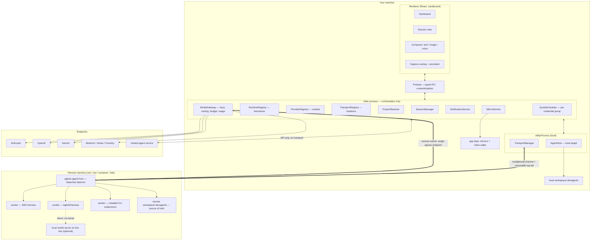

# Agbrte — Agent Bridge Terminal

**The name.** **Ag**ent **Br**idge **Te**rminal — three words that describe the architecture rather than decorate it. The **agent** is what runs. The **bridge** is the host: one process per workspace, owning the event log, the permission gate, and the turn queue, outliving every client attached to it (§8). The **terminal** is whatever you happen to be sitting at — the desktop app, a browser on a phone, the CLI on a machine with no display — and they are interchangeable by construction.

The design is in the order of those words. A session runs on the bridge, never inside the terminal, which is why closing the app mid-run, driving one session from a second machine, and resuming after a restart are not three features but one property seen three times.

**Status:** Architecture design, v0.5 — session hierarchy and scope-driven splitting. Greenfield.

**Reading guide.** §1 is the requirement map and the three-axis framing — read it first. The four load-bearing sections are **§3** (adapting any agent or model), **§4.3** (splitting work that doesn't fit), **§5** (surviving a folder move), and **§6** (where sessions run). §13 collects everything security-relevant. §15 is the build order; §17 is what's still open.

---

## 1. What this is

A desktop app for running software development work through AI agents. The unit of work is a **session**: a stated goal, bound to one workspace, worked by one or more **agents**, producing artifacts and a durable transcript.

| # | Requirement | Where addressed |
|---|---|---|
| R1 | Manage many sessions concurrently | §4, §8 |
| R2 | Many agents per session | §4.2, §9 |
| R3 | Agent context + history survive the workspace folder being moved | §5 — **load-bearing** |
| R4 | Dashboard showing per-session progress | §10 |
| R5 | Notify when a result is produced | §11 |
| R6 | Multimodal I/O, incl. per-session screen capture fed back to the agent | §12 |
| R7 | Sessions run locally **or** on a remote machine over SSH or other protocols | §6 — **load-bearing** |
| R8 | Any agent harness or model provider can be adapted, not only Claude | §3 — **load-bearing** |
| R9 | Work with the user's already-installed agent CLI, under their own auth | §3.12, §6.5 |
| R10 | Split work into child sessions when scope exceeds one context; manage the resulting tree | §4.3 — **load-bearing** |

### Confirmed decisions

- **Shell:** Electron desktop app (Node main + React/TS renderer).
- **Runtime layer:** pluggable, **two adapter branches** — external *harnesses* and raw *model providers* driven by a built-in harness (§3). Claude Agent SDK is the reference harness adapter, not a privileged one.
- **Execution target:** pluggable transport layer. Local first, SSH second, then WSL / container / k8s, with hosted agent services as a reduced-capability fourth locality (§6.9).
- **Auth:** three modes — API key through our gateway, the user's own installed CLI session, or none for local models (§3.11). **Agbrte never stores, proxies, or replays a vendor session token.**
- **Memory/history location:** **inside the workspace** (`<workspace>/.devagents/`), with a local follower mirror for remote workspaces. One documented exception: hosted targets, where the app-side store becomes primary (§6.9).
- **Multimodal, day one:** images/screenshots in, annotated screenshots, voice in (STT), voice out (TTS).

### Three axes, deliberately independent

The usual way to get this wrong is to conflate *what drives the loop*, *which model answers*, and *where it runs*:

| Axis | Interface | Question | Examples |
|---|---|---|---|
| Harness | `AgentRuntime` (§3.2) | who runs the loop, owns tools and context | Claude Agent SDK, an installed agent CLI, a hosted agent service, **Agbrte's own harness** |
| Model | `ModelProvider` (§3.6) | who answers one request | Anthropic Messages, OpenAI, Gemini, Bedrock/Vertex/Foundry, Ollama/vLLM/llama.cpp |
| Location | `Transport` (§6.2) | where it executes and how we reach it | local, ssh, wsl, container, k8s, hosted |

The model axis applies only when the harness is Agbrte's own — an external harness brings its own model plumbing. No adapter on any axis knows about the other two; `AgentHost` (§6.4) is the only component that composes them.

### One flagged concern, and how it's mitigated

Storing history inside the workspace can bloat a repo, leak transcripts into version control, and — since workspaces can be remote — put the dashboard's data on a machine you aren't connected to. Handled rather than argued with: `.devagents/` **splits** into `memory/` (small, curated, safe to commit) and `sessions/` (large, excluded by default) via a nested `.gitignore`; every remote workspace gets a **local follower mirror** (§6.6) so the dashboard works offline.

---

## 2. Architecture at a glance



**Four hard rules:**

1. **Agent loops never run on the Electron main process.** Main orchestrates; a blocked main freezes every window.
2. **For remote targets the loop runs *on the remote*** (§6.3 — a requirement, not a preference).
3. **Model credentials never leave your machine by default** (§6.5). Two deliberate exceptions: a model server on the agent's own box, and the user's own CLI session.
4. **Agbrte never holds a vendor session token.** Where the user's own CLI owns the credential, we invoke the tool and stay out of the auth path entirely (§3.11).

---

## 3. Runtime layer — adapting any agent or model

### 3.1 Four tiers, two branches

"Support any agent model" collapses several different integration jobs. They separate by who owns the loop and who owns the deployment:

| Tier | What it is | Owns loop | Owns deployment | Built-in tools |
|---|---|---|---|---|
| 0 | **Model endpoint** — messages in, text + tool-call requests out | **we do** | you | none |
| 1 | **Loop helper** — automates the cycle over *your* tools | library | you | none |
| 2 | **Coding harness, self-hosted** — loop + file/shell/search tools + context mgmt + permissions + subagents + sessions | it does | you | yes |
| 3 | **Hosted agent service** — loop *and* sandbox on the provider's infra | provider | provider | yes, in their sandbox |

Tier 0 is the **provider branch**. Tiers 2 and 3 are the **harness branch**. Tier 1 is essentially what `AgbrteHarness` is, except we also supply the tools.

```
AgentRuntime  (what the session sees — §3.2)
│
├── HarnessRuntime adapters — wrap something that already loops
│   ├── claude-agent-sdk        (Tier 2, in-process library — reference impl)
│   ├── agent-cli-stdio         (Tier 2, the user's installed CLI — §3.12)
│   └── hosted-agent-http       (Tier 3, REST + event stream — §6.9)
│
└── AgbrteHarness — our own loop, tools, gating, context management (§3.7)
    └── driven by any ModelProvider (§3.6)
        ├── anthropic-messages · openai-responses · google-gemini
        ├── openai-compatible   (Ollama, vLLM, LM Studio, OpenRouter, …)
        └── bedrock · vertex · foundry
```

Both branches present `AgentRuntime`, so **§4–§12 are provider-blind**. Building `AgbrteHarness` is real scope and it is what makes R8 true — a raw endpoint has no loop to wrap. It also pays back: for provider-backed agents *we* own the tool suite, the permission gate, compaction, and telemetry.

### 3.2 The outward interface

```ts
export interface AgentSpec {
  agentId: string;
  role: AgentRole;                          // 'lead' | 'worker' | 'reviewer' | 'custom'
  runtimeId: string;                        // which harness
  model?: ModelRef;                         // required iff harness is AgbrteHarness
  auth: AuthMode;                           // §3.11
  reasoning?: ReasoningRequest;             // normalized, §3.4
  systemPrompt?: string;
  toolPolicy: ToolPolicy;
  limits: { maxTurns?: number; maxToolCalls?: number; tokenCeiling?: number; wallClockMs?: number };
  /** Resolved at start by whoever is adjacent to the filesystem.
   *  Never persisted — environment, not identity. */
  workspacePath: string;
}

export interface ModelRef { providerId: string; modelId: string; endpointId?: string; }

export interface AgentHandle {
  send(turn: UserTurn): Promise<void>;
  interrupt(): Promise<void>;               // capability-gated on `interruptible`
  stop(reason: string): Promise<void>;      // unconditional — no capability guards it
  /** Subscribable before the first `send()`; consumable once. See below. */
  events: AsyncIterable<RuntimeEvent>;
  resumeToken(): string | null;             // a cache — never truth (§5.4)
}

export interface AgentRuntime {
  readonly id: string;
  /** Adapter version, stamped on every event this runtime produces (§5.1). */
  readonly version: string;
  /** Version of the underlying vendor tool, where one exists (§3.12). */
  readonly toolVersion?: string;
  /** Depends on the resolved model and adapter version, so it is a function. */
  capabilities(spec: AgentSpec): Promise<RuntimeCapabilities>;
  start(spec: AgentSpec, ctx: RuntimeContext): Promise<AgentHandle>;
  resume(spec: AgentSpec, token: string | null, ctx: RuntimeContext): Promise<AgentHandle>;
}

export interface RuntimeContext {
  seedHistory?: NormalizedTurn[];           // rehydration (§5.4)
  /** The adapter supplies the ask; only the host can stamp identity (§13). */
  requestPermission(ask: PermissionAsk): Promise<PermissionDecision>;
  reportProgress(p: ProgressSignal): void;
  modelEgress?: { baseUrl: string; token: string };   // absent when auth isn't api-key
  abortSignal: AbortSignal;
}

/** What the runtime picker lists (§7) and what admission checks against (§4.2). */
export interface RuntimeDescriptor {
  id: string; label: string;
  modelSelection: 'required' | 'optional' | 'none';
}
```

`capabilities()` is a function because with one provider capabilities belong to the adapter, and with many they belong to the *adapter plus the model plus the installed tool version*. `openai-compatible` against a 70B tool-caller and against a 3B chat model are not the same thing, and the orchestrator must know which it has before assigning work.

#### Interface obligations discovered while building the first two adapters

Each of these was a missing or wrongly-shaped field, not a coding mistake. They are recorded because the constraint is the interesting part.

| Obligation | The constraint that forced it |
|---|---|
| `version` (and optional `toolVersion`) live **on the interface** | §5.1 requires every event to name the adapter version that produced it. The host cannot read an adapter's module constants without importing the adapter, which is the layering leak the registry exists to prevent — so every transcript recorded `adapterVersion: 'unknown'` and was unattributable. |
| `events` is **subscribable before the first `send()`** and **consumable once** | The host is stream-first: it subscribes, then sends, so no early event is lost. An adapter that builds its stream lazily (an async generator body runs on its first `next()`) yields nothing, and the pump logs a clean turn as a transport failure — indistinguishable from a dropped subprocess. Repeated access must return the same stream; a second consumer races the first for events. Both are asserted for every adapter (§3.13). |
| `requestPermission` takes an **ask**, not a request | An adapter cannot know the session, and letting it mint the request id produced collisions across parallel tool calls — one promise never resolving, and a decision recorded against a call the user never saw. Both adapters independently wrote `sessionId: '' as never` to satisfy the old shape; two implementations reaching for the same cast is the signal that the type was wrong. The host stamps `requestId`, `sessionId`, and `originSessionId`; the adapter supplies `agentId`, `tool`, `args`, and its own `toolUseId` where it has one. |
| `modelSelection` has **three** states | A boolean `requiresModel` cannot express an adapter that accepts an optional model *hint*: the Claude adapter reads `spec.model?.modelId ?? DEFAULT_MODEL`, and §3.12's `CliAgentManifest.modelArg?` is optional by construction. `required` refuses a spec with no model, `none` refuses one that carries a model (it would be silently ignored), `optional` accepts either. **An `optional` adapter must report the model it actually resolved**, or §5.1 provenance is broken in the one case that matters — a transcript whose `origin.model` is absent because the adapter quietly used its own default. |
| `stop()` is unconditional | `interrupt()` is gated on the `interruptible` capability and a runtime may legitimately refuse it (§3.3). If `stop()` were gated too, `interruptible: false` would mean *unstoppable*: the only remaining channel is `ctx.abortSignal`, which an adapter is free to ignore. So `stop(reason)` is the escape hatch every adapter implements, and the supervisor must use it when interruption is refused. |

### 3.3 Capability model

Declared, probed, and **enforced** — never assumed. Everything the orchestrator branches on lives here.

```ts
export interface RuntimeCapabilities {
  // loop and lifecycle
  nativeResume: boolean; interruptible: boolean; subagents: boolean;
  streaming: boolean; streamingToolArgs: boolean;

  // tools and gating
  tools: 'native' | 'text-protocol' | 'none';
  parallelToolCalls: 'many' | 'one' | 'none';
  schemaProfile: SchemaProfile;                       // §3.5
  toolResultPairing: 'batched' | 'one-per-message';
  permissionFidelity: PermissionFidelity;            // §3.10 — safety-critical

  // context
  contextWindow: number; maxOutputTokens: number;
  serverSideCompaction: boolean; caching: 'explicit' | 'automatic' | 'none';

  // reasoning
  reasoningControl: 'effort' | 'budget' | 'none';
  reasoningVisible: 'summary' | 'raw' | 'none';

  // content
  input: { image: boolean; audio: boolean; pdf: boolean; video: boolean };
  imageMaxLongEdge?: number; imageMaxCount?: number;

  // economics
  pricing?: { inputPerMTok: number; outputPerMTok: number; currency: string } | 'free' | 'opaque';
  costReporting: 'per-request' | 'telemetry' | 'none';   // §10
  tokenCounter: 'provider-endpoint' | 'local-estimate' | 'none';
  quotaModel: 'per-token-billing' | 'windowed-allowance';   // §3.9
}
```

**Prefer self-description over synthetic probing where the runtime offers it.** A well-behaved harness announces itself: Claude Code's `stream-json` output opens with a `system/init` event carrying the model, tool list, MCP servers, plugins, and a `capabilities` array of protocol behaviors, which its docs direct you to feature-detect on rather than comparing version strings. Parsing the first event is cheaper and more accurate than four test calls.

Fall back to **probing** only where nothing self-describes — chiefly `openai-compatible` servers, whose spread is enormous and whose self-reports can't be trusted. Four cheap calls (single tool call, two parallel calls, nested schema, 1-pixel image) turn guesswork into a record, cached per endpoint+model and re-run when the reported model list changes. Capabilities are cached per **(runtime, provider, model, endpoint)**, never per runtime — keying on `runtimeId` alone is the bug that makes a 3B model inherit a frontier model's declared abilities.

**Three tiers of confidence, and the doc must not blur them.** A field in `RuntimeCapabilities` is either *self-described* by the runtime, *probed* by us, or *configured* — a constant the adapter was told. Configured values are legitimate, but they are assertions, and §3.13's matrix records which is which. What the Claude Agent SDK actually offers, verified against `@anthropic-ai/claude-agent-sdk` **0.3.220** (types read 2026-07-30):

| Wanted | Available from the SDK | Consequence |
|---|---|---|
| model, tool list, MCP servers, plugins, skills, slash commands, protocol `capabilities[]` | `system`/`init` message, at stream open. `capabilities[]` is an **open set** — feature-detect a specific string, never compare versions | the self-description path §3.3 prefers; parse the first event |
| effort support per model | `Query.supportedModels()` → `supportsEffort`, `supportedEffortLevels` | feeds `reasoningControl` (§3.4) without a table of model facts |
| `contextWindow`, `maxOutputTokens` | only **after a turn**, on the `result` message: `modelUsage[model].contextWindow` / `.maxOutputTokens` | cannot be known before the first request, so the reference adapter takes both as **configuration** today and corrects nothing — a hard-coded model fact with a real constraint behind it, not laziness |
| per-turn cost | `result.total_cost_usd` plus `modelUsage[model].costUSD` | `costReporting: 'per-request'` is honest for this branch |
| windowed-allowance position | `rate_limit_event` → `rate_limit_info` (§3.9) | the only trustworthy source for `quotaModel: 'windowed-allowance'` |

**Where the reference adapter stands today:** it declares its capabilities as configured constants and parses neither `system`/`init` nor `modelUsage`. Nothing in the current suite verifies any declared value against a real endpoint, so the honest reading of `claude-agent-sdk`'s row in the matrix is "declared, not verified" for everything except the gate configuration (§3.13). Closing that is adapter work, not doc work.

### 3.4 Normalizing reasoning control

Three incompatible families exist — effort levels, token budgets, nothing at all. The session stores one normalized value:

```ts
export type ReasoningRequest = { mode: 'off' | 'auto' | 'low' | 'medium' | 'high' | 'max' };
```

Adapters map it to their own knob or ignore it when `reasoningControl: 'none'`. Two rules keep it honest: **no provider-specific reasoning knob ever enters `AgentSpec`** (the moment one does, every other adapter inherits a field it must ignore), and **the log records both** the normalized request and the concrete parameters sent — reproducing a six-hour session needs the wire values, and `mode: 'high'` won't tell you them.

### 3.5 Tool schemas — where "any model" actually breaks

Pluggable layers rarely fail on the HTTP call. They fail because a schema the frontier model handles makes a smaller model emit malformed arguments, or the endpoint rejects it. Tools are authored **once, canonically**, then degraded per target.

```ts
export type SchemaProfile =
  | 'json-schema-full'    // $ref, anyOf, nesting, constraints
  | 'strict-subset'       // additionalProperties:false + required everywhere, no unions
  | 'flat-only'           // flat objects, primitive/enum properties
  | 'text-protocol';      // no native tool calling
```

The **schema degrader** is a pure, tested `(canonical, profile) => degraded + lossReport`:

| Degradation | `strict-subset` | `flat-only` |
|---|---|---|
| inline all `$ref` / `$def` | ✔ | ✔ |
| `additionalProperties: false`, all fields required, nullable-optional | ✔ | ✔ |
| collapse `anyOf`/`oneOf` → discriminator enum + optional siblings | ✔ | ✔ |
| flatten nested objects → `dotted.path` primitives | — | ✔ |
| arrays of objects → JSON-encoded string, shape in the description | — | ✔ |
| drop unsupported constraints (`minLength`, `multipleOf`, formats) | ✔ | ✔ |

Every degradation is reported, shown in the agent's capability panel, and logged — so "this model keeps mis-calling `edit`" has a visible cause rather than becoming folklore. For `tools: 'text-protocol'`, a **`ToolCallCodec`** renders the suite as instructions plus a delimited format and parses calls back out, with a repair prompt on failure and a hard cap on repairs.

Also normalized: `parallelToolCalls: 'one'` serializes our concurrent plan; `toolResultPairing: 'one-per-message'` splits batches; tool-call ids are mapped to our own, because collisions and reuse across providers are common.

### 3.6 The `ModelProvider` interface

Deliberately small. It does one request and knows nothing about sessions, workspaces, or transports.

```ts
export interface ModelProvider {
  readonly id: string;
  listModels(e: ModelEndpoint): Promise<ModelDescriptor[]>;
  probe(e: ModelEndpoint, modelId: string): Promise<RuntimeCapabilities>;
  invoke(req: ProviderRequest, opts: { signal: AbortSignal }): ProviderStream;
  countTokens?(req: ProviderRequest): Promise<number>;   // provider-native only
}

export interface ProviderRequest {
  endpoint: ModelEndpoint;
  modelId: string;
  system?: string;
  messages: ProviderMessage[];        // NOT NormalizedTurn[] — see below
  tools?: ToolSchema[];
  maxOutputTokens: number;
  reasoning?: ReasoningRequest;
}

export interface ProviderResult {
  content: ContentBlock[];
  toolCalls: NormalizedToolCall[];
  stop: StopReason;                                       // §3.9
  usage: { inputTokens: number; outputTokens: number; cachedInputTokens?: number };
  raw: unknown;                                           // debugging only, never interpreted upstream
}
```

**`messages` is `ProviderMessage[]`, not `NormalizedTurn[]`, and the difference is load-bearing.** `NormalizedTurn` models *what a person and an agent said* — a role and content blocks. That is sufficient for the durable log and for a rehydrated seed, and it was the obvious type to reach for here. It cannot express a tool-calling loop. A tool call needs an assistant turn carrying structured calls with ids, and a matching result turn bound to each id; with only role-plus-content, the second iteration of any loop is incoherent, because the model sees a request it can't tie to the result that followed.

```ts
export type ProviderMessage =
  | { role: 'system'; text: string }
  | { role: 'user'; content: ContentBlock[] }
  | { role: 'assistant'; text?: string; toolCalls?: NormalizedToolCall[] }
  | { role: 'tool'; toolCallId: string; name: string; result: string; isError?: boolean };
```

The two types stay separate on purpose. `NormalizedTurn` is **persisted** and versioned with the log; `ProviderMessage` is **transient** wire input, rebuilt on every request. Merging them would either put `toolCallId`s in the durable log or force the log's schema to track provider protocol changes.

**Divergence, recorded rather than smoothed over:** the signature above says `invoke(...): ProviderStream`. The implementation returns `Promise<ProviderResult>` — non-streaming — and `streaming: false` is reported honestly by both shipped providers. Nothing in the current UI consumes partial output, so streaming was deferred rather than faked; the interface name is aspirational and this note exists so no one reads it as implemented.

**Never use a foreign tokenizer for pre-flight counting.** A 20%-wrong estimate produces context overflow deep into a long run — the worst time to find out. Providers with a counting endpoint get exact numbers; others get a conservative estimate with the margin recorded, and `AgbrteHarness` compacts on *measured* usage from the prior turn rather than trusting the estimate.

**The scope of that ban is pre-flight request sizing**, and stating the boundary matters because a second kind of counting exists. Deciding *how much history to carry into a seed* (§5.4) is not sizing a request against a provider's limit: it selects how much of our own log to include, and its two failure modes are asymmetric — over-estimating carries less history than it could, which the next turn recovers; under-estimating overflows the window, which it cannot. So the seed builder uses a deliberately pessimistic character heuristic and that is **not** a violation of this rule. Anything that decides whether a request will fit still needs a provider-native count or a recorded margin.

### 3.7 `AgbrteHarness` — our own loop

For every `ModelProvider`, `AgbrteHarness` supplies what a harness would have:

- **Tool suite** — `read`, `write`, `edit`, `glob`, `grep`, `bash`, `web_fetch`, plus `plan`/`update_task` (§10) and `remember` (§5.5). One canonical schema set, degraded per §3.5. These are the same tools `AgentHost` implements for lease enforcement, so there is one implementation, not two.
- **Permission gate** — every call passes `ctx.requestPermission` *before* execution. `permissionFidelity: 'callback'`, the strongest tier (§3.10).
- **Context management** — no server-side compaction to lean on, so it compacts at a high-water mark by calling the **same `rehydrate()`** used for moved workspaces (§5.4). The function that reconstructs context after a move is the function that compacts a running session — one code path, exercised constantly, so the durable path can't rot.
- **Prompt assembly** — always stable-prefix-first (frozen system prompt, deterministic tool order, volatile content last). Correct for explicit-breakpoint caching, free wins for automatic prefix caching, harmless otherwise — so it's unconditional.
- **Loop control** — turn and tool-call caps, no-progress detection (identical call with identical args N times → intervene), and a wall-clock budget.

Reports `nativeResume: false`, which is fine: the durable resume path was never allowed to depend on it.

### 3.8 Endpoints and locality

```ts
export interface ModelEndpoint {
  endpointId: string; providerId: string; baseUrl?: string;
  auth: { kind: 'none' | 'api-key' | 'oauth' | 'aws-sigv4' | 'gcp-adc' | 'azure-key' };
  locality: 'cloud' | 'app-local' | 'target-local';
  defaultReasoning?: ReasoningRequest;
  costCeilingPerDay?: number;
  /** Recorded and displayed — adding a provider must never quietly change where code goes. */
  dataHandling: { provider: string; region?: string; retentionNote?: string };
}
```

| Locality | Meaning | Routing for a remote session |
|---|---|---|
| `cloud` | hosted API | through the gateway's reverse tunnel — credentials stay on your machine |
| `app-local` | model server on *your* machine | through the tunnel to your loopback |
| `target-local` | model server on the *agent's own box* | **direct to that box's loopback — no tunnel** |

Without `target-local`, an agent on your GPU workstation using Ollama on that same workstation would tunnel every token through your laptop and back — doubling latency for nothing and making the run depend on your laptop staying awake. Local servers usually need no auth, so there's also nothing to protect. This is precisely the case people buy a GPU box for, so it gets a first-class path.

### 3.9 Normalized failures, including quota

Providers signal trouble incompatibly, and the supervisor can't act without a common taxonomy:

```ts
export type StopReason =
  | { kind: 'end_turn' } | { kind: 'tool_calls' }
  | { kind: 'max_output_tokens' }
  | { kind: 'refused'; category?: string }
  | { kind: 'content_filtered'; stage: 'input' | 'output' }
  | { kind: 'context_overflow' }
  | { kind: 'invalid_tool_args'; detail: string }
  | { kind: 'rate_limited'; retryAfterMs?: number }
  | { kind: 'quota_exhausted'; scope: 'session' | 'window' | 'daily' | 'weekly'; resetsAt?: string }
  /** A ceiling *Agbrte itself* set was reached. Nothing is broken; nothing resets. */
  | { kind: 'limit_reached'; limit: 'turns' | 'cost' | 'wallclock'; detail?: string }
  /** A permanent configuration fault. Retrying cannot help. */
  | { kind: 'misconfigured'; detail: string }
  | { kind: 'auth' } | { kind: 'unavailable' } | { kind: 'transport' };
```

**`quota_exhausted` is distinct from `rate_limited` and matters more than it looks.** A rate limit clears in seconds and is handled by backoff. A windowed allowance — a subscription seat's rolling window, or a CLI's daily request cap — may not clear for hours. Failing the agent there is wrong: the supervisor **parks it and schedules resumption at `resetsAt`** (§8), exactly as it parks on `awaiting_credentials` when a laptop sleeps. `quotaModel: 'windowed-allowance'` tells the orchestrator to expect this.

**Three shapes of "cannot continue right now", and conflating any two is a bug.** The distinction is *who set the limit and whether waiting fixes it*:

| Stop | Who set the limit | Does waiting help? | Disposition | Session state |
|---|---|---|---|---|
| `rate_limited` | the provider, per-second | yes, seconds | retry with backoff | stays `working` |
| `quota_exhausted` | the provider, per-window | yes, at `resetsAt` | park with a scheduled wake | `awaiting_quota` |
| `limit_reached` | **us**, from `AgentSpec.limits` or `SessionBudget` | **never** | park for a human decision | `awaiting_input` |

`limit_reached` exists because the third row was previously mapped onto the second, and the consequence was specific rather than cosmetic: `awaiting_quota`'s contract is "resume at `resetsAt`", and a ceiling Agbrte set has no window to reset, so an agent that merely ran out of turns **parked forever** with no reset time and no prompt. Raising the ceiling, re-scoping the task, splitting it (§4.3), or closing the session out are all human decisions, which is exactly what `awaiting_input` means. It notifies as `budget_exhausted` (§11) — the trigger already existed; only the stop reason was missing.

**`misconfigured` is the fourth "cannot continue", and it is the one that must *not* pause.** An unknown model id and a malformed request are permanent: no wait, no retry, and no human decision at the *session* level will fix them — someone has to change the configuration. These were originally mapped to `invalid_tool_args`, whose disposition is `retry`, so a typo'd model id burned the entire attempt budget re-sending an identical doomed request before surfacing anything. It is the only stop reason whose disposition is `fail` while nothing about the *work* failed, which is why it carries a mandatory `detail`: the message is the fix.

**Mapping the reference harness onto this union**, verified against `@anthropic-ai/claude-agent-sdk` 0.3.220 (types read 2026-07-30):

| SDK signal | Maps to | Note |
|---|---|---|
| `result.subtype: 'error_max_turns'` / `'error_max_budget_usd'` | `limit_reached { limit: 'turns' \| 'cost' }` | these are *our* `maxTurns` / budget arguments coming back, not a provider limit |
| `result.subtype: 'error_max_structured_output_retries'` | `invalid_tool_args` | repair-and-retry, bounded |
| assistant-message `error: 'invalid_request' \| 'model_not_found'` | `misconfigured` | permanent; retrying re-sends an identical doomed request |
| assistant-message `error: 'rate_limit'` | `rate_limited` | backoff |
| assistant-message `error: 'authentication_failed' \| 'oauth_org_not_allowed' \| 'billing_error'` | `auth` | "credentials cannot currently be used" → pause, not fail |
| assistant-message `error: 'overloaded' \| 'server_error'` | `unavailable` | retry |
| `rate_limit_event.rate_limit_info` with `status: 'rejected'` | `quota_exhausted { scope, resetsAt }` | `rateLimitType: 'five_hour'` → `scope: 'window'`; `'seven_day' \| 'seven_day_opus' \| 'seven_day_sonnet'` → `'weekly'`; `resetsAt` is an epoch number whose unit the type does not state — normalize carefully |

**Honest gap:** `rate_limit_event` is the *only* signal in this branch that carries a genuine reset time, and the adapter does not consume it yet. Until it does, `quota_exhausted` has no verified producer on the SDK branch, so §3.13's "quota exhaustion and scheduled resume" scenario cannot pass there — which is why it is marked unverified rather than assumed.

**Cross-provider fallback comes nearly free.** Because rehydration reconstructs context from our own log rather than provider state, an agent stopped by `refused`, `unavailable`, persistent `rate_limited`, or `quota_exhausted` can be restarted on a different provider with its task intact. One caveat stated plainly: **opaque provider-specific reasoning blocks cannot cross a provider boundary** — they are dropped at the handoff and the drop is recorded, so the transcript explains any discontinuity.

### 3.10 Permission fidelity is a capability, not an assumption

Our safety model (§13) rests on a gate we control. Not every runtime can offer one, and pretending otherwise is the most dangerous thing this design could do.

```ts
export type PermissionFidelity =
  | 'callback'                // pre-execution gate we control, per call
  | 'precomputed-allowlist'   // rules fixed before start; no live prompt
  | 'all-or-nothing';         // only a blanket bypass exists
```

| Fidelity | Who has it | Gating behavior | Constraint we impose |
|---|---|---|---|
| `callback` | `AgbrteHarness`, Agent SDK library | true per-call ask/allow/deny | none |
| `precomputed-allowlist` | installed CLIs in headless mode (§3.12) | policy compiled to rules up front; `ask` becomes deny, then **deny → ask user → grant → resume** | none, but fidelity is badged in the UI |
| `all-or-nothing` | runtimes offering only a bypass flag | none | **may only run with `isolation: 'worktree'` or a container — never `shared`.** Refused at creation otherwise. |

That last row is a hard rule, enforced at agent creation rather than discovered at runtime: if we cannot gate the calls, we constrain what the process can reach. **Fidelity is displayed per agent** — a `AgbrteHarness` agent and a wrapped-CLI agent do not enforce identical policy, and the UI must never imply they do.

**Known narrowing: "or a container" is not expressible yet.** `Isolation` is `'shared' | 'worktree'` in code, because no container transport exists to enforce a third value (§6.1 lists the target kinds; §9 has the enforcement table). The rule therefore admits an `all-or-nothing` runtime under `worktree` only. That fails *closed* — the refusal is stricter than the design allows, never looser — so it is a coverage gap, not a hole, and deliberately left until a container target can actually be enforced. Adding `'container'` to the type before then would let the UI badge an agent as contained by something nobody implemented, which §13 treats as worse than having no containment at all.

### 3.11 Auth modes

```ts
export type AuthMode =
  | { kind: 'api-key'; endpointId: string }
  | { kind: 'vendor-cli-session'; cliId: string; quotaGroup: string }
  | { kind: 'none' };
```

| Mode | Credential lives | Gateway | Cost data | Detached remote runs |
|---|---|---|---|---|
| `api-key` | your OS keychain; injected at egress (§6.5) | routes everything | exact, centralized | needs your machine, or an explicit alternative |
| `vendor-cli-session` | that CLI's own config, on whichever machine runs it | **bypassed** | per-invocation or telemetry (§10) | yes — credential is already on the remote |
| `none` | nothing to hold (local model server) | bypassed | free | yes |

**Three non-negotiable rules:**

1. **Agbrte never stores, proxies, or replays a vendor session token.** Where the user's CLI owns the credential, we invoke the tool and stay out of the auth path. This is both the security boundary and the licensing boundary, and there is no version of holding those credentials worth building.
2. **We never bundle a vendor CLI.** Detect the installed binary, report its version, link to the vendor's install docs. Shipping the tool and having users log in through it is a materially different thing from running software they installed themselves.
3. **`vendor-cli-session` puts credentials wherever the loop runs.** For a remote session that means on the remote — the opposite of §6.5's default, unavoidable because there is no key to tunnel. **Surface it; never let it be inferred.**

`quotaGroup` identifies agents sharing one credential so they can share a throttle (§8) — eight agents on one seat allowance will burn a window in twenty minutes if scheduled independently.

> **Licensing note, stated once.** Driving a vendor CLI programmatically is a documented, supported integration for Claude Code (`-p` with `--output-format json` is the recommended way to drive the agent loop from another language). Building a third-party product that routes *its users* onto a vendor's consumer subscription limits is a separate question and generally requires the vendor's prior approval — Anthropic's Agent SDK docs say so explicitly, and an approval path exists. A telling signal: `--bare`, the mode its docs recommend for scripted calls, **skips OAuth and keychain reads entirely and requires an API key.** Treat API-key auth as the default and get written clarification before shipping subscription-backed operation as a feature.

### 3.12 Installed-CLI harness adapters

`agent-cli-stdio` spawns an agent CLI the user already installed and logged into, speaks its JSON protocol, and maps it onto `AgentRuntime`. One adapter plus a per-CLI manifest, so adding a tool is configuration and a conformance run rather than a new codebase.

```ts
export interface CliAgentManifest {
  cliId: string;                                  // 'claude-code' | 'gemini-cli' | …
  detect: { binary: string; versionArgs: string[]; versionRegex: string; supportedRange: string };
  invoke: {
    promptMode: 'argv' | 'stdin';
    baseArgs: string[];
    modelArg?: (m: ModelRef) => string[];
    resumeArg?: (token: string) => string[];
    allowlistArg?: (p: ToolPolicy) => string[];   // compile our policy to their rule syntax
    permissionModeArg?: string[];
    deterministicModeArgs?: string[];             // skip auto-discovery of local config
  };
  parse: {
    framing: 'ndjson' | 'json' | 'text';
    map: EventFieldMap;                           // → RuntimeEvent
    initEvent?: string;                           // self-describing capabilities (§3.3)
    costField?: string;                           // per-invocation cost
    errorCategoryField?: string;                  // → StopReason (§3.9)
    subagentParentField?: string;                 // → thread tree
  };
  permissionFidelity: PermissionFidelity;
  needsPty: boolean;
  quotaModel: 'per-token-billing' | 'windowed-allowance';
}
```

**Verified reference points** (check against the installed version at `hello` — these protocols are the vendor's to change):

| Concern | Claude Code | Gemini CLI |
|---|---|---|
| One-shot | `-p "…"` | `-p "…"` |
| Event stream | `--output-format stream-json --verbose --include-partial-messages` | `--output-format stream-json` |
| Self-description | `system/init` event: model, tools, MCP servers, plugins, `capabilities[]` | verify |
| Multi-turn | `--continue`, or `--resume <sessionId>` | verify |
| Model | `/model sonnet` in the prompt | `-m <model>` |
| Allowlist | `--allowedTools "Bash(git diff *),Read,Edit"` | verify |
| Permission baseline | `--permission-mode dontAsk` / `acceptEdits` | verify |
| Per-run cost | `total_cost_usd` + per-model breakdown in `--output-format json` | verify |
| Subagents | messages carry `parent_tool_use_id`; `--forward-subagent-text` for their text | verify |
| Errors | `system/api_retry` with an `error` category | verify |
| Deterministic mode | `--bare` (skips hooks/skills/plugins/MCP/CLAUDE.md discovery) | verify |
| Auth | interactive `/login` (subscription), or `ANTHROPIC_API_KEY` / Bedrock / Vertex / Foundry | Google OAuth, `GEMINI_API_KEY`, or Vertex |

**Gating flow — deny-ask-resume.** Headless mode has no per-call approval callback; that is a library feature. So:

1. Compile our `ToolPolicy` `allow` rules into the CLI's allowlist syntax before spawn. Our `{tool, match}` pairs map closely onto theirs — mind the gotchas, e.g. `Bash(git diff *)` needs the space before `*` or it also matches `git diff-index`.
2. Use the **deny-by-default** baseline (`dontAsk`), never the abort-on-unallowed one. Denial lets the agent adapt and keep working; aborting loses the turn.
3. Anything our policy marks `ask` compiles to *deny*. The denial surfaces as a prompt — "this agent tried X and was blocked; allow and continue?" — and on approval we add the rule and resume via the session token. **Approximate live gating at the cost of a turn restart**, which is as good as this branch can be.
4. The **sandbox is the real boundary**: worktree or container isolation, restricted filesystem view, egress policy. The subprocess holds one coarse grant the user approved up front.

**Determinism vs the user's own setup.** Deterministic mode is faster and reproducible but skips auto-discovery of local hooks, skills, plugins, MCP servers, and project instruction files — and, for Claude Code, skips OAuth/keychain reads, making it API-key-only:

| | deterministic | inherit local config |
|---|---|---|
| Same result on every machine | ✔ | ✘ — a teammate's hook or the project's MCP config runs |
| Uses the user's CLI login | ✘ | ✔ |
| Picks up user's project instructions / skills | ✘ (pass explicitly) | ✔ |

Since Agbrte promises reproducible transcripts, **deterministic plus explicit config flags is the default**, with "use my local setup" an opt-in mode carrying the caveat.

**For the SDK branch, deterministic mode is not merely the default — it is the only mode**, and the reason is a gate bypass rather than reproducibility. The library consults `canUseTool` *last* and skips it for anything approved earlier, so an allow rule arriving from a settings file is the same bypass as `allowedTools`, just sourced from disk. The adapter therefore pins `settingSources: []`, and its `permissionFidelity: 'callback'` claim is conditional on that. This narrows §17's open question about non-deterministic mode to the CLI branch, where fidelity is `precomputed-allowlist` and the sandbox is the boundary anyway.

**What `settingSources: []` does and does not exclude** — verified against `@anthropic-ai/claude-agent-sdk` 0.3.220 (`sdk.d.ts`, `Options` and `ResolveSettingsOptions`, read 2026-07-30). The SDK's own wording is that `[]` disables *filesystem* settings — user (`~/.claude/settings.json`), project (`.claude/settings.json`), and local (`.claude/settings.local.json`) — and that "the managed-settings policy tier is still read from disk." That tier is `managed-settings.json`, the remote-cached managed settings, MDM (macOS plist / Windows registry), and the SDK's own `managedSettings` option.

| Policy sub-source | Filtered? | Can it contribute `permissions.allow`? |
|---|---|---|
| `Options.managedSettings` (what an embedder passes) | yes — a **restrictive-key allowlist**: `allowManaged*Only` locks, `permissions.deny`/`ask`, sandbox restrictions. Permissive arrays including `permissions.allow` are "silently dropped" | no |
| admin tiers on disk (`managed-settings.json`, MDM) | root-owned by construction; an admin who can write them can do anything | out of scope — that is the machine's owner, not an untrusted input |
| remote tier (`~/.claude/remote-settings.json` cache, or `serverManagedSettings`) | **no** — documented as "same trust level as the on-disk cache it replaces, so non-restrictive keys flow through unfiltered" | **yes, in principle** |

So the accurate claim is narrower than "no invisible allow rules can reach the agent": `settingSources: []` closes the case we actually care about — a `.claude/settings.json` committed into the workspace we are about to let an agent edit — and cannot be widened by the `managedSettings` option we pass. The **residual risk is the remote tier**, a file in the user's own home directory that the merge engine trusts and does not filter. Two things bound it: our `deny` rules go through as `disallowedTools`, which the SDK enforces ahead of everything and cannot bypass; and the SDK exposes `resolveSettings()` (marked `@alpha`), which reports the same cascade a `query()` would see with per-key `provenance` and the raw per-source list. Inspecting that at `hello` and refusing the `callback` fidelity claim when the policy tier carries `permissions.allow` or an escalating `permissions.defaultMode` is the mitigation; it is **not implemented yet**, and §16 carries the risk until it is.

*Unconfirmed:* whether an explicit `permissionMode: 'default'` on `Options` overrides a `permissions.defaultMode` arriving from the policy tier. The SDK documents a separate trust filter (`filterEscalatingDefaultMode`) for repo-committed files but says nothing about option-versus-policy precedence. Treat it as unknown until a conformance assertion covers it.

**What building it changed.** The adapter now exists and runs the conformance suite; seven things about this section turned out to be wrong or underspecified, and they are recorded here rather than fixed silently.

- **`parse.map: EventFieldMap` is a function, not a map.** A field map can lift `msg.foo.bar` into an event and nothing these CLIs emit is that shape: one assistant record carries an array of content blocks that becomes several events, and a tool result means nothing until it is paired with the `tool_use` whose id it carries. A declarative map would have grown until it was a language. The manifest supplies a small **reader factory** instead — a factory because pairing needs per-run state and a manifest is a shared constant, so one reader instance would leak tool ids between concurrent agents.

- **Deterministic mode is derived from `AuthMode`, not configured.** The table above offers it as a user choice, and for Claude Code it is also what skips OAuth and keychain reads. Under `vendor-cli-session` the login it declines to read *is the entire reason* we are invoking the user's own CLI, so the two settings cannot both be honoured. The default stands — deterministic — and choosing `vendor-cli-session` **is** the opt-in to local config, rather than a second switch that can be set to contradict the first.

- **A scoped `allow` rule cannot be compiled, and is dropped.** §13's defaults table is scoped on every row: writes *inside* the workspace are allowed, writes outside are `ask`. An allowlist has no notion of inside and outside, so `{tool:'write', scope:'inside', action:'allow'}` compiled to a bare `Write` would hand over the whole filesystem while the UI kept displaying a rule that says "inside" — §13's widening bug, arriving through a translation instead of through a bad rule. It is therefore dropped, falls through to a denial and a prompt, and the loss is reported. A scoped **deny** compiles without its scope, because denying both sides is stricter than asked; that is reported too.

- **`allow once` has no allowlist equivalent**, because a rule granted before spawn lasts as long as the process. The closest honest thing is the call's **designated argument** as an exact pattern — `Bash(git status)` matches that call and nothing else, so approving it does not also approve `git push`. Where no designated argument exists the grant widens to the whole tool and says so. The argument is chosen from an ordered list rather than "first string found": tools carry incidental strings, and pinning a grant to a description produces a rule that matches nothing while looking specific.

- **`RuntimeDescriptor.requiresModel` is a boolean answering a three-valued question.** Required for `AgbrteHarness`, *optional* here — these CLIs take `-m` and choosing one is legitimate — and meaningless for `echo`. Admission rejects any spec carrying a model when `requiresModel` is false, so `modelArgs` was left out of the manifest entirely rather than shipped as code admission guarantees never runs. **Model selection for installed CLIs is blocked on making that field a tri-state**, which touches the IPC contract and the renderer and was not worth bundling into this change.

- **Exit 143 is clean only when we caused it.** The operational note below says to treat it as a stop rather than a crash, and that holds for our own `stop()` — which kills the process and returns before any exit mapping runs. An *external* SIGTERM mid-turn is a different event: an OOM killer or a `systemctl stop` cut the turn in half, and mapping that to `end_turn` would move the session to `awaiting_input` as though the work had finished. It is reported as `transport`, which is retryable, on the standing rule that a truncated turn reported as success is the worst outcome available.

- **A blanket-only CLI needs no new enforcement.** Gemini CLI's allowlist syntax and resume semantics are not documented well enough to compile a policy into, so its manifest declares `all-or-nothing` — and §9's existing admission rule then refuses to run it in a shared workspace, making the sandbox the boundary, with no new code. Declaring `precomputed-allowlist` to make it feel more capable would have been the one failure §13 calls worse than having no gate.

**Verification status.** The adapter is exercised end to end against a **real subprocess** speaking the protocol over real pipes — spawn, chunked NDJSON, non-protocol output, exit codes, and a full deny → ask → grant → resume across two genuinely separate processes. What that cannot prove is the **flag names**, which are the vendor's to change; both manifests carry `verified: false`, and a conformance run against an installed build is what flips it. Neither `claude` nor `gemini` was installed on either machine available here, so that run has not happened.

**Operational contract** — details that will otherwise be discovered painfully:

- **SIGTERM** is `stop()`: the CLI aborts the turn, kills its Bash process tree, runs its session-end hooks, and exits **143**. Treat 143 as clean, not a crash.
- **Background processes the agent starts are killed shortly after the run returns.** So a dev server for preview (§6.8) must be started by *us*, not by an agent inside a one-shot run.
- **Piped stdin is capped** (10 MB on Claude Code). Large `seedHistory` goes to a file and is referenced by path.
- **Session ids are scoped to the working directory and its git worktrees** — so `--resume` keeps working for worktree-isolated agents (§9). Isolation and resume don't fight.
- **Process-per-turn latency.** `--resume` means a fresh process each turn. Fine for long turns, noticeable in chatty interaction — measure before choosing this branch for interactive work.
- **Prefer documented JSON output over a pty.** Set `needsPty` only when a manifest genuinely requires interactivity; ANSI parsing is a maintenance sink.
- **Pin a supported version range.** The protocol is the vendor's; detect version at `hello`, refuse unknown majors, and run conformance per version.

### 3.13 Normalized content, and the conformance suite

```ts
export type ContentBlock =
  | { type: 'text'; text: string }
  | { type: 'image'; sha256: string; mime: string; width: number; height: number;
      provenance: ImageProvenance }
  | { type: 'audio'; sha256: string; mime: string; durationMs: number; transcript?: string }
  | { type: 'file_ref'; path: EncodedPath }           // §5.4b — one path type, everywhere
  | { type: 'artifact_ref'; artifactId: string };

export interface ImageProvenance {
  kind: 'paste' | 'drop' | 'screen_capture' | 'annotated_capture' | 'headless_browser';
  origin: 'client' | 'remote';                       // which machine made the pixels
  capturedAt?: string; displayId?: string; windowTitle?: string;
  url?: string; viewport?: { w: number; h: number; dpr: number };
  annotatedFrom?: string;
  redactions?: Array<{ x: number; y: number; w: number; h: number }>;
}
```

`file_ref` carries the same `EncodedPath` as the log (§5.4b) rather than a bare string. One path type means the collapse-on-write / expand-on-read codec covers content blocks too; a second string-shaped path field is exactly how an absolute path gets into durable history and survives a folder move as a lie.

Downgrade is a declared pipeline driven by capabilities, not scattered conditionals: no image support → description text plus `file_ref`; over `imageMaxLongEdge` → downscale; over `imageMaxCount` → keep the most recent and reference the rest. Every downgrade is logged, so a model "ignoring your screenshot" is diagnosable.

**The conformance suite is what keeps this abstraction from rotting.** Every adapter, both branches, runs one scenario set, and the *point* of the set is that it is run identically against deliberately different implementations. This exists because 158 passing tests failed to catch a reference adapter that emitted zero events: every runtime test asserted against the in-repo `echo` runtime, so the interface was only ever validated by the implementation that happened to satisfy it — §16's first risk, arriving on schedule.

**Five candidates run it now**, and they are deliberately unalike: `echo`; `claude-agent-sdk` through an injected `query`; `AgbrteHarness` over a raw provider; `agent-cli-stdio` against a real subprocess speaking the protocol over real pipes; and `echo` again reached through the agent-host control protocol. The last two matter most to the claim — one is a text protocol with no loop to hold, the other is the same adapter after serialization and a process boundary.

**Scenario status is part of the design, not a CI detail.** Claiming a scenario the suite does not run is the fiction this section exists to prevent, so the target set is listed with what is actually verified today No credentials and no real endpoints are involved anywhere in it: what the suite proves is the adapter, and what it cannot prove is the vendor's behaviour.

| Scenario | Status | Note |
|---|---|---|
| stream subscribable before first `send()` | ✔ all five | added to the set in Phase 1 — §3.2's obligation, and the zero-event bug |
| stream consumable once | ✔ all five | a second consumer races the first |
| explicit terminal stop, never an implicit clean finish | ✔ all five | a truncated turn reported as success is the worst available outcome |
| usage reported for the turn | ✔ all five | value accuracy against a real endpoint is **not** verified |
| single tool call through the gate before execution | ✔ all five | asserted on the real `canUseTool` wiring |
| resume token consistent with declared `nativeResume` | ✔ all five | an adapter may not claim native resume and supply nothing |
| gate configuration the fidelity claim depends on | ✔ SDK adapter | no `allowedTools`, `permissionMode: 'default'`, `settingSources: []`, `canUseTool` always present, denial carries its reason |
| kill and resume from log | ✔ host-level | covered against `echo` incl. a rejected native resume; not yet per-adapter |
| permission denial surfaced and resumed after grant | ✔ verified | the full §3.12 flow across two real processes: denied, asked, granted, resumed with the work kept |
| NDJSON record split across pipe chunks | ✔ CLI adapter | one record written seven bytes at a time; naive per-chunk parsing loses the middle of real output |
| non-protocol output on stdout | ✔ CLI adapter | an npm notice is not a failed turn |
| truncated run is not a clean finish | ✔ CLI adapter | a process that dies mid-turn stops as `transport`, never `end_turn` |
| uninstalled binary is not retried | ✔ CLI adapter | `misconfigured`, not `transport` — retrying cannot install a CLI |
| two parallel calls · tool error recovered · nested schema after degradation · image input · 200-message context with compaction · interrupt mid-stream · refusal · rate-limit backoff · **quota exhaustion and scheduled resume** · context-overflow recovery · malformed args repaired · cost/usage accuracy | ✘ not yet run | Phase 3 (§15), and most need real endpoints or the schema degrader, neither of which exists |

**Built.** The matrix ships, beside the runtime picker — the moment the question is actually being asked — showing the column for the runtime about to be chosen rather than the whole grid, because a 24-row table across five runtimes is a document and what is needed there is an answer.

Six cell states, because three were not enough to stay honest:

| State | Means | Why it is its own state |
|---|---|---|
| `verified` | a scenario ran and passed | carries its `evidence`: scripted fixture, in-process, real subprocess, live endpoint |
| `failed` | a scenario ran and failed | louder than an absence, deliberately |
| `stale` | a result exists, for a **different build** of this adapter | a report records one moment; an adapter edited since has not been checked, however green the file |
| `declared` | the adapter claims it; nothing has checked | the state this whole section exists to keep separate from `verified` |
| `unsupported` | the adapter says it cannot | an answer, not a gap — showing it as a hole makes an honest declaration look like missing work |
| `not-run` | no scenario, or the adapter could not be asked | the gaps, which are the point |

**The catalogue carries scenarios nobody has written.** A matrix built only from tests that exist shows a wall of green and answers the wrong question. Carrying the whole intended set — including everything in the "not yet run" row above — shows how much of it is actually covered, which is what someone choosing a runtime is really asking.

**Coverage counts only `verified`.** Counting declarations would make the runtime that claims everything and proves nothing the best-covered one on the screen.

**The tests write the report.** Each producer writes its own fragment under `conformance/`, because vitest runs test files in separate workers and one shared collector would keep only the last writer's rows. A fragment is replaced rather than merged, so a scenario deleted from the suite disappears from the matrix instead of leaving its last green cell up forever. Evidence is passed per assertion, not per suite: the same adapter proves one scenario against a real subprocess and another against a scripted response, and averaging those into one colour is the collapse this section forbids.

**A runtime that needs a model is not probed, and this cost an evening.** Asking an adapter what it declares needs a spec, so the host invents one — and the first version invented a placeholder *model id* too, so that `AgbrteHarness` could be asked. But that adapter answers by making **real requests** (§3.3: these endpoints' self-reports cannot be trusted), so every host attach fired a live call at a model that does not exist, behind a two-minute timeout. The end-to-end suite went from one minute to nine and a permission test timed out waiting. It was also the wrong question: the answer belongs to whichever model the user is about to choose. It now returns nothing and the matrix says the adapter could not be asked, which is exactly true.

Results publish as a **support matrix in the app**, so choosing a runtime shows what it can actually do here. An adapter that can't pass a scenario declares the capability `false` and the orchestrator routes around it — a configuration fact, not a runtime surprise. The matrix must distinguish *verified*, *declared*, and *not run*: a green cell earned by a scripted fixture is not the same claim as one earned against a live endpoint, and collapsing them would reintroduce exactly the confidence this table exists to remove.

---

## 4. Session and agent model

### 4.1 Session

```ts
export interface Session {
  sessionId: string;              // uuidv7 — sortable
  instanceId: string;             // workspace instance, §5.2
  target: ExecutionTarget;        // §6.1
  title: string; goal: string;
  state: SessionState;
  agents: AgentRecord[];
  createdAt: string; updatedAt: string;
  checklist: ChecklistItem[];     // shared across agents
  artifacts: ArtifactRef[];
  budget?: SessionBudget;         // hierarchical — §4.3
  needsAttention: null | { reason: AttentionReason; since: string };
  tree: TreePosition;             // §4.3
  children: ChildRef[];           // cached projection; the child owns the truth
  peerSessionIds: string[];       // genuinely unrelated work run alongside
}

export type SessionState =
  | 'draft' | 'planning' | 'working'
  | 'awaiting_input' | 'awaiting_permission'
  | 'awaiting_credentials'        // egress tunnel down (§6.5)
  | 'awaiting_quota'              // windowed allowance spent; resumes at resetsAt (§3.9)
  | 'awaiting_children'           // blocked on descendant sessions (§4.3)
  | 'verifying' | 'done' | 'failed' | 'cancelled';
```

**One workspace, one execution target; all agents run there.** A session never spans boundaries — that is what keeps path encoding (§5.4b), lease authority (§9), and the mirror's single-writer invariant (§6.6) simple. Work that crosses a repo or a machine is expressed as a **child session** with its own workspace or target (§4.3), which gives us cross-boundary work without weakening any of those three properties.

**Decided, no longer open:** a single session will not span two targets. This was carried as an open question through the hierarchy design and the answer never changed, because the three properties above are each *derived* from one-target-per-session rather than merely convenient alongside it — a two-target session needs relative paths resolved against two roots, a lease table no single host can enforce, and two writers on one log. Hierarchy removed the motivation: `ChildRef` carries its own `instanceId` and `target`, so cross-machine and cross-repo work is expressible without touching any of the three.

The five `awaiting_*` states are deliberately parallel. Each means *paused, holding all state, will resume* — never failed. Which pause a stop reason produces is a table in §3.9, and one row of it is easy to get wrong: a ceiling **Agbrte** set (`limit_reached`) lands in `awaiting_input`, not `awaiting_quota`, because no window will reset and only a person can decide to raise the ceiling, re-scope, split, or close the session out.

Not constrained: agents may use **different harnesses, providers, models, and auth modes**. Only location is fixed.

A laptop sleeping, a seat allowance resetting at 4pm, a user who hasn't approved a tool, and a parent waiting on its children are the same shape of problem — treating any of them as a failure would throw away hours of work.

### 4.2 Agents within a session

```ts
export interface AgentRecord {
  agentId: string; role: AgentRole;
  spec: Omit<AgentSpec, 'workspacePath'>;      // carries runtimeId, ModelRef, AuthMode
  resolvedCapabilities: RuntimeCapabilities;   // snapshot at start, recorded in the log
  status: 'idle' | 'parked' | 'running' | 'blocked' | 'crashed' | 'stopped';
  isolation: 'shared' | 'worktree';
  resumeToken: string | null;
  lastEventSeq: number;
  usage: { inputTokens: number; outputTokens: number; cost: number | 'unknown' };
}
```

**Heterogeneous rosters are the payoff of R8.** A realistic session: a frontier `lead` that plans and reviews, two cheap or local `worker` agents doing mechanical edits and test runs, and a `reviewer` on a **different provider** — because an independent model is independent in a way a second instance of the same model is not.

Assignment is capability-driven, not hand-wired:

```ts
export interface RoleRequirements {
  needs: Array<keyof RuntimeCapabilities | 'tools:native' | 'input:image'>;
  minContextWindow?: number;
  minPermissionFidelity?: PermissionFidelity;
  prefer?: ModelRef[];
  maxCostPerMTokOut?: number;
}
```

An agent whose configuration can't clear the floor is **refused at creation with the missing capability named** — not assigned and left to fail confusingly three tool calls in. `minPermissionFidelity` is how a role that must write outside a sandbox is prevented from being filled by an `all-or-nothing` runtime.

**Message bus.** Agents address each other through the session:

```ts
type AgentMessage = { from: string; to: string | 'session';
  kind: 'task' | 'report' | 'question' | 'answer' | 'review'; content: ContentBlock[] };
```

Every message is an event in the log, so agent-to-agent traffic is auditable and replayable — and because it carries normalized `ContentBlock`s, a Claude-backed lead messaging an Ollama-backed worker needs no translation beyond that worker's declared downgrades.

**Built, as a tool rather than an API.** An agent sends by calling `message`, which means the send passes the permission gate like every other call and appears in the transcript as one. A bus reachable some other way would be the one thing in the system an agent could do without the gate seeing it.

- **`from` and `hops` cannot be set by the sender.** What crosses the adapter boundary is an `OutboundMessage` with neither. The sender is stamped by the owner of the log — the only party that cannot be wrong about it — and stamping it in the agent host instead was the first version, which merely moved the forgery one process closer. This is §13's rule about the log saying who did what, applied to the one place an agent can write to it.
- **Sending never waits.** A lead that blocked until its worker replied would hold a model connection open for the length of somebody else's work, and two agents each waiting on the other is a deadlock that bills by the token.
- **A message to a named agent starts a turn; a broadcast does not.** `to: 'session'` is recorded and read in context. Delivering it as a turn would mean one message waking every agent in the roster, which is how a roster of six becomes a fork bomb.
- **The woken turn has no `actor`.** Nobody pressed anything, and §5.1 already treats an absent actor as "no person acted" — attributing it to whoever happens to be attached would put a name on a turn they never sent.
- **Bounded at eight hops without a person.** A lead asks a worker, the worker asks back, and with no ceiling that is a conversation with a bill attached and nobody watching. A human turn clears the count for the whole session, because a person in the loop is exactly what the ceiling is waiting for.
- **Everything is logged, including what was refused.** A message past the ceiling, and one addressed to an agent that is not there, are both recorded and neither is delivered. A log of only the successful coordination would answer the wrong question, since what a misbehaving roster *tried* to say is usually the interesting part.
- **The roster is carried, not discovered.** An adapter holds a spec, not a session, so `RuntimeContext.peers` is a snapshot taken at start. An agent added mid-turn is addressable from the next one — the alternative is a list that changes under a model between deciding who to ask and asking.

**Only `AgbrteHarness` can send.** The bus is our tool, and an adapter running its own tools — the SDK library, an installed CLI — has no way to call it. That is why `sendMessage` is optional on `RuntimeContext` rather than required: declaring it mandatory would put a method on those adapters that nothing could ever invoke. A roster mixing branches can therefore be addressed *by* a harness agent but cannot reply through the bus, which is a real limit and not a temporary one — it ends when those adapters can be given a tool of ours, not before.

### 4.3 Session hierarchy and scope-driven splitting

#### Four ways to decompose — choosing wrong is the mistake

| Mechanism | Shares | Lifetime | Use when |
|---|---|---|---|
| **Multiple agents in one session** (§4.2) | workspace, checklist, artifacts, log, budget | the session | parts are interdependent and one plan covers them all |
| **Subagent inside an agent** | that agent's task only | one turn, or a few | a bounded lookup or fan-out whose detail must not enter the parent's context |
| **Child session** | project memory always; workspace and target *optionally* | independent — resumable weeks later | the **scope** exceeds one coherent context, or the part needs its own workspace or machine |
| **Peer session** | nothing but the app | independent | genuinely unrelated work you happen to run at the same time |

The distinction that matters: compaction, subagents, and multi-agent all assume **the task is coherent and only the transcript is long**. A child session is for when the *task itself* doesn't fit — where compacting would destroy the specifics the remaining work still needs.

**Decision rule.** Compact when the transcript is long but the task is coherent. Split when compaction would discard information the remaining work still needs. Concretely: **a session that has compacted twice and is still growing its checklist is not a compaction problem, it is a decomposition problem** — compacting again will quietly delete the details that made the earlier work correct.

#### Shape

```ts
export interface TreePosition {
  rootSessionId: string;          // self when this is a root — makes tree queries one index scan
  parentSessionId?: string;
  depth: number;                  // root = 0
  ancestry: string[];             // ancestor ids, root-first — breadcrumbs + cycle prevention
}

export interface ChildRef {
  sessionId: string;
  instanceId: string;             // may differ from the parent's — cross-repo children
  target: ExecutionTarget;        // may differ — cross-machine children
  title: string;
  contract: ResultContract;       // what this child owes its parent
  /** Cached projection for tree rendering when the child is unreachable. */
  lastKnown: { state: SessionState; checklistDone: number; checklistTotal: number;
               updatedAt: string; cost: number | 'unknown' };
}
```

`tree` is about **session lineage**; `lineageId` (§5.2) is about **repository lineage**. Unrelated concepts, deliberately different names.

**Each child owns its own log, in its own workspace.** A parent in repo A with a child in repo B has its tree split across two `.devagents/` directories, and that is correct: the child is self-contained and independently resumable. The edge is stored on **both** ends so either can be reconstructed alone, and the parent's `lastKnown` projection follows the same pattern as the offline mirror (§6.6) — cached for rendering, never authoritative.

#### The brief — how context is handed down

A child that receives the parent's transcript is pointless; a child that receives nothing is starting over. What it receives is a **brief**:

```ts
export interface SessionBrief {
  parentGoal: string;                 // why this work exists at all
  scope: string;                      // this child's narrow goal
  outOfScope: string[];               // explicit — what not to touch, and why
  contract: ResultContract;           // what to produce, and in what shape
  acceptance: string[];               // how the child knows it is done
  memoryRefs: string[];               // lineage-keyed project memory (free — same repo)
  pointers: Array<{ kind: 'file' | 'artifact' | 'event'; ref: string; why: string }>;
  verbatim?: NormalizedTurn[];        // a small, deliberate set — by exception, not default
  budget: SessionBudget;
}
```

**`spawnChild()` builds the brief by calling `rehydrate()` with a scope filter.** That is the fourth job the same function does — resume after a move, switch provider mid-session, resume after a quota window, and now delegate — which is strong evidence the abstraction is right, and it means the delegation path is exercised by every other path's tests.

`outOfScope` is not politeness. Without it a child re-derives context by reading widely, which is exactly the cost the split was meant to avoid, and it may edit files a sibling owns.

**The brief is durable, not an opening prompt.** It is written to the child's log as a `session.brief_received` event and becomes a permanent part of that child's rehydration seed, so a child resumed in three weeks still knows why it exists. The parent records the mirror image as `session.spawned_child`, making the whole tree and its handoffs auditable and replayable.

#### The result contract — how results come back

The failure mode to prevent: a child returns its transcript, the parent's context explodes, and you have reproduced the original problem one level up.

```ts
export interface ResultContract {
  summaryMaxTokens: number;                  // hard ceiling on what enters parent context
  artifacts: Array<{ kind: string; required: boolean }>;
  structured?: object;                       // JSON Schema the summary must satisfy
}
```

**The brief builder is implemented, and it is mostly refusals.** `buildBrief()` reuses `rehydrate()` to assemble the parent's context and then discards almost all of it, keeping pointers instead of prose — artifact refs cost nothing until a child reads them. Verbatim history defaults to **none**, because every turn carried is parent context entering a child, which is the cost the split exists to avoid.

It refuses rather than degrades in four cases, all for the same reason: §4.3 keeps splits user-approved because a mis-scoped child is harder to salvage than one overlong session, so a *quietly* weak brief is the expensive outcome. An empty `outOfScope` is refused and cannot be defaulted — only the parent knows what it is keeping, and without exclusions the child reads widely to re-derive context it was never given. An empty scope, a contract with no summary ceiling, and a brief that exceeds its own token ceiling are all refused too: a "narrowing" larger than its ceiling is not narrowing anything.

`checkResult()` returns a verdict rather than throwing, so an over-ceiling summary becomes an artifact plus a pointer instead of a failed child. `reserveForChild()` takes the reservation **at spawn** and mutates the parent's remainder, which is what makes "a tree cannot outspend what its root was granted" true rather than aspirational — siblings already reserved reduce what the next child can take.

**`spawnChild()` is built**, and like the brief builder it is mostly refusals — for the same reason §4.3 keeps splits user-approved: a child spawned past a limit, or on a budget its parent cannot cover, costs money and attention before anyone notices, while a refused spawn says why immediately.

- **Depth is checked first**, being the cheapest thing to be wrong about and the one that says the decomposition itself is off rather than the work being deep.
- **The reservation is taken before the child exists.** Checking at spend time would make "a tree cannot outspend what its root was granted" a report rather than a rule — by then the money is gone. Siblings that already reserved genuinely reduce what the next child can take.
- **A parent with no budget cannot split.** Inventing a ceiling would put a number nobody agreed to at the root of a subtree, and every descendant would inherit it. A root session may now be given a budget at creation; absent still means *unbudgeted* rather than zero, since most sessions are a person working and a ceiling nobody chose would stop turns for a reason nobody set.
- **A refused split leaves nothing behind** — no reservation, no half-written edge, no child. A parent that lost budget to children which were never created would be the worst of both outcomes.
- **The edge is written on both logs**: the parent's `session.spawned_child` and the child's `session.brief_received`. Either alone reconstructs the relationship, which is what makes a child in another workspace self-contained rather than a dangling reference.

**Roll-up, `awaiting_children`, bubbling and orphan-on-cancel are built.** Two different things travel up and conflating them would have been the bug: `lastKnown` is a **cache** for rendering a tree whose children may be unreachable, and `needsAttention` is a **summons**.

- **`needs_input` deliberately does not bubble.** Every turn ends there, so a tree of any size would permanently show a summons from some child or other — and a rail that is always lit is a rail nobody reads. It stays on the child's own card, where it is true and where looking at it is a choice. The same rule already governs the notifier and the inbox: three features, one reason.
- **A session's own blockage outranks one beneath it.** A parent itself waiting on a prompt is not helped by being told a grandchild is too; the thing in front of you is the thing you can answer.
- **A relayed summons keeps its origin.** Re-attributing it to the session that passed it along would send the user to a session with nothing to answer, which is worse than not surfacing it — it looks like an answer and is not.
- **Attention is recomputed rather than patched.** An incremental update that only ever adds is how a stale summons stays on screen after the thing it pointed at was resolved.
- **Cancelling adopts children as roots**, and records `session.orphaned` on each. The edge was recorded when it was made; its removal is equally part of the history, and an orphan stays immediately runnable.

**Within one host only.** A tree spanning two workspaces has an edge no single `SessionManager` can see across, and this is the open question already named above: the fleet, or the host owning the root, has to carry it. Bubbling as far as one manager reaches is honest; the alternative would put a rail on screen that silently omits half a tree.

**Proposals and the result path are built, which completes the tree.**

`proposeSplit()` only ever records and asks — nothing there creates a session, because §4.3's reason for keeping splits user-approved is that an autonomous decomposition mistake is harder to salvage than one overlong session. The proposal carries a `why`, since a user asked to approve a split with no stated reason can only say yes.

- **The proposal survives the states underneath it.** A pending split is held on the session rather than derived from its state: the session goes on being `awaiting_input` between turns, and an attention computed from state alone dropped the question the moment the next turn ended. Found by the test written for it.
- **A refused proposal is logged as fully as an approved one.** A record of only the splits that happened hides every decomposition the user thought was wrong — the more interesting half when a session goes badly.
- **The proposal is cleared before the spawn is attempted**, so a split refused on a limit does not leave the same question being asked forever.

`reportResult()` closes the loop §4.3 opens with "the failure mode to prevent: a child returns its transcript, the parent's context explodes, and you have reproduced the original problem one level up".

- **An over-ceiling result is stored and pointed at, not refused.** `checkResult` returns a verdict rather than throwing precisely so this is possible: work done well and described at length should not be discarded for the length. What the child does not get is a larger injection.
- **The result lands on the parent's log**, because that is who it is for. The child's own transcript keeps the detail, and a person may drill into it — but that is a human reading, not context entering a model.

**Still absent:** automatic split *signals* (§4.3 lists compaction count, checklist size, tokens per completed item — none are measured yet, so a proposal is an agent's judgement rather than a triggered one), and the UI for approving a proposal. `respondSplit` exists and nothing in the renderer calls it.

**Results flow up by reference; only a bounded summary is injected.** A child returns a structured summary within `summaryMaxTokens`, plus artifact refs and checklist outcomes. If its result exceeds the ceiling, the child **writes an artifact and returns a pointer** — it does not get to negotiate a larger injection. The parent may drill into a child's full log in the UI, but that is a human reading a transcript, not context entering a model.

#### Deciding to split

Signals, all measurable from the log: projected context against the window; files in scope; checklist size; tokens burned per completed checklist item; **compaction count** (the strongest signal — see the decision rule); and no-progress detection.

The parent agent proposes via a `propose_split` tool and **the user approves.** Automatic splitting is policy-gated and off by default: it multiplies cost, and a decomposition mistake made autonomously produces a tree of subtly mis-scoped children that is harder to salvage than a single overlong session.

#### Limits, because trees explode

| Limit | Default | Why |
|---|---|---|
| `maxDepth` | 3 | deeper trees are unmanageable and almost always signal bad decomposition, not deep work |
| `maxChildrenPerSession` | 8 | keeps a tree node reviewable by a human |
| `maxOpenDescendants` | 24 | bounds concurrent cost and process count across the tree |

**Budget is hierarchical, and this is what keeps "split when large" from being a cost bomb:**

```ts
export interface SessionBudget {
  tokenCeiling: number; spent: number;
  costCeiling?: number; cost?: number | 'unknown';
  reservedForChildren: number;    // carved out at spawn, released on completion
  inheritedFrom?: string;         // parent session id
}
```

A child's ceiling is **reserved from the parent's remaining budget at spawn**, so a tree cannot spend more than its root was granted. `reserveForChild()` implements this.

**Two consequences of hosts being plural, both open.** `ChildRef` already carries a per-child `instanceId` and `target` — cross-repo and cross-machine children were always in the schema — and the fleet now makes them expressible, since it keys hosts by `instanceId` and routes by `sessionId`. But each `SessionManager` knows only its own workspace, so a parent on one host and a child on another means **tree budget has no single owner**: either the fleet holds it, or the host owning the root does. And `needsAttention` has to bubble *across hosts* for §15's criterion — "a permission prompt raised by the deepest child appearing in the top-level Needs-you rail" — which now runs through the fleet rather than one manager. The ModelGateway already enforces per-session ceilings (§6.5); it becomes tree-aware by resolving against the root. Descendants inherit `quotaGroup`, so the QuotaScheduler (§8) already throttles an entire tree drawing on one credential — no new mechanism needed.

#### State roll-up and failure

- A parent **cannot be `done` while any descendant is active.** It sits in `awaiting_children`, which — like the other `awaiting_*` states — is paused, not failed.
- **`needsAttention` bubbles to the root.** A child three levels down blocked on a permission prompt must surface at the top of the dashboard, or nobody will ever find it. This is the single most important tree behavior in the UI.
- **A failed child does not fail its parent.** The parent chooses: retry, re-scope and respawn, abandon and proceed, or escalate to the user. A child that failed still owns a log worth reading.
- **Cancelling a parent orphans its children into roots rather than destroying them.** Each child is self-contained and independently valuable, so adopt-on-orphan is the safe default; cascading cancellation is available but requires explicit confirmation.
- **An unreachable child renders from `lastKnown`**, muted, with the tree marked incomplete — never silently omitted, which would make a tree look finished when it isn't.

#### What this does not replace

Child sessions are the most expensive form of decomposition — a new log, a new plan, its own agents, its own budget. They do not replace compaction (different problem), subagents (cheaper, ephemeral, share the caller's task), or multiple agents in one session (parallel work inside one coherent scope). Reach for a child session when the scope genuinely does not fit, when a part needs a different workspace or machine, or when a part deserves a durable history of its own.

---

## 5. Persistence — surviving a folder move

### 5.1 On-disk layout

Identical whether the workspace is local or remote:

```
<workspace>/
├── .devagents/
│   ├── project.json           # TRACKED — lineage identity + schema version
│   ├── instance.json          # NOT tracked — this checkout's instance id
│   ├── .gitignore             # excludes sessions/, index/, run/, instance.json
│   ├── memory/                # curated durable knowledge (small, shareable)
│   │   ├── MEMORY.md
│   │   └── <slug>.md
│   ├── sessions/<sessionId>/
│   │   ├── session.json
│   │   ├── events.jsonl       # append-only — THE source of truth
│   │   ├── checkpoints/000042.json
│   │   └── attachments/<sha256>.png
│   ├── index/sessions.sqlite  # derived, disposable
│   └── run/                   # host.sock, host.pid, host.lock (0700)
└── ... your code ...
```

**`events.jsonl` is append-only.** Every turn, tool call, tool result, permission decision, bus message, capture, child spawn, received brief, agent admission, and state transition is one JSON line with a monotonic `seq`. Crash safety (torn last line discarded), cheap appends, full replayability — and a nearly free remote-mirroring story (§6.6).

**Everything else on disk is derived and disposable.** Checkpoints, the SQLite index, and a remote workspace's local mirror are caches: deleting every checkpoint must cost replay time and nothing else. Stated explicitly because the load path *starts* from the newest checkpoint, which makes it easy to drift into treating one as authoritative — and a checkpoint that is load-bearing is a second source of truth, which is the thing this layout refuses to have.

Events record **which runtime, provider, model, adapter version, and CLI version produced them**. With one provider that's a nicety; with many it's the difference between a reproducible transcript and a mystery. The adapter version comes from `AgentRuntime.version` (§3.2) — the host cannot obtain it any other way without importing the adapter it is supposed to be decoupled from.

**`agent.created` is what makes an `agentId` mean anything after a restart.** §13 requires every permission decision to name the agent, runtime, and model that requested it, and the runtime and model are properties of an agent that only lived in memory. So an agent's admission is itself an event, carrying its role, runtime, model, isolation, resolved capabilities, and permission fidelity; the projection folds it, so a log reopened weeks later resolves `agentId` → what it actually was. Without it, "which agent tried that" is answerable only while the process that answered it is still running.

### 5.2 Identity: lineage vs instance

A single project id breaks as soon as `memory/` is committed and the repo is cloned to a second machine — normal once remote sessions exist.

```jsonc
// project.json — tracked, travels with the repo through git
{ "schemaVersion": 4, "lineageId": "018f2c1e-…", "displayName": "acme-api" }

// instance.json — gitignored, unique per checkout per machine
{ "instanceId": "018f4a90-…", "createdAt": "2026-07-29T14:02:11Z" }
```

| Keyed by | Scope | Why |
|---|---|---|
| `lineageId` | the repo, across every checkout | project memory is knowledge about the codebase — it should follow a clone |
| `instanceId` | one checkout on one machine | sessions reference concrete paths, worktrees, a specific host |

Both live inside the workspace, so both **move with the folder**; identity is never derived from a path. Cloning a repo with committed memory mints a new `instanceId` under the existing `lineageId`: the clone inherits memory, starts with no sessions. Correct, and it falls out of the model rather than being special-cased.

### 5.3 Relocation resolution


Bounded, cancellable, off the main thread, never blocking first paint. On remote targets it runs as one `find`-equivalent on the host rather than N round trips. An unreachable workspace's sessions stay visible and searchable but not resumable, and the UI says so instead of failing on click.

### 5.4 Context survival — the actual mechanism

**(a) Runtime session state is not portable.** Harness session ids can expire, be version-bound, path-tied, or machine-tied; `AgbrteHarness` has none. Therefore:

> `resumeToken` is a **cache**. `events.jsonl` is **truth**.

```ts
async function resumeAgent(rec: AgentRecord, session: Session, wsPath: string) {
  const spec = { ...rec.spec, workspacePath: wsPath, agentId: rec.agentId };
  const runtime = registry.get(spec.runtimeId);
  const caps = await runtime.capabilities(spec);

  if (caps.nativeResume && rec.resumeToken) {
    try { return await runtime.resume(spec, rec.resumeToken, ctx); }        // fast path
    catch (e) { log.info('native resume rejected, rehydrating', { cause: e }); }
  }

  const seed = await rehydrate(session.sessionId, rec.agentId, {
    budgetTokens: caps.contextWindow * 0.5,
    dropOpaqueReasoning: spec.runtimeId !== rec.spec.runtimeId,             // provider switch
  });
  return await runtime.start(spec, { ...ctx, seedHistory: seed });          // durable path
}
```

`rehydrate()` reads the newest checkpoint, replays later events, and assembles: session goal, curated `memory/` entries, checklist with completion state, a compacted narrative, the last N verbatim turns, and pointers (not payloads) to artifacts and attachments. Blobs re-attach lazily by sha256.

One mechanism answers four requirements: workspace moved (R3), work migrated to another machine (R7), agent switched to another model or provider mid-session (R8), and agent resumed after a quota window resets hours later (R9). None may depend on runtime-owned state, so none do.

**Four properties the implementation pinned down**, each because the obvious alternative fails in one of those four situations:

| Property | Why it has to be this way |
|---|---|
| **No model call, ever.** The "compacted narrative" is a deterministic summary folded from the log — turn counts, tool calls, tool errors, policy denials, artifacts produced, compaction count — not model-generated prose. | Rehydration runs precisely when the model is unavailable: the quota window is spent, the provider refused, the laptop is offline, or we are switching *away* from a provider. A seed builder that needs an LLM call cannot run in three of its four use cases. Model-written summaries are a later, optional enrichment on top — never the mechanism. |
| **The brief is never dropped.** Oldest verbatim turns are evicted until the seed fits the budget; the leading system turn (goal, checklist, narrative, memory) survives eviction unconditionally. | An agent with conversation but no goal is worse off than one with a goal and no conversation — it will confidently continue the wrong task. |
| **`isEmpty` is reported, not inferred from a short seed.** A genuinely fresh session yields an empty seed, and the log records `resumeMode: 'fresh'` only then. | Otherwise a rehydration that silently produced nothing is indistinguishable from a first turn, and "the agent forgot everything" gets logged as intentional. |
| **Project memory is passed in, not read by `rehydrate()`.** | `memory/` is keyed by *repository* lineage (§5.2), lives outside the session store, and on a hosted target is not on the same machine as the log. Keeping the seed builder free of filesystem knowledge is what lets the same function run inside a remote host and against a mirror. |

**Stated limitation: seed construction currently scans the whole log.** The seed's *output* is bounded by `budgetTokens`, but reconstructing conversational turns cannot start from a checkpoint, because a checkpoint holds the derived projection rather than the turns themselves. So a week-long session re-reads its entire `events.jsonl` on every rehydration — including every in-session compaction (§3.7), which is the frequent caller. Acceptable now, not acceptable at scale; the fix is to carry a bounded narrative plus the recent verbatim turns into the checkpoint, which keeps the log as the only truth while making the common path O(tail). Recorded rather than fixed because the shape of a compacted narrative should settle before it gets a durable format.

**(b) Absolute paths in history become wrong.** Every path is workspace-relative and tagged:

```json
{"seq": 118, "type": "tool_result", "tool": "read",
 "args": {"path": {"$ws": "src/server/auth.ts"}}, "resultSha256": "b1946ac9…"}
```

A `PathCodec` collapses on write, expands on read. Genuinely external paths are stored absolute and flagged `external: true`, so rehydration warns rather than silently referencing something gone.

**(c) Attachments must not be path-linked.** Content-addressed, referenced by hash. Moving the folder moves the blobs; dedup and remote transfer (§6.7) follow free.

**(d) Timestamps across machines aren't comparable.** `seq` is authoritative; timestamps advisory. Each event carries the writing host's clock plus measured skew, so a transcript spanning machines 40 seconds apart still reads in order.

### 5.5 Memory tiers

| Tier | Lives in | Keyed by | Lifetime | Contents |
|---|---|---|---|---|
| Turn context | model context window | — | one agent run | active conversation |
| Session log | `sessions/<id>/events.jsonl` | instance | forever | everything that happened |
| Project memory | `memory/*.md` | lineage | forever, curated | conventions, constraints, decisions, gotchas |
| Local mirror | app data | instance | disposable | follower copy of remote logs (§6.6) |
| Index cache | app data SQLite | — | disposable | dashboard rows for unreachable workspaces |

Project memory is one-fact-per-file Markdown with frontmatter plus an `MEMORY.md` index — small enough to inject wholesale at rehydration, diff-friendly, human-editable, reviewable in a PR. **Because it's plain prose keyed by lineage, it is inherently portable across providers**: switching a session's model doesn't invalidate what the project has learned. Agents write it via a `remember` tool; writes surface in the UI so memory never grows silently.

---

## 6. Execution targets and transports

### 6.1 Targets

```ts
export type ExecutionTarget =
  | { kind: 'local' }
  | { kind: 'ssh'; alias?: string; host: string; user?: string; port?: number;
      identityFile?: string; jumpHosts?: string[]; useSystemConfig?: boolean }
  | { kind: 'wsl'; distro: string }
  | { kind: 'container'; engine: 'docker' | 'podman'; containerId: string }
  | { kind: 'k8s'; context: string; namespace: string; pod: string; container?: string }
  | { kind: 'devcontainer'; configPath: string }
  | { kind: 'hosted'; serviceId: string; agentRef: string }        // §6.9
  | { kind: 'custom'; transportId: string; config: unknown };
```

Saved as named **connection profiles** — host, auth, workspace roots, resource caps, policy overrides, installed CLIs detected there, and any `target-local` model endpoints — so creating a remote session is a picker, not a form.

### 6.2 Transport interface

```ts
export interface TransportCapabilities {
  persistentProcesses: boolean;   // can a process outlive the connection? gates detached runs
  portForwardIn: boolean;         // remote reaches local — needed for model egress
  portForwardOut: boolean;        // local reaches remote — needed for preview
  unixSockets: boolean;           // else loopback TCP + bearer token
  fileTransfer: boolean; multiplexed: boolean;
  latencyClass: 'local' | 'lan' | 'wan';
}

export interface Connection {
  readonly state: 'connecting' | 'ready' | 'degraded' | 'reconnecting' | 'closed';
  readonly caps: TransportCapabilities;
  exec(cmd: string[], opts?: ExecOpts): Promise<ExecResult>;
  spawn(cmd: string[], opts?: SpawnOpts & { detach?: boolean }): Promise<RemoteProcess>;
  openChannel(addr: { unixSocket: string } | { loopbackPort: number }): Promise<Duplex>;
  putFile(src: string | Buffer, remotePath: string, mode?: number): Promise<void>;
  getFile(remotePath: string): Promise<Readable>;
  tailFile(remotePath: string, fromOffset: number): AsyncIterable<Buffer>;   // resumable
  stat(remotePath: string): Promise<RemoteStat | null>;
  forwardOut(remotePort: number): Promise<{ localPort: number }>;
  forwardIn(localPort: number): Promise<{ remotePort: number }>;
  close(): Promise<void>;
  on(ev: 'state' | 'error', cb: (x: unknown) => void): void;
}
```

Capabilities are **enforced, not assumed**. `persistentProcesses: false` disables detached runs for that target with an explanation, rather than silently losing an overnight run. `portForwardIn: false` makes tunneled egress impossible, so the user must configure a `target-local` endpoint, use `vendor-cli-session` auth, or accept credentials on the remote.

**Two SSH transports, on purpose:**

| Transport | Mechanism | Use when |
|---|---|---|
| `ssh2` (default) | pure-JS, in-process; sftp, port forwarding, `direct-streamlocal` unix sockets | ordinary key-based hosts — no external binary, precise errors, easy multiplexing |
| `openssh-cli` | shells out to system `ssh` + `ControlMaster` | `ProxyCommand`, `Match` blocks, hardware/FIDO keys, exotic jump chains |

A pure-JS client cannot reasonably reimplement all of `ssh_config`, so rather than pretend, `openssh-cli` delegates and inherits the user's working setup. Selected automatically when `ssh2` fails to authenticate against a host system `ssh` can reach.

### 6.3 Where the loop runs — not a preference

| | **A. Remote agent host** (default) | **B. Remote tool execution** (fallback) |
|---|---|---|
| Loop runs | on the remote | locally |
| Tool calls | local to the remote — microseconds | one round trip each |
| Survives disconnect | yes, detached | no |
| Needs a deployed binary | yes | no |

A turn commonly makes 50–200 tool calls. At 60 ms round trip, B adds **3–12 seconds per turn**, compounding. Worse, B cannot survive a laptop lid closing — defeating the main reason to want remote execution. **A is the design center**; B exists for hosts where you cannot place a binary, is auto-selected only at `latencyClass: 'lan'`, and is labeled non-detachable.

### 6.4 The agent host

One binary, two deployments — the same program in a local `utilityProcess` or as a remote daemon, so the local path continuously exercises the remote code path. It embeds the harness adapters, `AgbrteHarness`, the tool suite, and the provider adapters.

- **Distribution:** self-contained single-file binary per `(os, arch)`, version- and checksum-stamped. No Node, npm, or Python needed on the remote.
- **Deployment:** uploaded once to `~/.agbrte/bin/<version>/`, checksum-verified before first exec, `0700`. Resumable, reused thereafter.
- **Scope:** one host per remote **workspace**. Owns that workspace's `.devagents/`, lease table, and agent workers.
- **Control surface:** unix socket at `run/host.sock` (0700) via `openChannel`; loopback TCP + bearer token where unix sockets are unavailable.
- **Detachment:** `setsid` + double-fork, stdio to `run/host.log`. Where systemd user services exist, a generated user unit plus `loginctl enable-linger` — **without lingering, systemd terminates user units at logout and your overnight run dies when the SSH session ends.** The most commonly botched detail in remote-agent tooling.
- **Health:** heartbeat file plus socket ping, so the app distinguishes *host dead* from *host alive but agent stalled* (§10).
- **Version skew:** protocol version at `hello`. Major mismatch → refuse and offer upgrade; minor → upload and restart at the next quiescent point, never mid-turn.

**Control protocol** — NDJSON: `hello`, `startAgent`, `sendTurn`, `interrupt`, `stopAgent`, `subscribe(fromSeq)`, `hasBlob`, `putBlob`, `getBlob`, `capture`, `lease`, `probeModel`, `detectCli`, `stat`, `shutdown`. The host pushes `EventBatch` and `HostStatus`. Every request carries an idempotency key, so a reconnect mid-request never double-applies a turn.

### 6.5 Model egress and the credential boundary

The **ModelGateway** on your machine is the single answer for `api-key` auth, and it generalizes across providers rather than being per-provider plumbing.

`forwardIn()` gives the remote one loopback endpoint. The host receives only that endpoint plus a per-session bearer token, and every `api-key` request goes through it. The gateway authenticates the token, routes by `providerId`, injects the credential from the OS keychain, enforces per-agent/session/day token and cost ceilings, records usage, and strips any credential the host might have sent.

Consequences worth naming:

- **Adding a provider changes nothing about remote credentials.** The eleventh provider is a routing entry, not a new secret-distribution problem.
- **Keys never touch remote disk, environment, or shell history** — the only defensible arrangement on a shared build box.
- **Cost accounting and budget enforcement are centralized** across every provider, model, machine, and session.

| Mode | Credentials live | Detached runs | Exposure |
|---|---|---|---|
| **Gateway tunnel** (default, `api-key`) | your machine only | ❌ needs your machine online | lowest |
| **Scoped short-lived token** | remote, TTL-bounded | ✅ within TTL | medium |
| **Remote-resident credential** | remote keychain / env / secrets manager | ✅ indefinitely | highest — host fully trusted |
| **`vendor-cli-session`** (§3.11) | that CLI's config, on the machine running it | ✅ | that machine is trusted; **no key exists to tunnel** |
| **`target-local` / `none`** | nothing to hold | ✅ | none |

**Two pause conditions, one mechanism.** When your laptop sleeps the tunnel dies; when a windowed allowance is spent the credential is fine but unusable. Both must pause, not fail. On either, the host finishes the current tool call, starts no new model request, transitions to `awaiting_credentials` or `awaiting_quota` with the reason (and `resetsAt` where known) recorded, holds all state, and resumes on reconnect or at reset. Closing your lid mid-run *pauses* work. To have work continue while you're disconnected, the UI requires choosing token, remote-resident, `vendor-cli-session`, or `target-local` first — with the tradeoff stated.

### 6.6 Remote workspaces and the local mirror

**The mirror is a pure follower, and can be, because there is exactly one writer.** The remote host is the only process appending to remote `events.jsonl`; the app never writes remote logs, and user turns reach the log via `sendTurn`. Single-writer + append-only means **there is no merge, no conflict resolution, and no vector clocks anywhere in this design.**

```ts
async function mirror(conn: Connection, m: MirrorState) {
  for await (const chunk of conn.tailFile(m.remoteLogPath, m.byteOffset)) {
    const { events, consumed } = parseWholeLines(chunk);   // torn tail line retained
    await m.appendLocal(events);
    m.byteOffset += consumed;
    await m.persistOffset();
  }
}
```

- Stored at `<appData>/mirrors/<instanceId>/…`, plus mirrored checkpoints (small, eager) and the index row.
- **Attachments fetched lazily** by sha256 on first view — no pulling 400 MB of screenshots over hotel wifi.
- Resume is exact: a byte offset survives disconnects, restarts, and reboots with zero loss and zero duplication.
- **The dashboard reads the mirror**, so it renders instantly and works fully offline.
- **Notifications fire from mirrored events** (§11), so a detached overnight run reaches you the moment your machine reconnects.

**Offline authoring — the one intentional exception.** Composed turns go to a local **outbox**, delivered via `sendTurn` on reconnect, in order. This doesn't violate single-writer: the outbox queues *requests*; the host remains the only log writer. Queued turns are shown as pending delivery.

### 6.7 Blob transfer

`hasBlob(sha256)` then `putBlob` only on miss. The same annotated screenshot attached to three sessions on one host transfers once. Chunked, resumable, rate-limited so a 4K screenshot never starves the event tail.

### 6.8 Preview forwarding

`forwardOut(3000)` yields a local port; the session view offers **Open preview** and **Capture preview** (§12.1). Ports are listed per session and torn down with it. The host detects newly listening ports and offers to forward them.

**Preview servers are started by us, not by the agent** — an agent's background processes are killed shortly after its run returns (§3.12), so an agent-started dev server would vanish under you.

### 6.9 Hosted targets — the documented exception

A hosted agent service (Tier 3) runs both the loop and the sandbox on the provider's infrastructure, reachable only by API. That breaks two assumptions, so it gets an explicit, reduced-capability locality rather than being forced into a shape it doesn't fit.

**It does not use `Transport` at all.** There is no `exec`, no `putFile`, no port forwarding, no unix socket, and no `agbrte-agent-host` to deploy. A hosted target is driven by the `hosted-agent-http` adapter directly from main.

**Persistence inverts.** We don't own the workspace filesystem — the sandbox is ephemeral and someone else's — so `.devagents/` cannot live there. For hosted targets **the app-side store is primary, not a mirror**: `instanceId` is minted app-side, the event log is written locally from the service's event stream, and workspace content reaches the service by *its* mechanism (typically mounting a git repository), not by us writing files.

| Feature | local / ssh / wsl / container / k8s | hosted |
|---|---|---|
| Source of truth for history | workspace `.devagents/` | **app-side store** |
| File leases (§9) | ours to enforce | theirs — we cannot |
| Worktree isolation | ✔ | ✘ — use their branch/session isolation |
| Detached long runs | ✔ (with lingering) | ✔ natively |
| Remote screen/browser capture | ✔ via host | only what their artifact API exposes |
| Cost data | gateway, exact | their usage API |
| Permission fidelity | `callback` or `precomputed-allowlist` | whatever their API offers — often coarse |
| Preview forwarding | ✔ | only if they expose an endpoint |

Everything else survives untouched: `AgentRuntime`, the session model, the dashboard, notifications, and `rehydrate()` all work, because none of them assume a local filesystem. Hosted targets are worth supporting precisely because they're the one locality that needs nothing from your machine to keep running — but the reduced matrix must be visible in the UI, not discovered.

---

## 7. IPC contract

`contextIsolation: true`, `nodeIntegration: false`, `sandbox: true`. A narrow typed surface — no raw `ipcRenderer`, no channel strings in the renderer.

```ts
export interface AgbrteApi {
  targets: {
    listProfiles(): Promise<ConnectionProfile[]>;
    saveProfile(p: ConnectionProfileInput): Promise<ConnectionProfile>;
    probe(t: ExecutionTarget): Promise<TransportCapabilities>;
    testConnect(t: ExecutionTarget): Promise<ConnectDiagnostics>;
    respondHostKey(promptId: string, accept: boolean): Promise<void>;   // never auto-accepted
    detectClis(t: ExecutionTarget): Promise<DetectedCli[]>;             // binary + version + auth state
    browse(t: ExecutionTarget, path: string): Promise<DirEntry[]>;
  };
  models: {
    listRuntimes(): Promise<RuntimeDescriptor[]>;
    listEndpoints(): Promise<ModelEndpoint[]>;
    saveEndpoint(e: ModelEndpointInput): Promise<ModelEndpoint>;        // secret → keychain
    listModels(endpointId: string): Promise<ModelDescriptor[]>;
    probe(endpointId: string, modelId: string): Promise<RuntimeCapabilities>;
    conformance(runtimeId: string, model?: ModelRef): Promise<ConformanceReport>;
    usage(range: DateRange): Promise<UsageReport>;
    quotas(): Promise<QuotaStatus[]>;                                   // per quotaGroup
  };
  workspaces: {
    list(): Promise<WorkspaceSummary[]>;
    open(t: ExecutionTarget, path: string): Promise<WorkspaceSummary>;
    relocate(instanceId: string, t: ExecutionTarget, path: string): Promise<WorkspaceSummary>;
  };
  sessions: {
    list(f?: SessionFilter): Promise<SessionSummary[]>;
    create(i: CreateSessionInput): Promise<Session>;
    get(sessionId: string): Promise<Session>;
    send(sessionId: string, agentId: string, t: UserTurn): Promise<{ queued: boolean }>;
    interrupt(sessionId: string, agentId?: string): Promise<void>;
    addAgent(sessionId: string, spec: NewAgentInput): Promise<AgentRecord>;
    /** Move a running agent to another runtime/model; rehydrates (§5.4). */
    switchAgentModel(sessionId: string, agentId: string, to: ModelRef | RuntimeRef): Promise<AgentRecord>;
    subscribe(sessionId: string, fromSeq: number, cb: (b: EventBatch) => void): Unsubscribe;
    forwards(sessionId: string): Promise<PortForward[]>;
    // hierarchy (§4.3)
    tree(rootSessionId: string): Promise<SessionTree>;                  // reads cached ChildRefs
    proposedSplits(sessionId: string): Promise<SplitProposal[]>;
    spawnChildren(sessionId: string, specs: ChildSpec[]): Promise<ChildRef[]>;   // user-approved
    reparent(sessionId: string, newParentId: string | null): Promise<Session>;   // null = promote to root
    cancelSubtree(sessionId: string, mode: 'orphan' | 'cascade'): Promise<void>;
  };
  permissions: {
    respond(requestId: string, d: PermissionDecision): Promise<void>;
    /** Grant a rule and resume a coarse-gated agent that was denied (§3.12). */
    grantAndResume(sessionId: string, agentId: string, rule: PolicyRule): Promise<void>;
    setPolicy(scope: PolicyScope, p: ToolPolicy): Promise<void>;
  };
  capture: {
    listSources(): Promise<CaptureSource[]>;
    grab(r: CaptureRequest): Promise<CapturedImage>;
    grabRemote(sessionId: string, r: RemoteCaptureRequest): Promise<CapturedImage>;
    attach(sessionId: string, sha256: string, ann?: Annotation[]): Promise<ContentBlock>;
  };
  speech: {
    startDictation(sessionId: string): Promise<DictationHandle>;
    speak(text: string, o?: TtsOptions): Promise<void>;
  };
}
```

**Event delivery.** Batches ≤50 ms or ≤64 events; the renderer acks by `seq`; main pauses forwarding above a watermark while continuing to persist. The renderer holds a **windowed projection** over the log, never an unbounded array — a week-long session must not become a 2 GB heap. Because the renderer subscribes to the **mirror**, remote and local sessions are indistinguishable to the UI and a flaky link degrades liveness without breaking the view.

**A batch carries its `seq` range, and a paused forwarder says so.** `EventBatch` has `firstSeq`, `lastSeq`, and `paused`, because a renderer that infers contiguity from array length renders a plausible, wrong transcript the first time a pause drops events. `paused: true` means "there is a hole, refetch with `sessions.since`" — not "forwarding has stopped". Backpressure **drops rather than buffers**: buffering is how a slow renderer becomes main's memory leak, and the log already holds every event.

Outstanding work is tracked as `forwardedSeq − ackedSeq`, one monotonic pair. Keeping a separate count of forwarded events alongside acked sequence numbers means holding two numbers in agreement, and they stop agreeing precisely when a pause drops events — the tally reports N outstanding while the renderer has already acked past them.

**What is implemented as of Phase 1.** `AgbrteApi` above is the full surface; the shipped preload exposes the subset Phase 1 needs — `workspace`, `runtimes`, `sessions` (list/create/listOnDisk/resume/snapshot/addAgent/send/interrupt/since), `permissions`, and the three push channels. `targets`, `capture`, `speech`, model management, and the hierarchy calls are **absent rather than present and throwing**, which is deliberate: a renderer cannot feature-detect against a method that exists and rejects at runtime.

**Several clients, one session (Phase 5).** With the log authoritative on a central agent server, a second device is not a synchronisation problem — it is another windowed projection over the same log, which needs no new protocol and no client-to-client state. Three things do not fall out for free, and each is a decision rather than an implementation detail.

*Answering is not reading.* N clients reading an append-only log is trivially safe, since the writer is the host. N clients *deciding* is not covered anywhere: a permission request must be answerable from whichever device you happen to be holding, which means the pending set is server-side and durable, the first answer wins, and the others are told it was answered so they stop showing a prompt that no longer exists. The current shape cannot do this at all — see §16.

*Capability is per client, not per session.* `desktopCapturer` grabs the screen of *that* device, and §12.4 deliberately keeps audio on the machine it was spoken on. A phone has no desktop to capture. So the same session offers different input affordances depending on where it is open, and the UI must disable what this client cannot do rather than offer a button that fails. This is §3.3's "capabilities are enforced, not assumed" applied to a third axis — the design already uses it for runtimes and transports, and clients need the same treatment.

*What travels and what does not, decided rather than discovered.* The transcript, attachments, and agent context travel, because all three live in the log or the content-addressed blob store beside it. A turn in flight keeps running, which is the point of a detached host. **Draft text and scroll position deliberately do not** — "seamless" rarely means a half-typed sentence follows you, and making it so would introduce the first authoritative state in the system that is not derived from the log. A captured-but-unsent attachment is the interesting middle case: rather than syncing it, push the blob on capture. It is content-addressed, so it dedupes for free, and there is then no unsent state to synchronise.

`sessions.resume` and `sessions.listOnDisk` are not in the §7 listing above but are load-bearing for Phase 1 — without them a session that exists on disk cannot be reattached, and "the transcript survives an app restart" is untestable. Reattach re-runs admission rather than replaying the capabilities recorded in `agent.created`: that recording is provenance, and §3.2 puts capabilities on adapter + model + installed tool version, any of which can change while the app is closed.

---

## 8. Process model and scheduling

| Process | Where | Count | Responsibility |
|---|---|---|---|
| Main | local | 1 | orchestration, mirroring, notifications, ModelGateway (the QuotaScheduler moved to the session host — see §8's note on why) |
| Renderer | local | 1/window | UI only |
| `AgentHost` (local) | local `utilityProcess` | 1 per local workspace | agent loops + tools for local sessions |
| `TransportManager` | local `utilityProcess` | 1 | connections, tails, forwards, uploads |
| Indexer | local `utilityProcess` | 1 | SQLite indexing, search, scans |
| `agbrte-agent-host` | remote | 1 per remote workspace | agent loops, tools, log writes, leases |
| agent worker | with its host | 1 per running agent | one agent's loop, or one CLI subprocess |

**Installing on a server is one file.** `npm run package` emits a shell script carrying the three bundles that constitute Agbrte on a machine with no display — the CLI, the session host, the agent host, ~280 KB — so the target needs no git, npm, registry, checkout or build. This is possible only because those bundles are genuinely standalone, which was established by running them against a bare Node on a real server rather than inferred from the bundler's settings. A private Node 22 is fetched only when the machine has none, and everything lands under `~/.agbrte`, undone by `rm -rf`. The payload sits in a shell variable rather than after a `__PAYLOAD__` marker, because a marker must be read back from `"$0"` and a script arriving through `curl | sh` has none.

**Credentials belong to the host, and the host can reach several models.** A single `AGBRTE_MODEL_BASE_URL` encoded "this server has one model", which stops being true the moment a machine has a local server and a hosted API. The types anticipated it — `AuthMode` is `{ kind: 'api-key'; endpointId }` and `ModelRef` carries an `endpointId`, so an agent has always been able to name the endpoint it wants; only the host's answer was hardcoded. `~/.agbrte/endpoints.json` now lists them and an agent picks one, per agent, per session.

A **file** and not an environment variable, because a host starts three ways and the environment covers two. The app spawning a *remote* host builds an explicit `ssh <alias> '<command>'`, which runs a non-interactive non-login shell: `~/.profile` is never sourced, so nothing exported there exists. A file the host reads for itself works however it was started. `~/.agbrte/` and not `.devagents/`, because the latter lives inside the user's git repository and a credential put there is a credential that gets committed.

**The key is never on the `ModelEndpoint`.** That object is passed around, logged, and sent to clients; `AuthMode` names an `endpointId` — a *reference* to a credential — and honouring that reading means nobody has to remember to strip a secret before serialising. "Remember to strip it" is how secrets reach transcripts. The credential is fetched by the provider at the point the request is made, and a test asserts the advertised list and the resolved endpoint both contain no key while the header on the wire does.

**What this separates is attribution, not spend.** One workspace has one host process running as one unix user, so a second person driving that session uses the owner's credential. That follows from there being one process — two hosts on one workspace would both own the log, which §8 forbids — and is not a gap to be closed. What the log does answer is who spent it: every human-caused event carries an actor and `usage` carries tokens. On a shared server that is usually the question being asked.

**§13's clause is now enforced rather than aspirational.** `dataHandling.provider` was hardcoded `'local'` and read nowhere, so pointing at a hosted API would have left the app claiming code never left the machine. It is derived per endpoint, an endpoint with a credential is classified `cloud` rather than `app-local`, and the agent picker names the recipient *before* the first turn — the only moment the choice can still be reconsidered.

**§17 Q13 is answered: the web client is the same renderer.** The renderer only ever talks to `window.agbrte`, one typed surface — a consequence of §7's `contextIsolation` rule, which made a single narrow API a requirement rather than a preference. So a browser needs exactly two things: that surface implemented over a WebSocket, and the built renderer served to it. No UI changed, and there is no second implementation: the handler map the socket drives is the map `ipcMain` drives, so a method added to one exists in both or neither.

Making that true required splitting `register.ts`. An ESM `import ... from 'electron'` is evaluated at load, not at use, so a headless server that merely wanted the handlers crashed with `SyntaxError: Named export 'BrowserWindow' not found` before a line ran — "does not call Electron" is not "does not import Electron". The two things that genuinely need a window, broadcasting a push and opening a folder picker, are now dependencies; `hosts.add` in a browser says why it cannot rather than failing opaquely.

**The address is the whole boundary, and it is typed out in full.** `agbrte web` binds loopback unless told otherwise, because it serves a UI that can drive an agent with a shell. The intended arrangement is a tailnet address: the phone is already on the same private network as the server, so nothing is exposed to the internet and the network has already established who is connecting. **There is no login in front of it**, exactly as there is none in front of the unix socket the host already listens on, and the command says so every time it binds to something other than loopback. Verified by binding to the server's tailnet address and driving it from a *different device* on that tailnet — which is the phone's path exactly.

One browser detail worth recording: the built CSP names `ws://localhost:*`, which is right for Electron and wrong for a phone reaching a tailnet address. `connect-src 'self'` is supposed to cover a same-origin WebSocket and browsers have disagreed about that for years — Safari being precisely the browser this has to work in. The served page therefore takes the origin from the request's own `Host` header, which is correct whether the phone arrives by IP or by MagicDNS name.

**Notification is a filtering problem, not a delivery one.** Sessions push on every state change and several times per turn; a notifier that fires on each is, at ten concurrent sessions, a stream of toasts that teaches you to dismiss them unread. So what earns one is a *transition into* a state that wants a person, tracked as the last state announced per session — twenty pushes while `done` are one event, and finishing twice is two. A first sighting is never announced, because attaching a host surfaces everything it already had and that would greet you with a notification per session on every launch. `needs_input` is deliberately silent: every turn ends there.

**And nothing at all while a window has focus** — the dashboard is already showing exactly this in the Needs-you rail, so an OS notification would be pure interruption. The state is recorded as announced even when suppressed, so looking away later does not fire a toast about something already seen.

**The web client cannot do this and does not pretend to.** `Notification` needs a secure context and the intended arrangement is `http://` to a tailnet address. TLS via `tailscale serve` would fix it and is not built.

**A spent quota window parks the session and then picks the work back up.** Half of this already worked — `stateForStop` sends `quota_exhausted` to `awaiting_quota` and the attention map calls it out — and the missing half was coming back: nothing read `resetsAt`, so a parked session sat until a human noticed and retyped, which is exactly what parking exists to avoid. §4.1 is why it is `awaiting_quota` and not `failed`: the `awaiting_*` states mean *paused, holding all state, will resume*, and a wait treated as a failure discards the work.

The **turn** is re-sent rather than the session merely unpaused, because §15's criterion is that the agent "resumes on its own at reset" and returning it to `awaiting_input` means the work continues only if somebody happens to be watching. That can repeat side effects the turn already had — the same bargain the supervisor already makes for `rate_limited`, on a longer clock, and better than work abandoned mid-way because nobody was awake. `session.unparked` announces it, because the transcript then contains the same turn twice and would otherwise read as a double-send by the user. The repeat carries the original actor: the person asked once, and attributing the second send to them would claim they pressed something at 4am.

**A window with no `resetsAt` is not parked at all.** Waking at a time nobody named would be a guess, so that one waits for a person.

**A session that goes quiet mid-turn is flagged as a suspicion, never as a verdict.** A hung agent and a busy one both report `working`, which is the one thing the dashboard exists to tell apart. So silence past a threshold sets `needsAttention: 'stalled'` and **leaves the state alone**: the agent may simply be slow, and moving it to a paused or failed state would assert something untrue about work still in flight and have to be undone the moment it spoke. `needsAttention` exists precisely to say "a person should look" without claiming what happened, and the card says *quiet — may be stuck* rather than *stalled*.

It clears on the **first** append, not at the end of a turn: a long generation that goes quiet and resumes was never stuck, and a warning still up after the thing it warned about resolved is how a signal stops being read. The clock is `lastEventAt`, not `updatedAt` — the latter moves only when an agent is added or the state changes, so a session mid-turn can go silent for an hour without touching it. Paused sessions are exempt: waiting for a human is not being stuck, and flagging it would light up everything anyone left overnight.

The threshold is generous at five minutes and injectable. Crying wolf is the only failure mode that matters for a warning, and one timer sweeps every session rather than one timer each — the check is a comparison against a number.

**The dashboard shows every session, ranked by who needs a human.** Several hosts and several sessions is the designed shape rather than an edge case — §8's caps are per host and every card carries a target badge for that reason — but the app could only show one session at a time, so "what is running and what is stuck" was answered by clicking through a list. `byAttentionThenRecency` moved from the session manager to sit beside `Session`, because the renderer needs it too: sessions arrive ranked and then drift as pushes replace them in place. One comparator, or the dashboard and the rest of the app would eventually disagree about what matters.

**Only what is true is drawn.** No progress bars: `checklist` exists on the session and no tool emits `checklist.updated`, so a bar would read 0/0 on every card forever — worse than none, because it looks like nothing is happening. No cost: that needs a per-model price nothing supplies. Tokens *are* drawn, because `usage` is genuinely populated by every runtime. The host badge appears only when more than one host is attached; a label identical on every card answers nothing while taking the width the title needs.

**A phone opens on the dashboard.** The earlier rule — sidebar until a session is open — was right when the main pane held only a start guide and became wrong the moment it held something worth seeing. The hosts pane holds the only way to attach a machine or start a session, so it is reachable from a single control in the main pane's header. Putting that control inside the dashboard was the first attempt and left a phone with no sessions yet unable to make one.

**A move is only detectable if you wrote down where it was.** Identity is deliberately never derived from a path — that is what makes relocation survivable — and the consequence is that a moved workspace is byte-identical to one that never moved: `project.json` and `instance.json` travel with the folder and every field matches. `instance.json` therefore records `lastKnownPath`, in the gitignored per-checkout file so a clone cannot inherit another machine's path and believe it has been relocated.

**Recording consumes the signal, so only an owner may record.** Once `lastKnownPath` matches, the move is gone. `openWorkspace` defaults to *not* recording and the host opts in, because a client reaches the folder first: the first version had the client record on the way past, and a resume after a real move came back with no `workspace.relocated` in the log at all. Defaulting to off means a caller added later cannot swallow it by accident.

**A relocated workspace does not try its native resume token.** It was minted by a vendor against the old location, and both outcomes are bad: rejection costs a round trip to learn what is already known, and *success* hands the agent state describing a directory the code is no longer in. §15's criterion says "verified with the native resume token deliberately invalidated" for exactly this reason — the durable path is what has to carry it. The move is written to the log whether or not there was a token to discard, because it is a fact about the workspace rather than about one runtime's resume support.

**The socket outlives the path, which no path-handling code can catch alone.** It is keyed by `instanceId`, and that survives a move by design, so a client opening the workspace at its new location computes the same socket, reaches the host still serving the old one, and gets answers about a directory that is gone. Every function involved is individually correct. The client now compares the host's `workspaceRoot` against the one it asked for and retires a host serving a stale location — asking rather than killing, since it may hold a live agent, and reporting both paths when it refuses.

That surfaced a second bug worth its own sentence: **a shutdown request stopped the server without ending the process.** `stop()` closed its clients and left the listener open, so `agbrte stop` reported success and left a host still accepting connections. The next client to compute that socket found the zombie and believed it was live. Stopping now has one exit path for every reason it stops, and a closed server refuses new clients rather than serving them in the window before the listener closes.

**An answered prompt is announced, not only logged.** §15 named this the criterion that proves the topology, and the reason it could not pass was narrow: the *question* was broadcast to every attached client and the *answer* was not. A second device kept a settled prompt on screen and learned otherwise only by pressing a button and being told it was too late. `push.permissionResolved` closes it, carrying who decided — the difference between a prompt that vanishes mysteriously and one that says "Bob allowed this". A withdrawal is announced the same way and carries no actor, because nobody decided; naming someone would invent a decision that was never made. A client that was not showing the prompt is told nothing, since a notice about something you never saw reads as a fault.

**A dropped link is not a stopped host.** Those are two different facts and the code now says so: `push.closing` means the host stopped on purpose and there is nothing to return to; a socket dying says nothing at all about the host, and on a remote workspace usually means the agent is still working. Before this only the first was observable, so a dead tunnel left an entry pointing at a dead connection and every later command failed one at a time. The fleet now **keeps the host**, marks it `reconnecting`, and dials again with backoff that never gives up — a closed laptop lid is the case this exists for, and eight hours is a normal amount of time for one.

**Catch-up is exact, not approximate.** `seq` is monotonic per session (§5.4d) and `readEvents(fromSeq)` is exclusive, so the highest seq delivered per session is precisely the right thing to ask from: nothing is lost and nothing repeats. The high-water mark is per *session* rather than per host because sessions advance independently — one number for a fleet would over- or under-read every session but one. Catch-up and the live push overlap by construction (the host starts pushing the moment the socket is up, while history is still being read), so the same `seq` guard drops the overlap rather than deduplicating by content. Verified against a real machine by cutting an `ssh -L` forward mid-session, running a turn on the server while the app was disconnected, and reconnecting: 15 events, 0 duplicates, the missed turn among them.

**The terminal client is a client, not a second product.** `agbrte` talks to the same session host the window talks to, over the same socket, through the same `HostConnection` — nothing about sessions, the log, the gate, or the queue is reimplemented for it. That is what makes a session started at a terminal the same session the app opens, and it is only true because §8 already put session ownership in the host rather than in the app. `src/cli/run.ts` remains the deliberate exception: it builds its own `SessionManager` to exercise adapters with no host in the way, which is why it is not a subcommand.

**Non-interactive is a different contract, not a degraded one.** `agbrte run` denies a permission request rather than waiting for it, because in cron there is nobody to ask and waiting is a job that never ends rather than a job that fails. The exit code carries the result — 0 done, 1 failed or denied, 2 stopped short — with 2 separated so a retry loop does not retry a hit limit forever. `agbrte attach` is line-based with no full-screen interface: the machine it runs on has no display, likely has tmux, and possibly has a `TERM` nobody has tested.

**The log records who, not just what.** Every event carries an optional `actor` — a stable id, the source that established it, and a changeable display label kept separate so a rename does not split one person into two. Absence is meaningful and means *no person acted*: agent output, state transitions, and a withdrawal on restart carry none. It never means "a human we could not identify", because a client whose identity cannot be established is capped at read-only and so cannot produce an event needing an actor. A turn's actor is captured when it is *queued*, not when it runs — a queued turn can start long after its sender disconnected.

**Identity comes from the socket, not from a login.** There is no `getpeereid` call and no native module: the host's socket is `0600` and owned by the host's user, and connecting to a unix socket requires write permission on it, so a connection existing at all is proof of who the peer is. The chmod is therefore not a fence around the identity model — it *is* the identity model. The same holds through `ssh -L`, whose forward faces that same check having already passed ssh's authentication. Real per-person identity (Tailscale `whois`, OIDC `sub`) arrives as another `IdentitySource` resolving the same `Actor`; nothing above `grantRole` changes when it does.

**`.devagents/access.json` is a seatbelt, not a lock.** A client label is self-reported, and on a `0600` socket the owner could connect under any label they liked — so this defends against the mistake, not the intruder. The mistake is worth defending against: a phone showing a live run is one keystroke from driving it. A rule is a ceiling and never grants more than a client asked for; first match wins; a malformed file refuses to start the host rather than falling back to unrestricted, because a typo silently widening access is the one failure mode that must be loud.

**There is no ssh setup step.** `ssh user@host` works with no configuration at all, so the machine field accepts that as readily as an alias and says so — treating a config as a prerequisite would invent one. What exists instead is four ways a *first* connection fails, each needing a different action, and each diagnosed where it happens rather than passed through as raw stderr: no ssh client, an unconfirmed host key, refused credentials, a name that does not resolve, a machine that never answered. "Host key verification failed" and "Permission denied (publickey)" are the same sentence to someone who has not met them before, and both read as "this app is broken".

**An unconfirmed host key is not offered as a button.** Agbrte reports it and points at `ssh <alias>` in a terminal. Trust-on-first-use only means anything if a human checks the fingerprint against something other than the connection presenting it; accepting it on their behalf would turn a real check into a formality. Refused credentials get `ssh-copy-id` instead, because Agbrte runs `ssh` with `BatchMode` — a password prompt would otherwise hang on a stdin nobody is attached to.

**Attaching a remote is picking a name.** The app lists the aliases from `~/.ssh/config` and asks only where the workspace is; the alias goes to `ssh` unchanged, so their own config decides the rest. A first attach installs a private Node and deploys the host, which takes seconds, so progress is reported rather than hidden behind a spinner — and the panel says up front that nothing goes system-wide.

`Fleet.attach` takes a `HostLocation` — a target *and* a path — because neither answers "which workspace" alone: a path is meaningless without the machine it is on, and that ambiguity is exactly what a fleet spanning hosts cannot afford. One connector dispatches on `target.kind`; everything above it, including the whole renderer, is identical for a workspace here and one on a build box.

**Remote hosts work, over the user's own `ssh`.** This reverses §14's ordering — `ssh2` was the default, the system client the fallback — and the reason is the only thing that makes remote usable: everything hard is already configured on the user's machine. `ProxyCommand`, jump chains, FIDO keys, `ssh-agent`, `known_hosts`, host aliases. A library means reimplementing all of it, host-key TOFU UI included, and each is a chance to be subtly worse than what already works in their terminal. So attaching a remote is picking a name from `~/.ssh/config`, and `ssh2` becomes the fallback for cases where shelling out is not viable.

The shape: the remote host listens on a **unix socket** in its own home, and the app reaches it with `ssh -L 127.0.0.1:<port>:<remote socket>`. A unix socket rather than a remote TCP port because a TCP listener is reachable by every user on that machine (§17 Q9). The local end being TCP on loopback is a concession to Windows, where forwarding to a local unix socket is not portable.

Bootstrap touches nothing system-wide: a private Node under `~/.agbrte/`, the two bundles beside it, no `sudo`. Attaching a machine you were lent must not mean changing it.

**Four things were only learnable against a real server**, and each is now a test:

- A backgrounded subshell inherits the SSH channel's stdout and stderr, and `ssh` does not return until every holder closes them. The launch has to be wrapped in `( … ) >/dev/null 2>&1` or the command succeeds and the caller hangs forever on a host that is deliberately long-lived.
- A child started with `ssh host 'cmd &'` dies when the session closes, `nohup setsid` notwithstanding — it reaches `listen`, logs, and is gone seconds later. Waiting for its readiness record *inside the same command* gets it past that point, after which it survives independently. That also removes up to forty connection setups from a first attach.
- `&` already terminates a command, so joining the pieces with `'; '` produces `… &; for …`, a syntax error that bash reports in a way that reads like a quoting problem.
- A quoted `~` reaches the remote as a directory literally named `~`. Paths must be quoted to be safe in `sh -c`, so they are built from the absolute `$HOME` the probe reports.

Measured against a live host: first attach 3.1 s including deploying both bundles, reattach 1.2 s. The host and its forked agent host both outlive the client, and a second client reattaches, reads the earlier transcript, and commands it again.

**Sessions belong to a host process, not to the app.** A `agbrte-host` runs per workspace, owns its `SessionManager` — and therefore its event log, its permission gate, and its turn queues — and outlives whatever started it. The app connects to it and holds no session state at all.

That last part is what the whole arrangement is for. Detaching a process is not enough on its own: if the app still owned the log, a running agent's events would have nowhere to go the moment it quit, so the work would continue and the transcript would not — worse than stopping. §8's table already assigned "log writes" to the host; this makes the local case match it.

```
  app(s)  ──socket──▶  agbrte-host  ──fork──▶  agent host
  render, command      sessions,             agent loops,
  no session state     log, gate             tools
```

The fork is not ceremony. The host owns the log, so an adapter crashing *inside* it would take down the thing that makes a detached session worth having. The boundary is the one the app used to hold; only the parent changed.

**A named pipe or unix socket, keyed by `instanceId`.** No port to allocate, collide over, or expose — a TCP listener on localhost is reachable by every process on the machine. Keyed by instance because §5.2 already makes that the identity of one checkout on one machine, which is exactly one host's scope.

**`.devagents/host.json` is a hint; the socket is the truth.** A host can die without cleaning up, so a record proves nothing and a failed connect means "no host": clear the record and start one. Trusting the file gives the classic stale-pidfile deadlock, where an app refuses to start a host because a record of a dead one exists.

**Detachment needs three things together** — `detached: true`, `unref()`, and `stdio: 'ignore'` — each closing a different way the child would otherwise die with its parent. Getting two of the three right yields a host that survives some exits and not others, which is worse than one that never survives, because the failure is intermittent.

**Hosts exit on their own after an idle spell**, per §8's parking. Without it every workspace ever opened leaves a process behind, and they are invisible. A shutdown request is refused while work is in flight: a host holding a live agent must not go down because a window closed.

**The protocol is versioned and the handshake refuses a mismatch.** A detached host outlives the app that spawned it, so a *newer* app can meet an *older* host — the one direction a single-process design never has to consider.

**Several hosts are watched at once, and that is what makes the caps above mean anything.** `Fleet` owns one `(workspace, agent host, SessionManager)` entry per attached host and does two jobs only: it routes a call to the owning host, and it aggregates. `SessionManager` was not changed and still owns exactly one workspace, one log, and one host — that boundary is load-bearing in two directions. `instanceId` identifies one checkout on one machine (§5.2), so a manager per checkout is the honest unit; and §5.1's single-writer invariant is *per log*, so N managers over N logs preserves it where one manager over N logs would be the first place this design needed conflict resolution, which it deliberately has none of.

Routing is by `sessionId` alone, which works without coordination because ids are uuidv7 — unique across hosts by construction, which is why they were chosen over per-workspace counters. Aggregation **re-sorts** rather than concatenating: each manager sorts its own list, and merging sorted lists loses the global order, so a blocked session on the second host would sit below an idle one on the first. §10 says attention outranks recency, and it has to outrank it *globally* or the rule is decorative.

Two behaviours worth stating because the alternative is tempting. Attaching is **idempotent by `instanceId`**, since two hosts over one log breaks single-writer; and the same `instanceId` appearing at a second path is **refused**, not aliased, because that means a folder was copied *including* `.devagents/instance.json` — §5.3's fork, which is resolved rather than run twice. A host that **cannot start still attaches**, read-only: refusing would let one dead host hide every transcript in that workspace, which is the opposite of what the log is for.

Local hosts today, and nothing about `Fleet` knows that. A "host" is a workspace with its own agent-host process, which is structurally what a remote server is; `HostChannel` is an interface precisely so Phase 5 swaps a `utilityProcess` for an SSH stream underneath, and a remote host then attaches through the same call with a different `spawn`.

**The local `AgentHost` split is implemented.** Agent loops and tool execution run in an Electron `utilityProcess`; main keeps session state, the event log, and the permission gate, and never runs an adapter. The control protocol is defined over an abstract `HostChannel` rather than Electron's `MessagePort`, which is what lets Phase 5 reuse it verbatim over SSH — and, more immediately, lets the whole protocol be tested in-process against a pair of in-memory channels.

Three consequences worth stating, because each was a decision rather than a detail:

**`SessionManager` was not changed.** The registry it receives holds façades that implement `AgentRuntime` and forward across the channel. This is the concrete test of §3.2's claim that an adapter carries no transport awareness: the manager still calls `start`, `resume`, `send`, and reads `events`, and the loop is in another process. The façade resolves the *current* host on every call, so a crash replaces the process without invalidating anything the manager holds.

**`resumeToken()` is where the abstraction genuinely strains.** It is synchronous on `AgentHandle` and cannot become a round trip, so the proxy returns whatever the host last pushed. This is only sound because §5.4 already treats the token as a cache and never as truth — stale or absent, resume falls through to rehydration. A design that trusted the token could not survive this move.

**A crashed host surfaces as `transport`,** which `stopDisposition` classifies as `retry`, so the next turn opens a fresh handle and rehydrates from the log — §8's "a crash costs time, never memory", reached through the existing taxonomy rather than a special case. Respawning is lazy: eagerly restarting a host that crashes on startup is a CPU-burning loop with no work to do.

Workers are separate processes because loops are long, CPU-bursty, and prone to hanging on a wedged subprocess. ~30–50 MB each, so concurrency is capped per host (default `min(8, cores − 2)`) with FIFO queueing above the cap. **Caps are per host** — eight local plus eight on the build box is sixteen running agents, which is the point of remote execution.

**Three independent limits, and conflating them is a real bug.**

| Limit | Protects | Scope |
|---|---|---|
| per-host concurrency cap | machine resources (RAM, CPU) | one host |
| `QuotaScheduler` token bucket | a shared credential's allowance | one `quotaGroup`, across every machine |
| `maxOpenDescendants` + budget reservation | cost and sprawl of one work tree | one session tree (§4.3) |

**Built, and narrower than the paragraph below suggests.** What it adds is not throttling — it is that *the first agent to learn a window is spent tells the rest*. Parking already handles a spent window after it is hit (§4.1); what it could not do is stop the other seven agents from each sending a request whose only outcome is discovering the same fact.

- **The group comes from `AuthMode`, not from configuration.** `vendor-cli-session` uses its `quotaGroup`, `api-key` uses its endpoint id — the credential *is* the allowance, and two agents sharing a key share its limit whether or not anyone remembered to say so. `auth: none` gets **no group and never waits**: a local model draws on nobody's allowance, and throttling an Ollama on the same machine would be pure harm.
- **Unthrottled until a provider says otherwise.** §17's third open question settles this: usage from the vendor's own app or another device is invisible to us, so a bucket sized from a guessed limit is wrong in whichever direction it guessed, and wrong quietly. A `rate_limited` sets a small interval and doubles it; three consecutive successes halve it back. That is "sized from observed limits" taken literally, and the alternative — ship a number — slows down a local setup for nothing while still not respecting a real limit.
- **A window with no `resetsAt` is not held.** Holding until a time nobody named would block the group forever; those sessions park and wait for a person, which is the same rule the parked-session sweeper already follows.
- **A transport failure is not evidence.** Only `quota_exhausted` and `rate_limited` change the pace. Treating a dropped connection as a rate limit would throttle a credential for a network blip.
- **A session queued on a credential is not stalled.** Both sit in `working` emitting nothing, so the stall sweeper skips agents waiting on quota — a warning that fires on something working exactly as designed is how a warning stops being read (§10). The wait is reported as a progress signal instead, so the silence is explained rather than merely excused.

**It lives in the session host, not in main**, which contradicts §8's process table below — that row is wrong and this is the correction. Turns start in the host, so a scheduler above it could not gate one sent by the CLI, by a second client, or by the host's own sweeper waking a parked session at reset; §13's rule that a bypassable gate is not a gate applies here too. The cost is real and worth naming: **a credential group spanning two hosts is scheduled by each of them separately.** That is the same blind spot §17 already admits for the vendor's own app, arriving from another direction, and it is not solved.

**Not built:** the `quotas()` API surface sketched in §11 and any UI for it. The scheduler can report its groups; nothing displays them yet.

The **QuotaScheduler** matters because every agent with the same `quotaGroup` (§3.11) draws on one allowance whether they're on one machine or five; eight agents scheduled independently against a single seat allowance or a 1,000-request daily cap will burn the window in minutes. Each group gets a token-bucket throttle sized from observed limits, and agents queue on it independently of the host cap. When a group is exhausted its agents go to `awaiting_quota` with a scheduled wake at `resetsAt` rather than failing.

The **tree limit** is different again: a work tree can be well within every machine and credential limit and still be a runaway, because splitting multiplies concurrent sessions. Descendant count is capped and each child's budget is reserved from its parent's remainder at spawn (§4.3), so a tree cannot outspend what its root was granted.

**Parking.** After idle a worker exits, its resume token persists, and the card shows `idle (parked)`. Sending a turn resumes transparently. Remote *hosts* also park — exiting when all agents are parked and no connection is live. This is what makes 30 concurrent sessions across four machines affordable rather than aspirational. A crashed worker is restarted by its host, rehydrating from the log (§5.4): a crash costs time, never memory.

---

## 9. Concurrency, isolation, and write conflicts

- **`shared`** (default) — agents work the workspace directly under an advisory **file lease**: exclusive, time-bounded, required before write; a write to a file modified since the agent last read it is rejected with a stale-read error the agent can recover from.
- **`worktree`** — the agent gets a `git worktree` on its own branch. Truly parallel writes; costs setup time, disk, and an explicit merge, surfaced as a checklist item.

**Built, for `shared` isolation.** The table lives in the agent host — one process per workspace, adjacent to its filesystem — and is created at the wiring site rather than inside a runtime, so the sharing is visible where someone might otherwise add a second one.

Two rejections, kept apart on purpose:

| | Means | What the agent does about it |
|---|---|---|
| **contended** | another agent holds the lease | wait, or work elsewhere — the message names the holder and the expiry |
| **stale** | nobody holds it, but the file changed since *this* agent read it | read it again |

Collapsing them would tell an agent to wait for a lease that is already free, which is advice it cannot act on.

- **Staleness is checked by content hash, not mtime.** Filesystem timestamp granularity is coarse enough on Windows that two writes in the same tick are indistinguishable, and "the check passed because the clock did not move" would make the whole mechanism decorative.
- **Only against what that agent actually read.** A file it never opened has nothing to be stale about, and demanding a read first would break generating a file from scratch — most of what a worker does. The clobber that rule might have caught, two agents blind-writing one path, is prevented by the lease instead, which does not depend on either of them having been careful.
- **An agent is never stale against its own write.** The ledger is updated on write as well as on read; without that, every multi-step edit fails on its second step.
- **Leases are released when a turn ends; the read ledger is not.** They look like one operation and are not. An agent's turns are one continuous piece of work, so a file read last turn and edited this turn must still be checked against what it saw — clearing the ledger there would turn every cross-turn edit from `stale` into `unread`, which is permitted, quietly removing the protection exactly where a long job needs it. Releasing the *leases* is what keeps the TTL a crash backstop rather than the normal path.
- **The lease is held for a short window after the write, not just during it.** A lease released the instant a write returns leaves the read-modify-write gap unprotected, and that gap is where clobbering actually happens.

**`worktree` is built too, and building it closed a live hole.** Admission already accepted `worktree` for an `all-or-nothing` runtime — and nothing cut one, so `workspacePath` stayed the workspace root and the agent ran in the very tree §3.10 exists to keep it out of. The decision said contained, the filesystem said otherwise, and only the decision was visible anywhere.

- **The fallback is resolved *before* admission**, which is what makes §9's rule above enforceable rather than decorative. A non-git workspace downgrades to `shared`, admission then runs against what the agent actually gets, and an `all-or-nothing` runtime is refused there by name. Deciding after admission reproduces exactly the hole described.
- **A downgrade is announced.** An agent that asked for its own checkout and did not get one is working under different rules than its configuration reads.
- **The log records what the agent got, not what it asked for.** A transcript claiming `worktree` for an agent that ran in the shared tree would misdescribe every decision made underneath it.
- **Checkouts live under `.devagents/worktrees/`** — Agbrte's bookkeeping, in the directory git is already told to ignore. Beside the workspace they would litter the user's parent folder with directories they did not create.
- **Nothing is merged automatically.** An unmerged branch becomes one checklist item, idempotent by id so a five-turn agent contributes one line rather than five, and only when the branch actually has commits. An automatic `git merge` either conflicts at an inconvenient moment or, worse, does not — and lands work nobody reviewed.
- **Removing a checkout keeps its branch.** An agent stopping is not its output being accepted, and deleting the branch would discard work nobody looked at.
- **"git is missing" and "this is not a repository" are separate answers**, because they need different fixes and a combined message sends the user after the wrong one.

**Still not built:** container isolation, so "or container" in the table above remains unreachable and `worktree` is the only home for an `all-or-nothing` agent. Merge *conflict* handling is likewise absent — the checklist item says a merge is owed, and performing it is the user's.

**Lease authority sits with whoever is adjacent to the filesystem:** main's local `AgentHost` for local workspaces, the remote host for remote ones — never the app across a network link, because a lease you can't enforce during a disconnect isn't a lease.

**Leases are scoped to the workspace, not the session** — which is what makes them cover contention between *sessions* as well as between agents. Two children of one tree working the same repo (§4.3) contend through the same lease table as two agents in one session, with no additional mechanism. Anyone tempted to key leases by `sessionId` should note that it would silently reintroduce cross-session clobbering the moment hierarchy is used.

**Isolation is also the enforcement boundary for coarse-gated agents.** Leases live in the tool implementation, so they bind any agent whose tools we run — but a CLI subprocess runs its *own* tools, outside our lease table. That's why §3.10 requires:

| `permissionFidelity` | Allowed isolation | Rationale |
|---|---|---|
| `callback` | `shared` or `worktree` | we gate every call and hold the leases |
| `precomputed-allowlist` | `shared` or `worktree` | allowlist bounds the tools; prefer `worktree` for parallel writes |
| `all-or-nothing` | **`worktree` or container only** | nothing gates the calls, so the filesystem view must |

Enforced at agent creation, not discovered at runtime — with one narrowing worth naming: `Isolation` is `'shared' | 'worktree'` today, so "or container" is currently unreachable and an `all-or-nothing` runtime is admissible under `worktree` alone (§3.10 explains why the type was not widened ahead of an enforcer). Conveniently, CLI session ids are typically scoped to the working directory *and its git worktrees*, so `--resume` keeps working under worktree isolation — isolation and resume don't fight.

Non-git workspaces fall back to `shared` with leases (and therefore cannot host an `all-or-nothing` agent at all); hosts lacking `git` report it at `hello` and worktree mode is disabled with an explanation.

---

## 10. Progress model and dashboard

**A percentage for agent work is a fabrication.** Five signals, each verifiable from the log:

| Signal | Source | Rendered as |
|---|---|---|
| State | session state machine | colored chip |
| Checklist | agent-called `plan` / `update_task` | `4/7 tasks` + expandable list |
| Activity | `now − lastEventAt` | live pulse; amber >90 s; red >10 min |
| Burn | tokens and cost vs ceiling | thin bar — or an honest `cost unknown` |
| Output | artifacts + files touched + diff size | `3 files, +180/−42` |

Agents must declare a plan before implementation work; a session with no checklist shows `no plan declared` rather than a fake bar. Where a model's tool support is weak, `AgbrteHarness` prompts for the plan explicitly and parses it via the `ToolCallCodec`, so progress reporting doesn't silently degrade to nothing on smaller models.

**Cost has three fidelity levels**, driven by `costReporting`:

| `costReporting` | Source | Shown as |
|---|---|---|
| `per-request` | gateway usage, or a CLI's per-invocation cost field | exact figure and burn bar |
| `telemetry` | OpenTelemetry metrics exported by the runtime | near-real-time figure, marked approximate |
| `none` | nothing observable (opaque windowed allowance) | **`cost not visible to Agbrte`** + quota-window position, plus turn/tool-call/wall-clock caps |

The third row must say so rather than showing zero. A subscription-backed agent has a real cost that we cannot see; displaying `$0.00` would be a lie, and displaying nothing would look like a bug.

**Stall detection has three states**, and conflating them makes remote sessions maddening to debug:

| Symptom | Meaning | UI |
|---|---|---|
| no events, connection down | we can't see it | `disconnected — last seen 14m ago` |
| no events, host heartbeat fresh | agent genuinely stuck | `possibly stalled` + interrupt |
| no events, host heartbeat stale | host died | `host not running` + restart |

Agent heartbeats are independent of model output, so a wedged tool call is distinguishable from deep thinking.

**Dashboard.** Cards grouped by workspace, sorted `needsAttention` → `working` → recency. Each card carries a **target badge** (`local`, `build-01`, `wsl:ubuntu`, `hosted`) and, per agent, a **model chip**, an **auth chip** (`api key` / `your CLI` / `local`), and a **permission-fidelity badge** — so "what's running this, where, on whose credential, and how tightly is it gated" is never a click away.

**Trees are rendered as trees** (§4.3). A root card is expandable to its descendants, and each node shows its own five signals plus a **roll-up**: checklist completion across the subtree, aggregate cost, and the deepest active descendant. Roll-up never hides a node's own state — a parent showing `12/12 subtree tasks` while its own verification step is unstarted would be a lie.

A **Needs you** rail pins everything blocked on a permission, question, credentials, or quota, with reset times where known — **including descendants at any depth**, labeled with their breadcrumb path. A child three levels down waiting on a permission prompt is the single easiest thing to lose in a tree, so it is surfaced at the top rather than behind two expansions.

Unreachable workspaces render from the mirror, muted, with `Reconnect` / `Locate…`.

---

## 11. Notifications

```ts
type NotifyTrigger =
  | 'result_produced' | 'awaiting_input' | 'awaiting_permission'
  | 'failed' | 'stalled' | 'budget_exhausted'
  | 'host_unreachable' | 'credentials_needed'
  | 'quota_exhausted'        // includes resetsAt when known
  | 'quota_restored'         // the window reset and parked agents resumed
  | 'provider_degraded'
  | 'split_proposed'         // a session wants to decompose; needs approval (§4.3)
  | 'subtree_complete';      // a root and all its descendants finished
```

- **Coalesce per tree, not per session.** One pending OS notification per *root*; a newer trigger replaces an older one. A parent with twelve children must produce `subtree_complete — 12 of 12 done`, not twelve notifications. Per-session coalescing alone would make hierarchy unusable, since splitting is exactly what multiplies completion events.
- **Blocking beats finishing.** If any descendant needs attention, that trigger outranks a completion elsewhere in the tree — the actionable thing wins the one available slot.
- **Suppress when focused** — visible focused session gets an in-app toast only.
- **Actionable** — `Open`, `Approve`, `Dismiss` where the OS supports it.
- **Fired from mirrored events**, so a detached run that finished at 3 a.m. notifies you on reconnect; the **in-app inbox is the durable record** regardless.

**The inbox is built, and it is a fold over the log rather than a store.** §5 makes the event log the source of truth, so an inbox kept beside it is a second one that can disagree — a line for a session whose transcript says otherwise, or a run that finished with nothing in the list. Every entry is folded out of events that were already being written, which is also why it survives a crash, a relocation, and the app never having been open when the thing happened.

That last case is the point. "Regardless" in the sentence above covers three holes the notifier has by design, and an inbox recording what was *delivered* would inherit all of them: it is silent while a window has focus, it cannot exist in a browser (`Notification` needs a secure context and the intended arrangement is `http://` to a tailnet address), and it has nobody to tell while the app is closed and a detached host works through the night.

- **Six triggers, not the full `NotifyTrigger` union.** Only the ones the fold can actually produce today: `result_produced`, `failed`, `awaiting_permission`, `credentials_needed`, `quota_exhausted`, `quota_restored`. Naming a trigger nothing can emit puts a row in the type that never appears, which reads as a gap in the data rather than in the code.
- **`awaiting_input` is deliberately absent**, for the same reason `needs_input` is silent in the notifier: every turn ends there, so recording it buries every real event under a per-turn log of nothing having happened.
- **Read state is one timestamp per workspace**, not a flag per entry. Entries are chronological, so a per-entry set is a second thing to keep consistent for no gain. It lives beside the log rather than in it — how far someone has read is a fact about a reader, and putting it in the transcript would make "I looked at this" part of the session's history. Per *workspace* rather than per client, so two devices attached to one host agree about what has been seen (§8).
- **Marking read is not gated on write access.** It changes nothing about the work, and a read-only viewer who cannot clear a badge is told about the same thing forever.
- **Marked read on closing, not on opening.** Clearing on open costs you the highlighting the instant you look, which is the only thing the count was for.
- **A bounded window of each log is folded**, so opening the inbox costs the same on a workspace used for a month as on one opened yesterday.

**Not built:** coalescing per tree, quiet hours, per-trigger opt-out, and OS-level actions (`Open` / `Approve` / `Dismiss`). Tree coalescing is the one that matters and it waits for Phase 6, since there are no trees yet to coalesce.
- `quota_restored` matters: parked work resuming hours later is exactly the event you'd otherwise miss entirely.
- Per-workspace and per-trigger opt-out, plus quiet hours.

Windows requires `app.setAppUserModelId(...)` early in startup or toasts intermittently vanish and group wrongly. Badges via `app.setBadgeCount` (macOS/Linux) and an overlay icon on Windows.

---

## 12. Multimodal

### 12.1 Screen capture

Per-session and **always explicitly user-initiated** — never silent or scheduled. Two sources, because a remote machine usually has no screen.

**Client capture (your screen)** — available for every target, including hosted.

1. Triggered from the composer or a shortcut scoped to the focused session.
2. `CaptureService` enumerates sources in main via `desktopCapturer.getSources({ types: ['screen','window'], thumbnailSize })`. A thumbnail requested at native display resolution yields a full-quality `NativeImage` — simpler and lower-latency than a media stream for a still. For region-live or video, `setDisplayMediaRequestHandler` + `getDisplayMedia()`.
3. A transparent, always-on-top, click-through-until-armed overlay handles region selection.
4. Frame hashed, written to the local blob store, previewed.
5. Optional annotation (§12.3), then attached — pushed via `putBlob` (§6.7) for remote sessions, `provenance.origin: 'client'`.

**Remote capture** — for what the agent's code is doing: a **headless browser screenshot** taken by the host of a URL the agent serves (with viewport and DPR recorded), or a **remote display grab** where a real or virtual display exists. The former lets an agent *see its own output* and iterate without you in the loop. Both tagged `origin: 'remote'`; on hosted targets, only whatever their artifact API exposes.

**Preview-then-capture** is often best: forward the port (§6.8), open it in your browser, capture that window, annotate, send — you see exactly what the model will see.

Platform notes: macOS needs Screen Recording permission — check `systemPreferences.getMediaAccessStatus('screen')` before the first capture and route the user to System Settings rather than producing a black frame. Windows needs none. Wayland requires the portal path.

**Redaction.** Screenshots leak tokens, customer data, and credentials — and with remote sessions and third-party providers that leak crosses a network onto someone else's disk. The annotator offers blackout rectangles, and an optional pre-pass blurs regions matched by local OCR (`sk-`, `Bearer `, `AKIA`, `-----BEGIN`). **Redaction is applied to the stored blob, not just the view** — the unredacted frame is never written to disk and therefore can never be uploaded. Rectangles are recorded in `provenance` for audit.

### 12.2 Images in

Paste and drag-drop. **Downscaling is driven by the receiving agent's capabilities**, not a constant: `imageMaxLongEdge` and `imageMaxCount` come from §3.3, and a model with `input.image: false` gets the declared text-plus-`file_ref` downgrade. Per-image token cost is shown from that agent's pricing — or marked unknown under an opaque allowance — so attaching four 4K screenshots per turn is visible rather than mysterious.

### 12.3 Annotated screenshots

Rectangle, arrow, freehand, text label, blackout, crop. Annotations are stored as **vector operations** alongside the original hash and flattened to PNG at send time (`provenance.annotatedFrom` links back), so they stay editable and the original is never destroyed.

The flattened image is sent with a generated text block describing the annotations (`"Red arrow at (412, 208) labeled 'this button does nothing'"`). This materially improves how reliably a model attends to what you pointed at — and for weaker vision models it's often the only part that lands, which is a good reason to always send both.

### 12.4 Voice

```ts
interface SttProvider {
  id: string;
  start(o: { sessionId: string; locale?: string }): Promise<{
    partials: AsyncIterable<string>;
    finish(): Promise<{ text: string; audioSha256: string; durationMs: number }>;
    cancel(): void;
  }>;
}
interface TtsProvider { id: string; speak(t: string, o?: TtsOptions): Promise<void>; stop(): void }
```

- **STT runs locally, always** — bundled `whisper.cpp` with a small multilingual model in the indexer process. Audio never traverses the transport and never reaches a model provider; dictating about proprietary code doesn't ship your voice to a third party. Cloud STT selectable for accuracy.
- Streaming partials render live; the user edits before sending. **Voice never auto-sends.**
- Audio kept as an attachment with its transcript, so a mis-transcription is recoverable.
- **TTS is OS-native** by default (`say` on macOS, SAPI on Windows) — offline, free, adequate.
- Push-to-talk scoped to the focused session; the mic is never hot by default, with an unmistakable live indicator.

---

## 13. Permissions and safety

```ts
interface ToolPolicy {
  rules: Array<{
    tool: string;
    match?: string;                    // glob on the tool's *designated* argument
    scope?: 'inside' | 'outside';      // relative to the workspace root
    action: 'allow' | 'ask' | 'deny';
  }>;
  defaultAction: 'ask';
}
type PolicyScope =
  | { kind: 'user' }
  | { kind: 'profile'; profileId: string }        // per connection profile
  | { kind: 'endpoint'; endpointId: string }      // per model endpoint
  | { kind: 'runtime'; runtimeId: string }        // per harness
  | { kind: 'workspace'; instanceId: string };
```

Resolution: workspace → runtime → endpoint → profile → user. Endpoint and runtime scopes exist because **trust is a real policy input**: a self-hosted 7B model that fabricates paths, an unevaluated provider, or a coarse-gated CLI can each be granted less than your primary configuration in the same workspace, without touching anything else.

**Remote targets default stricter, deliberately.** You can eyeball a local mistake; you cannot eyeball a remote filesystem.

| | local default | remote default | expressed as |
|---|---|---|---|
| read inside workspace | allow | allow | `scope: 'inside'` rule per read tool |
| write inside workspace | allow (leased) | allow (leased) | `scope: 'inside'` rule per write tool |
| read outside workspace | ask | ask | `scope: 'outside'` rule per read tool |
| write outside workspace | ask | **deny** | `scope: 'outside'` rule per write tool |
| network egress | ask | ask | explicit `ask` rule — see below |
| `git push` | ask | ask | explicit `ask` rule — see below |
| `sudo` / privilege escalation | deny | **deny, non-overridable** | not expressible in `ToolPolicy` at all |

**Every filesystem row is scoped, and `scope` exists because the table is unexpressible without it.** A rule of `{tool: 'write', action: 'allow'}` does not mean "may write in the workspace" — it means *may write anywhere on the machine*, which is the opposite of the first two rows' intent. So a rule may be pinned to `inside` or `outside` the workspace root, and a scoped rule that cannot classify its path (no root available, or a tool whose designated argument isn't a path) simply **does not apply**, falling through to `defaultAction: 'ask'` rather than matching by accident.

**The last two rows must be explicit rules, not left to the catch-all.** Resolution scans by action — `deny`, then `ask`, then `allow` — so an `ask` rule cannot be defeated by an `allow` rule added later, whatever its scope. That property is exactly what these two rows need, because `Allow for this session` on one `bash` call grants the *tool*, and if `git push` and egress were reachable only through `defaultAction`, that single grant would silently take both from `ask` to allowed. Both are now compiled into `defaultLocalPolicy` and `defaultRemotePolicy`, and a test asserts the property directly: grant `bash` for the session, confirm `ls -la` becomes `allow`, confirm `git push` and `curl` still `ask`.

**What those rules are worth, stated precisely.** The `web_fetch` / `web_search` rows are exact — the tool *is* the egress, so no pattern is involved. The `bash` rows are globs over a shell string and inherit the incompleteness of the `sudo` check: `c=curl; $c evil.sh`, a wrapper script, or three lines of Python with a socket all pass. They are therefore biased toward **over-asking** — `*curl*` fires on `cat curlopts.txt` too — because a false positive costs one prompt and a false negative is unreviewed egress. The control that actually bounds egress is the sandbox (§13's fourth point); these rules exist so the ordinary case is visible and the session grant cannot quietly widen.

Every prompt offers `Allow once` / `Allow for this session` / `Always allow this pattern` / `Deny with reason`, and the reason is fed back so the agent adapts instead of retrying blindly. **A pattern grant must carry the pattern**: "always allow this pattern" that records `{tool, action: 'allow'}` with no `match` widens one approved call into the whole tool, and a grant applies to the agent that asked, never to its siblings — a session-wide grant would widen an agent that may be on a coarse-gated runtime. Every decision is logged with full tool arguments **and the agent, runtime, and model that requested it** — including the ones policy settles without prompting, or a transcript can show hundreds of tool calls and no evidence the gate was ever consulted. "Which agent tried that" is answerable after a restart because admission is itself an event (§5.1).

**The `sudo` row is defense in depth, not the boundary — and the difference is not a quibble.** String inspection of a shell command cannot be complete: `S=sudo; $S id` defeats any pattern, and so do `eval`, base64, a wrapper script, and indirections nobody has thought of yet. The check catches the obvious case loudly and refuses to be granted by any scope, which is worth having; there is a test asserting the `$S` gap deliberately, so nobody later mistakes the incompleteness for an oversight. **The actual protection is architectural and already stated in this section:** the host runs as the connecting user, never root, and Agbrte never invokes `sudo` itself. Any design that leans on the pattern list as the thing standing between an agent and root is wrong about what a pattern list can do.

**Also load-bearing: the model never chooses which argument is inspected.** Each tool has one designated argument (`bash` → `command`, `write` → `file_path`, `web_fetch` → `url`, …), registered under vendor-native names as well as canonical ones because adapters pass tool names through verbatim. There is no positional fallback — "the first string-valued argument" is JSON insertion order, which the model controls, and it let an `allow` rule scoped to a URL pattern be satisfied by a model-authored `prompt` field while `url` pointed somewhere else. For a tool absent from that table, a `deny` or `ask` rule may match *any* string argument (that only tightens the gate) while an `allow` rule with a `match` never applies (we cannot say which argument to trust).

**Spawning a child session is a gated action, not a tool call** (§4.3). It commits budget, may reach a different workspace or machine, and can cascade. So `propose_split` produces a proposal the user approves; automatic spawning is policy-gated and off by default. A child **never inherits more permission than its parent held** — its policy is the parent's, intersected with any narrowing in the brief, and a child in a different workspace additionally picks up that workspace's scope. Widening requires an explicit user decision at the same prompt that approves the split, so "decompose the work" can never be a route to escalating privilege.

### Gating is never delegated to a model

Policy is enforced in the tool implementation, before execution — not by prompt instruction, and never by relying on a weaker model's compliance. Where we don't run the tools (§3.10, §3.12), the enforcement boundary moves to the sandbox and the fidelity is **badged in the UI**. Three rules follow:

1. `all-or-nothing` runtimes may only run under `worktree` or container isolation, enforced at creation (§9).
2. A `precomputed-allowlist` agent compiles `ask` to *deny*, then surfaces the denial for a grant-and-resume decision — never silently widens its own permissions.
3. The UI never presents a coarse-gated agent as equivalently gated to a `callback` agent.

### Credentials

- **Agbrte never stores, proxies, or replays a vendor session token** (§3.11). We invoke the user's tool; we stay out of the auth path.
- **We never bundle a vendor CLI** — detect, report version, link to the vendor's installer.
- **Secrets never live in the workspace store.** Keys and tokens go to the OS keychain via `safeStorage`; the store holds references only. A `.devagents/` accidentally committed, or sitting on a shared server, must not be a credential leak.
- **`vendor-cli-session` means credentials live wherever the loop runs** — on the remote, for a remote session. Surfaced explicitly, never inferred.

### Where your code goes

Each endpoint records provider, region, and retention posture (`dataHandling`, §3.8), and the session view shows which endpoints and runtimes an agent used. **Adding a provider must never be a quiet change in where source code is transmitted.** Per-workspace endpoint allowlists let a client project be pinned to approved providers by policy rather than by discipline, and `target-local` / `none` endpoints transmit nothing off the machine — the honest answer for sensitive repositories, and a strong reason to keep the local-model path first-class.

### Remote-specific

- **Host key verification is mandatory.** `known_hosts` honored; first contact is TOFU with the fingerprint shown and explicit confirmation. Auto-accept does not exist, not even behind a flag.
- **No password auth by default.** **SSH agent forwarding off by default** — it lets a compromised remote use your keys against every host you can reach. Opt-in per profile with the risk stated.
- **The remote is a trust boundary.** The host runs as the connecting user, never root; the app never invokes `sudo`. `.devagents/` and `~/.agbrte/` are `0700`. On a shared host, warn if the workspace or home directory is group/world-readable — a readable `.devagents/` is a readable transcript.
- **The uploaded host binary is checksum-verified before exec**, and its directory must not be writable by other users, or remote code execution is one hostile co-tenant away.

---

## 14. Technology choices

| Concern | Choice | Rationale |
|---|---|---|
| Shell | Electron | Node for agent hosting; `desktopCapturer` for R6; mature notification/tray APIs |
| UI | React + TypeScript + Vite | fast HMR, straightforward Electron integration |
| State | Zustand + windowed log projection | avoids holding whole transcripts in renderer memory |
| Styling | Tailwind + Radix primitives | accessible dialogs/menus without hand-rolled focus management |
| Durable log | JSONL + periodic JSON checkpoints | crash-safe appends, replayable, greppable, **byte-offset mirrorable** |
| Index/search | better-sqlite3 + FTS5 | synchronous and fast in a utility process; no server |
| File watching | chokidar (local), host-side inotify (remote) | move detection, external edits |
| Reference harness | Claude Agent SDK (`@anthropic-ai/claude-agent-sdk`) | batteries-included loop, real approval callbacks |
| CLI harness | subprocess + per-CLI manifest (§3.12) | supports the user's installed tooling under their own auth |
| Provider SDKs | each provider's official SDK behind our adapter | never a cross-provider shim; official clients get auth, retries, streaming right |
| Schema handling | canonical JSON Schema + a pure degrader | one authored schema, many dialects; degradation is unit-testable |
| Local models | OpenAI-compatible HTTP (Ollama, vLLM, LM Studio, llama.cpp) | one adapter covers the local ecosystem |
| Cloud-hosted models | provider-native clients (SigV4, ADC, Foundry keys) | auth differs enough that a generic HTTP path would be wrong |
| Cost telemetry | per-invocation cost fields + OpenTelemetry ingestion | recovers attribution when the gateway is bypassed |
| SSH (default) | `ssh2` | pure JS; sftp, port forwarding, `direct-streamlocal` unix sockets |
| SSH (fallback) | system `ssh` + `ControlMaster` | inherits `~/.ssh/config`: `ProxyCommand`, FIDO keys, jump chains |
| Containers / k8s | `docker`/`podman` CLI, `kubectl exec` + `port-forward` | no reimplementation of orchestrator auth |
| Agent host binary | Node SEA or Bun `--compile`, per platform | zero runtime prerequisites on the remote |
| Diffs / worktrees | target-side native `git` + isomorphic-git for reads | worktrees need the real binary |
| Secrets | Electron `safeStorage` (OS keychain) | never in the workspace store |
| STT / TTS | whisper.cpp bundled / OS native | local by default; audio never leaves the machine |
| Packaging | electron-builder | signed installers, auto-update |
| Tests | Vitest + Playwright (`_electron`) + Docker sshd fixture + **adapter conformance suite** | remote, CLI, and provider paths must run against real endpoints, not mocks |

**Three test layers, and what each is for.** `npm test` is Vitest over the headless core — no Electron, no window, so it runs in a second and is the one that gets run constantly. `npm run smoke` boots a real Electron window, a real preload, and a real agent host process to assert the wiring exists at all; it catches the class of failure where the app opens and every button silently does nothing. `npm run e2e` is Playwright driving the built app as a user, and is the only layer that can verify §15's acceptance criteria. The Docker sshd fixture arrives with Phase 5.

Live-model tests **skip loudly** when no local server is present rather than passing. A criterion whose test was skipped is not a criterion that holds, and a green run that proved nothing is worse than a red one.

---

## 15. Build order

**Phase numbers are stable labels, not the running order.** They are referenced from ~20 places in the source, from commit messages, and from the risk table, so renumbering them to reflect a resequencing would mean forty edits with forty chances to leave a stale reference. The number identifies a *scope of work*; the order below is the order it gets built in, and it has changed once.

| # | Phase | Order | State |
|---|---|---|---|
| 1 | Skeleton | 1st | **done**, verified end to end |
| 5 | Remote execution | **2nd** | criteria met; ModelGateway deliberately not built |
| 2 | Persistence hardening | 3rd | **done** — identity, `PathCodec`, `rehydrate`, blobs, detection, and the notice |
| 3 | Three-shape proof | 4th | validation satisfied early; `agent-cli-stdio` and the UI matrix landed; **a second real provider remains** |
| 4 | Multi-session + dashboard | 5th | **done** — dashboard, Needs-you rail, stall detection, parking, notifications, QuotaScheduler, inbox |
| 6 | Multi-agent + hierarchy | 6th | leases, message bus, worktrees, spawn, roll-up, bubbling, proposals and results done; per-agent panes and the approval UI remain |
| 7 | Multimodal | 7th | not started |
| 8 | Breadth + polish | 8th | not started |

**Why Phase 5 moved from fifth to second.** The deployment model is now explicit: the service runs on a central agent server and the app is used from whichever device you are at. That makes remote execution the substrate rather than a later capability, and three consequences follow.

Building Phases 2, 3, and 4 against a local-only assumption invites rework, because each of them touches state that a server-authoritative topology relocates: relocation resolution becomes a question about the server's filesystem, quota scheduling spans clients, and the dashboard reads a mirror rather than a local log. Second, **device independence is a headline requirement and Phase 5 is where it lives** — the log already being the source of truth means a second device is a new windowed projection rather than a sync protocol, but only once the log is authoritative somewhere central. Third, computer use and multimodal both get materially safer afterwards: an agent driving a virtual display on an expendable server is a bounded blast radius, which is the only honest answer to `click(x, y)` being outside what §13 can gate.

**This does not contradict Phase 3's "deliberately early" argument**, which is worth being precise about because it reads like it should. That argument is that an abstraction validated against one implementation is not validated, and it has already been satisfied: four runtimes run the contract suite — `echo`, the Claude SDK adapter, `AgbrteHarness` over a raw provider, and the same adapter reached through the agent-host protocol. What remains in Phase 3 is *breadth* — a second real provider — not validation. The installed-CLI branch and the support matrix have since landed; both are the pieces of that breadth that needed no credentials to be real. Breadth can follow the substrate; validation could not.

**Not in any phase: computer use / GUI control.** §12 is capture as *input* — you show the agent something, or the host screenshots a URL the agent serves. Nothing actuates a mouse or keyboard, and that is a scope decision rather than an omission. Three things must land before it is even expressible: tool results must carry content blocks instead of a `string` (a screenshot cannot be returned today), the tool model needs a notion of a provider-defined built-in tool that we do not author a schema for, and a frame must carry its coordinate space so downscaling cannot silently misplace every click. All three are in §16.

**Phase 1 — Skeleton.** Electron shell, typed IPC, `AgentRuntime`, `claude-agent-sdk` adapter, `AgentHost` as a local `utilityProcess`, `.devagents/` layout, `events.jsonl` + checkpoints, single-session text-only view.
*Done when:* a text-only session edits a real repo and the transcript survives an app restart.

*Status.* **Complete, both halves verified end to end.** `npm run e2e` drives the built app with Playwright's `_electron`: a session is created through the UI, an agent added, a turn sent, then the app is **closed and relaunched as a new process against the same folder** and the transcript is still there and still usable. The "edits a real repo" half runs a local `qwen2.5:7b` through the agent host against a `git init`-ed temp directory and asserts the file it wrote exists on disk.

Two findings from writing those tests, both of which corrected a wrong assumption rather than a bug:

- **An in-workspace write raises no prompt, by design.** The first version of the test waited for a permission dialog before the write and timed out. §13's defaults make `write` inside the workspace `allow`, so requiring approval there would have meant the policy was *not* applied. The test now asserts the prompt's **absence** together with the logged `allow via policy` decision. The gate still runs and still records — which is what §13 requires, and is not the same as prompting.
- **`bash` is the only tool in this suite that reaches a human**, since it has no allow rule and falls to `defaultAction: 'ask'`. That test denies rather than allows: refusal is the security-relevant direction, and a gate that only works when you say yes is not a gate.

The live tests **skip loudly** without a local model rather than passing vacuously, and the model-dependent ones need blunt phrasing — a softer instruction made this model answer in prose instead of calling the tool at all, which is a property of a 7B model and worth knowing before treating a failure as a bug.

§14's UI stack is now in: Tailwind v4 (configured in CSS, with the palette in `@theme` so `bg-panel` and `text-state-paused` are real utilities) and Radix for the runtime select, where a native `<select>` on Windows draws an OS popup that ignores the palette. Radix is used *only* there — the permission prompt stays inline, because it appears mid-run and a modal that steals focus is the wrong shape for that, so the focus-management Radix provides has nothing to protect.

Tests select on `data-testid`, never a styling class. That rule was earned: converting to Tailwind removed the `.app` class the harness waited on, and a pure restyle reported itself as five failing tests.

**Phase 2 — Persistence hardening (R3).** Lineage/instance identity, `ProjectResolver` with search + relocate UI, `PathCodec`, content-addressed attachments, `rehydrate()`, two-tier resume.
*Done when:* you move a workspace to a new drive with the app closed, reopen, and an agent resumes mid-task with context intact — **verified with the native resume token deliberately invalidated**, so the durable path is what's under test.

**Phase 3 — Three-shape proof (R8, R9).** `AgbrteHarness` with the canonical tool suite and permission gate; `ModelProvider` interface; capability model with self-description and probing; schema degrader; normalized `StopReason` incl. `quota_exhausted`; `AuthMode`; `permissionFidelity` with the isolation constraint and deny-ask-resume flow; `agent-cli-stdio` with manifests for two CLIs; **two providers deliberately far apart** — one frontier API, one local `openai-compatible` server. Conformance suite v1 with the support matrix in the UI.
*Done when:* the same session goal completes four ways — SDK library, `AgbrteHarness` + frontier API, `AgbrteHarness` + local model, and the user's installed CLI under its own auth — and a **running** agent is switched between them mid-session via rehydration, with the transcript explaining each handoff. Second criterion: a coarse-gated CLI agent hits a denied tool, the user grants the rule, and it resumes without losing the turn.

*Deliberately early.* An abstraction validated against one implementation is not validated. Proving three shapes before the dashboard, remoting, and multi-agent are layered on top is what stops the interface ossifying into a wrapper around whichever adapter came first — the exact failure R8 exists to prevent. The schema-degradation, text-protocol, and permission-fidelity problems are all much cheaper to discover here.

**Phase 4 — Multi-session + dashboard (R1, R4, R5).** SessionManager for N sessions, parking, `QuotaScheduler`, dashboard grid, progress signals with three cost fidelities, checklist tool, stall detection, coalesced notifications, inbox, Needs-you rail.
*Done when:* ten concurrent sessions across three workspaces, three models, and two auth modes are legible at a glance; you're notified exactly once per completed session; and a quota-exhausted agent parks and resumes on its own at reset.

**Phase 5 — Remote execution and device independence (R7).** `Transport`/`Connection`, `ssh2` + `openssh-cli`, `agbrte-agent-host` with detached supervision and lingering, control protocol, **ModelGateway with multi-provider routing** and pause/resume, `target-local` endpoints, remote CLI detection, mirror with resumable tails, outbox, preview forwarding, host-key TOFU UI, remote policy defaults. Then the multi-client work this topology makes mandatory: **durable permission requests** answerable from any attached client, **client capability descriptors**, and notification coalescing across clients rather than only across sessions (§7).

*Done when:* you start a remote session, **close your laptop lid mid-run, reopen eight hours later, and find it completed** with a full transcript mirrored and a result notification waiting. Second: pull the network cable mid-turn with zero event loss or duplication. Third: an agent on a GPU box using that box's own model server keeps running with your laptop shut.

*Fourth, and new:* **open the same live session on a second device, answer a permission prompt there, and watch the first device show it resolved rather than keep asking.** This is the criterion that proves the topology, because it is the one the current shape cannot pass — see §16's row on prompts only one process can answer.

**The reverse tunnel may turn out to be unnecessary here.** §6.5's ModelGateway exists because the app holds the API key and the remote should not. If the *server* is what has model access — its own credential, or a `target-local` endpoint such as a model server on the same box — there is nothing to tunnel and `portForwardIn` stops mattering. Worth establishing before building the gateway, since it is one of the more intricate pieces of this phase and this deployment may not need it at all.

**Phase 6 — Multi-agent and session hierarchy (R2, R10).** Multiple agents per session, roles with capability requirements, message bus, leases under both authorities, worktree isolation, merge surfacing, per-agent panes over a unified timeline. Then the tree: `TreePosition` / `ChildRef`, `SessionBrief` built from `rehydrate()` with a scope filter, `ResultContract` with an enforced summary ceiling, split proposals with user approval, hierarchical budget reservation, depth and fan-out caps, `awaiting_children`, roll-up and `needsAttention` bubbling, orphan-on-cancel, tree-aware notification coalescing.
*Done when:* a frontier lead delegates to two cheaper workers in parallel worktrees on a remote host, a third-provider reviewer checks the result, and the merge is clean. Then, for hierarchy: **a session too large to hold proposes a split, spawns three children — one in a different repo and one on a different machine — and completes**, with each child's result arriving as a bounded summary plus artifact refs rather than a transcript, the root's spend never exceeding its granted ceiling, and a permission prompt raised by the deepest child appearing in the top-level Needs-you rail. Second criterion: cancel the root and confirm the children survive as independently resumable roots.

*Hierarchy follows multi-agent deliberately.* Both are decomposition, and the tree reuses the message bus, the lease table, and worktree isolation — building it first would mean inventing throwaway versions of all three.

**Phase 7 — Multimodal (R6).** Capture overlay, annotation canvas, redaction with OCR pre-pass, capability-driven image sizing, blob push, headless-browser remote capture, whisper.cpp STT with push-to-talk, OS TTS.
*Done when:* you capture a broken UI region from a forwarded remote preview, circle it, say what's wrong, and the remote agent fixes it and screenshots its own fix.

**Phase 8 — Breadth + polish.** Remaining providers, `hosted-agent-http` with the inverted-persistence path (§6.9), WSL/container/k8s transports, cross-provider fallback chains, cross-machine search, usage/cost reporting, session export, auto-update.

---

## 16. Risks

| Risk | Impact | Mitigation |
|---|---|---|
| The abstraction ossifies around one runtime | R8 is a marketing claim | three shapes proven in Phase 3, before dependent features; conformance in CI from then on |
| **Coarse gating presented as real gating** | user believes a CLI agent is sandboxed when it isn't | `permissionFidelity` is a required capability, badged in the UI; `all-or-nothing` forced into worktree/container at creation |
| **A §13 row that is not compiled into the shipped defaults** | network egress and `git push` reached only `defaultAction`, so one `Allow for this session` grant on a `bash` call took both from `ask` to allowed | **Closed.** Both defaults now carry explicit `ask` rules, and a test grants `bash` for the session then asserts `git push` and `curl` still ask. The residual risk moved rather than vanished: the `bash` rules are globs, defeated by indirection, so the sandbox remains the real egress boundary — see the row below |
| **Pattern rules mistaken for an egress boundary** | someone adds `nc` to the egress list and believes outbound traffic is now gated, when any interpreter with a socket bypasses it | §13 states the bias explicitly (over-ask, never claim completeness) and names the sandbox as the control. The same caveat is written at the `EGRESS_COMMANDS` definition, next to the list someone would extend |
| **A host that dies before handshaking hangs the app** | `client.ready` only ever settled on a `ready` message, so a host that exited first — a missing binary, a dead link — left it pending forever. `advertised()` returns that promise, so attaching a workspace whose host cannot start hung indefinitely instead of reporting it unavailable | **Closed.** A close now fails `ready` as well as the in-flight requests, and both channels notify a late-registered `onClose` immediately if the peer has already gone — the same late-subscriber rule the message backlog already followed. Found by the fleet test for a read-only attach, not in the app |
| **Agent loops in the main process** | a crashing adapter takes the window with it, and a wedged tool freezes the UI — the exact failure §8's `utilityProcess` split exists to prevent | **Closed.** Loops run in a `utilityProcess`; main never runs an adapter. The proxy runs the full runtime contract suite as a fourth candidate, so it is held to the same `AgentHandle` contract as a direct adapter rather than assumed equivalent |
| **A protocol whose failure modes are only reachable in production** | a host that dies mid-turn, an ask left outstanding at teardown, an abort racing a start — none of which a happy-path test exercises | The channel is an interface, so an in-memory pair drives the real server and real client with real serialization. That is how the abort-before-start ordering bug was found: main wires the signal *before* sending `start`, so an already-aborted signal arrives for a handle that does not exist yet, and the naive host dropped it and ran the agent anyway |
| **A shell that boots but is wired to nothing** | `contextBridge` silently exposes nothing when a preload is built as ESM instead of CJS, and every button becomes a no-op with no error anywhere | `npm run smoke` drives the real preload through a real window: asserts the exposed key set, that no Node global leaked, an invoke round trip, a full turn arriving over the push channel, and that an error keeps its message. Fourteen checks, exit code, plus a real `utilityProcess` that must handshake and run a turn — Playwright now covers the layer above |
| **A pattern list mistaken for the escalation boundary** | someone hardens the `sudo` regex and believes the job is done | §13 states the deny list is defense in depth; the architectural protection is running as the connecting user and never invoking `sudo`. A test asserts the `S=sudo; $S id` gap deliberately so the incompleteness cannot read as an oversight |
| **A permission prompt only one process can answer** | `PendingPermission` carried `resolve: (d) => void` — a closure in an in-memory `Map`, unqueryable from another client and dead with its process. Under a host that keeps running while clients come and go, changing device mid-prompt left the agent **blocked forever on a promise nobody could resolve** | **Closed.** `permission.requested` is logged before the prompt exists, so the pending set is *derived* — requested, minus decided, minus withdrawn — and cannot disagree with the transcript. Answering is first-wins and returns `answered` / `already-answered` / `unknown`, so a second client withdraws its prompt instead of seeing an error. On load, outstanding requests are **withdrawn** and the session leaves `awaiting_permission`: found by test, since withdrawing the requests alone left a session reporting `needs_permission` with no prompt to answer — the same stranding, more quietly |
| **Client capability assumed uniform** | a capture or dictation button offered on a device with no desktop to capture, failing at the point of use instead of being unavailable | Client capability descriptors per attached device (§7), the same enforce-don't-assume rule §3.3 already applies to runtimes and transports. **Open** |
| **Notifications multiplied by attached devices** | §11 promises "exactly once per completed session"; with three devices attached that silently becomes three | Coalescing keyed across clients, not only across sessions and trees. **Open**, and cheap to get right while the notification path is still unbuilt |
| **A tool result that cannot carry an image** | `ProviderMessage`'s tool role is `result: string`, so a screenshot cannot be returned as a tool result. Any screenshot-in / action-out loop — computer use, visual iteration on the agent's own output — is unrepresentable, not merely unimplemented | Tool results carry `ContentBlock[]`. Worth doing before Phase 7 builds capture on the current assumption, since it is a schema change to a persisted shape |
| **Coordinate targeting silently broken by image sizing** | `imageMaxLongEdge` exists as a capability with no consumer yet. The moment capture honours it, a model returns coordinates in the *resized* frame while an actuator clicks in *display* space. Every click lands slightly wrong, worse toward the edges, and it reads as a bad model rather than a scaling bug | A frame carries its own coordinate space, and any downscale records the factor so coordinates map back. Cheapest to fix **before** capture exists rather than after |
| **`click(x, y)` mistaken for something §13 can gate** | policy scopes on inspectable arguments — a path, a command. A coordinate carries no meaning at evaluation time, so no rule can distinguish "click Save" from "click Delete account". Prompting per click is unusable, so the natural move is a session-wide grant, which is exactly the coarse fidelity §3.10 refuses for shared workspaces | Bound it by **isolation**, not policy: a virtual display on an expendable server, which the Phase 5 topology supplies. Gating on something derived from a vision pass would put a model in the security path and is rejected for the same reason §13 never delegates gating to a model |
| Schemas that work on frontier models break smaller ones | "any model" works for one model | canonical schemas + tested degrader; text-protocol codec with bounded repair; loss reports surfaced |
| Capability self-reports are wrong | confusing mid-run failures | prefer init-event self-description; always probe `openai-compatible`; cache per endpoint+model; re-probe on model-list change |
| Foreign tokenizer for pre-flight counting | context overflow deep into a long run | provider-native counting where available; conservative estimates elsewhere; compact on measured usage |
| **Quota exhaustion treated as failure** | hours of work discarded at a window boundary | `quota_exhausted` distinct from `rate_limited`; park with scheduled wake; `QuotaScheduler` per credential group |
| **Splitting as cost multiplication** | a tree quietly spends many times what one session would | child budgets reserved from the parent's remainder at spawn; `maxDepth`/`maxChildren`/`maxOpenDescendants`; auto-split off by default |
| **Context lost at the handoff** | a child re-derives what the parent already knew, or works to the wrong scope | brief built by `rehydrate()` with a scope filter, carrying explicit `outOfScope` and acceptance criteria; brief is durable, not an opening prompt |
| **A child returns its transcript** | the parent's context explodes — the original problem, one level up | `ResultContract.summaryMaxTokens` enforced; oversized results must become an artifact plus a pointer |
| **Blocked descendants invisible** | a tree stalls for hours on an unanswered prompt three levels down | `needsAttention` bubbles to the root with breadcrumbs; blocking outranks completion in notification coalescing |
| **Over-decomposition** | many mis-scoped children, harder to salvage than one long session | user approves every split; `maxDepth` 3; compaction-vs-split decision rule stated in §4.3 |
| **CLI protocol drift** | adapter breaks on the user's next `brew upgrade` | pin supported version range; detect at `hello`; refuse unknown majors; conformance per version; the manifest is the only thing to update |
| **Subscription-backed use without vendor approval** | account or licensing exposure | API key is the default; the licensing note is in the design (§3.11); never bundle a CLI; never hold a token |
| Rehydrated context worse than native resume | agents "forget" after a move, migration, or switch | rehydration is the primary tested path; golden-transcript continuity tests; forced in Phase 2 |
| Cross-provider handoff loses opaque reasoning | subtle discontinuity | dropped at the boundary and recorded in the transcript, never silently |
| Provider API drift across N providers | breakage multiplies with breadth | official SDK per provider; conformance catches drift; every event records adapter + provider version |
| WAN latency makes thin remote mode unusable | remote feels broken | fat host default; thin only on LAN, labeled non-detachable |
| Host binary can't be deployed | remote unavailable | capability probe up front with a specific error; thin fallback; document the one writable path needed |
| systemd kills the host at logout | overnight runs die silently | `enable-linger`; `setsid` double-fork fallback; post-detach survival check |
| Laptop sleeps with gateway-tunneled credentials | agent stalls mid-run | `awaiting_credentials` pause/resume, never failure; UI requires an alternative before offering detached runs |
| Complex `ssh_config` | can't connect | `openssh-cli` delegates to system `ssh`; auto-fallback |
| Clock skew across machines | transcript out of order | `seq` authoritative, timestamps advisory, skew measured at connect |
| Remote disk fills with transcripts | host wedges | refuse to start below a free-space threshold; per-session size budget with rotation |
| Transcript volume in the repo | repo bloat, slow git | `sessions/` excluded by default; visible per-workspace disk usage |
| Renderer memory on long sessions | degrades over hours | windowed projection, virtualized lists, no unbounded arrays — soak-tested |
| Agent write collisions, incl. from weak models | corrupted edits | leases in the tool implementation, not model cooperation; worktrees for parallel writes; stale-read rejection |
| Code sent to an unintended provider | data-handling violation | `dataHandling` recorded and displayed; per-workspace endpoint allowlists; `target-local` for sensitive repos |
| Screenshot leaks secrets across a network | credential exposure off-machine | explicit capture only, redaction before disk write, OCR pre-pass, provenance audit trail |
| Hostile or shared remote host | key theft, transcript disclosure | no agent forwarding, no credential forwarding, 0700 everywhere, checksum-verified binary, shared-host warnings |
| Cost sprawl across providers | surprise bills | one gateway for `api-key`; per-agent/session/day ceilings; honest `cost unknown` where unobservable |
| Notification fatigue | you stop reading them | per-session coalescing, focus suppression, opt-outs, quiet hours |
| Electron capture platform gaps | silently black frames | pre-flight permission checks; portal path on Linux; never a black frame without explanation |
| Process overhead at scale | memory pressure | per-host caps, quota-group throttles, idle parking of workers *and* hosts |

---

## 17. Open questions

1. **How much harness should `AgbrteHarness` be?** Thin loop, or grow subagents, its own context-editing strategies, and progressive instruction loading? Start thin and let conformance gaps drive growth — revisit after Phase 3.
2. **Automatic model routing.** With cost and capability data the app *could* pick a model per role, or per turn (cheap for mechanical edits, escalate on failure). Attractive, but it makes behavior non-reproducible and cost unpredictable. Leaning: suggest, never auto-switch, until there's usage data.
3. **Should quota state be shared across machines?** A `quotaGroup` for a subscription is really global to the user, but Agbrte only sees what it schedules — usage from the vendor's own app or another device is invisible. Optimistic scheduling plus reactive parking is the pragmatic answer; a vendor usage API would be better where one exists.
4. **Cross-machine and cross-repo work** is now child sessions with their own target or workspace (§4.3), which resolved the old "linked siblings" workaround without weakening path encoding, lease authority, or single-writer. What remains open is whether a *single* session should ever span two targets — still no, on the same reasoning, and hierarchy removes most of the motivation.
5. **Should a child ever run in a different workspace than its parent's repo?** The schema allows it and the cross-repo case needs it, but a tree spanning four `.devagents/` directories is hard to reason about and any one of them can be unreachable. Possibly cap cross-workspace children at depth 1.
6. **Can a child spawn its own children, and should the parent know?** `maxDepth` 3 permits it. Whether a grandparent should see the whole subtree or only its direct children is a UI question with a real cost: full visibility scales badly, direct-only hides stalls. Leaning full visibility with collapse-by-default, revisited once trees exist.
7. **Result contract enforcement.** `summaryMaxTokens` is enforced by us, but nothing stops a child writing a 40-page artifact and a parent choosing to read it — reintroducing the problem by hand. Should artifact reads by a parent be budgeted, or is that over-policing a deliberate human choice?
8. **Automatic splitting.** The signals in §4.3 are measurable enough to act on, and always requiring approval means a long overnight run stalls at the moment it most needs to decompose. A middle path — auto-split only within a pre-approved budget and depth, only on the compaction-count signal — may be worth it once there's real usage data.
9. **Shared remote hosts, multiple users.** One host per workspace per user today. A team sharing a build box and checkout needs per-user workspaces or a multi-tenant host with per-user log scoping — a much larger design.
10. **Non-deterministic CLI mode.** Narrowed by Phase 1: the mode does not exist. The SDK adapter pins `settingSources: []` unconditionally and `buildOptions` throws if a later edit reintroduces a bypass, so "use my local setup" is currently disallowed by construction rather than by policy. What remains open is whether to add it at all — inheriting the user's hooks, skills, and MCP servers is genuinely useful, and the cost is a transcript we cannot promise to replay. If it is added, the honest shape is a per-session flag recorded in the log, so a non-reproducible session is labelled as one rather than discovered later.
11. **Session templates** carrying rosters, checklists, a default target, and a model + auth assignment per role. Likely Phase 8.
12. **Memory curation** — should agents prune project memory autonomously or only propose deletions? Leaning propose-only; silent memory loss is very hard to debug.
13. **What shape is the client?** "Use it from any device" has two readings and they are different products. A desktop app per device, using SSH as its transport to the server, is what §14 assumes and needs no rethink — but "any device" then means any device you have installed on. A browser UI served from the server reaches anything with a network connection, and costs three §14 choices outright: `desktopCapturer` for client capture (R6), `safeStorage` for credentials, and native notifications (§11). X11-forwarding the Electron app is the third option and is rejected — painful off-LAN and it breaks capture. Phase 5 currently assumes the desktop client; this should be settled before the mirror is built, because a browser client changes who holds the projection.
14. **Two clients sending at once — resolved: a queue.** Of the three options considered (an exclusive owner, a queue, a soft lock), the queue is the one that does not require deciding who is "primary" — which a person switching between their own desk and their own phone should never have to answer. Turns are ordered by **arrival at the owner**, because with two clients that cannot see each other, arrival is the only ordering that exists.

    Access is split into `read-write` and `read-only`, enforced by the owner and never by the client: a read-only client that can still send is not read-only. The role belongs to a *connection*, so one person can hold different roles on different devices — a phone watching a run the desk machine is driving.

    **What does not queue is the load-bearing part.** An interrupt behind the turn it cancels would arrive after that turn finished, which is useless. A permission answer behind the turn that is blocked *waiting for that answer* is a deadlock outright — the answer waits for the turn, the turn waits for the answer. Both are out-of-band, and both have tests whose failure mode is a hang rather than a wrong value.

    The queue is **per agent**, not per session: §4.2 has agents in one session running in parallel, so a session-wide queue would serialize work meant to be concurrent. With one agent the two are identical, so this costs nothing today and is correct later.

    Deliberately **not durable across an owner crash**. A queued turn has not happened, so writing it to the log would put something in the transcript that never ran; and a separate durable queue buys little when depth is normally zero or one and a crash already costs the running turn. A queued turn *does* survive the client that sent it — that is the point of the owner holding it.
15. **Migrating a live session between targets** (laptop → build box mid-task). The context half is no longer speculative: `rehydrate()` is implemented and runs on every turn for any runtime without native resume, so the mechanism is exercised continuously rather than only on the migration path. What stays open is workspace *content* — whether the app syncs it or requires a clean git state and lets git do it. Still leaning the latter, now for a sharper reason: syncing content would make Agbrte responsible for a merge, and §6.6's single-writer invariant is the one place the design has no conflict resolution at all.
