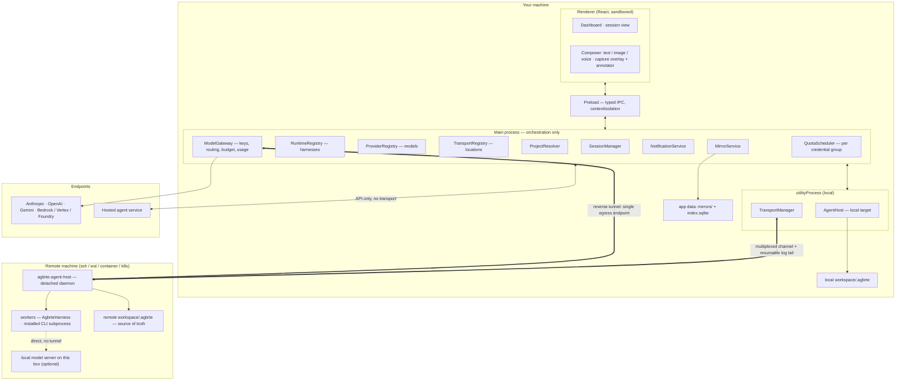
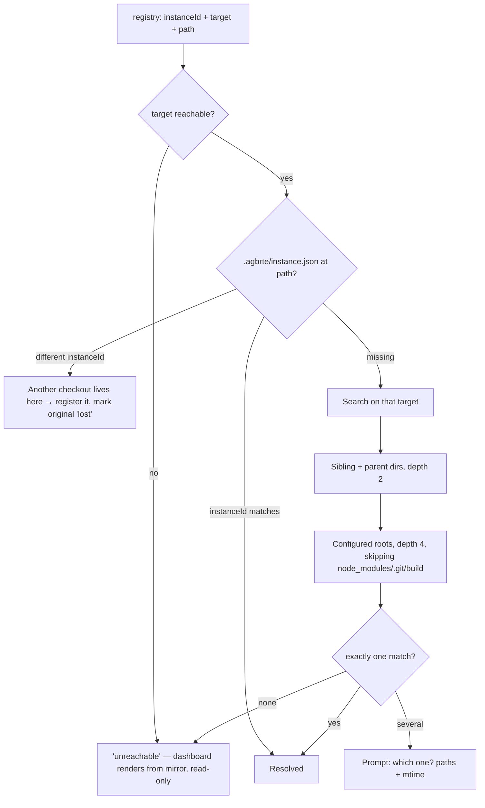

# Agbrte — Agent Bridge Terminal

**The name.** **Ag**ent **Br**idge **Te**rminal — three words that describe the architecture rather than decorate it. The **agent** is what runs. The **bridge** is the host: one process per workspace, owning the event log, the permission gate, and the turn queue, outliving every client attached to it (§8). The **terminal** is whatever you happen to be sitting at — the desktop app, a browser on a phone, the CLI on a machine with no display — and they are interchangeable by construction.

The design is in the order of those words. A session runs on the bridge, never inside the terminal, which is why closing the app mid-run, driving one session from a second machine, and resuming after a restart are not three features but one property seen three times.

**Status:** Architecture design, v0.5 — session hierarchy and scope-driven splitting. Greenfield.

**Reading guide.** §1 is the requirement map and the three-axis framing — read it first. The four load-bearing sections are **§3** (adapting any agent or model), **§4.3** (splitting work that doesn't fit), **§5** (surviving a folder move), and **§6** (where sessions run). §13 collects everything security-relevant. §15 is the build order; §17 is what's still open.

---

## 1. What this is

A desktop app for running software development work through AI agents. The unit of work is a **session**: a stated goal, bound to one workspace, worked by one or more **agents**, producing artifacts and a durable transcript.

| # | Requirement | Where addressed |
|---|---|---|
| R1 | Manage many sessions concurrently | §4, §8 |
| R2 | Many agents per session | §4.2, §9 |
| R3 | Agent context + history survive the workspace folder being moved | §5 — **load-bearing** |
| R4 | Dashboard showing per-session progress | §10 |
| R5 | Notify when a result is produced | §11 |
| R6 | Multimodal I/O, incl. per-session screen capture fed back to the agent | §12 |
| R7 | Sessions run locally **or** on a remote machine over SSH or other protocols | §6 — **load-bearing** |
| R8 | Any agent harness or model provider can be adapted, not only Claude | §3 — **load-bearing** |
| R9 | Work with the user's already-installed agent CLI, under their own auth | §3.12, §6.5 |
| R10 | Split work into child sessions when scope exceeds one context; manage the resulting tree | §4.3 — **load-bearing** |

### Confirmed decisions

- **Shell:** Electron desktop app (Node main + React/TS renderer).
- **Runtime layer:** pluggable, **two adapter branches** — external *harnesses* and raw *model providers* driven by a built-in harness (§3). No adapter is privileged; the harness branch is currently represented by the user's own installed CLI (§3.12).
- **Execution target:** pluggable transport layer. Local first, SSH second, then WSL / container / k8s, with hosted agent services as a reduced-capability fourth locality (§6.9).
- **Auth:** three modes — API key through our gateway, the user's own installed CLI session, or none for local models (§3.11). **Agbrte never stores, proxies, or replays a vendor session token.**
- **Memory/history location:** **inside the workspace** (`<workspace>/.agbrte/`), with a local follower mirror for remote workspaces. One documented exception: hosted targets, where the app-side store becomes primary (§6.9).
- **Multimodal, day one:** images/screenshots in, annotated screenshots, voice in (STT), voice out (TTS).

### Three axes, deliberately independent

The usual way to get this wrong is to conflate *what drives the loop*, *which model answers*, and *where it runs*:

| Axis | Interface | Question | Examples |
|---|---|---|---|
| Harness | `AgentRuntime` (§3.2) | who runs the loop, owns tools and context | an installed agent CLI, a vendor SDK, a hosted agent service, **Agbrte's own harness** |
| Model | `ModelProvider` (§3.6) | who answers one request | Anthropic Messages, OpenAI, Gemini, Bedrock/Vertex/Foundry, Ollama/vLLM/llama.cpp |
| Location | `Transport` (§6.2) | where it executes and how we reach it | local, ssh, wsl, container, k8s, hosted |

The model axis applies only when the harness is Agbrte's own — an external harness brings its own model plumbing. No adapter on any axis knows about the other two; `AgentHost` (§6.4) is the only component that composes them.

### One flagged concern, and how it's mitigated

Storing history inside the workspace can bloat a repo, leak transcripts into version control, and — since workspaces can be remote — put the dashboard's data on a machine you aren't connected to. Handled rather than argued with: `.agbrte/` **splits** into `memory/` (small, curated, safe to commit) and `sessions/` (large, excluded by default) via a nested `.gitignore`; every remote workspace gets a **local follower mirror** (§6.6) so the dashboard works offline.

---

## 2. Architecture at a glance



**Four hard rules:**

1. **Agent loops never run on the Electron main process.** Main orchestrates; a blocked main freezes every window.
2. **For remote targets the loop runs *on the remote*** (§6.3 — a requirement, not a preference).
3. **Model credentials never leave your machine by default** (§6.5). Two deliberate exceptions: a model server on the agent's own box, and the user's own CLI session.
4. **Agbrte never holds a vendor session token.** Where the user's own CLI owns the credential, we invoke the tool and stay out of the auth path entirely (§3.11).

---

## 3. Runtime layer — adapting any agent or model

### 3.1 Four tiers, two branches

"Support any agent model" collapses several different integration jobs. They separate by who owns the loop and who owns the deployment:

| Tier | What it is | Owns loop | Owns deployment | Built-in tools |
|---|---|---|---|---|
| 0 | **Model endpoint** — messages in, text + tool-call requests out | **we do** | you | none |
| 1 | **Loop helper** — automates the cycle over *your* tools | library | you | none |
| 2 | **Coding harness, self-hosted** — loop + file/shell/search tools + context mgmt + permissions + subagents + sessions | it does | you | yes |
| 3 | **Hosted agent service** — loop *and* sandbox on the provider's infra | provider | provider | yes, in their sandbox |

Tier 0 is the **provider branch**; tiers 2 and 3 are the **harness branch**; tier 1 is what `AgbrteHarness` is, except we also supply the tools.

```
AgentRuntime  (what the session sees — §3.2)
├── HarnessRuntime adapters — wrap something that already loops
│   ├── agent-cli-stdio         (Tier 2, the user's installed CLI — §3.12)
│   ├── (in-process vendor library — no implementation, §3.14)
│   └── hosted-agent-http       (Tier 3, REST + event stream — §6.9)
└── AgbrteHarness — our own loop, tools, gating, context management (§3.7)
    └── driven by any ModelProvider (§3.6)
        ├── anthropic-messages · openai-responses · google-gemini
        ├── openai-compatible   (Ollama, vLLM, LM Studio, OpenRouter, …)
        └── bedrock · vertex · foundry
```

Both branches present `AgentRuntime`, so **§4–§12 are provider-blind**. Building `AgbrteHarness` is real scope and it is what makes R8 true — a raw endpoint has no loop to wrap. It also pays back: for provider-backed agents *we* own the tool suite, the permission gate, compaction, and telemetry.

### 3.2 The outward interface

```ts
export interface AgentSpec {
  agentId: string;
  role: AgentRole;                          // 'lead' | 'worker' | 'reviewer' | 'custom'
  runtimeId: string;                        // which harness
  model?: ModelRef;                         // required iff harness is AgbrteHarness
  auth: AuthMode;                           // §3.11
  reasoning?: ReasoningRequest;             // normalized, §3.4
  systemPrompt?: string;                    // absent ⇒ none is sent; see §3.7
  toolPolicy: ToolPolicy;
  limits: { maxTurns?: number; maxToolCalls?: number; tokenCeiling?: number; wallClockMs?: number };
  /** Resolved at start by whoever is adjacent to the filesystem.
   *  Never persisted — environment, not identity. */
  workspacePath: string;
}
export interface ModelRef { providerId: string; modelId: string; endpointId?: string; }

export interface AgentHandle {
  send(turn: UserTurn): Promise<void>;
  interrupt(): Promise<void>;               // capability-gated on `interruptible`
  stop(reason: string): Promise<void>;      // unconditional — no capability guards it
  events: AsyncIterable<RuntimeEvent>;      // subscribable before the first send(); consumable once
  resumeToken(): string | null;             // a cache — never truth (§5.4)
}
export interface AgentRuntime {
  readonly id: string;
  readonly version: string;                 // stamped on every event this runtime produces (§5.1)
  readonly toolVersion?: string;            // the underlying vendor tool, where one exists (§3.12)
  /** Depends on the resolved model and adapter version, so it is a function. */
  capabilities(spec: AgentSpec): Promise<RuntimeCapabilities>;
  start(spec: AgentSpec, ctx: RuntimeContext): Promise<AgentHandle>;
  resume(spec: AgentSpec, token: string | null, ctx: RuntimeContext): Promise<AgentHandle>;
}
export interface RuntimeContext {
  seedHistory?: NormalizedTurn[];           // rehydration (§5.4)
  /** The adapter supplies the ask; only the host can stamp identity (§13). */
  requestPermission(ask: PermissionAsk): Promise<PermissionDecision>;
  reportProgress(p: ProgressSignal): void;
  modelEgress?: { baseUrl: string; token: string };   // absent when auth isn't api-key
  abortSignal: AbortSignal;
  // optional, and optional on purpose — an adapter running its own loop cannot use them:
  // compact(budgetTokens) §17.18 · sendMessage §4.2 · peers §4.2 · sessionTools §17.20
}
/** What the runtime picker lists (§7) and what admission checks against (§4.2). */
export interface RuntimeDescriptor { id: string; label: string; model: 'required' | 'optional' | 'none'; }
```

`capabilities()` is a function because with one provider capabilities belong to the adapter, and with many they belong to the *adapter plus the model plus the installed tool version*. `openai-compatible` against a 70B tool-caller and against a 3B chat model are not the same thing, and the orchestrator must know which it has before assigning work.

#### Interface obligations discovered while building the first two adapters

Each was a missing or wrongly-shaped field, not a coding mistake. They are recorded because the constraint is the interesting part.

| Obligation | The constraint that forced it |
|---|---|
| `version` (and optional `toolVersion`) live **on the interface** | §5.1 requires every event to name the adapter version that produced it, and the host cannot read an adapter's module constants without importing the adapter — the layering leak the registry exists to prevent. Every transcript recorded `adapterVersion: 'unknown'` and was unattributable. |
| `events` is **subscribable before the first `send()`** and **consumable once** | The host is stream-first: it subscribes, then sends, so no early event is lost. An adapter that builds its stream lazily (an async generator body runs on its first `next()`) yields nothing, and the pump logs a clean turn as a transport failure — indistinguishable from a dropped subprocess. Repeated access must return the same stream; a second consumer races the first. Both asserted for every adapter (§3.13). |
| `requestPermission` takes an **ask**, not a request | An adapter cannot know the session, and letting it mint the request id produced collisions across parallel tool calls — one promise never resolving, and a decision recorded against a call the user never saw. Both adapters independently wrote `sessionId: '' as never` to satisfy the old shape; two implementations reaching for the same cast is the signal that the type was wrong. The host stamps `requestId` and `sessionId`; the adapter supplies `agentId`, `tool`, `args`, and its own `toolUseId` where it has one. (`originSessionId` was on this row too. Nothing ever stamped it — one declaration, no writer — and it described a routing that does not happen, since `pendingPermissions()` is per-session and a child's prompt never enters its parent's list. Removed; the descendant breadcrumb is §4.3's `needsAttention.from`, which keeps the original origin when relayed through an intermediate parent, and is tested.) |
| `model` has **three** states, not a boolean | A boolean cannot express an adapter that accepts an optional model *hint*: §3.12's `CliAgentManifest.modelArg?` is optional by construction. `required` refuses a spec with no model, `none` refuses one carrying a model (it would be silently ignored), `optional` accepts either. **An `optional` adapter must report the model it actually resolved**, or §5.1 provenance breaks in the one case that matters — a transcript whose `origin.model` is absent because the adapter quietly used its own default. §17.11 records what the boolean cost while it stood. |
| `stop()` is unconditional | `interrupt()` is gated on `interruptible` and a runtime may legitimately refuse it (§3.3). If `stop()` were gated too, `interruptible: false` would mean *unstoppable*: the only remaining channel is `ctx.abortSignal`, which an adapter is free to ignore. So `stop(reason)` is the escape hatch every adapter implements, and the supervisor must use it when interruption is refused. |

### 3.3 Capability model

Declared, probed, and **enforced** — never assumed. Everything the orchestrator branches on lives here.

```ts
export interface RuntimeCapabilities {
  // loop and lifecycle
  nativeResume: boolean; interruptible: boolean; subagents: boolean;
  streaming: boolean; streamingToolArgs: boolean;
  // tools and gating
  tools: 'native' | 'text-protocol' | 'none';
  parallelToolCalls: 'many' | 'one' | 'none';
  schemaProfile: SchemaProfile;                          // §3.5
  toolResultPairing: 'batched' | 'one-per-message';
  permissionFidelity: PermissionFidelity;                // §3.10 — safety-critical
  // context
  contextWindow: number; maxOutputTokens: number;
  serverSideCompaction: boolean; caching: 'explicit' | 'automatic' | 'none';
  // reasoning
  reasoningControl: 'effort' | 'budget' | 'none';
  reasoningVisible: 'summary' | 'raw' | 'none';
  // content
  input: { image: boolean; audio: boolean; pdf: boolean; video: boolean };
  imageMaxLongEdge?: number; imageMaxCount?: number;
  // economics
  pricing?: { inputPerMTok: number; outputPerMTok: number; currency: string } | 'free' | 'opaque';
  costReporting: 'per-request' | 'telemetry' | 'none';   // §10
  tokenCounter: 'provider-endpoint' | 'local-estimate' | 'none';
  quotaModel: 'per-token-billing' | 'windowed-allowance';   // §3.9
}
```

**Prefer self-description over synthetic probing where the runtime offers it.** A well-behaved harness announces itself: Claude Code's `stream-json` output opens with a `system/init` event carrying the model, tool list, MCP servers, plugins, and a `capabilities` array of protocol behaviours, which its docs direct you to feature-detect on rather than comparing version strings. **Fall back to probing** only where nothing self-describes — chiefly `openai-compatible` servers, whose spread is enormous and whose self-reports can't be trusted: four cheap calls (single tool call, two parallel calls, nested schema, 1-pixel image), cached per **(runtime, provider, model, endpoint)** and re-run when the reported model list changes. Keying that cache on `runtimeId` alone is the bug that makes a 3B model inherit a frontier model's declared abilities.

**Three tiers of confidence, and the doc must not blur them.** A field is either *self-described* by the runtime, *probed* by us, or *configured* — a constant the adapter was told. Configured values are legitimate, but they are assertions, and §3.13's matrix records which is which. What the Claude Agent SDK offers, verified against `@anthropic-ai/claude-agent-sdk` **0.3.220** (types read 2026-07-30) — kept although the adapter that read it has been removed (§3.14), because it is checked vendor shape and the alternative is recalling it from memory later:

| Wanted | Available from the SDK | Consequence |
|---|---|---|
| model, tool list, MCP servers, plugins, skills, slash commands, protocol `capabilities[]` | `system`/`init` message, at stream open. `capabilities[]` is an **open set** — feature-detect a string, never compare versions | the self-description path above; parse the first event |
| effort support per model | `Query.supportedModels()` → `supportsEffort`, `supportedEffortLevels` | feeds `reasoningControl` (§3.4) without a table of model facts |
| `contextWindow`, `maxOutputTokens` | only **after a turn**, on `result`: `modelUsage[model].contextWindow` / `.maxOutputTokens` | unknowable before the first request, so an adapter on this branch must take both as **configuration** — a hard-coded model fact with a real constraint behind it, not laziness |
| per-turn cost | `result.total_cost_usd` plus `modelUsage[model].costUSD` | `costReporting: 'per-request'` is honest for this branch |
| windowed-allowance position | `rate_limit_event` → `rate_limit_info` (§3.9) | the only trustworthy source for `quotaModel: 'windowed-allowance'` |

**The three tiers had to reach the screen, and the incident that forced it is small and exact.** A user picked `qwen3:0.6b`, whose probe answers `tools: 'none'`, then asked it four times to search. Nothing happened; nothing said why. Under `AgbrteHarness` a model that cannot call tools can only chat, and §3.5's rule is that a degradation nobody is told about reads as the feature being broken. So the picker carries per-model capabilities — tool calling, context window, image input, reasoning control — each labelled *probed*, *self-described* or *configured*, and a capability nobody established renders as **unknown**, never as absent and never as no.

**The split between the two halves is a cost split, measured against a live Ollama rather than reasoned about.** Self-description is free — five models described themselves in 85 ms total, one `/api/show` each, no inference — so `models.list` carries a hint per model (v14). Probing is not: ~1.2 s per model here, and two real requests at whatever a cloud endpoint charges, so `models.capabilities` (v14) is asked for the one model somebody selected, automatically where the endpoint is free and behind a button where it is not. The asymmetry that makes the cheap half worth having: a server that lists *no* tool support is a hard no (Ollama refuses the request outright), while a server that lists tool support is only a claim — `qwen3:0.6b`'s own manifest says `['completion','tools','thinking']`. A declared yes is therefore shown as declared, and replaced rather than confirmed by the probe.

### 3.4 Normalizing reasoning control

Three incompatible families exist — effort levels, token budgets, nothing at all. The session stores one normalized value, `ReasoningRequest = { mode: 'off' | 'auto' | 'low' | 'medium' | 'high' | 'max' }`, and adapters map it to their own knob or ignore it when `reasoningControl: 'none'`. Two rules keep it honest: **no provider-specific reasoning knob ever enters `AgentSpec`** (the moment one does, every other adapter inherits a field it must ignore), and **the log records both** the normalized request and the concrete parameters sent — reproducing a six-hour session needs the wire values, and `mode: 'high'` won't tell you them.

### 3.5 Tool schemas — where "any model" actually breaks

Pluggable layers rarely fail on the HTTP call. They fail because a schema the frontier model handles makes a smaller model emit malformed arguments, or the endpoint rejects it. Tools are authored **once, canonically**, then degraded per target by a pure, tested `(canonical, profile) => degraded + lossReport`:

```ts
export type SchemaProfile =
  | 'json-schema-full'    // $ref, anyOf, nesting, constraints
  | 'strict-subset'       // additionalProperties:false + required everywhere, no unions
  | 'flat-only'           // flat objects, primitive/enum properties
  | 'text-protocol';      // no native tool calling
```

| Degradation | `strict-subset` | `flat-only` |
|---|---|---|
| inline all `$ref` / `$def` | ✔ | ✔ |
| `additionalProperties: false`, all fields required, nullable-optional | ✔ | ✔ |
| collapse `anyOf`/`oneOf` → discriminator enum + optional siblings | ✔ | ✔ |
| flatten nested objects → `dotted.path` primitives | — | ✔ |
| arrays of objects → JSON-encoded string, shape in the description | — | ✔ |
| drop unsupported constraints (`minLength`, `multipleOf`, formats) | ✔ | ✔ |

Every degradation is reported, shown in the agent's capability panel, and logged — so "this model keeps mis-calling `edit`" has a visible cause rather than becoming folklore. For `tools: 'text-protocol'`, a **`ToolCallCodec`** renders the suite as instructions plus a delimited format and parses calls back out, with a repair prompt on failure and a hard cap on repairs. Also normalized: `parallelToolCalls: 'one'` serializes our concurrent plan; `toolResultPairing: 'one-per-message'` splits batches; tool-call ids are mapped to our own, because collisions and reuse across providers are common.

### 3.6 The `ModelProvider` interface

Deliberately small. It does one request and knows nothing about sessions, workspaces, or transports.

```ts
export interface ModelProvider {
  readonly id: string;
  listModels(e: ModelEndpoint): Promise<ModelDescriptor[]>;
  probe(e: ModelEndpoint, modelId: string): Promise<RuntimeCapabilities>;
  invoke(req: ProviderRequest, opts: { signal: AbortSignal }): ProviderStream;
  countTokens?(req: ProviderRequest): Promise<number>;   // provider-native only
}
export interface ProviderRequest {
  endpoint: ModelEndpoint; modelId: string; system?: string;
  messages: ProviderMessage[];        // NOT NormalizedTurn[] — see below
  tools?: ToolSchema[]; maxOutputTokens: number; reasoning?: ReasoningRequest;
}
export interface ProviderResult {
  content: ContentBlock[]; toolCalls: NormalizedToolCall[];
  stop: StopReason;                                       // §3.9
  usage: { inputTokens: number; outputTokens: number; cacheReadTokens?: number; cacheWriteTokens?: number };
  raw: unknown;                                           // debugging only, never interpreted upstream
}
export type ProviderMessage =
  | { role: 'system'; text: string }
  | { role: 'user'; content: ContentBlock[] }
  | { role: 'assistant'; text?: string; toolCalls?: NormalizedToolCall[] }
  | { role: 'tool'; toolCallId: string; name: string; result: string; isError?: boolean };
```

**`messages` is `ProviderMessage[]`, not `NormalizedTurn[]`, and the difference is load-bearing.** `NormalizedTurn` models *what a person and an agent said* — a role and content blocks — which is sufficient for the durable log and a rehydrated seed, and was the obvious type to reach for. It cannot express a tool-calling loop: a tool call needs an assistant turn carrying structured calls with ids and a matching result turn bound to each id, so with only role-plus-content the second iteration of any loop is incoherent. The two types stay separate on purpose — `NormalizedTurn` is **persisted** and versioned with the log, `ProviderMessage` is **transient** wire input rebuilt on every request. Merging them would either put `toolCallId`s in the durable log or force the log's schema to track provider protocol changes.

**Divergence, recorded rather than smoothed over:** the signature says `invoke(...): ProviderStream`; the implementation returns `Promise<ProviderResult>`, and `streaming: false` is reported honestly by both shipped providers. Nothing in the current UI consumes partial output, so streaming was deferred rather than faked, and this note exists so no one reads the name as implemented.

**Never use a foreign tokenizer for pre-flight counting.** A 20%-wrong estimate produces context overflow deep into a long run — the worst time to find out. Providers with a counting endpoint get exact numbers; others get a conservative estimate with the margin recorded, and `AgbrteHarness` compacts on *measured* usage from the prior turn. **The scope of that ban is pre-flight request sizing**, and the boundary matters because a second kind of counting exists: deciding *how much history to carry into a seed* (§5.4) selects how much of our own log to include, and its failure modes are asymmetric — carrying less than it could is recovered by the next turn, overflowing the window is not. So the seed builder's pessimistic character heuristic is not a violation. Anything deciding whether a request will *fit* still needs a provider-native count or a recorded margin.

### 3.6a What the provider boundary cannot express

`ModelProvider` has one implementation, so the interface has only ever been shaped against one wire format. Rather than wait for a second implementation — which needs a paid key — the shapes of two genuinely different APIs were read against these types directly: **Anthropic Messages** and **Google `generateContent`**, both free to read. The point is not that the interface is wrong. It is that **every row is a place where one dialect's convenience was written down as if it were universal**, and none of them is visible from inside `openai-compatible`.

| # | What a second API needs | What we have | Forced? |
|---|---|---|---|
| 1 | A tool result carrying **content blocks**, images included — Anthropic's `tool_result.content` accepts `ImageBlockParam` outright | `ProviderMessage`'s tool role is `result: string` | **Yes** — our own §12 already works around it |
| 2 | Opaque reasoning echoed back verbatim: Anthropic returns `thinking` + `signature` (or `redacted_thinking` + `data`), Gemini a `thoughtSignature`, and multi-turn continuity **requires returning them** | `{ role: 'assistant'; text?; toolCalls? }` — nowhere to put them | Not yet |
| 3 | A thinking **budget** — Anthropic's `budget_tokens` (≥1024, counted against `max_tokens`) | `ReasoningRequest` is `{ mode: 'off' \| 'low' \| … }` | Not yet |
| 4 | **Per-block** cache markers — `cache_control` sits on individual content blocks, with a TTL | usage can *report* caching; nothing can *ask* for it | Not yet |
| 5 | Streaming | `invoke` returns `Promise<ProviderResult>`; the only provider declares `streaming: false` | Not yet |
| 6 | `pause_turn` — a long turn the model asks to continue by sending back | No `StopReason` for "resumable". `end_turn` truncates the work; `limit_reached` parks it for a human | Not yet |
| 7 | Usage split by **cache creation vs cache read**, priced differently, plus thinking tokens | ~~one `cachedInputTokens` conflating both~~ — **fixed**: separate through the event, the projection and the agent record, with an optional rate for each. Thinking tokens remain unmodelled | Was going to be, the moment anything priced a turn |
| 8 | System prompt as an array of blocks, cacheable | `system?: string` | Not yet |

**Row 1 was justified by a claim that is false.** `agbrteHarness` pushes tool-produced images as a following *user* message, and the comment gave the reason as "providers reliably accept images in a user turn and many reject them in a tool role". Anthropic's `tool_result.content` takes image blocks natively: the claim was true of the dialect in front of us and was written as a fact about providers. **And that workaround had a race** — the push was `void fitContent(...).then(...)`, landing in `messages` before the next request only because the loop happens to `await runTool` and the fitting happens to await nothing real. Give that call a resizer (§12.2) and the screenshot arrives *after* the request meant to carry it, reading as a model ignoring an image. Now awaited, with a test that fails when the fitting does real work and the push is not awaited.

**Row 5 is a documented deviation that has quietly become a capability claim:** `RuntimeCapabilities.streaming` is a field an adapter declares, and through this boundary no provider can honestly declare it true. **What this does *not* establish:** that the interface can be fixed. Fixing rows 2–8 without a second implementation to check against would be guessing at shapes — the same mistake one layer up. They are recorded so the eventual second provider is a check rather than a discovery.

### 3.7 `AgbrteHarness` — our own loop

For every `ModelProvider`, `AgbrteHarness` supplies what a harness would have:

- **Tool suite** — `read`, `write`, `edit`, `glob`, `grep`, `bash`, `web_fetch`, plus `plan`/`update_task` (§10) and `remember` (§5.5). One canonical schema set, degraded per §3.5. These are the same tools `AgentHost` implements for lease enforcement, so there is one implementation, not two.
- **Permission gate** — every call passes `ctx.requestPermission` *before* execution. `permissionFidelity: 'callback'`, the strongest tier (§3.10).
- **Context management** — no server-side compaction to lean on, so it compacts at a high-water mark by calling the **same `rehydrate()`** used for moved workspaces (§5.4). The function that reconstructs context after a move is the function that compacts a running session — one code path, exercised constantly, so the durable path can't rot. It is split across the seam §17.18 named: `RuntimeContext.compact(budgetTokens)` lets the harness decide **when**, from a token count only it can take, while the owner **does** it and writes `agent.compacted`.

  Two numbers and one restriction. Compaction triggers at **0.75** of the window and targets **0.5**; a single mark would sit just under the line and re-summarize every turn, paying for it each time and losing a little more detail each time. And it happens **between turns, never inside one**: a turn in flight holds an assistant message with tool calls and the results answering them, every provider requires those paired, and `rehydrate()` returns ordinary conversation — so compacting mid-loop would replace half a pair with prose and be rejected far from its cause. Declining is ordinary (the hook is absent on adapters that run their own loop, and returns `null` when the log holds nothing worth carrying); running out is not silent either, since the provider refuses and `context_overflow` surfaces as needing a person (§4.1).
- **Prompt assembly** — always stable-prefix-first (frozen system prompt, deterministic tool order, volatile content last). Correct for explicit-breakpoint caching, free wins for automatic prefix caching, harmless otherwise — so it's unconditional.
- **No default system prompt** — a seat that sets none sends none. Tested the other way and the measurement went against it: given only a tool list, a small local model concludes about one turn in ten that it has no filesystem, says so, and stops, and adding a short factual system prompt saying otherwise raised the broken-run rate from ~3/20 to 9/20 on `qwen2.5:7b` *and changed the failure kind* — the model left function calling and began typing tool calls as prose, opening shell fences, emitting gibberish. Prose in the system slot pulls a small model toward answering in prose. The field stays plumbed and empty; a future default needs its own twenty-run measurement, not an argument.
- **Loop control** — turn and tool-call caps, no-progress detection (identical call with identical args N times → intervene), and a wall-clock budget.

Reports `nativeResume: false`, which is fine: the durable resume path was never allowed to depend on it.

### 3.8 Endpoints and locality

```ts
export interface ModelEndpoint {
  endpointId: string; providerId: string; baseUrl?: string;
  auth: { kind: 'none' | 'api-key' | 'oauth' | 'aws-sigv4' | 'gcp-adc' | 'azure-key' };
  locality: 'cloud' | 'app-local' | 'target-local';
  defaultReasoning?: ReasoningRequest; costCeilingPerDay?: number;
  /** Recorded and displayed — adding a provider must never quietly change where code goes. */
  dataHandling: { provider: string; region?: string; retentionNote?: string };
}
```

| Locality | Meaning | Routing for a remote session |
|---|---|---|
| `cloud` | hosted API | through the gateway's reverse tunnel — credentials stay on your machine |
| `app-local` | model server on *your* machine | through the tunnel to your loopback |
| `target-local` | model server on the *agent's own box* | **direct to that box's loopback — no tunnel** |

Without `target-local`, an agent on your GPU workstation using Ollama on that same workstation would tunnel every token through your laptop and back — doubling latency for nothing and making the run depend on your laptop staying awake. Local servers usually need no auth, so there is also nothing to protect. This is precisely the case people buy a GPU box for, so it gets a first-class path. Four things the model-management path settled, each found by running it:

- **Which models an endpoint has is asked, not typed.** The model was a free-text field: you typed a name and found out whether it existed when the turn failed, while `ModelProvider.listModels` had been declared, implemented against `/v1/models`, and called by nothing — §16's shape, with the unused piece being exactly what the missing feature needed. `models.list` (v8) asks each endpoint what it serves *now*, as a command rather than a handshake field, because the answer changes while the host runs: pulling a model is something a person does mid-session and expects to see. Endpoints are configuration; their contents are not. Each is asked independently and a failure comes back as a value, since a machine with a local Ollama and a hosted API is ordinary and the local one is unreachable whenever the laptop is elsewhere.
- **Installing is not one operation, and three of four runners cannot do it.** Ollama fetches into a local store while running (`POST /api/pull`); vLLM and llama.cpp take their model at launch; NIM is a container per model. A menu offering *Install* against all four works against one and fails against three with a 404 — an error about the wrong subject. So the runner is detected by a positive test (`/api/version`, which only Ollama answers) and the others are told so by name, with what to do instead. Anything that does not answer is assumed usable-but-not-installable: the cost of that error is a sentence, and the cost of the opposite is a dead button.
- **The catalogue is verified, not recalled.** A tag is exactly what one is confidently wrong about: writing the suggested-model list by hand produced `kimi-k2:1t`, which the registry answered 404, as it did for every other Kimi tag — it is not in Ollama's library at all. One invented entry in eight, caught by asking. `scripts/model-catalogue.mjs` checks every tag against the registry and takes each size from the manifest, CI runs `--check`, and the file records the date the claim was true. It is a starting point, not an allow-list: the field still accepts any tag and the dropdown's last option reveals it, because `/v1/models` is optional and a closed list would strand any server that does not implement it.
- **Progress sums the layers.** Ollama reports `completed`/`total` for whichever blob is in flight, so passing them through makes the numbers restart at every layer boundary: a real pull raced to 88%, jumped to a nonsense percentage when a 561-byte config layer arrived, and *finished* at `561/561` — a 271 MB download reporting itself as half a kilobyte.

### 3.9 Normalized failures, including quota

Providers signal trouble incompatibly, and the supervisor can't act without a common taxonomy:

```ts
export type StopReason =
  | { kind: 'end_turn' } | { kind: 'tool_calls' } | { kind: 'max_output_tokens' }
  | { kind: 'refused'; category?: string }
  | { kind: 'content_filtered'; stage: 'input' | 'output' }
  | { kind: 'context_overflow' }
  | { kind: 'invalid_tool_args'; detail: string }
  | { kind: 'rate_limited'; retryAfterMs?: number }
  | { kind: 'quota_exhausted'; scope: 'session' | 'window' | 'daily' | 'weekly'; resetsAt?: string }
  /** A ceiling *Agbrte itself* set was reached. Nothing is broken; nothing resets. */
  | { kind: 'limit_reached'; limit: 'turns' | 'cost' | 'wallclock'; detail?: string }
  /** A permanent configuration fault. Retrying cannot help. */
  | { kind: 'misconfigured'; detail: string }
  | { kind: 'auth' } | { kind: 'unavailable' } | { kind: 'transport' };
```

**Three shapes of "cannot continue right now", and conflating any two is a bug.** The distinction is *who set the limit and whether waiting fixes it*:

| Stop | Who set the limit | Does waiting help? | Disposition | Session state |
|---|---|---|---|---|
| `rate_limited` | the provider, per-second | yes, seconds | retry with backoff | stays `working` |
| `quota_exhausted` | the provider, per-window | yes, at `resetsAt` | park with a scheduled wake | `awaiting_quota` |
| `limit_reached` | **us**, from `AgentSpec.limits` or `SessionBudget` | **never** | park for a human decision | `awaiting_input` |

- **`quota_exhausted` matters more than it looks.** A rate limit clears in seconds; a windowed allowance — a subscription seat's rolling window, or a CLI's daily cap — may not clear for hours, and failing the agent there is wrong. The supervisor parks it and schedules resumption at `resetsAt` (§8), exactly as it parks on `awaiting_credentials` when a laptop sleeps; `quotaModel: 'windowed-allowance'` tells the orchestrator to expect this.
- **`limit_reached` exists because the third row was mapped onto the second**, and the consequence was specific: `awaiting_quota`'s contract is "resume at `resetsAt`", and a ceiling Agbrte set has no window to reset, so an agent that merely ran out of turns **parked forever** with no reset time and no prompt. Raising the ceiling, re-scoping, splitting (§4.3), or closing the session out are all human decisions, which is what `awaiting_input` means. It notifies as `budget_exhausted` (§11).
- **`misconfigured` is the fourth "cannot continue", and the one that must *not* pause.** An unknown model id and a malformed request are permanent: no wait, no retry, and no human decision at the *session* level fixes them. These were originally mapped to `invalid_tool_args`, whose disposition is `retry`, so a typo'd model id burned the entire attempt budget re-sending an identical doomed request before surfacing anything. It is the only stop reason whose disposition is `fail` while nothing about the *work* failed, which is why it carries a mandatory `detail`: the message is the fix.
- **Nothing retries.** `stopDisposition` classifies `rate_limited`, `unavailable`, `transport`, `context_overflow` and `invalid_tool_args` as `'retry'`, and no provider, runtime, supervisor or manager code re-issues the turn; the only reader of that field turns anything not `'fail'` into `idle`. These used to map to `working` on the strength of a comment saying the supervisor retried, which left a stalled session displayed as busy and raising no `needsAttention` — and `working` is not in the attention family (§10). A stall that reports progress is the worst shape available on a workbench built for unattended runs, so they map to `awaiting_input` until a retry exists: honest about needing a person, and not `failed`, which §4.1 reserves for faults that will not come back.

**Mapping a Claude-family harness onto this union**, verified against `@anthropic-ai/claude-agent-sdk` 0.3.220 (types read 2026-07-30):

| SDK signal | Maps to | Note |
|---|---|---|
| `result.subtype: 'error_max_turns'` / `'error_max_budget_usd'` | `limit_reached { limit: 'turns' \| 'cost' }` | *our* arguments coming back, not a provider limit |
| `result.subtype: 'error_max_structured_output_retries'` | `invalid_tool_args` | repair-and-retry, bounded |
| assistant `error: 'invalid_request' \| 'model_not_found'` | `misconfigured` | permanent; retrying re-sends an identical doomed request |
| assistant `error: 'rate_limit'` | `rate_limited` | backoff |
| assistant `error: 'authentication_failed' \| 'oauth_org_not_allowed' \| 'billing_error'` | `auth` | "credentials cannot currently be used" → pause, not fail |
| assistant `error: 'overloaded' \| 'server_error'` | `unavailable` | retry |
| `rate_limit_event.rate_limit_info` with `status: 'rejected'` | `quota_exhausted { scope, resetsAt }` | `'five_hour'` → `scope: 'window'`; `'seven_day' \| 'seven_day_opus' \| 'seven_day_sonnet'` → `'weekly'`; `resetsAt` is an epoch number whose unit the type does not state — normalize carefully |

**Honest gap:** `rate_limit_event` is the *only* signal in this branch carrying a genuine reset time, and no adapter consumes it. Until one does, `quota_exhausted` has no verified producer here, so §3.13's "quota exhaustion and scheduled resume" scenario cannot pass on this branch — which is why it is marked unverified rather than assumed.

**Cross-provider fallback comes nearly free.** Because rehydration reconstructs context from our own log rather than provider state, an agent stopped by `refused`, `unavailable`, persistent `rate_limited`, or `quota_exhausted` can be restarted on a different provider with its task intact. One caveat stated plainly: **opaque provider-specific reasoning blocks cannot cross a provider boundary** — they are dropped at the handoff and the drop is recorded, so the transcript explains any discontinuity.

### 3.10 Permission fidelity is a capability, not an assumption

Our safety model (§13) rests on a gate we control. Not every runtime can offer one, and pretending otherwise is the most dangerous thing this design could do.

```ts
export type PermissionFidelity =
  | 'callback'                // pre-execution gate we control, per call
  | 'precomputed-allowlist'   // rules fixed before start; no live prompt
  | 'all-or-nothing';         // only a blanket bypass exists
```

| Fidelity | Who has it | Gating behavior | Constraint we impose |
|---|---|---|---|
| `callback` | `AgbrteHarness`; an in-process library exposing a per-call hook | true per-call ask/allow/deny | none |
| `precomputed-allowlist` | installed CLIs in headless mode (§3.12) | policy compiled to rules up front; `ask` becomes deny, then **deny → ask user → grant → resume** | none, but fidelity is badged in the UI |
| `all-or-nothing` | runtimes offering only a bypass flag | none | **`isolation: 'worktree'` or a container only — never `shared`.** Refused at creation otherwise |

That last row is enforced at agent creation rather than discovered at runtime: if we cannot gate the calls, we constrain what the process can reach. **Fidelity is displayed per agent** — a `AgbrteHarness` agent and a wrapped-CLI agent do not enforce identical policy, and the UI must never imply they do. A roster strip above the transcript carries each agent's role, model or runtime, auth kind, and a gate badge in words rather than colour — `gated per call`, `allowlist only`, `sandbox only` — rendered only when a session has more than one agent, on the same rule the dashboard uses for its host badge: a label that is always present and always the same teaches people to stop reading labels.

**Per-agent panes are a filter over the unified timeline, not columns.** The timeline stays the truth — one log, one order — and selecting an agent narrows the view. Permanent side-by-side columns would lose the interleaving, which is usually the thing you are trying to understand when a roster misbehaves. Rows carry the agent that produced them; rows nobody is attributed with, and agents no longer in the roster, are left unlabelled rather than guessed at. Building it exposed a bug invisible while sessions had one agent: the composer always addressed `agents[0]`, so in a roster every turn went to the lead however carefully a worker had been selected.

**Known narrowing: "or a container" is not expressible yet.** `Isolation` is `'shared' | 'worktree'` in code, because no container transport exists to enforce a third value (§6.1, §9). The rule therefore admits an `all-or-nothing` runtime under `worktree` only. That fails *closed* — stricter than the design allows, never looser — so it is a coverage gap rather than a hole, deliberately left until a container target can actually be enforced. Adding `'container'` to the type first would let the UI badge an agent as contained by something nobody implemented, which §13 treats as worse than having no containment at all.

### 3.11 Auth modes

```ts
export type AuthMode =
  | { kind: 'api-key'; endpointId: string }
  | { kind: 'vendor-cli-session'; cliId: string; quotaGroup: string }
  | { kind: 'none' };
```

| Mode | Credential lives | Gateway | Cost data | Detached remote runs |
|---|---|---|---|---|
| `api-key` | your OS keychain; injected at egress (§6.5) | routes everything | exact, centralized | needs your machine, or an explicit alternative |
| `vendor-cli-session` | that CLI's own config, on whichever machine runs it | **bypassed** | per-invocation or telemetry (§10) | yes — credential is already on the remote |
| `none` | nothing to hold (local model server) | bypassed | free | yes |

**Three non-negotiable rules:**

1. **Agbrte never stores, proxies, or replays a vendor session token.** Where the user's CLI owns the credential, we invoke the tool and stay out of the auth path. This is both the security boundary and the licensing boundary, and there is no version of holding those credentials worth building.
2. **We never bundle a vendor CLI.** Detect the installed binary, report its version, link to the vendor's install docs. Shipping the tool and having users log in through it is a materially different thing from running software they installed themselves.
3. **`vendor-cli-session` puts credentials wherever the loop runs.** For a remote session that means on the remote — the opposite of §6.5's default, unavoidable because there is no key to tunnel. **Surface it; never let it be inferred.**

`quotaGroup` identifies agents sharing one credential so they can share a throttle (§8) — eight agents on one seat allowance will burn a window in twenty minutes if scheduled independently.

> **Licensing note, stated once.** Driving a vendor CLI programmatically is a documented, supported integration for Claude Code (`-p` with `--output-format json` is the recommended way to drive the agent loop from another language). Building a third-party product that routes *its users* onto a vendor's consumer subscription limits is a separate question and generally requires the vendor's prior approval — Anthropic's Agent SDK docs say so explicitly, and an approval path exists. A telling signal: `--bare`, the mode its docs recommend for scripted calls, **skips OAuth and keychain reads entirely and requires an API key.** Treat API-key auth as the default and get written clarification before shipping subscription-backed operation as a feature.

### 3.12 Installed-CLI harness adapters

`agent-cli-stdio` spawns an agent CLI the user already installed and logged into, speaks its JSON protocol, and maps it onto `AgentRuntime`. One adapter plus a per-CLI manifest, so adding a tool is configuration and a conformance run rather than a new codebase.

```ts
export interface CliAgentManifest {
  cliId: string;                                  // 'claude-code' | 'gemini-cli' | …
  detect: { binary: string; versionArgs: string[]; versionRegex: string; supportedRange: string };
  invoke: {
    promptMode: 'argv' | 'stdin'; baseArgs: string[];
    modelArg?: (m: ModelRef) => string[];
    resumeArg?: (token: string) => string[];
    allowlistArg?: (p: ToolPolicy) => string[];   // compile our policy to their rule syntax
    permissionModeArg?: string[];
    deterministicModeArgs?: string[];             // skip auto-discovery of local config
  };
  parse: {
    framing: 'ndjson' | 'json' | 'text';
    map: EventFieldMap;                           // a reader factory → RuntimeEvent; see below
    initEvent?: string;                           // self-describing capabilities (§3.3)
    costField?: string; errorCategoryField?: string;   // per-invocation cost; → StopReason (§3.9)
    subagentParentField?: string;                 // → thread tree
  };
  permissionFidelity: PermissionFidelity;
  needsPty: boolean;
  quotaModel: 'per-token-billing' | 'windowed-allowance';
}
```

**Verified reference points** (check against the installed version at `hello` — these protocols are the vendor's to change):

| Concern | Claude Code | Gemini CLI |
|---|---|---|
| One-shot | `-p "…"` | `-p "…"` |
| Event stream | `--output-format stream-json --verbose --include-partial-messages` | `--output-format stream-json` |
| Self-description | `system/init` event: model, tools, MCP servers, plugins, `capabilities[]` | verify |
| Multi-turn | `--continue`, or `--resume <sessionId>` | verify |
| Model | `/model sonnet` in the prompt | `-m <model>` |
| Allowlist | `--allowedTools "Bash(git diff *),Read,Edit"` | verify |
| Permission baseline | `--permission-mode dontAsk` / `acceptEdits` | verify |
| Per-run cost | `total_cost_usd` + per-model breakdown in `--output-format json` | verify |
| Subagents | messages carry `parent_tool_use_id`; `--forward-subagent-text` for their text | verify |
| Errors | `system/api_retry` with an `error` category | verify |
| Deterministic mode | `--bare` (skips hooks/skills/plugins/MCP/CLAUDE.md discovery) | verify |
| Auth | interactive `/login` (subscription), or `ANTHROPIC_API_KEY` / Bedrock / Vertex / Foundry | Google OAuth, `GEMINI_API_KEY`, or Vertex |

**Gating flow — deny-ask-resume.** Headless mode has no per-call approval callback; that is a library feature. So: compile our `ToolPolicy` `allow` rules into the CLI's allowlist syntax before spawn (our `{tool, match}` pairs map closely onto theirs — mind the gotchas, e.g. `Bash(git diff *)` needs the space before `*` or it also matches `git diff-index`); use the **deny-by-default** baseline (`dontAsk`) rather than the abort-on-unallowed one, because denial lets the agent adapt and keep working while aborting loses the turn; compile anything our policy marks `ask` to *deny*, surface the denial as a prompt — "this agent tried X and was blocked; allow and continue?" — and on approval add the rule and resume via the session token. That **approximates live gating at the cost of a turn restart**, which is as good as this branch can be, and the **sandbox is the real boundary**: worktree or container isolation, restricted filesystem view, egress policy, with the subprocess holding one coarse grant the user approved up front.

**The raw side is kept, and it now outlives the process that printed it.** Everything above is what a CLI's output *parses to*; a person watching a long turn also wants what it *was* — NDJSON, update banners, the deprecation notice, stderr — so each seat keeps a bounded ring of its own lines and a read-only pane shows them beside the transcript. Bounded three ways, because unlike a preview log this one lives as long as the session: per line, in total, and in count, with the count of what was evicted carried alongside so a shortened tail says it was shortened.

It used to die with the process, and that made the two panes unequal in a way only a restart revealed: reopen a session and the chat comes back whole from the log while the pane beside it is blank. The ring is therefore **mirrored to disk** beside the log, and restored on reopen. Three properties are deliberate. It is a *snapshot*, not a second append-only log — the ring cannot exceed a quarter of a megabyte, so the file cannot either, and nothing needs compacting. It is *not a transcript*: resume, the §13 gate, projections and checkpoints read `events.jsonl` and none of them read this. And it restores **the bytes that were actually printed** rather than re-rendering the log to look like terminal output, which was the objection that kept the pane empty and is still the right one — what the pane must never show is text nothing ever wrote there. The join between runs is drawn rather than hidden, since a CLI's start-up banner appearing twice reads as a fault instead of a restart.

**Determinism vs the user's own setup.** Deterministic mode is faster and reproducible but skips auto-discovery of local hooks, skills, plugins, MCP servers, and project instruction files — and, for Claude Code, skips OAuth/keychain reads, making it API-key-only:

| | deterministic | inherit local config |
|---|---|---|
| Same result on every machine | ✔ | ✘ — a teammate's hook or the project's MCP config runs |
| Uses the user's CLI login | ✘ | ✔ |
| Picks up user's project instructions / skills | ✘ (pass explicitly) | ✔ |

Since Agbrte promises reproducible transcripts, **deterministic plus explicit config flags is the default**, with "use my local setup" an opt-in carrying the caveat.

**A settings file is a gate bypass, recorded although the adapter that found it is gone (§3.14).** An in-process library that consults its `canUseTool` hook *last*, and skips it for anything approved earlier, makes an allow rule arriving from a settings file the same bypass as `allowedTools`, just sourced from disk. Any such adapter must pin `settingSources: []`, and a `permissionFidelity: 'callback'` claim is conditional on it. **What that does and does not exclude** — verified against `@anthropic-ai/claude-agent-sdk` 0.3.220 (`sdk.d.ts`, `Options` and `ResolveSettingsOptions`, read 2026-07-30) — is that `[]` disables *filesystem* settings (user, project, local `settings.json`) while "the managed-settings policy tier is still read from disk":

| Policy sub-source | Filtered? | Can it contribute `permissions.allow`? |
|---|---|---|
| `Options.managedSettings` (what an embedder passes) | yes — a **restrictive-key allowlist**: `allowManaged*Only` locks, `permissions.deny`/`ask`, sandbox restrictions. Permissive arrays including `permissions.allow` are "silently dropped" | no |
| admin tiers on disk (`managed-settings.json`, MDM) | root-owned by construction; an admin who can write them can do anything | out of scope — that is the machine's owner, not an untrusted input |
| remote tier (`~/.claude/remote-settings.json` cache, or `serverManagedSettings`) | **no** — documented as "same trust level as the on-disk cache it replaces, so non-restrictive keys flow through unfiltered" | **yes, in principle** |

So the accurate claim is narrower than "no invisible allow rules can reach the agent": `settingSources: []` closes the case we care about — a `.claude/settings.json` committed into the workspace we are about to let an agent edit — and cannot be widened by the `managedSettings` option we pass. The **residual risk is the remote tier**, a file in the user's own home directory that the merge engine trusts and does not filter, bounded by two things: our `deny` rules go through as `disallowedTools`, which the SDK enforces ahead of everything, and `resolveSettings()` (`@alpha`) reports the same cascade a `query()` would see with per-key `provenance`, so inspecting it at `hello` and refusing the `callback` claim when the policy tier carries `permissions.allow` or an escalating `permissions.defaultMode` is the mitigation. *Unconfirmed:* whether an explicit `permissionMode: 'default'` on `Options` overrides a `permissions.defaultMode` from the policy tier — the SDK documents a separate trust filter (`filterEscalatingDefaultMode`) for repo-committed files but says nothing about option-versus-policy precedence. Treat it as unknown until a conformance assertion covers it.

**What building it changed** — seven things this section had wrong or underspecified:

- **`parse.map` is a function, not a map.** A field map lifts `msg.foo.bar` into an event and nothing these CLIs emit is that shape: one assistant record carries an array of content blocks that becomes several events, and a tool result means nothing until it is paired with the `tool_use` whose id it carries, so a declarative map would have grown until it was a language. The manifest supplies a small **reader factory** — a factory because pairing needs per-run state and a manifest is a shared constant, so one reader instance would leak tool ids between concurrent agents.
- **Deterministic mode is derived from `AuthMode`, not configured.** For Claude Code it is also what skips OAuth and keychain reads, and under `vendor-cli-session` the login it declines to read *is the entire reason* we are invoking the user's own CLI. The default stands — deterministic — and choosing `vendor-cli-session` **is** the opt-in to local config, rather than a second switch that can contradict the first.
- **A scoped `allow` rule cannot be compiled, and is dropped.** An allowlist has no notion of inside and outside, so `{tool:'write', scope:'inside', action:'allow'}` compiled to a bare `Write` would hand over the whole filesystem while the UI kept displaying a rule that says "inside" — §13's widening bug arriving through a translation instead of a bad rule. It is dropped, falls through to a denial and a prompt, and the loss is reported; a scoped **deny** compiles without its scope, because denying both sides is stricter than asked, and that is reported too. **`allow once` likewise has no equivalent**, since a rule granted before spawn lasts as long as the process: the closest honest thing is the call's **designated argument** as an exact pattern — `Bash(git status)` matches that call and nothing else — widening to the whole tool, and saying so, where no designated argument exists. The argument comes from an ordered list rather than "first string found", because tools carry incidental strings and pinning a grant to a description produces a rule that matches nothing while looking specific.
- **Model selection needed the descriptor's three-valued field** (§3.2, §17.11). While it was a boolean, admission rejected any spec carrying a model for this adapter, so `modelArgs` was left out of the manifest rather than shipped as code admission guarantees never runs.
- **Exit 143 is clean only when we caused it.** That holds for our own `stop()`, which kills the process and returns before any exit mapping runs. An *external* SIGTERM mid-turn is a different event — an OOM killer or a `systemctl stop` cut the turn in half — and mapping it to `end_turn` would move the session to `awaiting_input` as though the work had finished, so it is reported as `transport`, on the standing rule that a truncated turn reported as success is the worst outcome available.
- **A blanket-only CLI needs no new enforcement.** Gemini CLI's allowlist syntax and resume semantics are not documented well enough to compile a policy into, so its manifest declares `all-or-nothing` — and §9's existing admission rule then refuses to run it in a shared workspace, making the sandbox the boundary, with no new code. Declaring `precomputed-allowlist` to make it feel more capable would have been the one failure §13 calls worse than having no gate.

**Verification status.** The adapter runs end to end against a **real subprocess** over real pipes — spawn, chunked NDJSON, non-protocol output, exit codes, and a full deny → ask → grant → resume across two separate processes. What that cannot prove is the **flag names**, which are the vendor's to change; both manifests carry `verified: false`, and a conformance run against an installed build is what flips it. Neither `claude` nor `gemini` was installed on any machine available here, so that run has not happened.

**Operational contract** — details that will otherwise be discovered painfully:

- **SIGTERM** is `stop()`: the CLI aborts the turn, kills its Bash process tree, runs its session-end hooks, and exits **143**, which is clean rather than a crash. **Background processes the agent starts are killed shortly after the run returns**, so a preview dev server (§6.8) must be started by *us*.
- **Piped stdin is capped** (10 MB on Claude Code), so large `seedHistory` goes to a file and is referenced by path. **Session ids are scoped to the working directory and its git worktrees**, so `--resume` keeps working for worktree-isolated agents (§9): isolation and resume don't fight.
- **Process-per-turn latency** — `--resume` means a fresh process each turn, fine for long turns and noticeable in chatty interaction, so measure before choosing this branch for interactive work. **Prefer documented JSON output over a pty** (`needsPty` only where a manifest genuinely requires interactivity; ANSI parsing is a maintenance sink), and **pin a supported version range**, detecting at `hello` and refusing unknown majors.

### 3.13 Normalized content, and the conformance suite

```ts
export type ContentBlock =
  | { type: 'text'; text: string }
  | { type: 'image'; sha256: string; mime: string; width: number; height: number;
      provenance: ImageProvenance }
  | { type: 'audio'; sha256: string; mime: string; durationMs: number; transcript?: string }
  | { type: 'file_ref'; path: EncodedPath }           // §5.4b — one path type, everywhere
  | { type: 'artifact_ref'; artifactId: string };

export interface ImageProvenance {
  kind: 'paste' | 'drop' | 'screen_capture' | 'annotated_capture' | 'headless_browser';
  origin: 'client' | 'remote';                       // which machine made the pixels
  capturedAt?: string; displayId?: string; windowTitle?: string;
  url?: string; viewport?: { w: number; h: number; dpr: number };
  scaledFrom?: { w: number; h: number };             // pre-scale size — §16, coordinate targeting
  annotatedFrom?: string;
  redactions?: Array<{ x: number; y: number; w: number; h: number }>;
}
```

`file_ref` carries the same `EncodedPath` as the log (§5.4b) rather than a bare string: one path type means the collapse-on-write / expand-on-read codec covers content blocks too, and a second string-shaped path field is exactly how an absolute path gets into durable history and survives a folder move as a lie. Downgrade is a declared pipeline driven by capabilities, not scattered conditionals — no image support → description text plus `file_ref`; over `imageMaxLongEdge` → downscale; over `imageMaxCount` → keep the most recent and reference the rest — and every downgrade is logged, so a model "ignoring your screenshot" is diagnosable.

**The conformance suite is what keeps this abstraction from rotting.** Every adapter, both branches, runs one scenario set, and the *point* of the set is that it is run identically against deliberately different implementations. It exists because 158 passing tests failed to catch a reference adapter that emitted zero events: every runtime test asserted against the in-repo `echo` runtime, so the interface was only ever validated by the implementation that happened to satisfy it — §16's first risk, arriving on schedule. **Four candidates run it now**, deliberately unalike: `echo`; `AgbrteHarness` over a raw provider; `agent-cli-stdio` against a real subprocess speaking the protocol over real pipes; and a runtime reached through the agent-host control protocol. The last two matter most to the claim — one is a text protocol with no loop to hold, the other is the same adapter after serialization and a process boundary. It was five: `claude-agent-sdk` ran through an injected `query` until the dependency was removed (§3.14).

**Scenario status is part of the design, not a CI detail**, because claiming a scenario the suite does not run is the fiction this section exists to prevent. No credentials and no real endpoints are involved anywhere in it: what the suite proves is the adapter, and what it cannot prove is the vendor's behaviour.

| Scenario | Status | Note |
|---|---|---|
| stream subscribable before first `send()` | ✔ all candidates | added in Phase 1 — §3.2's obligation, and the zero-event bug |
| stream consumable once | ✔ all candidates | a second consumer races the first |
| explicit terminal stop, never an implicit clean finish | ✔ all candidates | a truncated turn reported as success is the worst available outcome |
| usage reported for the turn | ✔ all candidates | value accuracy against a real endpoint is **not** verified |
| single tool call through the gate before execution | ✔ all candidates | asserted on the real callback wiring |
| resume token consistent with declared `nativeResume` | ✔ all candidates | an adapter may not claim native resume and supply nothing |
| gate configuration the fidelity claim depends on | ✘ producer removed | was ✔ on the SDK adapter (no `allowedTools`, `permissionMode: 'default'`, `settingSources: []`, `canUseTool` always present, denial carries its reason); that adapter is gone (§3.14) |
| kill and resume from log | ✔ host-level | covered against `echo` incl. a rejected native resume; not yet per-adapter |
| permission denial surfaced and resumed after grant | ✔ verified | the full §3.12 flow across two real processes: denied, asked, granted, resumed with the work kept |
| NDJSON record split across pipe chunks | ✔ CLI adapter | one record written seven bytes at a time; naive per-chunk parsing loses the middle of real output |
| non-protocol output on stdout | ✔ CLI adapter | an npm notice is not a failed turn |
| truncated run is not a clean finish | ✔ CLI adapter | a process that dies mid-turn stops as `transport`, never `end_turn` |
| uninstalled binary is not retried | ✔ CLI adapter | `misconfigured`, not `transport` — retrying cannot install a CLI |
| two parallel calls · tool error recovered · nested schema after degradation · image input · 200-message context with compaction · interrupt mid-stream · refusal · rate-limit backoff · **quota exhaustion and scheduled resume** · context-overflow recovery · malformed args repaired · cost/usage accuracy | ✘ not yet run | Phase 3 (§15), and most need real endpoints or the schema degrader, neither of which exists |

**The matrix ships beside the runtime picker** — the moment the question is actually being asked — showing the column for the runtime about to be chosen rather than the whole grid, because a 24-row table across five runtimes is a document and what is needed there is an answer. An adapter that cannot pass a scenario declares the capability `false` and the orchestrator routes around it: a configuration fact, not a runtime surprise. Six cell states, because three were not enough to stay honest:

| State | Means | Why it is its own state |
|---|---|---|
| `verified` | a scenario ran and passed | carries its `evidence`: scripted fixture, in-process, real subprocess, live endpoint |
| `failed` | a scenario ran and failed | louder than an absence, deliberately |
| `stale` | a result exists, for a **different build** of this adapter | a report records one moment; an adapter edited since has not been checked, however green the file |
| `declared` | the adapter claims it; nothing has checked | the state this whole section exists to keep separate from `verified` |
| `unsupported` | the adapter says it cannot | an answer, not a gap — showing it as a hole makes an honest declaration look like missing work |
| `not-run` | no scenario, or the adapter could not be asked | the gaps, which are the point |

- **The catalogue carries scenarios nobody has written**, because a matrix built only from tests that exist shows a wall of green and answers the wrong question. **Coverage counts only `verified`**, or the runtime that claims everything and proves nothing becomes the best-covered one on the screen.
- **The tests write the report.** Each producer writes its own fragment under `conformance/`, because vitest runs test files in separate workers and one shared collector would keep only the last writer's rows. A fragment is replaced rather than merged, so a scenario deleted from the suite disappears from the matrix instead of leaving its last green cell up forever. Evidence is passed per assertion, not per suite: the same adapter proves one scenario against a real subprocess and another against a scripted response, and averaging those into one colour is the collapse this section forbids.
- **A runtime that needs a model is not probed, and this cost an evening.** Asking an adapter what it declares needs a spec, so the host invents one — and the first version invented a placeholder *model id* too, so `AgbrteHarness` could be asked. That adapter answers by making **real requests** (§3.3), so every host attach fired a live call at a model that does not exist, behind a two-minute timeout: the end-to-end suite went from one minute to nine and a permission test timed out waiting. It was also the wrong question, since the answer belongs to whichever model the user is about to choose. It returns nothing now and the matrix says the adapter could not be asked, which is exactly true.

### 3.14 No vendor SDK, and what that cost

The `claude-agent-sdk` adapter is removed, along with the dependency it imported. What is left in the harness branch is `agent-cli-stdio` — the user's own installed CLI, under their own auth, detected rather than bundled.

**The reason is what the project already says everywhere else.** §3.12 refuses to vendor a CLI, §12.1 refuses to vendor a browser, and §12.4 refuses to vendor a speech model — each time because the installer is one self-contained shell script and a dependency that is not ours is a dependency the user did not choose. An in-process SDK is the same argument with more force: it is *proprietary* code, "© Anthropic PBC. All rights reserved", and `scripts/package.mjs` already carried a licence gate refusing to redistribute it. **That gate never fired, and that is the point:** the SDK reached no shipped bundle, but only because the adapter importing it happened not to be registered in any headless entry point, and an accident that holds is not a guarantee. The gate stays now that the dependency is gone, because the next proprietary SDK will arrive as a convenience inside one adapter and this script is where redistribution would actually happen.

**What it cost, stated rather than glossed.** §3.1 names three harness tiers, and Tier 2's *in-process library* shape now has no implementation. The branch is still exercised — `agent-cli-stdio` runs the full contract suite against a real subprocess over real pipes — but the specific shape of "an adapter that is a function call into somebody else's loop, in our own process" is unproven, and it was the only candidate exercising `canUseTool`-style approval callbacks from inside a library, which is a different gate wiring from a subprocess flag list. Four candidates still run the contract suite and remain deliberately unalike (§3.13); the claim that gets weaker is R8's, and §16 records it as weaker rather than pretending otherwise.

**What it did not cost:** nothing about *using* Claude. `cli:claude-code` is a manifest — a binary name and a list of argv flags describing how to drive a CLI the user installed and authenticated themselves. It bundles nothing, depends on nothing, and is the shape §3.12 argues for; removing it would remove support for the user's own tool while removing no coupling at all.

---

## 4. Session and agent model

### 4.1 Session

```ts
export interface Session {
  sessionId: string;              // uuidv7 — sortable, unique across hosts by construction
  instanceId: string;             // workspace instance, §5.2
  target: ExecutionTarget;        // §6.1
  title: string; goal: string;
  state: SessionState;
  agents: AgentRecord[];
  createdAt: string; updatedAt: string;
  checklist: ChecklistItem[];     // shared across agents
  artifacts: ArtifactRef[];
  budget?: SessionBudget;         // hierarchical — §4.3
  needsAttention: null | { reason: AttentionReason; since: string; from?: Breadcrumb };
  tree: TreePosition;             // §4.3
  children: ChildRef[];           // cached projection; the child owns the truth
  group?: SessionGroup;           // a named set that may message each other — §17.22
}

export type SessionState =
  | 'draft' | 'planning' | 'working'
  | 'awaiting_input' | 'awaiting_permission'
  | 'awaiting_credentials'        // egress tunnel down (§6.5)
  | 'awaiting_quota'              // windowed allowance spent; resumes at resetsAt (§3.9)
  | 'awaiting_children'           // blocked on descendant sessions (§4.3)
  | 'verifying' | 'done' | 'failed' | 'cancelled';
```

**One workspace, one execution target; all agents run there.** A session never spans boundaries — that is what keeps path encoding (§5.4b), lease authority (§9), and the mirror's single-writer invariant (§6.6) simple. Work crossing a repo or a machine is a **child session** with its own workspace or target (§4.3). **Decided, no longer open:** a single session will not span two targets. This was carried as an open question through the hierarchy design and the answer never changed, because those three properties are each *derived* from one-target-per-session rather than merely convenient alongside it — a two-target session needs relative paths resolved against two roots, a lease table no single host can enforce, and two writers on one log. Hierarchy removed the motivation, since `ChildRef` carries its own `instanceId` and `target`.

The five `awaiting_*` states are deliberately parallel: each means *paused, holding all state, will resume* — never failed. Which pause a stop reason produces is a table in §3.9, and one row is easy to get wrong: a ceiling **Agbrte** set (`limit_reached`) lands in `awaiting_input`, not `awaiting_quota`, because no window will reset and only a person can raise the ceiling, re-scope, split, or close the session out. A laptop sleeping, a seat allowance resetting at 4pm, a user who hasn't approved a tool, and a parent waiting on its children are the same shape of problem — treating any of them as a failure would throw away hours of work. Not constrained: agents may use **different harnesses, providers, models, and auth modes**. Only location is fixed.

### 4.2 Agents within a session

```ts
export interface AgentRecord {
  agentId: string; role: AgentRole;
  spec: Omit<AgentSpec, 'workspacePath'>;      // carries runtimeId, ModelRef, AuthMode
  resolvedCapabilities: RuntimeCapabilities;   // snapshot at start, recorded in the log
  status: 'idle' | 'parked' | 'running' | 'blocked' | 'crashed'
        | 'stopped'                            // a turn ended badly — about the turn
        | 'retired';                           // replaced; folded from agent.retired
  isolation: 'shared' | 'worktree';
  resumeToken: string | null; lastEventSeq: number;
  usage: { inputTokens: number; outputTokens: number; cost: number | 'unknown' };
}
/** What a role demands of whatever fills it. */
export interface RoleRequirements {
  needs: Array<keyof RuntimeCapabilities | 'tools:native' | 'input:image'>;
  minContextWindow?: number; minPermissionFidelity?: PermissionFidelity;
  prefer?: ModelRef[]; maxCostPerMTokOut?: number;
}
```

**The roster is capped at one, by product decision.** A session is **one agent, one model**. `SessionManager.addAgent` refuses a second *active* seat — naming the agent already there, and pointing at the two things the person can do instead — and it refuses in the owner of the log rather than in a client, because three clients reach it (the app, the terminal, an attached browser) and template application reaches it too. A rule enforced by hiding a button is a rule the other clients do not have.

This is a decision about *product shape*, not a discovery that rosters cannot work. Collaboration between models is **session groups** (§17 Q22) instead: separate sessions, separate logs, separate budgets, separate permission policies, and one bounded channel — `message_peer` — between them. That gives up shared-workspace immediacy and gains four things a roster could not. Each model's cost and blame is separable, which is what makes "the cheap worker went wrong" answerable. Each has its own gate, so a coarse-gated CLI cannot inherit a grant a person gave to a frontier model in the same session. Each is independently resumable, cancellable and orphanable. And the *user's* mental model becomes one transcript, one voice — a single log interleaving four models is the hardest artefact in the system to read, and it was being produced by the feature that was supposed to make work legible.

**Changing the model mid-session stays.** It is a **replacement**, not an addition: the incumbent is retired and the newcomer admitted, in that order, in one call, and both halves land in the log — `agent.retired` then `agent.created`. The order matters. Admission runs first, so a model the host cannot start leaves the session exactly as it was rather than empty; the retirement is written *before* the newcomer is pushed, so there is no instant at which the roster holds two. `agent.retired` is a durable event rather than a status flip because `AgentRecord.status` is live state that a resume rebuilds as `idle` — a rule that evaporates on restart is not a rule — and because `stopped` already means "a turn ended badly", which admission has to be able to tell apart from "this seat was deliberately replaced". A retired seat keeps its place in `session.agents` forever so every row it wrote keeps its name, and it is not sendable, not addressable on the bus, and not projected into a template.

**What stays, and why.** The bus below, `agentId` on every event, per-agent panes, `focusedAgent`, roster rendering and the per-agent turn queue are all **kept**: sessions with two seats exist on disk, resume, attribute their rows, and still coordinate through the bus, and §5.1 makes their logs permanent — a rule about what may be *created* can never become a rule about what already exists. The group feature also delivers through the same per-agent path. What changed is only that a new session cannot grow a second seat, so in a session created from now on `RuntimeContext.peers` is a list of one and `message` refuses every address it is given.

**Heterogeneous rosters were the payoff of R8**, and this is where that payoff moved rather than where it was abandoned: a frontier `lead` and a `reviewer` on a **different provider** is still the point — an independent model is independent in a way a second instance of the same model is not — but they are now two grouped sessions rather than two seats. Admission is still capability-driven, not hand-wired: an agent whose configuration can't clear the floor is **refused at creation with the missing capability named**, rather than assigned and left to fail confusingly three tool calls in. `minPermissionFidelity` is how a role that must write outside a sandbox is prevented from being filled by an `all-or-nothing` runtime.

**Message bus** — *for the sessions that have a roster, which are the ones created before the cap above, and for the delivery path §17 Q22 shares with it.* Agents address each other through the session, as a *tool* rather than an API — an agent sends by calling `message`, so the send passes the permission gate like every other call and appears in the transcript as one. A bus reachable some other way would be the one thing in the system an agent could do without the gate seeing it. Messages carry normalized `ContentBlock`s, so a Claude-backed lead messaging an Ollama-backed worker needs no translation beyond that worker's declared downgrades, and every message is an event in the log.

```ts
type AgentMessage = { from: string; to: string | 'session';
  kind: 'task' | 'report' | 'question' | 'answer' | 'review'; content: ContentBlock[] };
```

- **`from` and `hops` cannot be set by the sender.** What crosses the adapter boundary is an `OutboundMessage` with neither; the sender is stamped by the owner of the log, the only party that cannot be wrong about it. Stamping it in the agent host instead was the first version, which merely moved the forgery one process closer — §13's rule about the log saying who did what, applied to the one place an agent can write to it.
- **Sending never waits.** A lead that blocked until its worker replied would hold a model connection open for the length of somebody else's work, and two agents each waiting on the other is a deadlock that bills by the token.
- **A message to a named agent starts a turn; a broadcast does not.** `to: 'session'` is recorded and read in context; delivering it as a turn would wake every agent in the roster, which is how a roster of six becomes a fork bomb. **The woken turn has no `actor`** — nobody pressed anything, and §5.1 treats an absent actor as "no person acted".
- **Bounded at eight hops without a person.** A lead asks a worker, the worker asks back, and with no ceiling that is a conversation with a bill attached and nobody watching. A human turn clears the count for the whole session, because a person in the loop is what the ceiling is waiting for. **The count travels across a session boundary too** (§17.22): two grouped sessions doing this is the same conversation with two bills, and a ceiling that restarted at the boundary would make grouping the documented way around it.
- **Everything is logged, including what was refused.** A message past the ceiling, and one addressed to an agent that is not there, are both recorded and neither delivered — a log of only the successful coordination would answer the wrong question, since what a misbehaving roster *tried* to say is usually the interesting part.
- **The roster is carried, not discovered.** An adapter holds a spec, not a session, so `RuntimeContext.peers` is a snapshot taken at start. An agent added mid-turn is addressable from the next one; the alternative is a list that changes under a model between deciding who to ask and asking. **Retired seats are not in it** — a seat that cannot take a turn is an address that would report a send and deliver nothing.

**Only `AgbrteHarness` can send.** The bus is our tool, and an adapter running its own tools — a vendor library, an installed CLI — has no way to call it, which is why `sendMessage` is optional on `RuntimeContext`: declaring it mandatory would put a method on those adapters that nothing could ever invoke. A roster mixing branches can be addressed *by* a harness agent but cannot reply through the bus. That is a real limit and not a temporary one — it ends when those adapters can be given a tool of ours, not before.

### 4.3 Session hierarchy and scope-driven splitting

#### Four ways to decompose — choosing wrong is the mistake

| Mechanism | Shares | Lifetime | Use when |
|---|---|---|---|
| ~~**Multiple agents in one session**~~ (§4.2) | workspace, checklist, artifacts, log, budget | the session | **no longer createable** — a session holds one agent; sessions that predate the cap still run this way |
| **Subagent inside an agent** | that agent's task only | one turn, or a few | a bounded lookup or fan-out whose detail must not enter the parent's context |
| **Child session** | project memory always; workspace and target *optionally* | independent — resumable weeks later | the **scope** exceeds one coherent context, or the part needs its own workspace or machine |
| **Peer session** | the app, and — if grouped — a bounded channel to say one thing (§17.22) | independent | work that is genuinely its own, run alongside |

Three mechanisms now, not four: with the roster capped at one (§4.2), work that used to be a second seat is a **peer session in a group** — the row above is kept because sessions built that way still exist and still run. The distinction that matters: compaction, subagents, and a grouped peer all assume **the task is coherent and only the transcript is long**. A child session is for when the *task itself* doesn't fit — where compacting would destroy the specifics the remaining work still needs. **Decision rule:** compact when the transcript is long but the task is coherent; split when compaction would discard information the remaining work still needs. Concretely, **a session that has compacted twice and is still growing its checklist is not a compaction problem, it is a decomposition problem** — compacting again will quietly delete the details that made the earlier work correct.

#### Shape

```ts
export interface TreePosition {
  rootSessionId: string;          // self when this is a root — makes tree queries one index scan
  parentSessionId?: string;
  depth: number;                  // root = 0
  ancestry: string[];             // ancestor ids, root-first — breadcrumbs + cycle prevention
}
export interface ChildRef {
  sessionId: string;
  instanceId: string;             // may differ from the parent's — cross-repo children
  target: ExecutionTarget;        // may differ — cross-machine children
  title: string;
  contract: ResultContract;       // what this child owes its parent
  /** Cached projection for tree rendering when the child is unreachable. */
  lastKnown: { state: SessionState; checklistDone: number; checklistTotal: number;
               updatedAt: string; cost: number | 'unknown' };
}
```

`tree` is about **session lineage**; `lineageId` (§5.2) is about **repository lineage** — unrelated concepts, deliberately different names. **Each child owns its own log, in its own workspace.** A parent in repo A with a child in repo B has its tree split across two `.agbrte/` directories, and that is correct: the child is self-contained and independently resumable. The edge is stored on **both** ends so either can be reconstructed alone, and the parent's `lastKnown` follows the offline mirror's pattern (§6.6) — cached for rendering, never authoritative.

#### The brief — how context is handed down

A child that receives the parent's transcript is pointless; a child that receives nothing is starting over. What it receives is a **brief**:

```ts
export interface SessionBrief {
  parentGoal: string;                 // why this work exists at all
  scope: string;                      // this child's narrow goal
  outOfScope: string[];               // explicit — what not to touch, and why
  contract: ResultContract;           // what to produce, and in what shape
  acceptance: string[];               // how the child knows it is done
  memoryRefs: string[];               // lineage-keyed project memory (free — same repo)
  pointers: Array<{ kind: 'file' | 'artifact' | 'event'; ref: string; why: string }>;
  verbatim?: NormalizedTurn[];        // a small, deliberate set — by exception, not default
  budget: SessionBudget;
}
```

**`buildBrief()` calls `rehydrate()` with a scope filter and then discards almost all of it**, keeping pointers instead of prose — artifact refs cost nothing until a child reads them. That is the fourth job the same function does (resume after a move, switch provider mid-session, resume after a quota window, delegate), which is strong evidence the abstraction is right and means the delegation path is exercised by every other path's tests. Verbatim history defaults to **none**, because every turn carried is parent context entering a child.

It refuses rather than degrades in four cases, all for one reason: splits are user-approved because a mis-scoped child is harder to salvage than one overlong session, so a *quietly* weak brief is the expensive outcome. An empty `outOfScope` is refused and cannot be defaulted — only the parent knows what it is keeping, and without exclusions the child reads widely to re-derive context it was never given (the cost the split was meant to avoid) and may edit files a sibling owns. An empty scope, a contract with no summary ceiling, and a brief exceeding its own token ceiling are refused too: a "narrowing" larger than its ceiling is not narrowing anything.

**The brief is durable, not an opening prompt.** It is written to the child's log as `session.brief_received` and becomes a permanent part of that child's rehydration seed, so a child resumed in three weeks still knows why it exists. The parent records the mirror image as `session.spawned_child`, making the whole tree and its handoffs auditable and replayable.

#### The result contract — how results come back

The failure mode to prevent: a child returns its transcript, the parent's context explodes, and you have reproduced the original problem one level up.

```ts
export interface ResultContract {
  summaryMaxTokens: number;                  // hard ceiling on what enters parent context
  artifacts: Array<{ kind: string; required: boolean }>;
  structured?: object;                       // JSON Schema the summary must satisfy
}
```

A child returns a structured summary within `summaryMaxTokens`, plus artifact refs and checklist outcomes; over the ceiling it **writes an artifact and returns a pointer** rather than negotiating a larger injection. `checkResult()` returns a verdict rather than throwing precisely so that is possible — work done well and described at length should not be discarded for the length. The result lands on the **parent's** log, because that is who it is for; the child's transcript keeps the detail and a person may drill into it, but that is a human reading rather than context entering a model.

#### Spawning, and why it is mostly refusals

A child spawned past a limit, or on a budget its parent cannot cover, costs money and attention before anyone notices; a refused spawn says why immediately.

- **Depth is checked first**, being the cheapest thing to be wrong about and the one that says the decomposition itself is off rather than the work being deep.
- **The reservation is taken at spawn**, before the child exists. Checking at spend time would make "a tree cannot outspend what its root was granted" a report rather than a rule — by then the money is gone — and siblings that already reserved genuinely reduce what the next child can take.
- **A parent with no budget cannot split.** Inventing a ceiling would put a number nobody agreed to at the root of a subtree, and every descendant would inherit it. A root may be given a budget at creation; absent still means *unbudgeted* rather than zero, since most sessions are a person working and a ceiling nobody chose would stop turns for a reason nobody set.
- **A refused split leaves nothing behind** — no reservation, no half-written edge, no child. A parent that lost budget to children which were never created would be the worst of both outcomes.
- **The edge is written on both logs.** Either alone reconstructs the relationship, which is what makes a child in another workspace self-contained rather than a dangling reference.
- **A child on another machine works, and the spawn is split into three to make it so** (§17.5). A `SessionManager` owns one workspace on one host, so it cannot create a session elsewhere: `prepareChild` decides and changes nothing, `createSession` takes the position and brief a child inherits, `recordChild` commits, and the fleet runs the three against two hosts. No two-phase commit is needed, because the debit lands after the child exists, so a creation that fails on the far host leaves nothing behind on the near one. Before this, a `target` naming another machine set a field and changed nothing about where the work ran — the log said `ssh` while the agent worked locally, which is worse than the feature being absent, because an absent feature is noticed. **The approver picks the machine, not the proposing agent**, since the person approving is the one who can see the fleet, and an unattached host is refused by name.

**Roll-up, `awaiting_children`, bubbling and orphan-on-cancel.** Two different things travel up and conflating them would have been the bug: `lastKnown` is a **cache** for rendering a tree whose children may be unreachable, and `needsAttention` is a **summons**.

- **`needs_input` deliberately does not bubble.** Every turn ends there, so a tree of any size would permanently show a summons from some child or other — and a rail that is always lit is a rail nobody reads. It stays on the child's own card, where it is true and where looking at it is a choice. The same rule governs the notifier and the inbox: three features, one reason.
- **A session's own blockage outranks one beneath it.** A parent itself waiting on a prompt is not helped by being told a grandchild is too.
- **A relayed summons keeps its origin.** Re-attributing it to the session that passed it along would send the user to a session with nothing to answer — worse than not surfacing it, because it looks like an answer and is not. **Attention is recomputed rather than patched**, since an incremental update that only ever adds is how a stale summons stays on screen after the thing it pointed at was resolved.
- **Bubbling crosses hosts by derivation.** The fleet already receives every session and re-sorts them globally by attention, so raising a descendant's attention onto an ancestor needs no new command and writes nothing into one machine's durable log about another machine's — a view can be recomputed on the next list and a log entry cannot be taken back. The descendant's reason travels with the same `from` breadcrumb `recomputeAttention` attaches, because two bubbling rules that disagreed about what a raised attention says would be worse than one that stopped at a host boundary.
- **Cancelling adopts children as roots**, recording `session.orphaned` on each. The edge was recorded when it was made; its removal is equally part of the history, and an orphan stays immediately runnable.

**Proposals.** `proposeSplit()` only ever records and asks — nothing there creates a session — and carries a `why`, since a user asked to approve a split with no stated reason can only say yes.

- **The proposal survives the states underneath it.** A pending split is held on the session rather than derived from its state: the session goes on being `awaiting_input` between turns, and an attention computed from state alone dropped the question the moment the next turn ended. Found by the test written for it.
- **A refused proposal is logged as fully as an approved one**, since a record of only the splits that happened hides every decomposition the user thought was wrong — the more interesting half when a session goes badly. **The proposal is cleared before the spawn is attempted**, so a split refused on a limit does not leave the same question being asked forever.
- **The `propose_split` tool asks and creates nothing**, reaching the owner of the log through `RuntimeContext` like the message bus, so an agent cannot propose without the call appearing in the transcript. `out_of_scope` is required by the tool and not only by the brief builder: a proposal that cannot name what it leaves behind has not thought about the seam, and refusing at the point of proposing says so while the agent still has the context to fix it.
- **The approval prompt is shaped differently from the permission prompt, deliberately.** A permission decision is a reflex — you recognise the command or you do not. Approving a split is a judgement: it creates a session, reserves budget out of this one, and commits to a seam, so scope, exclusions, budget and the stated `why` are all on screen. Split prompts render *below* permission prompts, because a tool call is blocking a turn right now while a proposal is a decision about what to do next. A bubbled blockage shows its breadcrumb on the card, since "something below this needs you" is not something anyone can act on.

**Still absent:** automatic split *signals*. The measurable triggers below are not measured, so a proposal is an agent's judgement rather than something the system noticed.

#### Deciding to split

Signals, all measurable from the log: projected context against the window; files in scope; checklist size; tokens burned per completed checklist item; **compaction count** (the strongest signal — see the decision rule); and no-progress detection. The parent agent proposes via `propose_split` and **the user approves.** Automatic splitting is policy-gated and off by default: it multiplies cost, and a decomposition mistake made autonomously produces a tree of subtly mis-scoped children that is harder to salvage than a single overlong session. §17.8 records the one exception — a spent, per-session grant decided while the person is present.

#### Limits, because trees explode

| Limit | Default | Why |
|---|---|---|
| `maxDepth` | 3 | deeper trees are unmanageable and almost always signal bad decomposition, not deep work |
| `maxChildrenPerSession` | 8 | keeps a tree node reviewable by a human |
| `maxOpenDescendants` | 24 | bounds concurrent cost and process count across the tree |

**Budget is hierarchical, and this is what keeps "split when large" from being a cost bomb:**

```ts
export interface SessionBudget {
  tokenCeiling: number; spent: number;
  costCeiling?: number; cost?: number | 'unknown';
  reservedForChildren: number;    // carved out at spawn, released on completion
  inheritedFrom?: string;         // parent session id
}
```

A child's ceiling is **reserved from the parent's remaining budget at spawn**, so a tree cannot spend more than its root was granted. That survives hosts being plural without anyone owning a total: the debit happens on the parent's host before the child exists, there is no refund path anywhere, and the child enforces a figure it was given (§17.5). The ModelGateway already enforces per-session ceilings (§6.5) and becomes tree-aware by resolving against the root; descendants inherit `quotaGroup`, so the QuotaScheduler (§8) already throttles an entire tree drawing on one credential.

#### State roll-up and failure

- A parent **cannot be `done` while any descendant is active.** It sits in `awaiting_children`, which — like the other `awaiting_*` states — is paused, not failed.
- **`needsAttention` bubbles to the root.** A child three levels down blocked on a permission prompt must surface at the top of the dashboard, or nobody will ever find it. This is the single most important tree behavior in the UI.
- **A failed child does not fail its parent.** The parent chooses: retry, re-scope and respawn, abandon and proceed, or escalate. A child that failed still owns a log worth reading.
- **Cancelling a parent orphans its children into roots rather than destroying them.** Each child is self-contained and independently valuable, so adopt-on-orphan is the safe default; cascading cancellation is available but requires explicit confirmation.
- **An unreachable child renders from `lastKnown`**, muted, with the tree marked incomplete — never silently omitted, which would make a tree look finished when it isn't.

#### What this does not replace

Child sessions are the most expensive form of decomposition — a new log, a new plan, its own agents, its own budget. They do not replace compaction (different problem), subagents (cheaper, ephemeral, share the caller's task), or multiple agents in one session (parallel work inside one coherent scope). Reach for a child session when the scope genuinely does not fit, when a part needs a different workspace or machine, or when a part deserves a durable history of its own.

---

## 5. Persistence — surviving a folder move

### 5.1 On-disk layout

Identical whether the workspace is local or remote:

```
<workspace>/.agbrte/
├── project.json           # TRACKED — lineage identity + schema version
├── instance.json          # NOT tracked — this checkout's instance id + lastKnownPath
├── .gitignore             # excludes sessions/, index/, run/, instance.json, host.json
├── memory/                # curated durable knowledge (small, shareable): MEMORY.md, <slug>.md
├── templates/             # TRACKED — saved session templates (§17.12)
├── sessions/<sessionId>/  # session.json · events.jsonl · checkpoints/ · attachments/<sha256>
├── index/sessions.sqlite  # derived, disposable
├── host.json              # NOT tracked — a *pointer* to the machine's host (§8)
└── run/                   # 0700
```

And beside it, the machine's own directory, which is not a workspace and holds nothing about one:

```
~/.agbrte/                 # 0700 — or wherever AGBRTE_HOME says
├── machine.json           # this machine's id (§5.2)
├── host.json              # the machine's host: pid, socket, protocol
├── workspaces.json        # folders this machine's host has been asked to serve
├── endpoints.json         # credentials (§6.5)
└── node/ agbrteHost.js …  # the private runtime and bundles (§6.4)
```

**The directory is `.agbrte`, and the old name is read forever.** It used to be `.devagents`. The name changed because a workspace's directory and the machine's install area (`~/.agbrte`, §6.4) are the two places this program keeps things and having them spelled differently was an accident of history rather than a distinction — they now coincide *by intent*, and the design keeps them apart by what is in them rather than by what they are called: `~/.agbrte` holds the private Node, the host bundles, `endpoints.json` and the machine host's own state, and `<workspace>/.agbrte` holds one workspace's identity, memory, templates and sessions. Exactly one path would make them the same directory — a workspace rooted at `$HOME` — and that is **refused by name** rather than worked around, because a home directory is not a workspace and quietly relocating its store would make the sessions unfindable by the next honest reader.

**Existing `.devagents/` workspaces are opened in place and never renamed.** One function, `workspaceDirName`, decides: the new name if it is there, the old one if it is, the new one for a folder that is neither. That is a fallback with no end date, and the alternative — one rename on first open — was rejected for four reasons in the order they would bite. **A rename is a write to the directory holding a live log.** §5.1's single-writer property says the *host* is that writer, and a host is detached by design (§8): it may be appending to an `events.jsonl` inside that directory right now, started by a process that is gone. On Windows the rename simply fails while a descriptor is open; on POSIX it succeeds, the host keeps writing to a moved inode — which works by luck — and every absolute path it holds, its socket and its own record, is stale. **`project.json`, `memory/` and `templates/` are tracked**, so a rename is a change to the user's committed tree that nobody asked for, arriving as deletions in `git status`, possibly on a branch an agent is about to commit. **A released build is in the wild and reads only the old name**, so renaming hides every existing session from it — including after a rollback, and including a machine with both installed; reading both keeps one folder legible to both. And **the cost of keeping it is one `existsSync`** in one place. A rename stays available as an explicit thing a person asks for; it must not be something an open does on the way past.

**`events.jsonl` is append-only.** Every turn, tool call, tool result, permission decision, bus message, capture, child spawn, received brief, agent admission, and state transition is one JSON line with a monotonic `seq` — whose allocation and ordering rules, and the collision bug they were written to prevent, are §5.4(e), which some code comments cite as "§5.1e". Crash safety (torn last line discarded), cheap appends, full replayability — and a nearly free remote-mirroring story (§6.6).

**`host.json` joined the excluded side, late and for a reason worth writing down.** It was never in that list — a gap that cost nothing while the record was written once per workspace by the host that owned it, and stopped being free when the machine host began leaving a **pointer** in every folder it opens (§8). On a loopback control channel that record carries the bearer token which is the *entire* authentication for it (§6.2), so a committed one is a credential in a repository, which is exactly what §13 says this store must never be. Existing workspaces are repaired rather than rewritten: the missing lines are appended and anything the user added is kept, because a rule that only reaches workspaces created after it was written reaches almost nobody. The header's old promise — *delete this file to exclude `.agbrte/` entirely* — was never true, since `openWorkspace` recreates it on the next open; it now names the thing that works, which is an entry in the repository's own `.gitignore`.

**Everything else on disk is derived and disposable.** Checkpoints, the SQLite index, and a remote workspace's local mirror are caches: deleting every checkpoint must cost replay time and nothing else. Stated explicitly because the load path *starts* from the newest checkpoint, which makes it easy to drift into treating one as authoritative — and a checkpoint that is load-bearing is a second source of truth, which is the thing this layout refuses to have.

Events record **which runtime, provider, model, adapter version, and CLI version produced them**. With one provider that's a nicety; with many it's the difference between a reproducible transcript and a mystery. The adapter version comes from `AgentRuntime.version` (§3.2) — the host cannot obtain it any other way without importing the adapter it is supposed to be decoupled from. **`agent.created` is what makes an `agentId` mean anything after a restart:** §13 requires every permission decision to name the agent, runtime, and model that requested it, and those are properties of an agent that otherwise only lived in memory. So admission is itself an event, carrying role, runtime, model, isolation, resolved capabilities and permission fidelity, and the projection folds it.

### 5.2 Identity: lineage vs instance

A single project id breaks as soon as `memory/` is committed and the repo is cloned to a second machine — normal once remote sessions exist.

```jsonc
// project.json — tracked, travels with the repo through git
{ "schemaVersion": 4, "lineageId": "018f2c1e-…", "displayName": "acme-api" }
// instance.json — gitignored, unique per checkout per machine
{ "instanceId": "018f4a90-…", "createdAt": "2026-07-29T14:02:11Z", "lastKnownPath": "…" }
```

| Keyed by | Scope | Why |
|---|---|---|
| `lineageId` | the repo, across every checkout | project memory is knowledge about the codebase — it should follow a clone |
| `instanceId` | one checkout on one machine | sessions reference concrete paths, worktrees, a specific host |
| `machineId` | one machine's install (`~/.agbrte/machine.json`) | credentials, the lease authority, the host process and the install area are per *computer*, and a computer holds many checkouts |

Both live inside the workspace, so both **move with the folder**; identity is never derived from a path. Cloning a repo with committed memory mints a new `instanceId` under the existing `lineageId`: the clone inherits memory and starts with no sessions, which falls out of the model rather than being special-cased.

### 5.3 Relocation resolution



Bounded, cancellable, off the main thread, never blocking first paint. On remote targets it runs as one `find`-equivalent on the host rather than N round trips. An unreachable workspace's sessions stay visible and searchable but not resumable, and the UI says so instead of failing on click.

- **A move is only detectable if you wrote down where it was.** Identity is deliberately never derived from a path — that is what makes relocation survivable — and the consequence is that a moved workspace is byte-identical to one that never moved. `instance.json` therefore records `lastKnownPath`, in the gitignored per-checkout file so a clone cannot inherit another machine's path and believe it has been relocated.
- **Recording consumes the signal, so only an owner may record.** Once `lastKnownPath` matches, the move is gone. `openWorkspace` defaults to *not* recording and the host opts in, because a client reaches the folder first: the first version had the client record on the way past, and a resume after a real move came back with no `workspace.relocated` in the log at all. Defaulting to off means a caller added later cannot swallow it by accident.
- **A relocated workspace does not try its native resume token.** It was minted by a vendor against the old location, and both outcomes are bad: rejection costs a round trip to learn what is already known, and *success* hands the agent state describing a directory the code is no longer in. §15's criterion says "verified with the native resume token deliberately invalidated" for exactly this reason. The move is written to the log whether or not there was a token to discard, because it is a fact about the workspace rather than about one runtime's resume support.

### 5.4 Context survival — the actual mechanism

**(a) Runtime session state is not portable.** Harness session ids can expire, be version-bound, path-tied, or machine-tied; `AgbrteHarness` has none. Therefore:

> `resumeToken` is a **cache**. `events.jsonl` is **truth**.

```ts
async function resumeAgent(rec: AgentRecord, session: Session, wsPath: string) {
  const spec = { ...rec.spec, workspacePath: wsPath, agentId: rec.agentId };
  const runtime = registry.get(spec.runtimeId);
  const caps = await runtime.capabilities(spec);
  if (caps.nativeResume && rec.resumeToken) {
    try { return await runtime.resume(spec, rec.resumeToken, ctx); }        // fast path
    catch (e) { log.info('native resume rejected, rehydrating', { cause: e }); }
  }
  const seed = await rehydrate(session.sessionId, rec.agentId, {
    budgetTokens: caps.contextWindow * 0.5,
    dropOpaqueReasoning: spec.runtimeId !== rec.spec.runtimeId,             // provider switch
  });
  return await runtime.start(spec, { ...ctx, seedHistory: seed });          // durable path
}
```

`rehydrate()` reads the newest checkpoint, replays later events, and assembles: session goal, curated `memory/` entries, checklist with completion state, a compacted narrative, the last N verbatim turns, and pointers (not payloads) to artifacts and attachments; blobs re-attach lazily by sha256. One mechanism answers four requirements — workspace moved (R3), work migrated to another machine (R7), agent switched to another model or provider mid-session (R8), agent resumed after a quota window resets hours later (R9) — and none may depend on runtime-owned state, so none do.

**Four properties the implementation pinned down**, each because the obvious alternative fails in one of those four situations:

| Property | Why it has to be this way |
|---|---|
| **No model call, ever.** The compacted narrative is a deterministic fold of the log — turn counts, tool calls, tool errors, policy denials, artifacts produced, compaction count — not model-generated prose. | Rehydration runs precisely when the model is unavailable: the quota window is spent, the provider refused, the laptop is offline, or we are switching *away* from a provider. A seed builder that needs an LLM call cannot run in three of its four use cases. Model-written summaries are a later, optional enrichment — never the mechanism. |
| **The brief is never dropped.** Oldest verbatim turns are evicted until the seed fits the budget; the leading system turn (goal, checklist, narrative, memory) survives eviction unconditionally. | An agent with conversation but no goal is worse off than one with a goal and no conversation — it will confidently continue the wrong task. |
| **`isEmpty` is reported, not inferred from a short seed.** A genuinely fresh session yields an empty seed, and the log records `resumeMode: 'fresh'` only then. | Otherwise a rehydration that silently produced nothing is indistinguishable from a first turn, and "the agent forgot everything" gets logged as intentional. |
| **Project memory is passed in, not read by `rehydrate()`.** | `memory/` is keyed by *repository* lineage (§5.2), lives outside the session store, and on a hosted target is not on the same machine as the log. Keeping the seed builder free of filesystem knowledge is what lets the same function run inside a remote host and against a mirror. |

**Stated limitation: seed construction scans the whole log.** The seed's *output* is bounded by `budgetTokens`, but reconstructing conversational turns cannot start from a checkpoint, because a checkpoint holds the derived projection rather than the turns themselves. So a week-long session re-reads its entire `events.jsonl` on every rehydration — including every in-session compaction (§3.7), which is the frequent caller. Acceptable now, not at scale; the fix is to carry a bounded narrative plus the recent verbatim turns into the checkpoint, which keeps the log as the only truth while making the common path O(tail). Recorded rather than fixed because the shape of a compacted narrative should settle before it gets a durable format.

**(b) Absolute paths in history become wrong.** Every path is workspace-relative and tagged — `{"seq": 118, "type": "tool_result", "tool": "read", "args": {"path": {"$ws": "src/server/auth.ts"}}, "resultSha256": "b1946ac9…"}` — with a `PathCodec` collapsing on write and expanding on read. Genuinely external paths are stored absolute and flagged `external: true`, so rehydration warns rather than silently referencing something gone. **(c) Attachments must not be path-linked:** content-addressed, referenced by hash, so moving the folder moves the blobs and dedup and remote transfer (§6.7) follow free. **(d) Timestamps across machines aren't comparable:** `seq` is authoritative and timestamps advisory, each event carrying the writing host's clock plus measured skew, so a transcript spanning machines 40 seconds apart still reads in order.

**(e) `seq` is claimed synchronously, and writes are serialized.** Because `seq` is authoritative, allocating it across an `await` is not a small bug. `append` used to read `this.seq`, await the file write, and increment afterwards — so every append starting during that await was issued the same number. A live session produced `6:usage 6:permission.decided 7:agent.tool_use 9:agent.tool_result`: one number issued twice, one issued to nobody. Nothing complained. The renderer dedupes by `seq` — which this section entitles it to do — so it discarded the decision as a repeat of the usage row, and a `write` the gate had allowed and recorded left no trace on screen: §13's audit trail missing an allow, which reads exactly like a gate that was never consulted. The write path is chained now, because byte order and `seq` order must agree — a mirror resumes from a byte offset (§6.6) and reads the file rather than the numbers.

Downstream, the renderer keys its dedupe on event `id` rather than `seq`: two fetches of one event share an id, while two events sharing a position is a writer bug, and keying on position made the reader *execute* that bug instead of surviving it. The same correction applies to the fold — `reduceEvents` skipped anything at or below `lastSeq`, the guard that makes replaying a checkpoint's overlap idempotent, so in a log that already contains a collision the second event at a shared `seq` was dropped from the projection on **every load, permanently**. Not a display problem: the log recorded a permission decision and the session state did not have it. The projection now carries `lastSeqIds`, the handful of ids folded at `lastSeq`. Checkpoints written before this cannot answer it, so `CHECKPOINT_VERSION` is bumped and they are ignored in favour of a full replay, which is always correct. Logs written before the fix keep their duplicate numbers — the log is the record of what happened and is not rewritten — but they now replay in full.

### 5.5 Memory tiers

| Tier | Lives in | Keyed by | Lifetime | Contents |
|---|---|---|---|---|
| Turn context | model context window | — | one agent run | active conversation |
| Session log | `sessions/<id>/events.jsonl` | instance | forever | everything that happened |
| Project memory | `memory/*.md` | lineage | forever, curated | conventions, constraints, decisions, gotchas |
| Local mirror | app data | instance | disposable | follower copy of remote logs (§6.6) |
| Index cache | app data SQLite | — | disposable | dashboard rows for unreachable workspaces |

Project memory is one-fact-per-file Markdown with frontmatter plus an `MEMORY.md` index — small enough to inject wholesale at rehydration, diff-friendly, human-editable, reviewable in a PR. **Because it's plain prose keyed by lineage, it is inherently portable across providers**: switching a session's model doesn't invalidate what the project has learned. Agents write it via a `remember` tool (unbuilt, §17.13); writes surface in the UI so memory never grows silently.

---

## 6. Execution targets and transports

### 6.1 Targets

```ts
export type ExecutionTarget =
  | { kind: 'local' }
  | { kind: 'ssh'; alias?: string; host: string; user?: string; port?: number;
      identityFile?: string; jumpHosts?: string[]; useSystemConfig?: boolean }
  | { kind: 'wsl'; distro: string }
  | { kind: 'container'; engine: 'docker' | 'podman'; containerId: string }
  | { kind: 'k8s'; context: string; namespace: string; pod: string; container?: string }
  | { kind: 'devcontainer'; configPath: string }
  | { kind: 'hosted'; serviceId: string; agentRef: string }        // §6.9
  | { kind: 'custom'; transportId: string; config: unknown };
```

Saved as named **connection profiles** — host, auth, workspace roots, resource caps, policy overrides, installed CLIs detected there, and any `target-local` model endpoints — so creating a remote session is a picker, not a form.

### 6.2 Transport interface

```ts
export interface TransportCapabilities {
  persistentProcesses: boolean;   // can a process outlive the connection? gates detached runs
  portForwardIn: boolean;         // remote reaches local — needed for model egress
  portForwardOut: boolean;        // local reaches remote — needed for preview
  unixSockets: boolean;           // else loopback TCP + bearer token
  fileTransfer: boolean; multiplexed: boolean;
  latencyClass: 'local' | 'lan' | 'wan';
}

export interface Connection {
  readonly state: 'connecting' | 'ready' | 'degraded' | 'reconnecting' | 'closed';
  readonly caps: TransportCapabilities;
  exec(cmd: string[], opts?: ExecOpts): Promise<ExecResult>;
  spawn(cmd: string[], opts?: SpawnOpts & { detach?: boolean }): Promise<RemoteProcess>;
  openChannel(addr: { unixSocket: string } | { loopbackPort: number }): Promise<Duplex>;
  putFile(src: string | Buffer, remotePath: string, mode?: number): Promise<void>;
  getFile(remotePath: string): Promise<Readable>;
  tailFile(remotePath: string, fromOffset: number): AsyncIterable<Buffer>;   // resumable
  stat(remotePath: string): Promise<RemoteStat | null>;
  forwardOut(remotePort: number): Promise<{ localPort: number }>;
  forwardIn(localPort: number): Promise<{ remotePort: number }>;
  close(): Promise<void>;
  on(ev: 'state' | 'error', cb: (x: unknown) => void): void;
}
```

Capabilities are **enforced, not assumed**. `persistentProcesses: false` disables detached runs for that target with an explanation, rather than silently losing an overnight run. `portForwardIn: false` makes tunneled egress impossible, so the user must configure a `target-local` endpoint, use `vendor-cli-session` auth, or accept credentials on the remote.

**As built, that sentence was false in both directions, and the second one mattered.** Nothing in the program read `TransportCapabilities` — six booleans and a latency class declared in a type file and referenced nowhere, which is §16's "recorded, not enforced" in its purest form. Worse, of the eight kinds above, two were implemented and the app's connector handled the difference with a single `if (target.kind === 'ssh')` whose `else` was the *local* branch. So asking for a container ran the work **on the user's own machine**, quietly and successfully, under a badge saying `docker:…`. An unsupported feature is something a person can act on; a session they believe is somewhere it is not is a wrong belief with nothing to correct it. It never fired only because the UI can build just the two kinds that work — which is what a latent bug is, not an argument that there wasn't one.

**The registry is a `Record<TargetKind, TransportDescriptor>`, and that is the entire enforcement mechanism.** A ninth member of `ExecutionTarget` stops the build until somebody states what it can do and whether it works — verified by adding one and watching two files refuse to compile. An `if` chain and a `switch` with a `default` both accept silence as an answer; a total map does not. The gate sits in `Fleet.attach`, **above** the injected connector rather than inside the app's copy of it, because a rule living in one implementation of a dependency is a rule the CLI does not have and the next connector will not have either — which is how it was lost the first time.

Capabilities are read now, by the refusal: an unbuilt locality says *which* capability is the reason, and that distinction turned out to be the whole value. `SshRunner` is `exec` / `upload` / `forward`; the first two are nearly a one-line change for WSL (`wsl -d <distro> -- sh -c …`) or a container (`docker exec`). `forward` was not, because the host listens on a **unix socket** and the app reaches it with `ssh -L`, and nothing carries a Linux unix socket out of a WSL2 VM to Windows — the `\wsl$` share is 9p and an `AF_UNIX` path does not survive it. Writing that down is what made it visible that WSL, container, k8s and devcontainer were blocked on **one** thing rather than four, and that the one thing was already specified two paragraphs up and implemented nowhere. With the loopback channel below built, those four are no longer blocked on a shared thing: WSL is now the runner and nothing else, a container additionally needs its port published when it starts, and a pod needs `kubectl port-forward` held open.

Each row carries `evidence: 'observed' | 'documented'`. `local` and `ssh` were measured against real hosts; the other six are what the mechanism is documented to allow and each needs confirming when it is built. A table that mixes the two is a table nobody can trust a row of, so the split is asserted in tests rather than left as a comment — promoting a row while *writing* a transport instead of after running one is exactly the temptation.

#### The loopback control channel

Built, and the argument for it is entirely about what it replaces. A unix socket at `0600` and a Windows named pipe carry an **OS-enforced** claim: reaching one proves you are the user who owns the workspace. The host leans on that directly — `grantRole` hands a client the role it asks for on the reasoning that reaching the socket already proved who it was, and §7's access policy calls itself a seatbelt rather than a lock for the same reason. **A loopback port proves nothing**; every process on the machine can connect to it, including a browser a model persuaded someone to open. So the token is not hardening added on top of the existing check. It is the *substitute* for a check that a unix socket got for free, and if it is weaker than the file permission it stands in for, moving to TCP is a downgrade dressed as a feature. Which fixes where the token lives: in the host record, inside `.agbrte/`'s `0700`, in a file written `0600` — reading it requires exactly the filesystem permission that reaching the unix socket required.

Four consequences, each a way to get it wrong:

- **Authenticated below the protocol, not inside it.** Putting the token in `hello` would leave a connection that never says hello able to issue `session.list` and `session.events` — the same hole found when a protocol mismatch was *told* no and left connected. Until the first line verifies there is no channel, and `SessionHostServer` never learns the connection exists. A raw socket that skips the token and asks for a session list gets closed with no reply.
- **Bound to `127.0.0.1`, never `0.0.0.0`.** Node's default is every interface, so this is one omitted argument between a control channel for the machine and an unauthenticated one for the network. Asserted by *exposure* rather than by inspecting the argument: the test dials the same port on a real non-loopback address of this machine and requires a refusal. Removing the argument fails it — on this machine, by answering on the tailnet.
- **Constant-time compare, and no throw on a length mismatch.** `timingSafeEqual` raises rather than returning false on unequal lengths, and an exception out of an auth path turns a refusal into a crash.
- **A refusal is a close, and an unauthenticated connection has a deadline.** Nothing useful can be said to someone without the token, and a connection that says nothing must not hold a socket indefinitely.

**There is an acknowledgement, after arguing there should not be.** The first version replied nothing on success, reasoning that answering differently to a wrong token than to a right one is an oracle. That does not survive the failure it produces: with nothing to wait for, the client must hand over the channel optimistically, so a refusal arrives a round trip later as `socket closed` — making a stale token indistinguishable from a crashed host, which are opposite problems with opposite fixes. The oracle was never one: against a 256-bit secret, "that token was wrong" tells a guesser exactly what the close already told them. **The pipelining trap is real and our own client cannot reach it:** TCP does not preserve write boundaries, so a client writing its token and its `hello` in one tick delivers both in one segment, and a reader that stops at the newline swallows the handshake — after which each side waits for the other. Our client waits for the acknowledgement and so never produces it, which is precisely why it is asserted with a raw socket.

#### The far end may be POSIX or Windows

§6.3 puts the loop *on the remote*, which has a consequence: the bootstrap is a POSIX shell script in five independent places. The probe runs `uname`, `command -v` and `[ -x … ]`; `nodeTarballUrl` fetches a `linux` or `darwin` build as a `.tar.xz`; the launch uses `nohup setsid`; the bundle arrives by `cat > …`; and the host listens on a **unix socket**, which `ssh -L` cannot forward if it is a Windows named pipe. So **a Windows server could not be attached at all**, while the transport row read "a machine over SSH" — a claim broader than the truth.

**It was also being reported as the wrong machine's fault.** `diagnoseSshFailure` matched `not recognized` and `command not found` under `no-ssh-client`, and those are the *remote* shell's words: a Windows server answers the probe's `uname` with `'uname' is not recognized as an internal or external command`, so the user was told "No ssh client was found on this machine" and sent to install OpenSSH locally. A confident sentence about the wrong computer is worse than an unhelpful one. That branch is now `ENOENT` only — what Node reports when the binary is genuinely missing — and a non-POSIX remote gets its own classification saying the connection and the credentials are both fine.

**Windows as a target is built, and every layer of it was wrong in a way reading could not have found.** A Windows machine with `sshd` became available, so a second bootstrap exists: a PowerShell probe, a `.zip` Node, a detached launch through WMI, and the loopback control channel in place of the unix socket. The row reads "a Linux, macOS, or Windows machine over SSH". Four things passed before a real `sshd` carried them:

- **The launch read the previous host's record and reported it as this one's.** The script waits for `host.json` to appear, and took the first file it found — but a record is a hint (§6.4) and a *killed* host leaves one behind describing a process that is gone. So a machine with debris in its directory answered a launch with a stale record: found when a suite that had just killed two hosts read a leftover naming a named pipe and reported this build as one without loopback support, which is a wrong diagnosis about a host that had not finished starting. The wait now checks that the pid in the record is a process that exists, which keeps the case that matters — a host already running for that machine answers with its own record — and rejects the debris.
- **The upload hung forever.** The Windows analogue of `cat > path` was PowerShell copying its raw standard input into the destination. Locally, `cmd.exe` on a real pipe delivers stdin EOF and it was byte-exact; over ssh the remote wrote exactly one 32 KB buffer and blocked, because Win32-OpenSSH does not deliver stdin EOF to a non-tty child. The lock was the worse half: the stalled shell held an exclusive handle on a half-written bundle and could not be killed without elevation, so every later run failed `EBUSY` on a file nothing appeared to be using. It uses `scp` now — same OpenSSH, its own framed protocol, a non-zero exit instead of a stall — staged through `.part` so a dead transfer cannot leave a truncated bundle where a working one was.
- **The probe reported a locked bundle as an unreachable machine**, reading the bundle's first line for a version under `$ErrorActionPreference='Stop'`. A bundle mid-upload is locked on Windows for the length of the transfer — a window this program opens itself on every upgrade — so the failure was reachable in normal use. An unreadable version degrades to empty now, which re-uploads.
- **Detection was on the wrong field, and never fired.** The fallback ran only when the POSIX probe was unreachable, but `echo "platform=$(uname -s)"` handed to `cmd.exe` prints back literally and **exits 0**, so the probe reported reachable with every field empty and the POSIX path continued — surfacing as "could not install Node on the remote", the wrong problem on the wrong operating system. The condition is an empty `platform` now: `uname -s` prints something on every POSIX system there is, so a probe that cannot say what it runs on did not run as a shell script, whatever the exit code claimed.
- **Nothing called any of it.** The bootstrap passed end to end over real ssh while `connectRemoteHost` still ran the POSIX path against every remote; outside its own file, the only reference to `windowsBootstrap.ts` was a comment in the capability table claiming Windows worked. That is this project's most reliable failure — correct code behind a seam nobody crosses — and the table would have said `observed` about a product that could not attach a single Windows machine. The test that closes it injects *nothing*, so the POSIX probe genuinely runs first and the fallback is genuinely what recovers. Wiring it also exposed that there was no way to read an existing Windows host record, so every attach would have started a second host against one workspace: two processes appending to one event log.

**`unixSockets` became a floor rather than a fact.** The `ssh` kind now spans two remote operating systems that answer it differently — a POSIX remote listens on a unix socket, a Windows one cannot and uses the loopback-plus-token channel — so one boolean on the kind can no longer describe both. It declares what holds *whoever* answers, and the probe picks the better channel when the remote supports it; left `true` it would promise a channel half the reachable machines cannot open. This is a limit of the shape rather than of the data: capabilities are declared per kind, and locality is only one thing they depend on. The next transport spanning two remote OSes needs a capability set the probe narrows, not a longer comment.

**Two SSH transports, on purpose:**

| Transport | Mechanism | Use when |
|---|---|---|
| `openssh-cli` (default) | shells out to system `ssh` + `ControlMaster` | ordinary use — inherits `~/.ssh/config`: `ProxyCommand`, `Match` blocks, hardware/FIDO keys, `ssh-agent`, `known_hosts`, jump chains |
| `ssh2` (fallback) | pure-JS, in-process; sftp, port forwarding, `direct-streamlocal` unix sockets | where shelling out is not viable — no external binary, precise errors, easy multiplexing |

This ordering reverses §14's table, and the reason is the only thing that makes remote usable: everything hard is already configured on the user's machine. A pure-JS client cannot reasonably reimplement all of `ssh_config` — host-key TOFU UI included — and each attempt is a chance to be subtly worse than what already works in their terminal. So attaching a remote is picking a name from `~/.ssh/config`.

#### Picking a name is half an attach — the other half was typed from memory

Attaching locally is a folder picker. Attaching a remote asked for a machine and then an **absolute path**, against a placeholder reading `/home/you/project` — so a machine you had not used in a month could not be attached without opening a terminal to go and look. The two halves of one panel disagreed about whether you are expected to know where your own work lives. `hosts.discoverWorkspaces(alias)` is the missing half: **one `ssh`, one bounded `find`, before any host exists.** It is a main-process capability like `hosts.sshHosts`, not a session command, because at that moment there is nothing on the far side to ask — no bundle, no private Node, no control socket — and listing directories must not be gated on a hundred-megabyte install.

**Ranked, not flattened.** A directory holding `.agbrte/` is definitive: this project has run there and sessions may still be in it. A git repository is the next-best guess. A plain directory is mostly noise, so it is folded away behind a disclosure rather than given equal weight — the kinds *are* what the user is choosing on, and one flat list hides exactly that.

**Bounded four ways, because an unbounded `find` over a home directory with `node_modules` in it is a hang with nothing on screen** — the failure this project keeps refusing to ship. A fixed root list (`$HOME`, the conventional `~/src`-style parents, `/srv`-style ones, only where they exist); `-maxdepth 3`, so a workspace is found at most two levels below a root; prunes, of which `-name '.*'` earns the most by taking every hidden tree out in one rule; and a cap plus a timeout at both ends, where whatever streamed back before the kill is still parsed and shown. The answer therefore carries **what was searched**, so an empty list reads as "nothing under these five directories" rather than as a broken feature, and `truncated` / `partial` say when a list is short on purpose.

**A Windows remote is refused by name, and that is a deliberate divergence.** Attaching one works; looking around one does not, because `Get-ChildItem` has no `-prune`, `.git` carries the hidden attribute there so `-Force` is mandatory or discovery finds *nothing* and says so confidently, and there is no `timeout(1)` to bound a root — none of which could be checked against a real Windows remote here. An unverified script returning an empty list is indistinguishable from a machine with no projects on it, which is the failure this feature exists to remove, so it says "not here" instead of guessing. The manual field stays for that, for a workspace deeper than the depth bound, and for a root nobody thought to list.

**It is not a step the user takes.** Choosing a machine *is* the request — the same collapse the one-shot "New session in a folder" made — so the search runs on its own and the button is only a retry. What that costs is handled rather than avoided: a name from the user's own config fires at once and a name being typed waits for the typing to stop, because `user@10.0.0.9` passes through nine prefixes that are not machines; the last search wins, so a slow machine cannot land its list under the next machine's name; the panel says *which* machine it is looking on, since a bounded command may take twenty seconds and a still panel reads as a hang; and closing the panel cancels the answer, there being nothing to cancel on the far side. **Failure stays inside the panel.** An unreachable machine, a refused key or a Windows remote is one line beside a field that still works — the app's error banner is for something a person just tried to do, and a red banner for a search nobody asked for is an alarm about somebody else's action.

**Twenty-seven directories is not a list, it is a control.** A working machine answers with eight directories that have held sessions, a dozen repositories and whatever else sits one level below a root; as rows that filled the sidebar and pushed the path field and **Attach** below the fold, so the results — the *input* to the decision — were crowding out the decision. They collapse into one Radix dropdown (§14: a native popup on Windows is OS-drawn and ignores the palette) with the three kinds kept as labelled groups, because the ranking is the whole point and flattening it at the last step would throw it away. Bounding the rows with a scrollbox was the alternative and it is the wrong shape: scrolling to reach the primary action of a panel is a workaround for a panel that is too tall. What the panel keeps is one scroll region — the machine field and the results — with the path and Attach pinned beneath it, because this panel is a flex child of a column that also holds the session list and is *shrunk* rather than given what it asks for. Measured in the real app rather than assumed: 217px of content in a 217px region at the ordinary window size, with Attach 63px above the panel's own bottom edge, and the end-to-end test asserts both against the panel's box rather than a viewport an Electron window does not have.

**The picker is behind a Browse button, and the resting panel is three fields.** A dropdown is one control and still a control: with the machine field, its hint, the list, a Refresh and the path field all on screen at once, the panel read as a form for a question most people do not have — they know where they are going. So the resting state is a machine, a path with **Browse** beside it, and **Attach**; Browse reveals the dropdown and Refresh under the field they fill, and choosing folds them away again, since the box is now full and the next thing to press is Attach. **The search is not behind the button** — it still runs the moment a machine is chosen, so Browse shows an answer that is already there rather than starting a twenty-second wait, and pressing it mid-search says which machine is being looked at where the list will appear. The one thing a hidden picker still owes the reader is a failure: a machine that could not be reached or cannot be listed keeps a single quiet line by the path field whether or not anybody opens the picker, because this feature exists for the person who does *not* know the path and a Browse button that opens an empty box for an unexplained reason is worse than the sentence. Re-measured after the fold, since two earlier layout structures were answers to a height that no longer existed: 333px of content in 333px at rest, 412px in 412px with twenty-seven results showing, so both scaffolds came out and what remains is one `min-h-0` and one `overflow-y-auto`, which earns its place only at a window too short for the panel — at 481px the same content gets 180px and scrolls, reachable rather than clipped.

**The last workspace per machine is a client preference**, like `agentDefaults` — `localStorage`, keyed by alias, offered in the field and never acted on by itself, so a renamed folder degrades to typing rather than to a confident wrong attach. It is also the one thing here that makes a second attach one click.

**Unverified against a live server, and said so where it matters.** This machine has no `sshd`, so the command construction, the parsing, the cap, the timeout classification and the Windows refusal are unit-tested against an injected runner, the *script itself* is executed by a real POSIX shell against a temporary home directory with a space in its name — which is what proves `find` accepts the expression, that the prunes prune and that a linked worktree's `.git` **file** is still found — and the panel is driven end to end in the real app with the main-process handler stubbed. What none of that measures is whether a real remote answers in a useful time.

### 6.3 Where the loop runs — not a preference

| | **A. Remote agent host** (default) | **B. Remote tool execution** (fallback) |
|---|---|---|
| Loop runs | on the remote | locally |
| Tool calls | local to the remote — microseconds | one round trip each |
| Survives disconnect | yes, detached | no |
| Needs a deployed binary | yes | no |

A turn commonly makes 50–200 tool calls. At 60 ms round trip, B adds **3–12 seconds per turn**, compounding. Worse, B cannot survive a laptop lid closing — defeating the main reason to want remote execution. **A is the design center**; B exists for hosts where you cannot place a binary, is auto-selected only at `latencyClass: 'lan'`, and is labeled non-detachable.

### 6.3a A host keeps running the code it started with

Deploying a newer bundle changes nothing until the host restarts, and until v7 no client could tell whether that had happened. `attach` compares the *file* on the far side and re-uploads when it differs — which says what is on disk, not what is executing. So the host reports `bundleVersion`, read from its own first line at startup: the build stamps `// agbrte-bundle: <version>` onto `agbrteHost.js`, and upload had always stamped a deployed copy so a remote probe could read it, while a local host — spawned straight from the file — could not answer about itself. "Which of my hosts is running old code" is one question wherever the host is. Read from `process.argv[1]` rather than baked in as a constant, because a constant is the version of the source that was *built*, which is the same number right up until the case that matters: a bundle deployed by one client and inspected by another.

**Three-valued, and the third value is the point.** `undefined` means *cannot be determined* — a pre-v7 host, or one run unstamped from source — and nothing rounds that to "out of date", because the remedy offered is restarting the host and that costs whoever is mid-turn on it. The button is absent rather than optimistic. Restarting is `hosts.update` in the app and `agbrte update [path]` at a terminal; both stop the host and let the next attach deploy, and sessions resume from the log (§5.4), so the cost is the turn in flight rather than the work. Interrupting a running host is deliberately **not** something `attach` does on its own: on a remote machine that may be somebody's overnight run, and the decision belongs to a person.

### 6.4 The agent host

One binary, two deployments — the same program in a local `utilityProcess` or as a remote daemon, so the local path continuously exercises the remote code path. It embeds the harness adapters, `AgbrteHarness`, the tool suite, and the provider adapters.

- **Distribution:** self-contained single-file binary per `(os, arch)`, version- and checksum-stamped. No Node, npm, or Python needed on the remote.
- **Deployment:** uploaded once to `~/.agbrte/bin/<version>/`, checksum-verified before first exec, `0700`. Resumable, reused thereafter.
- **Scope:** one host per remote **workspace**. Owns that workspace's `.agbrte/`, lease table, and agent workers.
- **Control surface:** unix socket at `run/host.sock` (0700) via `openChannel`; loopback TCP + bearer token where unix sockets are unavailable (§6.2).
- **Detachment:** `setsid` + double-fork, stdio to `run/host.log`. Where systemd user services exist, a generated user unit plus `loginctl enable-linger` — **without lingering, systemd terminates user units at logout and your overnight run dies when the SSH session ends.** The most commonly botched detail in remote-agent tooling.
- **Health:** heartbeat file plus socket ping, so the app distinguishes *host dead* from *host alive but agent stalled* (§10).
- **Version skew:** protocol version at `hello`. The host refuses a client below `MIN_CLIENT_PROTOCOL` and disconnects it; the client declines commands the host is too old for (§17.16).

**Control protocol** — NDJSON: `hello`, `startAgent`, `sendTurn`, `interrupt`, `stopAgent`, `subscribe(fromSeq)`, `hasBlob`, `putBlob`, `getBlob`, `capture`, `lease`, `probeModel`, `detectCli`, `stat`, `shutdown`. The host pushes `EventBatch` and `HostStatus`. Every request carries an idempotency key, so a reconnect mid-request never double-applies a turn.

### 6.5 Model egress and the credential boundary

The **ModelGateway** on your machine is the single answer for `api-key` auth, and it generalizes across providers rather than being per-provider plumbing. `forwardIn()` gives the remote one loopback endpoint. The host receives only that endpoint plus a per-session bearer token, and every `api-key` request goes through it: the gateway authenticates the token, routes by `providerId`, injects the credential from the OS keychain, enforces per-agent/session/day token and cost ceilings, records usage, and strips any credential the host might have sent.

- **Adding a provider changes nothing about remote credentials.** The eleventh provider is a routing entry, not a new secret-distribution problem.
- **Keys never touch remote disk, environment, or shell history** — the only defensible arrangement on a shared build box.
- **Cost accounting and budget enforcement are centralized** across every provider, model, machine, and session.

| Mode | Credentials live | Detached runs | Exposure |
|---|---|---|---|
| **Gateway tunnel** (default, `api-key`) | your machine only | ❌ needs your machine online | lowest |
| **Scoped short-lived token** | remote, TTL-bounded | ✅ within TTL | medium |
| **Remote-resident credential** | remote keychain / env / secrets manager | ✅ indefinitely | highest — host fully trusted |
| **`vendor-cli-session`** (§3.11) | that CLI's config, on the machine running it | ✅ | that machine is trusted; **no key exists to tunnel** |
| **`target-local` / `none`** | nothing to hold | ✅ | none |

**Two pause conditions, one mechanism.** When your laptop sleeps the tunnel dies; when a windowed allowance is spent the credential is fine but unusable. Both must pause, not fail. On either, the host finishes the current tool call, starts no new model request, transitions to `awaiting_credentials` or `awaiting_quota` with the reason (and `resetsAt` where known) recorded, holds all state, and resumes on reconnect or at reset. Closing your lid mid-run *pauses* work. To have work continue while you're disconnected, the UI requires choosing token, remote-resident, `vendor-cli-session`, or `target-local` first — with the tradeoff stated.

### 6.6 Remote workspaces and the local mirror

**The mirror is a pure follower, and can be, because there is exactly one writer.** The remote host is the only process appending to remote `events.jsonl`; the app never writes remote logs, and user turns reach the log via `sendTurn`. Single-writer + append-only means **there is no merge, no conflict resolution, and no vector clocks anywhere in this design.**

```ts
async function mirror(conn: Connection, m: MirrorState) {
  for await (const chunk of conn.tailFile(m.remoteLogPath, m.byteOffset)) {
    const { events, consumed } = parseWholeLines(chunk);   // torn tail line retained
    await m.appendLocal(events);
    m.byteOffset += consumed;
    await m.persistOffset();
  }
}
```

- Stored at `<appData>/mirrors/<instanceId>/…`, plus mirrored checkpoints (small, eager) and the index row.
- **Attachments fetched lazily** by sha256 on first view — no pulling 400 MB of screenshots over hotel wifi.
- Resume is exact: a byte offset survives disconnects, restarts, and reboots with zero loss and zero duplication.
- **The dashboard reads the mirror**, so it renders instantly and works fully offline.
- **Notifications fire from mirrored events** (§11), so a detached overnight run reaches you the moment your machine reconnects.

**Offline authoring — the one intentional exception.** Composed turns go to a local **outbox**, delivered via `sendTurn` on reconnect, in order. This doesn't violate single-writer: the outbox queues *requests*; the host remains the only log writer. Queued turns are shown as pending delivery.

**Looking at the files — `files.list` / `files.read`, session protocol v19.** The mirror carries the *log*, which is the durable half of a remote workspace; the working tree is on the other machine and was, until this, unreachable from the app — a path in a header, with a transcript full of filenames nobody could open. So the listing runs on the host, exactly like `preview.ports` and `shell.open`, and the local case falls out rather than being the case it was built for. Two commands and not one `files.tree`, because **the shape is the bound**: `files.list` answers about one directory, there is no `depth`, `recursive` or glob to ask it for more, and a recursive walk of a `node_modules` tree at 200 ms of latency is a hang with nothing on screen to explain it. Expanding a folder is another round trip, which is the cost the click is buying.

Both are **reads** — a `read-only` client may use them, on `blob.get`'s reasoning: that client can already read a transcript naming these files, and withholding the list would keep the caption and hide the picture. They are **not §13-gated**, and the comment saying so lives at the dispatch: §13 covers what a *model* asks the app for, and an agent reading a file goes through the `read` tool and the session's policy. This is a person looking. Nothing here writes an event, touches the turn queue, or changes a projection.

The bounds are all on the host, because the host owns the root: every path is workspace-relative and refused by name if it escapes, checked **twice** — lexically, so a traversal never touches the disk, then against `realpath`, because `resolve()` cannot see through a symlink and the check that stops `../../etc` passes happily on a link pointing there. `isInsideWorkspace` rather than `PathCodec`: the codec exists to make a path *durable* and records an escape as `{abs, external: true}` rather than refusing it, so a gate built on it would admit everything and merely label it — and this is a view, with nothing to make durable. A directory stops at 500 entries and reports **how many it left out**; a file over 256 KiB, or one that is not valid UTF-8 text, is **refused by name rather than truncated**, because a half-file with no marker is worse than a sentence naming the cap. Unlike `shell.open`, this needs no native module, so it is available on a remote host the day the bundle lands there.

### 6.7 Blob transfer

`hasBlob(sha256)` then `putBlob` only on miss. The same annotated screenshot attached to three sessions on one host transfers once. Chunked, resumable, rate-limited so a 4K screenshot never starves the event tail. This exists because §12.1's client capture cannot: a screen capture happens on the machine with the screen, and for a remote session the blob store is at the far end of an ssh connection, so an `ImageBlock` naming a sha the host has never seen is a dangling reference that fails when the model request is *built* — well after the point where the bytes were actually missing.

- **It moves the redaction guarantee.** §12.1 states its ordering rule as "the unredacted frame is never written to disk", and once a capture can cross a network that is no longer the whole of it: bytes that reach a remote host have left the machine they were taken on whether or not anyone stored them. So the rule is stronger — **painting happens on the machine that took the picture**, and there is no command in this protocol that would carry a raw frame instead. That is only affordable because `content/pixels.ts` runs on plain Node; an Electron-only painter would have forced the opposite pipeline, shipping the frame to the host to be painted there.
- **A commit is verified, because a content-addressed store is poisonable.** A blob's name is a claim about its contents and every later reader trusts it — including the dedup above, which skips the transfer entirely on a hash it already holds. So the assembled bytes are hashed and compared before the store sees them, and a mismatch drops the staging rather than writing it under either name.
- **Partials are staged in memory, not as `<sha>.part`.** A half-written file in the blob directory is indistinguishable from a complete one to anything that lists it, and the whole store rests on a filename being a hash. Memory has no such ambiguity: an interrupted transfer leaves nothing at all. The cost is that staging is client-controlled growth — the only place in the protocol where a client picks how much host memory to use — so it is capped per blob and swept by age, and a retry counts as life so an active transfer is never swept out from under itself.
- **The chunk *is* the rate limit.** Chunks are sent one at a time and awaited, so every gap between them is a point where the host's pushes get the channel; a single 10 MiB message would hold it for the whole write. Resumption needs no reconnect handling on either side: every reply carries the byte count the host holds, and the client follows that number rather than its own, which is what makes a retried chunk idempotent rather than duplicated.
- **"Transfers once" needed a local copy to be true.** Attachments are stored **per session**, so a hit in a sibling session is served by copying on the host rather than by asking the client to send a screenshot that machine already received. Per-session storage is not an oversight: sessions have independent lifetimes, and a shared store would mean deleting one session silently breaks another's transcript — much worse than a duplicated few megabytes. The lookup is reachable only by naming the hash, and in a content-addressed store naming the hash means having held the content.

**Verified against a real machine, not only in memory.** Against the tailnet server: 2.16 MB in 9 chunks, 712 ms, and `sha256sum` **on the far end** matching the locally computed hash — two machines agreeing on the bytes rather than the host agreeing with itself. The second attach took 9 ms and sent nothing, and a sibling session resolved the same hash in 22 ms with no transfer, both confirmed by finding the blob in two session directories on the server's disk. The first attempt proved nothing and looked like it had: the test frame was filled with `(i * 7) & 0xff` — described in the code as noise, actually a ramp — which zlib crushed to 15 KB, so the whole "chunked" transfer fitted in one chunk and the loop under test never ran. Replaced with a xorshift; the frame went from 15 KB to 2.16 MB and the test started testing something.

**A protocol bump costs a `kill`, not a restart — which is why §17.16 was worth acting on.** `SESSION_PROTOCOL_VERSION` went to 2 and the in-repo tests immediately failed against a detached host built from the previous commit, refused at handshake exactly as §6.4 intends, on the first **purely additive** bump: two new commands, no field moved, and an older host would have served every existing command correctly. Then the deploy showed what that means. `agbrte stop` on the upgraded server printed the same sentence and could do nothing: the running host is v1, the freshly installed CLI is v2, and **the tool that would shut it down politely is the one that can no longer speak to it.** Killing remains safe (the log is the truth and every session reopens from it), and all five sessions on the server listed correctly afterwards. **Since fixed** (§17.16): compatibility is a range rather than an equality, so a v2 client connects to a v1 host, loses `blob.has`/`blob.put` and nothing else, and can still ask it to shut down — verified against a host built from the commit before §6.7 existed, which is the only way to know that the old side needed no change.

**The versions since, and the one thing the mechanism does not cover.** The table is `COMMAND_SINCE`, and it answers *per command*: v3 added `preview.ports`, v4 the four preview-server commands, v5 templates, v8 `models.list`, v9 `models.install` and `models.progress`, v12 `session.recordChild`, v14 `models.capabilities`, v15 `session.group`/`ungroup`. Every one degrades as designed — an older host says which single feature it lacks and serves everything else. **v6 and v7 added *fields*, which that table cannot express:** `template.save` gained a `target` and `welcome` gained `bundleVersion`. `supports('template.save')` is still `true` against a v5 host, so the client sends a field the host ignores; `bundleVersion` is simply absent from an older handshake. Both are safe for a reason that is a property of *those fields* rather than of the mechanism: the missing one drops a restriction that never existed, or produces "cannot tell" rather than a wrong value. A field whose absence changed a *result* would need `MIN_CLIENT_PROTOCOL`, which is the lever that exists for shape changes and has still never been raised. Worth writing down because a blind spot nobody has named is one somebody walks into.

### 6.8 Preview forwarding

`forwardOut(3000)` yields a local port; the session view offers **Open preview** and **Capture preview** (§12.1). Ports are listed per session and torn down with it. The host detects newly listening ports and offers to forward them. **Preview servers are started by us, not by the agent** — an agent's background processes are killed shortly after its run returns (§3.12), so an agent-started dev server would vanish under you — and the process belongs to the *host*, which already outlives the app on purpose (§6.4), so a preview survives the turn that motivated it, the app closing, and the lid. It is stopped when the session ends and when the host does: a preview server outliving the host that started it is a port answering with nothing to explain it and nothing left that knows how to stop it.

- **It is the user's command, never the model's.** §3.12's reaping is a real containment property: whatever an agent starts, ends. An API that starts a *persistent* process would **launder** that guarantee if a model could reach it — "run this in the background" becomes possible again by asking us nicely. Two guards: `preview.start` is a protocol command and an IPC method and is deliberately absent from the tool registry, so a model cannot ask for it at all; and it is a write, gated on the human client's role, so the phone pinned to `read-only` by §7's policy cannot start processes on a build box — asserted, including that nothing was spawned.
- **Stopping has to reach the process holding the port**, which is rarely the one we started: `npm run dev` is npm, which spawns node, which is listening. On POSIX the child gets its own process group and the group is signalled. **Windows needed a different answer and the test found it**: `detached` there creates a new console rather than a process group, `child.kill()` reaches only the `cmd.exe` that `shell: true` started, and the grandchild survives holding the port — so the next start fails with `EADDRINUSE` for a server the user believes they stopped. `taskkill /T` walks the tree there.
- **`detached` had to become POSIX-only for a second, unrelated reason.** A child in a new Windows console writes its output to that console instead of into the pipe — measured, and total: the same command captures `42\n` without the flag and `""` with it. Every preview log would have been empty, and a dev server that died on a syntax error would have died silently, which is the one thing the "report, do not refuse" rule depends on not happening. The log is kept as a bounded ring, because a dev server left up for a day produces a great deal of nothing in particular and the interesting part is always the end.
- **The same platform fact bites one level up, where the host is the parent.** A host is spawned `detached` so it outlives the app (§8), and on Windows that means it has *no console of its own* — so every console program it starts is given a brand new console by the OS, which on Windows 11 is drawn as a Windows Terminal window. The host forks an agent host per session, so that is one window per session, appearing over whatever the person was doing. Putting the flag on the host's own spawn cannot fix it: `CREATE_NO_WINDOW` is ignored when `DETACHED_PROCESS` is set, so it belongs on what the detached process starts. Counted rather than argued, after two wrong theories — 19 windows from the host-update suite, 7 from the detached-host suite, 3 from the machine-host suite, 0 from every suite that starts no host, and 1 across a full run afterwards.
- **A remote machine may have no Node but ours.** §6.2 unpacks a private runtime under `~/.agbrte/node` precisely so that attaching a host does not change the machine — so the first thing a user types here, `npm run dev`, failed with `/bin/sh: 1: node: not found` on a machine demonstrably running Node at that moment. Found by running it against a real host, and found *through the log*. The host's own runtime directory is now **appended** to the command's `PATH`, never prepended: if the machine has its own Node, the user's command should get that one, and shadowing it would be exactly the "we changed your machine" the private runtime exists to avoid.
- **A forward that opened is not a forward that works.** `ssh -N -L` binds the local end immediately, so the transport's readiness test — "the port answers" — is true for a remote port with nothing behind it. Forwarding port 9 on a live host reported success, and the failure arrived at fetch time as a connection reset; to a user that reads as "the preview is broken" and sends them to debug the wrong machine. Each forward is now probed, and the numbers are measured rather than assumed: **a dead forward closes the probe in 4–5 ms, a live one stays open indefinitely.** `reachable: false` is **reported, not refused** — a dev server still compiling is indistinguishable from a port that will never answer, and opening the forward *before* the thing behind it is listening is the ordinary order of events, so tearing it down would break the common case to catch a typo. Looking again keeps the same local port, so a browser tab already open on it starts working.
- **Detection reads `/proc/net/tcp`, and shows only this user's ports.** No subprocess and nothing to have installed — a remote host is Node on Linux by construction. The uid filter is the design decision, and the capture that verified the parser is also what argues for it: that machine had twelve listeners under four uids, of which five were ours, and among the other seven was **another user's service on port 4000, bound to `0.0.0.0`**. Offering the whole list turns a preview feature into a reconnaissance one. The bind address is carried through rather than normalised away, because `127.0.0.1` and `0.0.0.0` are both ordinary and the difference is who can reach it. The command reports `[]` where it cannot look, since asking what is available is a question a UI asks on open and an unanswerable one must not become an error banner; the *other* kind of "cannot tell" — a host too old to have the command — comes from `supports()` and names the command and version.
- **Client-only, by type.** What comes back is `http://127.0.0.1:<port>` — an address on the machine that opened the tunnel — so handing it to a browser on a phone would be a URL pointing at the wrong computer, a subtler wrongness than a missing feature. `previews` therefore joins `screen`, `selectRegion`, `clips` and `speaker` in what §14's web path cannot be given. Writing that assertion found the handler checking the host *before* the client-only guard, so a browser got "no attached host" rather than the honest sentence. The control is shown for remote sessions only: a local dev server is already on `localhost`, and a button that does nothing visible teaches people the feature does nothing.

Verified end to end against the real remote host — started by us, forwarded while still compiling (`reachable=false`, log `compiling…`), reachable on the same local port once it came up, detected by the host, `HTTP 200` through the tunnel with the expected bytes, `SIGTERM` on stop with the port released, and no leftover process. Separately, a loopback-bound `python3 -m http.server` on a build box, unreachable from this machine by any route except the tunnel, was fetched through it with the expected bytes, asked twice and answered with the same forward, and torn down with the session. `portForwardOut` is the first of §6.2's six booleans to be read by anything. The commands are `preview.start` / `preview.stop` / `preview.servers` / `preview.log` at protocol **v4**, and `preview.ports` at **v3** — not bundled together, because a host deployed at v3 has the latter and not the former, and adding them to v3 would have made `supports()` lie to every client that met one.

**Adding `preview.ports` found the stranding bug the protocol negotiation exists to prevent.** It was the first command added since §17.16, so bumping to v3 was the first real exercise of it — and `connectRemote` refused *any* version difference, in either direction, before the handshake could speak. The check described itself as "the same rule the handshake enforces"; it was not. Reproduced against a real host rather than argued: a v2 host that had been running there since the previous day, with this app at v3, gave `REFUSED: the host on build-01 speaks session protocol v2, this app speaks v3: stop it there, or update this app`. "Stop it there" for a host holding a live agent means losing the work — exactly what §17.16 was written so that a bump would never require. Removed, and the same host attached on the next run at the same pid, reporting v2, with `preview.ports` unavailable and everything else working. Two smaller things the same work turned up: `HostConnection.previewPorts` and `hasBlob` were typed `Promise<T>` and threw **synchronously** from the version gate, so `.catch()` on either would never have seen it — both are `async` now; and the host's own loopback control port is excluded from what it offers, read through a closure because the server is constructed before the listener binds, so passing the number would have passed `undefined` forever.

### 6.9 Hosted targets — the documented exception

A hosted agent service (Tier 3) runs both the loop and the sandbox on the provider's infrastructure, reachable only by API. That breaks two assumptions, so it gets an explicit, reduced-capability locality rather than being forced into a shape it doesn't fit.

**It does not use `Transport` at all.** There is no `exec`, no `putFile`, no port forwarding, no unix socket, and no `agbrte-agent-host` to deploy. A hosted target is driven by the `hosted-agent-http` adapter directly from main.

**Persistence inverts.** We don't own the workspace filesystem — the sandbox is ephemeral and someone else's — so `.agbrte/` cannot live there. For hosted targets **the app-side store is primary, not a mirror**: `instanceId` is minted app-side, the event log is written locally from the service's event stream, and workspace content reaches the service by *its* mechanism (typically mounting a git repository), not by us writing files.

| Feature | local / ssh / wsl / container / k8s | hosted |
|---|---|---|
| Source of truth for history | workspace `.agbrte/` | **app-side store** |
| File leases (§9) | ours to enforce | theirs — we cannot |
| Worktree isolation | ✔ | ✘ — use their branch/session isolation |
| Detached long runs | ✔ (with lingering) | ✔ natively |
| Remote screen/browser capture | ✔ via host | only what their artifact API exposes |
| Cost data | gateway, exact | their usage API |
| Permission fidelity | `callback` or `precomputed-allowlist` | whatever their API offers — often coarse |
| Preview forwarding | ✔ | only if they expose an endpoint |

Everything else survives untouched: `AgentRuntime`, the session model, the dashboard, notifications, and `rehydrate()` all work, because none of them assume a local filesystem. Hosted targets are worth supporting precisely because they're the one locality that needs nothing from your machine to keep running — but the reduced matrix must be visible in the UI, not discovered.

---

## 7. IPC contract

`contextIsolation: true`, `nodeIntegration: false`, `sandbox: true`. A narrow typed surface — no raw `ipcRenderer`, no channel strings in the renderer.

```ts
export interface AgbrteApi {
  targets: {
    listProfiles(): Promise<ConnectionProfile[]>;
    saveProfile(p: ConnectionProfileInput): Promise<ConnectionProfile>;
    probe(t: ExecutionTarget): Promise<TransportCapabilities>;
    testConnect(t: ExecutionTarget): Promise<ConnectDiagnostics>;
    respondHostKey(promptId: string, accept: boolean): Promise<void>;   // never auto-accepted
    detectClis(t: ExecutionTarget): Promise<DetectedCli[]>;             // binary + version + auth state
    browse(t: ExecutionTarget, path: string): Promise<DirEntry[]>;
  };
  models: {
    listRuntimes(): Promise<RuntimeDescriptor[]>;
    listEndpoints(); saveEndpoint(e: ModelEndpointInput);                // secret → keychain
    listModels(endpointId); probe(endpointId, modelId);                  // §3.3, §3.8
    conformance(runtimeId, model?): Promise<ConformanceReport>;          // §3.13
    usage(range); quotas(): Promise<QuotaStatus[]>;                      // per quotaGroup
  };
  workspaces: { list(); open(t, path); relocate(instanceId, t, path) };   // §5.3
  files: {                                                               // §6.6
    /** One directory, workspace-relative POSIX; `''` is the root. Never recursive. */
    list(r: { instanceId: string; path: string; limit?: number }): Promise<DirListing>;
    /** Whole or refused: over 256 KiB or not UTF-8 text rejects by name. */
    read(r: { instanceId: string; path: string }): Promise<FilePreview>;
  };
  sessions: {
    list(f?: SessionFilter); create(i: CreateSessionInput); get(id): Promise<Session>;
    send(id, agentId, t: UserTurn): Promise<{ queued: boolean }>;        // queued per agent, §17.15
    interrupt(id, agentId?); addAgent(id, spec: NewAgentInput): Promise<AgentRecord>;
    /** Move a running agent to another runtime/model; rehydrates (§5.4). */
    switchAgentModel(id, agentId, to: ModelRef | RuntimeRef): Promise<AgentRecord>;
    subscribe(id, fromSeq: number, cb: (b: EventBatch) => void): Unsubscribe;
    forwards(id): Promise<PortForward[]>;
    // hierarchy (§4.3)
    tree(rootId): Promise<SessionTree>;                                  // reads cached ChildRefs
    proposedSplits(id); spawnChildren(id, specs: ChildSpec[]);           // user-approved
    reparent(id, newParentId: string | null);                            // null = promote to root
    cancelSubtree(id, mode: 'orphan' | 'cascade'): Promise<void>;
  };
  permissions: {
    respond(requestId: string, d: PermissionDecision): Promise<void>;
    /** Grant a rule and resume a coarse-gated agent that was denied (§3.12). */
    grantAndResume(id, agentId, rule: PolicyRule): Promise<void>;
    setPolicy(scope: PolicyScope, p: ToolPolicy): Promise<void>;
  };
  capture: { listSources(); grab(r); grabRemote(id, r); attach(id, sha256, ann?) };  // §12.1
  speech: { startDictation(id): Promise<DictationHandle>; speak(text, o?) };         // §12.4
}
```

**Event delivery.** Batches ≤50 ms or ≤64 events; the renderer acks by `seq`; main pauses forwarding above a watermark while continuing to persist. The renderer holds a **windowed projection** over the log, never an unbounded array — a week-long session must not become a 2 GB heap. Because the renderer subscribes to the **mirror**, remote and local sessions are indistinguishable to the UI and a flaky link degrades liveness without breaking the view.

**A batch carries its `seq` range, and a paused forwarder says so.** `EventBatch` has `firstSeq`, `lastSeq`, and `paused`, because a renderer that infers contiguity from array length renders a plausible, wrong transcript the first time a pause drops events. `paused: true` means "there is a hole, refetch with `sessions.since`" — not "forwarding has stopped". Backpressure **drops rather than buffers**: buffering is how a slow renderer becomes main's memory leak, and the log already holds every event. Outstanding work is tracked as `forwardedSeq − ackedSeq`, one monotonic pair, because keeping a separate count of forwarded events alongside acked sequence numbers means holding two numbers in agreement — and they stop agreeing precisely when a pause drops events.

**What is implemented as of Phase 1.** `AgbrteApi` above is the full surface; the shipped preload exposes the subset Phase 1 needs — `workspace`, `runtimes`, `sessions` (list/create/listOnDisk/resume/snapshot/addAgent/send/interrupt/since), `permissions`, and the three push channels. `targets`, `capture`, `speech`, model management, and the hierarchy calls are **absent rather than present and throwing**, which is deliberate: a renderer cannot feature-detect against a method that exists and rejects at runtime. `sessions.resume` and `sessions.listOnDisk` are not in the listing above but are load-bearing for Phase 1 — without them a session that exists on disk cannot be reattached, and "the transcript survives an app restart" is untestable. Reattach re-runs admission rather than replaying the capabilities recorded in `agent.created`: that recording is provenance, and §3.2 puts capabilities on adapter + model + installed tool version, any of which can change while the app is closed.

**Several clients, one session.** With the log authoritative on a central agent server, a second device is not a synchronisation problem — it is another windowed projection over the same log, which needs no new protocol and no client-to-client state. Three things do not fall out for free, and each is a decision rather than an implementation detail.

- *Answering is not reading.* N clients reading an append-only log is trivially safe, since the writer is the host. N clients *deciding* is not: a permission request must be answerable from whichever device you happen to be holding, which means the pending set is server-side and durable, the first answer wins, and the others are told it was answered so they stop showing a prompt that no longer exists (§16).
- *Capability is per client, not per session.* `desktopCapturer` grabs the screen of *that* device, and §12.4 deliberately keeps audio on the machine it was spoken on. A phone has no desktop to capture. So the same session offers different input affordances depending on where it is open, and the UI must disable what this client cannot do rather than offer a button that fails — §3.3's "capabilities are enforced, not assumed" applied to a third axis.
- *What travels and what does not.* The transcript, attachments, and agent context travel, because all three live in the log or the content-addressed blob store beside it. A turn in flight keeps running, which is the point of a detached host. **Draft text and scroll position deliberately do not** — "seamless" rarely means a half-typed sentence follows you, and making it so would introduce the first authoritative state in the system that is not derived from the log. A captured-but-unsent attachment is the interesting middle case: rather than syncing it, push the blob on capture. It is content-addressed, so it dedupes for free, and there is then no unsent state to synchronise.

---

## 8. Process model and scheduling

| Process | Where | Count | Responsibility |
|---|---|---|---|
| Main | local | 1 | orchestration, mirroring, notifications, ModelGateway |
| Renderer | local | 1/window | UI only |
| `agbrte-host` | local or remote | **1 per machine** | sessions in every open workspace, their event logs, permission gate, turn queues, leases, `QuotaScheduler` |
| `AgentHost` | forked by its host | 1 per host | agent loops + tools, with one lease table per workspace root (§9) |
| `TransportManager` | local `utilityProcess` | 1 | connections, tails, forwards, uploads |
| Indexer | local `utilityProcess` | 1 | SQLite indexing, search, scans |
| agent worker | with its agent host | 1 per running agent | one agent's loop, or one CLI subprocess |

**Sessions belong to a host process, not to the app.** A `agbrte-host` runs per machine, owns its `SessionManager` — and therefore its event log, its permission gate, and its turn queues — and outlives whatever started it. The app connects and holds no session state at all. That is what the whole arrangement is for: detaching a process is not enough on its own, because if the app still owned the log, a running agent's events would have nowhere to go the moment it quit, so the work would continue and the transcript would not — worse than stopping.

```
  app(s)  ──socket──▶  agbrte-host  ──fork──▶  agent host
  render, command      sessions,             agent loops,
  no session state     log, gate             tools
```

- **The fork is not ceremony.** The host owns the log, so an adapter crashing *inside* it would take down the thing that makes a detached session worth having. The boundary is the one the app used to hold; only the parent changed.
- **A named pipe or unix socket, keyed by `machineId`.** No port to allocate, collide over, or expose — a TCP listener on localhost is reachable by every process on the machine. It was keyed by `instanceId`, because §5.2 makes that the identity of one checkout and that was exactly one host's scope for as long as a host was one per workspace. It is not any more: the key is the machine, minted in `~/.agbrte/machine.json`, and the record is `~/.agbrte/host.json`. Session storage does not move with it — it stays in each workspace's own `.agbrte`, because a folder carried to another machine has to arrive with its sessions, which is what §5.3 exists to protect.
- **`~/.agbrte/host.json` is a hint; the socket is the truth.** (And a *pointer* record in each open workspace, for the two readers that cannot be told any other way — see below.) A host can die without cleaning up, so a record proves nothing and a failed connect means "no host": clear the record and start one. Trusting the file gives the classic stale-pidfile deadlock, where an app refuses to start a host because a record of a dead one exists.
- **Detachment needs three things together** — `detached: true`, `unref()`, and `stdio: 'ignore'` — each closing a different way the child would otherwise die with its parent. Getting two of three right yields a host that survives some exits and not others, which is worse than one that never survives, because the failure is intermittent.
- **Hosts exit on their own after an idle spell.** Without it every workspace ever opened leaves a process behind, and they are invisible. A shutdown request is refused while work is in flight: a host holding a live agent must not go down because a window closed. That had a consequence found in the field — a turn whose agent died leaves its session in `working` for good (correctly, since §10 refuses to let a suspicion move the state), and `shutdown` then refuses on its behalf, so such a host could not be asked to exit at all and upgrading one meant killing the process. **Now closed:** `agbrte interrupt` reaches it from a terminal, and an explicit interrupt resolves a session that is `working` with no handle registered. That inference is sound because the manager owns the turn loop — a handle exists before the state becomes `working` and is released when the turn ends — and it lands in `awaiting_input` per §4.1 with the reason recorded, because a state change with no explanation reads as a bug six months later. **Only on an explicit interrupt:** a timer that resolved sessions would be stall detection issuing the verdict §10 denies it.
- **The socket outlives the path, which no path-handling code can catch alone.** It is keyed by `instanceId`, which survives a move by design, so a client opening the workspace at its new location computes the same socket, reaches the host still serving the old one, and gets answers about a directory that is gone. Every function involved is individually correct. The client now compares the host's `workspaceRoot` against the one it asked for and retires a host serving a stale location — asking rather than killing, since it may hold a live agent, and reporting both paths when it refuses. That surfaced a second bug: **a shutdown request stopped the server without ending the process.** `stop()` closed its clients and left the listener open, so `agbrte stop` reported success and left a host still accepting connections, and the next client to compute that socket found the zombie and believed it was live. Stopping now has one exit path for every reason it stops, and a closed server refuses new clients rather than serving them in the window before the listener closes. **That refusal then had to move a tick earlier, and only a loaded machine could show why.** `stop()` runs on the turn *after* the reply so the acknowledgement wins the race, and the listener is closed synchronously to cover the gap — but closing a listener is itself asynchronous inside libuv, and a busy loop is exactly when it takes longest, so a client dialling on the strength of `{stopped:true}` was accepted by the kernel and handed a full welcome by the process it had just retired. `hosts.update` then reported success against the code it set out to replace. The flag is raised the moment the stop is *agreed* rather than when the teardown runs, which is a refusal that does not depend on the event loop getting there; it failed one release on all three platforms while passing alone on the developer's machine, and the regression test for it reaches that tick deliberately rather than waiting for a slow day.

**The fleet watches several hosts at once, and that is what makes the caps below mean anything.** `Fleet` owns one `(workspace, agent host, SessionManager)` entry per attached host and does two jobs only: it routes a call to the owning host, and it aggregates.

**A manager holds a table of workspaces, not one workspace — and single-writer is untouched by that.** This paragraph used to say `SessionManager` owns exactly one workspace, one log and one host, and gave two reasons; one of them was wrong and it is worth saying which. The right one is that **§5.1's single-writer invariant is per *log***. The wrong one was the inference drawn from it: that "one manager over N logs would be the first place this design needed conflict resolution". It would not. A log is written by exactly one session, a session is held by exactly one manager, and N logs under one manager satisfies the invariant precisely as N managers over N logs did. What actually has to stay true is that **two hosts never hold one log**, which is enforced where it always was — attachment is idempotent by `instanceId`, and the same `instanceId` at a second path is refused as §5.3's fork rather than aliased.

So the manager now holds `Map<instanceId, workspace>`, a session names its folder through the `instanceId` it already carries, and `createSession` takes the folder as an argument. **Keyed by `instanceId` and never by path**, because a path is the one thing about a workspace that changes underneath you (§5.3) and a map keyed on one is a map a `mv` invalidates. Three things stopped being manager-wide as a result, each of which would otherwise have been a fact about one folder applied to all of them: `relocatedFrom` is per workspace, so a folder that moved discards *its* native resume tokens and its neighbours keep theirs; the inbox read marker stays inside each workspace, so a project carried to another machine arrives with what you had already read; and `listOnDisk` says which checkout each row came from instead of leaving the caller to assume.

**A session can be renamed, including one nobody has opened.** A title starts as whatever the folder was called that morning, so a list of them that cannot be corrected is a list of guesses — and the sessions most worth renaming are last month's, which are rows on disk. The name goes in the log (`session.renamed`, protocol v22) because an edit somebody made is what the log is for and a folder carried elsewhere has to arrive with it (§5.3); `session.json` is updated after it, as the hint a sidebar reads without opening anything, and a resume prefers the log so a hint that was never written costs a stale row rather than the name. Renaming a row that is not open is routed like any other command to a session a host has not read: the fleet loads it first (§5.4), which the on-disk list now makes possible by recording who owns each row — before, a session nobody had opened was unroutable, and the answer was "no attached host owns that session" about a folder that host was serving. **Not a double-click**, which was the first shape and did not survive contact: a row is a button that opens the session, and the two clicks a double-click is made of opened the very session being renamed — which for a row on disk means starting a host to rename it. Its own control, hidden until the row is hovered.

**A remote machine can open a terminal now, and the host is what says so.** A terminal used to be local-only, and the reason was deployment rather than protocol: a remote host is bundles copied into `~/.agbrte` with no `node_modules` beside them, so the module that opens a pty was genuinely not on that machine. It is deployed with them now — **fetched on the far side**, because a prebuild is per platform *and* architecture and the app only ever has the one npm installed for the machine it runs on, so a Windows laptop deploying to a Linux build box has no Linux binary to send. That is the same act as the private Node: a pinned version, over TLS, from the project's own registry, into `~/.agbrte` and nowhere else — one more host to trust and no new *kind* of trust. It lands in `~/.agbrte/node_modules`, which is where `createRequire` walks up to from the deployed bundle, so nothing in the host had to change: the remote and the local machine load it the same way. Our own CLI ships as a third file for the same pane, since `programs.ts` looks for it beside the host bundle and a remote with two files could offer a vendor CLI it happened to have and never the one program there that is a *client* of the session. A machine that cannot fetch it keeps everything else: the install is reported, not thrown, because refusing to attach would trade a session for a pane.

**And the capability is stated rather than inferred (v23).** `HostIdentity.shells` is the host's own answer, from trying to load the module. The inference it replaces — local yes, remote no — described the world it was written in and was wrong in *both* directions afterwards: a remote with the module deployed can open a terminal, and an arm64 artifact cross-built on an x64 runner ships without the prebuild, so a **local** host can be one that cannot. A host too old to say is read as *cannot say*, which falls back to the old inference — correct for exactly that host, since one predating the field also predates the deployment.

**One terminal button per *session*, not per binary on the machine.** The row beside the composer offers the session's own interface and the shell, and nothing else: a session has one seat (§4.2) and that seat has one interface — a Claude Code seat's is Claude Code, and a seat on a local model has none, so Agbrte's own CLI stands in, attached to this session. It replaced a `Terminal` button that opened a pane which then asked *which* program, so reaching the tool you meant took two decisions with a terminal starting in between; and the first of them was not a thing anybody wants, it was the category. The other CLIs a machine happens to have are not this session's tool, and offering them from a session's row implied a relationship they do not have — the shell can start anything by hand, which is what its own hint says.

**A group is shown where the sessions are, which took a hint to do.** Membership is in each session's log — `session.joined_group`, `session.left_group` — and folding a log is what an *open* session does. The sidebar lists what is on disk, most of it never opened in this window, so labelling those rows from the truth would mean replaying every log on the machine on every render. So the group is copied into `session.json` beside the log, in exactly `host.json`'s sense of the word (§6.4): the event is appended first and the hint written after, a failed write never fails a join, and a stale hint corrects itself the moment the session is opened, because opening reads the log and never this field. Absent means *the file does not say* — an older session, a host that predates it — which the sidebar shows as nothing rather than as "no group", the same distinction an absent `machineId` carries.

**What it buys is the thing §17 Q22 was blocked on.** Grouped sessions message each other, and delivery is a lookup in one manager's `sessions` map — so a group could never span two folders, because two folders meant two managers. It can now, for folders one manager holds. The remaining refusal is honest about which of two problems it is: another *machine* is Q22 and unbuilt, while another *host on this machine* is something a person can fix.

**A machine has an identity of its own, and it is not `instanceId`.** `lineageId` is a repository, `instanceId` is one checkout of it on one machine (§5.2) — and for as long as a host was one per workspace, `instanceId` also answered *which host*, so everything asking "is this the same computer" asked it and got the wrong answer for two folders on one build box. `machineId` is minted once in `~/.agbrte/machine.json`, advertised on the handshake, and **never derived from a hostname**, which is reassigned, duplicated across a fleet, and changes with the network. Absent from a host that predates it, and absence means *cannot tell* rather than *a different machine* — two hosts that both decline to say are not thereby one.

**One host per machine, holding the folders its sessions named.** It was one per *workspace*: the socket was `agbrte-<instanceId>`, the record lived in `<workspace>/.agbrte/host.json`, and opening a second project on one box started a second process with its own agent host, its own credentials read, its own runtime detection and its own linger timer — four machines' worth of bookkeeping for one machine. The socket is now `agbrte-<machineId>`, the record is `~/.agbrte/host.json`, and a connection names the folder it wants in `hello`. **Session storage did not move with it**: each workspace's `.agbrte` still holds its own sessions, because the requirement that made this design what it is — carry a folder to another machine and its work goes with it (§5.3) — is a property of where the log lives, not of who is serving it.

- **Two hosts on one machine became structurally impossible rather than merely discouraged.** Two folders used to mean two sockets, and nothing at the OS level objected to a second process; now every host on a machine computes the same path, so the second one loses the bind. What settles it is unchanged and was the expensive thing to get right: §17 Q9's question, *is anything actually there*. Something answering is a live host and the second refuses to start, naming the socket and offering `agbrte stop`; nothing answering is debris from an unclean death and is removed. The one thing that did change is that **Windows now gets the sentence too** — a named pipe cannot be probed and cannot be debris, so that branch rethrew a bare `EADDRINUSE`, which was tolerable when it meant "somebody else's workspace" and is not when it is the ordinary way to learn your machine already has a host.
- **A connection is bound to one workspace, for its life.** Named in `hello` as a *path* — the one place in this protocol where a path is the right key, because a client is opening a folder a person just handed it and does not know the checkout id until the host has read `instance.json` inside. Bound **before** the role is decided, since `access.json` is per workspace (§8.2) and deciding first would grant one folder's policy to a connection working in another. Binding is not mutable: a command's meaning would then depend on when it was sent relative to a rebind.
- **Naming nothing is a real state, not a degraded one.** A connection that names no folder on a host holding several is a *machine* connection — it can list what is here, ask about models, and retire the host — and every workspace-scoped command on it is refused by name, listing the folders, rather than silently answered about whichever one came first. On a host holding exactly one there is nothing to disambiguate, so it binds; that is what keeps `agbrte serve` and every direct construction working unchanged.
- **Everything session-shaped is scoped to the binding, and the push half is the one that bites.** `session.list`, `session.listOnDisk` and `inbox.list` answer for the bound folder; the machine-wide question is `workspace.list`. The pushes had to follow and did not at first: "broadcast to every attached client" was correct while a host was one workspace and became a leak the moment it held several, so a client bound to one project received another's transcript, permission prompts and queue depths. Found end to end, by two hosts on one machine each listing the other's sessions — a *list* bug on screen, and a boundary crossing underneath it.
- **A departing client's terminals are reaped across every workspace, and that broke silently first.** §7's rule is that a terminal is a *view* with exactly one reader, so a client going away must take its shells with it — otherwise each is a program blocked on a prompt nobody will answer. The handler read the host's single `shells`, which is the shape a host built directly around one folder passes (`agbrte serve`, and every test); once `hostMain` began creating one supervisor per workspace it stopped setting that field, and a real host reaped nothing at all. Every unit test of `Shells` kept passing, because what broke was the wiring above it — which is why the assertion now lives at that seam rather than on the supervisor.

**`makeHostWorkspace` is per folder, because `cwd` is the whole of what those things are.** Preview servers, terminals and the access policy are created per workspace rather than per host: one `Shells` for a machine holding four repositories would open every terminal in whichever folder happened to be first. A move re-keys the entry and takes its shells and preview servers with it, because their working directory is the one that was renamed away.
- **The host's records go out before the socket does, not after.** The old order was "listen, then record", on the rule that a record pointing at a socket nobody answers sends every client down the stale path. That rule is about a record left by a *dead* host, and §6.4 already answers it better: the record is a hint and every reader probes, so a record that is briefly early costs a client one failed probe. A record that is briefly **late** costs more, and that asymmetry is the whole argument — the workspace pointer exists so a client from before v21 finds this host instead of starting its own, and in the window between the socket accepting and the pointer landing that client sees an empty folder and puts a second writer on one log. A socket path is known before the bind, so those records are written first and cleared if the bind fails; a loopback port is not known until it is bound, so that transport keeps the old order and the old window, which is stated rather than hidden and is the one a released client cannot reach anyway (§6.2).

**`~/.agbrte/workspaces.json` is what makes an unopened folder findable.** A host holds what clients ask for, a client asks for what a person picks, and a person picking has to see what is already here — without a list that is a chicken-and-egg problem solved by making the user remember paths. It is a **hint** in exactly `host.json`'s sense: an entry that no longer names a workspace is dropped the next time the file is written, and a deleted folder, an unmounted volume and a workspace held by an older host are all skipped rather than fatal. Restored with `record: false`, because writing `lastKnownPath` *consumes* the relocation signal (§5.3) and reading your own list at startup is not a person asking for a folder — the signal is spent when a client binds, which is the moment somebody is there to be told. And a restore never *creates*: `peekIdentity` reads and never writes, because `mkdir -p` on a deleted folder would quietly resurrect a directory the user removed on purpose.

**What a client from before the move sees, and what this one sees of an older host.** This is the first bump that is a *shape* change rather than an addition, so it is the first time `MIN_CLIENT_PROTOCOL` has been raised — the lever §17 Q16 reserved for exactly this and had never pulled.

- **An older client is refused at the handshake, and reaches the host at all on purpose.** It computes a per-workspace socket, finds nothing there, and would start its own host against a workspace this one is already serving — two processes appending to one `events.jsonl`, which is the single thing §5.1 does not survive. A version number cannot stop that, because the two never speak. So the machine host leaves a **pointer record** in each workspace it opens, naming the machine socket, and the older client dials that instead of spawning; and this host then refuses it by name, because a v20 client reading a `welcome` with no `workspaceRoot` in it concludes the host is shutting down and waits ten seconds to report the wrong fact.
- **A newer client still reads an older host**, which is the half Q16 was written about. `HostConnection` normalises the pre-v21 shape — top-level `instanceId`/`lineageId`/`workspaceRoot`, no `workspaces` — into one entry, so `agbrte stop` can retire a per-workspace host politely instead of by `kill`. That is not hypothetical maintenance: the machine this was built on has live sessions under hosts started by the released build.
- **A workspace an older host is holding is refused, by both sides.** `legacyHost.ts` reads that folder's record, probes it — because a record left by a killed process proves nothing (§6.4) — and refuses with the pid, the socket and `agbrte stop <path>`. The check runs in the **client**, so the refusal arrives before anything is spawned, and in the **host**, because a gate a client can skip is not a gate (§13). "Ours" is recognised twice over, by `machineId` and by socket path, since a false negative there refuses to open a folder this very host is already serving.

**`AGBRTE_HOME` moves the machine's directory, and "one host per machine" means one *installation*.** The installer script has always read that name (`AGBRTE_HOME="${AGBRTE_HOME:-$HOME/.agbrte}"`); what was missing was a single place in the program that read it, and once the host became a machine-wide singleton the gap stopped being cosmetic — the whole point is that everything on a machine agrees where the machine's directory is, so a second reader computing `$HOME/.agbrte` by hand is not a duplicate but a *disagreement*. `machineRoot()` is now the only definition, and the machine id, the host record, the workspace registry, the endpoints file and the managed-tool PATH all go through it. **And it honours the variable only when nobody names a directory**, which is a distinction that hid the bug it was meant to prevent: `machineIdentity` and `machineFilePath` defaulted their parameter to `homedir()`, so every caller arrived claiming to know which machine directory it meant and the variable was read by none of them. The socket is named from the id in that file, so two installations — the case this exists for — computed the same socket and fought over it, and a parallel test run is that case at scale: one file's client reaching another file's host, a test reading a record its own host had never written. Serial runs passed, which is why it survived a release; the parallel run CI has always done is the one that showed it. The socket follows for free, because it is named from the `machineId` that directory holds — which is what makes this move an installation rather than one file.

Three cases need installations apart, and none of them is a test. **Two builds side by side**: a release and a checkout on one laptop are two bundles, two sets of credentials, two hosts, and without a lever they fight over one socket — the loser reporting, correctly and uselessly, that a host is already running. **A shared machine**: `~` already separates people, so what this adds is one person running an isolated instance without disturbing the one their editor is attached to. **A suite**: everything in that directory is global by design, so a run using the real one shares a host between every file and spends §5.3 relocation signals in the developer's own projects. A remote host is *told* its root in the launch command rather than left to derive one, because the app computes `remoteRoot(home)` from the `$HOME` its probe reported while the host would compute its own from a non-interactive non-login shell's environment — two beliefs about one path, which is the disagreement this exists to end.

**Restarting a host restarts every folder on that machine, and the fleet has to say so rather than forget them.** `push.closing` means the host stopped on purpose (§8), and an entry that sees it is removed — right when a host was one per workspace, and wrong the moment one process serves several. `updateHost` marked only the entry it was asked about, so every *sibling* took the plain reading and was forgotten: updating one project dropped the others out of the sidebar, mid-turn, with their sessions perfectly intact and nothing on screen saying why. Now the whole machine is marked, the siblings are shown as `reconnecting` before the wait rather than left claiming `connected` about a process that has agreed to exit, and they are redialled after the replacement is up — a sibling's folder is reopened by its own connection naming it in `hello`, so dialling before the host exists would only be a failed dial with a backoff behind it. Matched on `machineId`, and an entry that does not report one is left alone: absence means *cannot tell*, and marking an entry that may be elsewhere would suppress a `forget` that was correct.

**Attaching asks for a machine; creating a session asks for a folder.** The two were one form, because a host was one per folder and there was nothing else an attach could mean — so naming a build box was a thing you could only do while also deciding what to do on it, and a second project on a machine you had already attached looked like attaching it again. They are answered by different people at different times: a machine is a fact about somebody's setup that changes twice a year, and a folder is the piece of work about to start.

- **Naming a machine installs nothing**, and the check is why that is safe to say. There is no host, no private Node, no `.agbrte` on the far side — §6.4's bootstrap starts a host *because of* a workspace, and installing one on a box somebody was only looking at is exactly the "we changed your machine" the private runtime exists to avoid. So **Attach** asks the machine what workspaces are on it, which needs nothing but a POSIX shell (§6.2) and is the same call the folder browser makes later. A panel that merely wrote the name down would report success for a machine nobody had spoken to, and the first anyone heard of it would be halfway through starting work.
- **One press is a shortcut only where the folder is not a guess.** Resolving it from discovery's *first* candidate looked like the same shortcut and was a decision made on somebody's behalf: discovery ranks every directory one level down, so attaching a machine silently opened `~/Desktop` as a workspace and put a session on top of an entire desktop, `.agbrte` and all. Reported from a real server. Two things count as proof — a folder this person opened on that machine before, and a candidate that already *is* an Agbrte workspace — and anything else leaves the list and the field on screen, which is the panel asking rather than guessing.
- **A session can be given a folder of its own, which is the rule the form never stated.** One session, one folder (§8), and what the form asked for was *a path* with a browser beside it offering every directory a machine had — so the easy answer was whatever already existed. The creation form takes an optional name and makes `<browsed>/<name>`, showing the path before anything is created: a directory appearing on a remote machine is a change to it, and a change made on somebody's behalf has to be legible first. Optional, because opening a project that already exists is most of the work anybody does here; what it removes is having to find a place for new work in a file manager first.
- **The panel does not stop at the machine, and stopping there was a dead end on screen.** The split above is right about what the two acts *are* — a machine is a fact about somebody's setup, a folder is the work about to start — and it was read as licence to end the attach panel at the machine, with the folder half only in the session form. A machine with no folder open has no host, so pressing a button called **Attach** left the sidebar reading "No hosts attached yet", which is indistinguishable from a connection that failed; reported as exactly that. So the panel carries on: the machine answers with what is on it, one of those folders is opened, and *that* is the act that starts the host and puts it in the sidebar with the sessions already in it. The rule the split protects is untouched — naming a machine still installs nothing, and the private Node still lands on the step that opens a folder, which is the step the note names.
- **A machine that answered and cannot be *listed* still counts as reached.** A Windows remote or a non-POSIX shell fails at listing, not at connecting, and typing a path there works — so it is remembered, and the sentence about listing shows up where the folder is chosen rather than where the machine is.
- **The machine list is renderer state, deliberately.** A named machine is *a destination somebody does not want to type again*; it holds no connection, owns nothing, and cannot be wrong in a way that costs anything, because nothing acts on it until a folder is opened — at which point §8.3's four ssh failures apply, each diagnosed where it happens. `local` is not stored and cannot be removed: the machine the app runs on is present by construction, and offering to "add" it would be offering to agree with a fact.
- **The remote a person was working on comes back by itself, and until it did the quit comment was lying.** Quitting disconnects and does not stop (§8), so a remote host is still running when the window returns — but startup attached local workspaces and nothing else, so a build box holding a live session was reachable, running, and *unlisted* until somebody pressed Attach again. What the app now keeps is the list of destinations that worked: an alias and a path, in the machine directory, written after a successful attach and cleared when a person removes the host. Nothing in it is a credential — an alias is a name in the user's own ssh config, which is where everything needed to connect stays (§6.2) — and no `instanceId` is kept, since it is minted by the folder being looked for. **It is an app policy, not a fleet concept**: the CLI attaches what its argv names and must not inherit a list somebody's window wrote, so the remembering happens at the two IPC handlers where a person adds or removes a machine.
- **Reaching for them is bounded, backgrounded, and stops at a refusal.** After the window exists and never awaited by it, because an `ssh` dial hangs for as long as a network lets it and a box that is switched off must not keep somebody from opening their local sessions. Five attempts over about a minute covers a laptop finding its wifi; past that the honest answer is that the machine is not there, and the button is one click away. A *refusal* — too old a client, a workspace another host holds — stops the attempts at the first one, because it is a fact that will read the same in thirty seconds and re-dialling it is noise in somebody else's `sshd` log. A machine that could not be reached is **kept**, since a box that is off today is the same box tomorrow. The failure is a state the attach panel reads, never a dialog at startup.
- **Choosing a folder opens it, and opening is what makes its sessions readable.** So the second step lists what is already there before offering to start something new: a folder opened last month usually holds the session actually wanted, and a form going straight from *which folder* to *what shall we call the new one* makes a duplicate the easiest thing to make.

**The move stopped costing a process.** `connectOrSpawn` used to carry a retirement loop for it: the socket survived a move by design, so a client opening the workspace at its new location reached the host still serving the old one and got answers about a directory that was gone, and the fix was to ask that host to retire and start a replacement. A machine-keyed socket removes the premise — there is one host either way, it holds folders by path, and it opens the one it is asked for. What replaced it is smaller and lives where §5.3 says it belongs: one checkout turning up at a second path is a **rename** if it is no longer at the first and a **fork** if it still is, and only the second is refused. That distinction is new and was forced by this change; the old code refused both, which was over-broad and had never been noticed because a moved workspace never reached it.

- **Routing is by `sessionId` alone**, which works without coordination because ids are uuidv7 — unique across hosts by construction, which is why they were chosen over per-workspace counters.
- **Aggregation re-sorts rather than concatenating.** Each manager sorts its own list, and merging sorted lists loses the global order, so a blocked session on the second host would sit below an idle one on the first. §10 says attention outranks recency, and it has to outrank it *globally* or the rule is decorative.
- **Attaching is idempotent by `instanceId`**, since two hosts over one log breaks single-writer; and the same `instanceId` at a second path is **refused**, not aliased, because that means a folder was copied *including* `.agbrte/instance.json` — §5.3's fork, which is resolved rather than run twice. A host that **cannot start still attaches**, read-only: refusing would let one dead host hide every transcript in that workspace, which is the opposite of what the log is for.
- **`Fleet.attach` takes a `HostLocation`** — a target *and* a path — because neither answers "which workspace" alone: a path is meaningless without the machine it is on, and that ambiguity is exactly what a fleet spanning hosts cannot afford. One connector dispatches on `target.kind`; everything above it, including the whole renderer, is identical for a workspace here and one on a build box.
- **A dropped link is not a stopped host.** `push.closing` means the host stopped on purpose and there is nothing to return to; a socket dying says nothing about the host, and on a remote workspace usually means the agent is still working. Before this only the first was observable, so a dead tunnel left an entry pointing at a dead connection and every later command failed one at a time. The fleet now **keeps the host**, marks it `reconnecting`, and dials again with backoff that never gives up — a closed laptop lid is the case this exists for, and eight hours is a normal amount of time for one.
- **Catch-up is exact, not approximate.** `seq` is monotonic per session (§5.4d) and `readEvents(fromSeq)` is exclusive, so the highest seq delivered per session is precisely the right thing to ask from. The high-water mark is per *session* rather than per host because sessions advance independently — one number for a fleet would over- or under-read every session but one. Catch-up and the live push overlap by construction (the host starts pushing the moment the socket is up, while history is still being read), so the same `seq` guard drops the overlap rather than deduplicating by content. Verified against a real machine by cutting an `ssh -L` forward mid-session, running a turn on the server while the app was disconnected, and reconnecting: 15 events, 0 duplicates, the missed turn among them.
- **An answered prompt is announced, not only logged.** The *question* was broadcast to every attached client and the *answer* was not, so a second device kept a settled prompt on screen and learned otherwise by pressing a button and being told it was too late. `push.permissionResolved` carries who decided — the difference between a prompt that vanishes mysteriously and one that says "Bob allowed this". A withdrawal is announced the same way and carries no actor, because nobody decided; naming someone would invent a decision that was never made. A client that was not showing the prompt is told nothing, since a notice about something you never saw reads as a fault.

**The local `AgentHost` split.** Agent loops and tool execution run in a forked process; the host keeps session state, the event log, and the permission gate, and never runs an adapter. The control protocol is defined over an abstract `HostChannel` rather than Electron's `MessagePort`, which is what lets the same protocol run over SSH — and, more immediately, lets the whole protocol be tested in-process against a pair of in-memory channels.

- **`SessionManager` was not changed.** The registry it receives holds façades that implement `AgentRuntime` and forward across the channel — the concrete test of §3.2's claim that an adapter carries no transport awareness. The façade resolves the *current* host on every call, so a crash replaces the process without invalidating anything the manager holds.
- **`resumeToken()` is where the abstraction genuinely strains.** It is synchronous on `AgentHandle` and cannot become a round trip, so the proxy returns whatever the host last pushed. This is only sound because §5.4 already treats the token as a cache and never as truth. A design that trusted the token could not survive this move.
- **A crashed host surfaces as `transport`,** which `stopDisposition` classifies as `retry`, so the next turn opens a fresh handle and rehydrates from the log — "a crash costs time, never memory", reached through the existing taxonomy rather than a special case. Respawning is lazy: eagerly restarting a host that crashes on startup is a CPU-burning loop with no work to do.

**Three independent limits, and conflating them is a real bug.**

| Limit | Protects | Scope |
|---|---|---|
| per-host concurrency cap | machine resources (RAM, CPU) | one host |
| `QuotaScheduler` token bucket | a shared credential's allowance | one `quotaGroup`, across every machine |
| `maxOpenDescendants` + budget reservation | cost and sprawl of one work tree | one session tree (§4.3) |

Workers are separate processes because loops are long, CPU-bursty, and prone to hanging on a wedged subprocess. ~30–50 MB each, so concurrency is capped per host (default `min(8, cores − 2)`) with FIFO queueing above the cap — strict, because on a busy host the alternative is one session that never moves. **Caps are per host**: eight local plus eight on the build box is sixteen running agents, which is the point of remote execution. A slot is taken *after* the credential wait, because waiting on a shared allowance costs this host nothing and holding one of its scarce slots through that wait would starve an agent on a different credential; it is **handed back while a person is waited for** and retaken before the tool runs, for the same reason — a prompt can go unanswered for hours (§16). A parent waiting on children holds nothing, since `propose_split` returns inside the turn; without that a tree deeper than the cap would deadlock.

The **QuotaScheduler** matters because every agent with the same `quotaGroup` (§3.11) draws on one allowance whether they're on one machine or five. What it adds is narrower than that suggests: parking already handles a spent window after it is hit (§4.1), and what it could not do is stop the other seven agents from each sending a request whose only outcome is discovering the same fact.

- **The group comes from `AuthMode`, not from configuration.** `vendor-cli-session` uses its `quotaGroup`, `api-key` uses its endpoint id — the credential *is* the allowance, and two agents sharing a key share its limit whether or not anyone remembered to say so. `auth: none` gets **no group and never waits**: a local model draws on nobody's allowance, and throttling an Ollama on the same machine would be pure harm.
- **Unthrottled until a provider says otherwise** (§17.3). Usage from the vendor's own app or another device is invisible to us, so a bucket sized from a guessed limit is wrong in whichever direction it guessed, and wrong quietly. A `rate_limited` sets a small interval and doubles it; three consecutive successes halve it back. The alternative — ship a number — slows down a local setup for nothing while still not respecting a real limit.
- **A window with no `resetsAt` is not held.** Holding until a time nobody named would block the group forever; those sessions park and wait for a person, the same rule the parked-session sweeper follows.
- **A transport failure is not evidence.** Only `quota_exhausted` and `rate_limited` change the pace. Treating a dropped connection as a rate limit would throttle a credential for a network blip.
- **A session queued on a credential is not stalled.** Both sit in `working` emitting nothing, so the stall sweeper skips agents waiting on quota — a warning that fires on something working exactly as designed is how a warning stops being read (§10). The wait is reported as a progress signal instead, so the silence is explained rather than merely excused.
- **It lives in the session host, not in main.** Turns start in the host, so a scheduler above it could not gate one sent by the CLI, by a second client, or by the host's own sweeper waking a parked session at reset; §13's rule that a bypassable gate is not a gate applies here too. The cost is real and worth naming: **a credential group spanning two hosts is scheduled by each of them separately** — the same blind spot §17.3 admits for the vendor's own app, arriving from another direction, and not solved. **Not built:** the `quotas()` API surface in §7 and any UI for it; the scheduler can report its groups and nothing displays them.

**A spent quota window parks the session and then picks the work back up.** Half of this already worked — `stateForStop` sends `quota_exhausted` to `awaiting_quota` and the attention map calls it out — and the missing half was coming back: nothing read `resetsAt`, so a parked session sat until a human noticed and retyped, which is exactly what parking exists to avoid. The **turn** is re-sent rather than the session merely unpaused, because §15's criterion is that the agent "resumes on its own at reset" and returning it to `awaiting_input` means the work continues only if somebody happens to be watching. That can repeat side effects the turn already had — the same bargain the supervisor already makes for `rate_limited`, on a longer clock, and better than work abandoned mid-way because nobody was awake. `session.unparked` announces it, because the transcript then contains the same turn twice and would otherwise read as a double-send by the user, and the repeat carries the original actor: the person asked once, and attributing the second send to them would claim they pressed something at 4am.

**Parking.** After idle a worker exits, its resume token persists, and the card shows `idle (parked)`. Sending a turn resumes transparently. Remote *hosts* also park — exiting when all agents are parked and no connection is live. This is what makes 30 concurrent sessions across four machines affordable rather than aspirational. A crashed worker is restarted by its host, rehydrating from the log (§5.4).

### 8.1 Clients: the app, the terminal, the browser

**The terminal client is a client, not a second product.** `agbrte` talks to the same session host the window talks to, over the same socket, through the same `HostConnection` — nothing about sessions, the log, the gate, or the queue is reimplemented for it. That is what makes a session started at a terminal the same session the app opens, and it is only true because session ownership sits in the host rather than in the app. `src/cli/run.ts` remains the deliberate exception: it builds its own `SessionManager` to exercise adapters with no host in the way, which is why it is not a subcommand.

**Non-interactive is a different contract, not a degraded one.** `agbrte run` denies a permission request rather than waiting for it, because in cron there is nobody to ask and waiting is a job that never ends rather than a job that fails. The exit code carries the result — 0 done, 1 failed or denied, 2 stopped short — with 2 separated so a retry loop does not retry a hit limit forever. `agbrte attach` is line-based with no full-screen interface: the machine it runs on has no display, likely has tmux, and possibly has a `TERM` nobody has tested.

**The web client is the same renderer** (§17.14). The renderer only ever talks to `window.agbrte`, one typed surface — a consequence of §7's `contextIsolation` rule, which made a single narrow API a requirement rather than a preference. So a browser needs exactly two things: that surface implemented over a WebSocket, and the built renderer served to it. No UI changed, and there is no second implementation: the handler map the socket drives is the map `ipcMain` drives, so a method added to one exists in both or neither.

- Making that true required splitting `register.ts`. An ESM `import ... from 'electron'` is evaluated at load, not at use, so a headless server that merely wanted the handlers crashed with `SyntaxError: Named export 'BrowserWindow' not found` before a line ran — "does not call Electron" is not "does not import Electron". The two things that genuinely need a window, broadcasting a push and opening a folder picker, are now dependencies; `hosts.add` in a browser says why it cannot rather than failing opaquely.
- **The address is the whole boundary, and it is typed out in full.** `agbrte web` binds loopback unless told otherwise, because it serves a UI that can drive an agent with a shell. The intended arrangement is a tailnet address: the phone is already on the same private network as the server, so nothing is exposed to the internet and the network has already established who is connecting. **There is no login in front of it**, exactly as there is none in front of the unix socket the host already listens on, and the command says so every time it binds to something other than loopback. Verified by binding to the server's tailnet address and driving it from a *different device* on that tailnet — the phone's path exactly.
- One browser detail worth recording: the built CSP names `ws://localhost:*`, which is right for Electron and wrong for a phone reaching a tailnet address. `connect-src 'self'` is supposed to cover a same-origin WebSocket and browsers have disagreed about that for years — Safari being precisely the browser this has to work in. The served page therefore takes the origin from the request's own `Host` header, which is correct whether the phone arrives by IP or by MagicDNS name.

### 8.2 Identity, access, and what a host serves

- **The log records who, not just what.** Every event carries an optional `actor` — a stable id, the source that established it, and a changeable display label kept separate so a rename does not split one person into two. Absence is meaningful and means *no person acted*: agent output, state transitions, and a withdrawal on restart carry none. It never means "a human we could not identify", because a client whose identity cannot be established is capped at read-only and so cannot produce an event needing an actor. A turn's actor is captured when it is *queued*, not when it runs — a queued turn can start long after its sender disconnected.
- **Identity comes from the socket, not from a login.** There is no `getpeereid` call and no native module: the host's socket is `0600` and owned by the host's user, and connecting to a unix socket requires write permission on it, so a connection existing at all is proof of who the peer is. The chmod is therefore not a fence around the identity model — it *is* the identity model. The same holds through `ssh -L`, whose forward faces that check having already passed ssh's authentication. Real per-person identity (Tailscale `whois`, OIDC `sub`) arrives as another `IdentitySource` resolving the same `Actor`; nothing above `grantRole` changes when it does.
- **`.agbrte/access.json` is a seatbelt, not a lock.** A client label is self-reported, and on a `0600` socket the owner could connect under any label they liked — so this defends against the mistake, not the intruder. The mistake is worth defending against: a phone showing a live run is one keystroke from driving it. A rule is a ceiling and never grants more than a client asked for; first match wins; a malformed file refuses to start the host rather than falling back to unrestricted, because a typo silently widening access is the one failure mode that must be loud.
- **Credentials belong to the host, and the host can reach several models.** A single `AGBRTE_MODEL_BASE_URL` encoded "this server has one model", which stops being true the moment a machine has a local server and a hosted API. The types anticipated it — `AuthMode` is `{ kind: 'api-key'; endpointId }` and `ModelRef` carries an `endpointId` — so only the host's answer was hardcoded. `~/.agbrte/endpoints.json` now lists them and an agent picks one, per agent, per session. A **file** and not an environment variable, because a host starts three ways and the environment covers two: the app spawning a *remote* host builds an explicit `ssh <alias> '<command>'`, which runs a non-interactive non-login shell, so `~/.profile` is never sourced and nothing exported there exists. The machine's `~/.agbrte/` and not the workspace's `.agbrte/` — the two share a name and are different things (§5.1) — because the latter lives inside the user's git repository and a credential put there is a credential that gets committed.
- **The key is never on the `ModelEndpoint`.** That object is passed around, logged, and sent to clients; `AuthMode` names an `endpointId` — a *reference* to a credential — and honouring that reading means nobody has to remember to strip a secret before serialising. "Remember to strip it" is how secrets reach transcripts. The credential is fetched by the provider at the point the request is made, and a test asserts the advertised list and the resolved endpoint both contain no key while the header on the wire does.
- **What this separates is attribution, not spend.** One workspace has one host process running as one unix user, so a second person driving that session uses the owner's credential. That follows from there being one process — two hosts on one workspace would both own the log — and is not a gap to be closed. What the log does answer is who spent it: every human-caused event carries an actor and `usage` carries tokens. On a shared server that is usually the question being asked.
- **§13's data-handling clause is enforced rather than aspirational.** `dataHandling.provider` was hardcoded `'local'` and read nowhere, so pointing at a hosted API would have left the app claiming code never left the machine. It is derived per endpoint, an endpoint with a credential is classified `cloud` rather than `app-local`, and the agent picker names the recipient *before* the first turn — the only moment the choice can still be reconsidered.

### 8.3 Installing and attaching a machine

**Installing on a server is one file.** `npm run package` emits a shell script carrying the three bundles that constitute Agbrte on a machine with no display — the CLI, the session host, the agent host, ~280 KB — so the target needs no git, npm, registry, checkout or build. This is possible only because those bundles are genuinely standalone, established by running them against a bare Node on a real server rather than inferred from the bundler's settings. A private Node 22 is fetched only when the machine has none, everything lands under `~/.agbrte`, and `rm -rf` undoes it. The payload sits in a shell variable rather than after a `__PAYLOAD__` marker, because a marker must be read back from `"$0"` and a script arriving through `curl | sh` has none. Bootstrap touches nothing system-wide: no `sudo`, nothing outside `~/.agbrte/`. Attaching a machine you were lent must not mean changing it.

**There is no ssh setup step.** `ssh user@host` works with no configuration at all, so the machine field accepts that as readily as an alias and says so — treating a config as a prerequisite would invent one. The app lists the aliases from `~/.ssh/config` and asks only where the workspace is; the alias goes to `ssh` unchanged, so their own config decides the rest. What exists instead is four ways a *first* connection fails, each needing a different action and each diagnosed where it happens rather than passed through as raw stderr: no ssh client, an unconfirmed host key, refused credentials, a name that does not resolve, a machine that never answered. "Host key verification failed" and "Permission denied (publickey)" are the same sentence to someone who has not met them before, and both read as "this app is broken". A first attach installs a private Node and deploys the host, which takes seconds, so progress is reported rather than hidden behind a spinner.

**Four things were only learnable against a real server**, and each is now a test:

- A backgrounded subshell inherits the SSH channel's stdout and stderr, and `ssh` does not return until every holder closes them. The launch has to be wrapped in `( … ) >/dev/null 2>&1` or the command succeeds and the caller hangs forever on a host that is deliberately long-lived.
- A child started with `ssh host 'cmd &'` dies when the session closes, `nohup setsid` notwithstanding — it reaches `listen`, logs, and is gone seconds later. Waiting for its readiness record *inside the same command* gets it past that point, after which it survives independently. That also removes up to forty connection setups from a first attach.
- `&` already terminates a command, so joining the pieces with `'; '` produces `… &; for …`, a syntax error that bash reports in a way that reads like a quoting problem.
- A quoted `~` reaches the remote as a directory literally named `~`. Paths must be quoted to be safe in `sh -c`, so they are built from the absolute `$HOME` the probe reports.

Measured against a live host: first attach 3.1 s including deploying both bundles, reattach 1.2 s. The host and its forked agent host both outlive the client, and a second client reattaches, reads the earlier transcript, and commands it again. The remote host listens on a **unix socket** in its own home and the app reaches it with `ssh -L 127.0.0.1:<port>:<remote socket>` — a unix socket rather than a remote TCP port because a TCP listener is reachable by every user on that machine (§17.9); the local end being TCP on loopback is a concession to Windows, where forwarding to a local unix socket is not portable.

---

## 9. Concurrency, isolation, and write conflicts

- **`shared`** (default) — agents work the workspace directly under an advisory **file lease**: exclusive, time-bounded, required before write; a write to a file modified since the agent last read it is rejected with a stale-read error the agent can recover from.
- **`worktree`** — the agent gets a `git worktree` on its own branch. Truly parallel writes; costs setup time, disk, and an explicit merge, surfaced as a checklist item.

The lease tables live in the agent host, adjacent to the filesystem they arbitrate, and are created at the wiring site rather than inside a runtime, so the sharing is visible where someone might otherwise add a second one. **One table per workspace root, not one per process:** the two were the same thing while a process was one workspace, and stopped being when a manager gained several (§8). A single table spanning two unrelated repositories would let a write in one wait on a lease held in the other, and would make an agent finishing in one workspace look like activity in a folder it has never touched. A `worktree` agent gets its own table, which is correct — a private checkout has nobody to contend with, and its paths are distinct in any case. **Lease authority sits with whoever is adjacent to the filesystem**, never the app across a network link, because a lease you can't enforce during a disconnect isn't a lease. **Leases are scoped to the workspace, not the session**, which is what makes them cover contention between *sessions* as well as between agents: two children of one tree working the same repo (§4.3) contend through the same table as two agents in one session, with no additional mechanism. Keying leases by `sessionId` would silently reintroduce cross-session clobbering the moment hierarchy is used.

Two rejections, kept apart on purpose:

| | Means | What the agent does about it |
|---|---|---|
| **contended** | another agent holds the lease | wait, or work elsewhere — the message names the holder and the expiry |
| **stale** | nobody holds it, but the file changed since *this* agent read it | read it again |

Collapsing them would tell an agent to wait for a lease that is already free, which is advice it cannot act on.

- **Staleness is checked by content hash, not mtime.** Filesystem timestamp granularity is coarse enough on Windows that two writes in the same tick are indistinguishable, and "the check passed because the clock did not move" would make the whole mechanism decorative.
- **Only against what that agent actually read.** A file it never opened has nothing to be stale about, and demanding a read first would break generating a file from scratch — most of what a worker does. The clobber that rule might have caught, two agents blind-writing one path, is prevented by the lease instead, which does not depend on either of them having been careful.
- **An agent is never stale against its own write.** The ledger is updated on write as well as on read; without that, every multi-step edit fails on its second step.
- **Leases are released when a turn ends; the read ledger is not.** They look like one operation and are not. An agent's turns are one continuous piece of work, so a file read last turn and edited this turn must still be checked against what it saw — clearing the ledger there would turn every cross-turn edit from `stale` into `unread`, which is permitted, quietly removing the protection exactly where a long job needs it. Releasing the *leases* is what keeps the TTL a crash backstop rather than the normal path.
- **The lease is held for a short window after the write, not just during it.** A lease released the instant a write returns leaves the read-modify-write gap unprotected, and that gap is where clobbering actually happens.

**`worktree` closed a live hole when it was built.** Admission already accepted `worktree` for an `all-or-nothing` runtime — and nothing cut one, so `workspacePath` stayed the workspace root and the agent ran in the very tree §3.10 exists to keep it out of. The decision said contained, the filesystem said otherwise, and only the decision was visible anywhere.

- **The fallback is resolved *before* admission**, which is what makes the isolation rule enforceable rather than decorative. A non-git workspace downgrades to `shared`, admission then runs against what the agent actually gets, and an `all-or-nothing` runtime is refused there by name. Deciding after admission reproduces exactly the hole described. A downgrade is announced, because an agent that asked for its own checkout and did not get one is working under different rules than its configuration reads, and **the log records what the agent got, not what it asked for** — a transcript claiming `worktree` for an agent in the shared tree would misdescribe every decision made underneath it.
- **Checkouts live under `.agbrte/worktrees/`** — Agbrte's bookkeeping, in the directory git is already told to ignore. Beside the workspace they would litter the user's parent folder with directories they did not create.
- **Nothing is merged automatically.** An unmerged branch becomes one checklist item, idempotent by id so a five-turn agent contributes one line rather than five, and only when the branch actually has commits. An automatic `git merge` either conflicts at an inconvenient moment or, worse, does not — and lands work nobody reviewed. **Removing a checkout keeps its branch**, because an agent stopping is not its output being accepted.
- **"git is missing" and "this is not a repository" are separate answers**, because they need different fixes and a combined message sends the user after the wrong one. Hosts lacking `git` report it at `hello` and worktree mode is disabled with an explanation.

**Isolation is also the enforcement boundary for coarse-gated agents.** Leases live in the tool implementation, so they bind any agent whose tools we run — but a CLI subprocess runs its *own* tools, outside our lease table. That's why §3.10 requires:

| `permissionFidelity` | Allowed isolation | Rationale |
|---|---|---|
| `callback` | `shared` or `worktree` | we gate every call and hold the leases |
| `precomputed-allowlist` | `shared` or `worktree` | allowlist bounds the tools; prefer `worktree` for parallel writes |
| `all-or-nothing` | **`worktree` or container only** | nothing gates the calls, so the filesystem view must |

Enforced at agent creation, not discovered at runtime — with one narrowing worth naming: `Isolation` is `'shared' | 'worktree'` today, so "or container" is currently unreachable and an `all-or-nothing` runtime is admissible under `worktree` alone (§3.10 explains why the type was not widened ahead of an enforcer). Non-git workspaces fall back to `shared` and therefore cannot host an `all-or-nothing` agent at all. Conveniently, CLI session ids are typically scoped to the working directory *and its git worktrees*, so `--resume` keeps working under worktree isolation — isolation and resume don't fight.

**Still not built:** container isolation, and merge *conflict* handling — the checklist item says a merge is owed, and performing it is the user's.

---

## 10. Progress model and dashboard

**A percentage for agent work is a fabrication.** Five signals, each verifiable from the log:

| Signal | Source | Rendered as |
|---|---|---|
| State | session state machine | colored chip |
| Checklist | agent-called `plan` / `update_task` | `4/7 tasks` + expandable list |
| Activity | `now − lastEventAt` | live pulse; amber >90 s; red >10 min |
| Burn | tokens and cost vs ceiling | thin bar — or an honest `cost unknown` |
| Output | artifacts + files touched + diff size | `3 files, +180/−42` |

Agents must declare a plan before implementation work; a session with no checklist shows `no plan declared` rather than a fake bar. Where a model's tool support is weak, `AgbrteHarness` prompts for the plan explicitly and parses it via the `ToolCallCodec`, so progress reporting doesn't silently degrade to nothing on smaller models.

**Cost has three fidelity levels**, driven by `costReporting`:

| `costReporting` | Source | Shown as |
|---|---|---|
| `per-request` | gateway usage, or a CLI's per-invocation cost field | exact figure and burn bar |
| `telemetry` | OpenTelemetry metrics exported by the runtime | near-real-time figure, marked approximate |
| `none` | nothing observable (opaque windowed allowance) | **`cost not visible to Agbrte`** + quota-window position, plus turn/tool-call/wall-clock caps |

The third row must say so rather than showing zero. A subscription-backed agent has a real cost that we cannot see; displaying `$0.00` would be a lie, and displaying nothing would look like a bug.

**Stall detection has three states**, and conflating them makes remote sessions maddening to debug:

| Symptom | Meaning | UI |
|---|---|---|
| no events, connection down | we can't see it | `disconnected — last seen 14m ago` |
| no events, host heartbeat fresh | agent genuinely stuck | `possibly stalled` + interrupt |
| no events, host heartbeat stale | host died | `host not running` + restart |

Agent heartbeats are independent of model output, so a wedged tool call is distinguishable from deep thinking.

**A session that goes quiet mid-turn is flagged as a suspicion, never as a verdict.** A hung agent and a busy one both report `working`, which is the one thing the dashboard exists to tell apart. So silence past a threshold sets `needsAttention: 'stalled'` and **leaves the state alone**: the agent may simply be slow, and moving it to a paused or failed state would assert something untrue about work still in flight and have to be undone the moment it spoke. The card says *quiet — may be stuck* rather than *stalled*.

- It clears on the **first** append, not at the end of a turn: a long generation that goes quiet and resumes was never stuck, and a warning still up after the thing it warned about resolved is how a signal stops being read.
- The clock is `lastEventAt`, not `updatedAt` — the latter moves only when an agent is added or the state changes, so a session mid-turn can go silent for an hour without touching it.
- Paused sessions are exempt: waiting for a human is not being stuck, and flagging it would light up everything anyone left overnight. Agents queued on a shared credential are exempt too (§8).
- The threshold is generous at five minutes and injectable. Crying wolf is the only failure mode that matters for a warning, and one timer sweeps every session rather than one timer each.

**Dashboard.** Cards grouped by workspace, sorted `needsAttention` → `working` → recency, showing **every** session: several hosts and several sessions is the designed shape rather than an edge case (§8's caps are per host), and before this the app could show one session at a time, so "what is running and what is stuck" was answered by clicking through a list. `byAttentionThenRecency` sits beside `Session` rather than in the session manager, because the renderer needs it too — sessions arrive ranked and then drift as pushes replace them in place, and two comparators would eventually disagree about what matters.

Each card carries a **target badge** (`local`, `build-01`, `wsl:ubuntu`, `hosted`) and, per agent, a **model chip**, an **auth chip** (`api key` / `your CLI` / `local`), and a **permission-fidelity badge** — so "what's running this, where, on whose credential, and how tightly is it gated" is never a click away. The host badge appears only when more than one host is attached; a label identical on every card answers nothing while taking the width the title needs.

**Only what is true is drawn.** No progress bars: `checklist` exists on the session and no tool emits `checklist.updated`, so a bar would read 0/0 on every card forever — worse than none, because it looks like nothing is happening. No cost: that needs a per-model price nothing supplies. Tokens *are* drawn, because `usage` is genuinely populated by every runtime.

**Trees are rendered as trees** (§4.3). A root card is expandable to its descendants, and each node shows its own five signals plus a **roll-up**: checklist completion across the subtree, aggregate cost, and the deepest active descendant. Roll-up never hides a node's own state — a parent showing `12/12 subtree tasks` while its own verification step is unstarted would be a lie.

A **Needs you** rail pins everything blocked on a permission, question, credentials, or quota, with reset times where known — **including descendants at any depth**, labeled with their breadcrumb path. A child three levels down waiting on a permission prompt is the single easiest thing to lose in a tree, so it is surfaced at the top rather than behind two expansions. **A phone opens on the dashboard**: the earlier rule — sidebar until a session is open — was right when the main pane held only a start guide and became wrong the moment it held something worth seeing. The hosts pane holds the only way to attach a machine or start a session, so it is reachable from a single control in the main pane's header; putting that control inside the dashboard was the first attempt and left a phone with no sessions yet unable to make one.

Unreachable workspaces render from the mirror, muted, with `Reconnect` / `Locate…`.

---

## 11. Notifications

```ts
type NotifyTrigger =
  | 'result_produced' | 'awaiting_input' | 'awaiting_permission'
  | 'failed' | 'stalled' | 'budget_exhausted'
  | 'host_unreachable' | 'credentials_needed'
  | 'quota_exhausted'        // includes resetsAt when known
  | 'quota_restored'         // the window reset and parked agents resumed
  | 'provider_degraded'
  | 'split_proposed'         // a session wants to decompose; needs approval (§4.3)
  | 'subtree_complete';      // a root and all its descendants finished
```

**Notification is a filtering problem, not a delivery one.** Sessions push on every state change and several times per turn; a notifier that fires on each is, at ten concurrent sessions, a stream of toasts that teaches you to dismiss them unread. So what earns one is a *transition into* a state that wants a person, tracked as the last state announced per session — twenty pushes while `done` are one event, and finishing twice is two. A first sighting is never announced, because attaching a host surfaces everything it already had and that would greet you with a notification per session on every launch. `awaiting_input` / `needs_input` is deliberately silent: every turn ends there. And **nothing at all fires while a window has focus** — the dashboard is already showing exactly this in the Needs-you rail — though the state is recorded as announced even when suppressed, so looking away later does not fire a toast about something already seen.

**Coalesce per tree, not per session.** One pending OS notification per *root*; a newer trigger replaces an older one. A parent with twelve children must produce `subtree_complete — 12 of 12 done`, not twelve notifications; per-session coalescing alone would make hierarchy unusable, since splitting is exactly what multiplies completion events. A single session is a tree of one, so this costs nothing before anybody splits anything. A tree says nothing while any part of it is still working — a root that finished ahead of its child has not finished the work — and the count goes into the line, because `12 of 12 done` is what lets one notification stand in for twelve rather than hide eleven. Failures are counted separately: `2 of 2 done` alone would report a tree that half failed as a clean finish.

**Blocking beats finishing, and it is ranked.** A blocked descendant outranks a completion anywhere in the tree, and among blockages the order is by what a person can *do* about it — a permission prompt or a missing credential first, then a split awaiting approval, then a failure, a stall, and a spent quota window last. The blocked session is named, since the root is not where the answer has to be given.

One bug found in the writing, recorded because it was invisible from outside: the coalescing key used `undefined` both for "this tree has never been assessed" and for "there is nothing to say", so the first push compared equal to itself, returned before recording, and made the *second* push look like a first sight as well. Nothing was ever announced. It is an empty string now.

**The web client cannot notify and does not pretend to.** `Notification` needs a secure context and the intended arrangement is `http://` to a tailnet address. TLS via `tailscale serve` would fix it and is not built.

**The inbox is the durable record, and it is a fold over the log rather than a store.** §5 makes the event log the source of truth, so an inbox kept beside it is a second one that can disagree — a line for a session whose transcript says otherwise, or a run that finished with nothing in the list. Every entry is folded out of events that were already being written, which is also why it survives a crash, a relocation, and the app never having been open when the thing happened. That last case is the point: the notifier is silent while a window has focus, cannot exist in a browser, and has nobody to tell while the app is closed and a detached host works through the night — an inbox recording what was *delivered* would inherit all three holes.

- **Six triggers, not the full `NotifyTrigger` union.** Only the ones the fold can produce today: `result_produced`, `failed`, `awaiting_permission`, `credentials_needed`, `quota_exhausted`, `quota_restored`. Naming a trigger nothing can emit puts a row in the type that never appears, which reads as a gap in the data rather than in the code. `quota_restored` matters: parked work resuming hours later is exactly the event you'd otherwise miss entirely.
- **`awaiting_input` is deliberately absent**, for the same reason it is silent in the notifier: every turn ends there, so recording it buries every real event under a per-turn log of nothing having happened.
- **Read state is one timestamp per workspace**, not a flag per entry. Entries are chronological, so a per-entry set is a second thing to keep consistent for no gain. It lives beside the log rather than in it — how far someone has read is a fact about a reader, and putting it in the transcript would make "I looked at this" part of the session's history. Per *workspace* rather than per client, so two devices attached to one host agree about what has been seen.
- **Marking read is not gated on write access.** It changes nothing about the work, and a read-only viewer who cannot clear a badge is told about the same thing forever. **Marked read on closing, not on opening**, because clearing on open costs you the highlighting the instant you look, which is the only thing the count was for.
- **A bounded window of each log is folded**, so opening the inbox costs the same on a workspace used for a month as on one opened yesterday.

**Not built:** quiet hours, per-workspace and per-trigger opt-out, and OS-level actions (`Open` / `Approve` / `Dismiss`).

Windows requires `app.setAppUserModelId(...)` early in startup or toasts intermittently vanish and group wrongly. Badges via `app.setBadgeCount` (macOS/Linux) and an overlay icon on Windows.

---

## 12. Multimodal

### 12.1 Screen capture

Per-session and **always explicitly user-initiated** — never silent or scheduled. Two sources, because a remote machine usually has no screen.

**Client capture (your screen)** — available for every target, including hosted.

1. Triggered from the composer or a shortcut scoped to the focused session.
2. `CaptureService` enumerates sources in main via `desktopCapturer.getSources({ types: ['screen','window'], thumbnailSize })`. A thumbnail requested at native display resolution yields a full-quality `NativeImage` — simpler and lower-latency than a media stream for a still. For region-live or video, `setDisplayMediaRequestHandler` + `getDisplayMedia()`.
3. A transparent, always-on-top, click-through-until-armed overlay handles region selection.
4. Frame hashed, written to the local blob store, previewed.
5. Optional annotation (§12.3), then attached — pushed via `putBlob` (§6.7) for remote sessions, `provenance.origin: 'client'`.

Enumeration, the permission check, region selection, cropping, scaling, redaction, storage and attachment all work, on every target, from the composer. Verified against a real screen: the Electron smoke check drives the real backend, and the DPI arithmetic that was pure guesswork holds — a `1707×1067 @1.5` display yields a `2560×1600` grab, which is what asking in device pixels rather than DIPs is supposed to do. The full client path — take, draw, redact, store, transfer, flatten, describe — has also been run end to end against the tailnet server, where the described arrow tip landed within a pixel of where it was drawn after the preview→stored conversion.

- **Only three things needed Electron, and they are the only three that touch it.** `capture/client.ts` asks a `ScreenBackend` whether it may look, what there is to look at, and for the pixels; `capture/electron.ts` is that backend and is the second and last file in the app that imports `electron`. Not for testability first — for **loadability**: an ESM `import … from 'electron'` is evaluated when a module loads, so one import in the wrong file makes it unloadable under plain Node, which is what `ipc/api.ts` was split off to fix. Everything else §12.1 asks for is pixels and files, which is why the pipeline is identical on every target.
- **Cropping is a redaction that nobody calls one.** What lies outside the rectangle is precisely what the user chose not to send, and on a desk covered in windows that is most of the sensitive content on the screen. So the region is applied to the bytes before anything is stored, not as a viewport the renderer draws — the latter would keep the whole screen in the blob and merely *show* a slice of it. It also fixes the coordinate space: crop first means a blackout is painted in the coordinates the user was actually looking at.
- **The permission check comes before the grab, and macOS is the reason.** A denied capture there does not fail — it succeeds and returns an empty desktop, which is indistinguishable from a screenshot of a tidy one. Checking afterwards would turn an error into a mystery. `unknown` is its own status and proceeds, because Windows has no such concept to report and a platform with nothing to say must not be read as one that said no.
- **A capture is scaled once, here.** §12.2 downsizes at send time regardless, so doing it at capture means the blob that is transferred (§6.7) and kept forever is the useful size rather than the captured one. **The renderer never holds a screenshot**: `capture.grab` returns an `ImageBlock` — a hash the owning host can already resolve — because a renderer that held the frame would be a renderer that could be asked to store it.
- **A client with no screen says so.** `sources()` returns empty and `grab()` explains, naming the remedy — the desktop app, or the headless screenshot for a page the agent is serving. The asymmetry is deliberate: listing is a question a UI asks on open and must not need a `try`; capturing is something a person did and deserves a sentence.
- **Client capture inherits §12.2's fitting for free**, and a test written wrongly is what proved it: asserting that the image survived to an agent declaring `input.image: false` failed, because fitting had already degraded it to a described note. That is the pipeline working on a path nobody had thought to connect it to — and the alternative, a capture that skipped fitting because it came from a person rather than from a tool, would send an image to a model that rejects the request.
- **The overlay is one window per display, and the arithmetic lives outside it.** A single window spanning the virtual screen cannot be transparent-and-clickable everywhere and gets the DPI wrong the moment two monitors differ; N windows also make the coordinates simple. The page is *injected* rather than loaded — `executeJavaScript` resolves with the value of the promise its script returns, so the whole interaction is one expression main awaits, instead of a preload and an IPC channel for a window that lives three seconds.
- **Region selection goes wrong silently, so the conversion is a separate tested module.** Three coordinate spaces meet: CSS pixels inside the overlay, DIPs in the virtual-screen space where a monitor to the left has a *negative* origin, and the native device pixels `desktopCapturer` returns. Each conversion has a plausible wrong answer that still produces a picture — forget `scaleFactor` and a retina selection captures the **top-left quarter** of what was drawn, which looks enough like a working feature to ship. `capture/region.ts` holds the arithmetic and imports no Electron.
- **`Promise.race` over the overlays was wrong twice, and both only appear on a second monitor.** A rejected overlay settles the race, so one that failed to load on a secondary display would end a selection the user was still drawing on their main one — as a *cancel*, silently. And after an answer the losing overlays are still awaiting their script inside windows about to be destroyed, which rejects them with nothing watching: every successful multi-monitor capture would raise an unhandled rejection. So the first *resolution* wins, failures are counted, and only all of them failing is a failure.
- **Click-through until it is on screen** is not ceremony: the click that opened the picker is still in flight while the window is being constructed, and an armed overlay would read that mouse-up as a zero-pixel drag. A minimum drag size catches it too, but as an error message — and nothing happening is the right response to a click that was never meant for you.
- **Region capture is one call, not select-then-grab.** The overlay, the display→source lookup and the capture all happen in main, so the renderer never holds a display id. A cancel comes back as `null` rather than an exception, because opening the overlay and changing your mind is a decision and not a failure.

**Remote capture** — for what the agent's code is doing: a **headless browser screenshot** taken by the host of a URL the agent serves (with viewport and DPR recorded), or a **remote display grab** where a real or virtual display exists. The former lets an agent *see its own output* and iterate without you in the loop. Both tagged `origin: 'remote'`; on hosted targets, only whatever their artifact API exposes.

- **A browser the user already has, driven as a subprocess.** Not Playwright or Puppeteer: the host is frequently a headless Linux box reached over ssh and the installer is one self-contained shell script, so a package that downloads a browser per platform would be the heaviest dependency in the project — for a feature many sessions never use. Same shape as §3.12: detect what is installed, drive it, refuse clearly when it is absent. `--headless --screenshot` needs no protocol client at all.
- **Reached through a tool, because it is a data-egress decision.** An agent that can screenshot `localhost:8080` can screenshot an internal dashboard and put it in a third-party model's context. §13 says that belongs to the permission gate, and being a tool is what puts it there. `file://` and `data:` are refused outright — otherwise this is a way to read the disk through a screenshot. **The temp directory is removed whatever happens**: a screenshot of somebody's admin panel left in `/tmp` is the same leak §12.1 spends its length preventing, arriving through a cleanup nobody wrote.
- **Two bugs in the headless path, neither environmental.** `chrome.exe --version` on Windows prints nothing and never exits, so probing with it stalled ten seconds and then *skipped Chrome* — every capture paid the delay and used Edge instead, which is not a browser anybody chose; an absolute candidate is now checked by existence, which is the question being asked. And without `--user-data-dir` the browser used the default profile: with that browser already open it handed off to the running process, exited 0, and wrote no file, surfacing as `ENOENT` on a temp path that explains nothing. Both were silent, and the second only appeared once somebody had a browser open — which is most of the time.
- **Tool results had to learn to carry images.** `ToolResult` was text, so a screenshot tool could only ever have described what it saw — which is not "the agent sees its own output", it is the agent reading its own caption. `ToolResult.blocks` now carries content, and the harness delivers it as a **user** message immediately after the tool result rather than inside it (§3.6a row 1 records what that reasoning got wrong about providers in general). The blocks go through §12.2's fitting first, so an agent that cannot see images gets the described downgrade instead of a rejected request.

**Preview-then-capture** is often best: forward the port (§6.8), open it in your browser, capture that window, annotate, send — you see exactly what the model will see.

Platform notes: macOS needs Screen Recording permission — check `systemPreferences.getMediaAccessStatus('screen')` before the first capture and route the user to System Settings rather than producing a black frame. Windows needs none. Wayland requires the portal path, which is not built.

**Redaction.** Screenshots leak tokens, customer data, and credentials — and with remote sessions and third-party providers that leak crosses a network onto someone else's disk. The annotator offers blackout rectangles, and an optional pre-pass blurs regions matched by local OCR (`sk-`, `Bearer `, `AKIA`, `-----BEGIN`). **Redaction is applied to the stored blob, not just the view** — the unredacted frame is never written to disk and therefore can never be uploaded. Rectangles are recorded in `provenance` for audit.

- **Built as an ordering guarantee rather than a discipline.** `redactAndStore` takes the frame, the rectangles and the store, paints, and hands only the result on; the unredacted bytes exist as a parameter and a local and there is no path from there to disk. A pipeline that wrote first and painted after would already have lost — the original would be in the content-addressed index and §6.7 would push it to a remote host on request, and nothing done afterwards makes that untrue.
- **It fails closed, which is the opposite of how §12.2 resolves the same missing dependency, and the difference is the point.** Painting needs a decoder and there is not always one. An image that cannot be *resized* degrades to a text note, because the cost of not sending it is a worse answer. An image that cannot be *redacted* is refused, because the cost of storing it is a credential on someone else's disk — and a fallback that stored the original while reporting the rectangles would be worse than having no redaction feature at all.
- **"Looked and found nothing" is distinct from "could not look."** The result carries `scanned`, so an unscanned frame cannot be read as a clean one. A failed OCR sweep reports unscanned rather than empty, for the same reason.
- **The marker list stays short.** Four prefixes, and the implementation adds none. A scanner that tries to be clever about secrets in general produces false positives, then a user who learns to ignore them, then a false sense that the sweep is a guarantee rather than a helper for the person doing the redacting.
- **The painter is a small PNG codec over `node:zlib`**, not a native library and not Electron's `nativeImage` — which resizes and crops and cannot draw at all. That choice is the substance: redaction fails closed, so an Electron-only painter would have left it unavailable in the agent host and on every remote machine, which is exactly where a screenshot of somebody's production console gets taken. The codec **refuses everything it does not fully understand** — interlaced, 16-bit, palettes, greyscale, and anything that is not a PNG — because approximating any of them risks an image that looks redacted and is not, and a picture that looks safe is worse than an error. Blackouts are painted opaque rather than blurred: people have read text back out of blurs.

**Not built:** OCR, which is a native model and stays injected. Without it the explicit-rectangle path works and the sweep honestly reports that it did not run.

### 12.2 Images in

Paste and drag-drop. **Downscaling is driven by the receiving agent's capabilities**, not a constant: `imageMaxLongEdge` and `imageMaxCount` come from §3.3, and a model with `input.image: false` gets the declared text-plus-`file_ref` downgrade. Per-image token cost is shown from that agent's pricing — or marked unknown under an opaque allowance — so attaching four 4K screenshots per turn is visible rather than mysterious. This is the part every other multimodal path funnels into; the types existed from Phase 1 and nothing used them, so attaching an image to an agent that could not see one produced a request the provider rejected or quietly ignored — §3.5's named failure, where "this model keeps ignoring my screenshots" becomes folklore instead of a reported capability gap.

- **A dropped image is described, not deleted.** A downgrade that only reaches the log tells the *user* something was lost and leaves the *model* looking at a turn with a hole in it. A model told "there was a 2560×1440 screenshot here and you cannot see it" can ask about it; one handed nothing cannot.
- **Count is checked before size.** Dropping the fifth image is cheaper than rescaling it and then dropping it, and someone who over-attached should hear about it before anything is spent on the ones that will not be sent. **An absent limit means unlimited, not zero**, or a default ceiling would shrink images for agents that never asked for one.
- **Resizing is injected, and its absence is a named downgrade.** Decoding needs a decoder and the only one guaranteed present is Electron's — absent in the agent host, on a remote machine, and in every test. Sending an oversized image anyway hands the provider something it will reject or silently crop, which is a loss with nobody's name on it. So it becomes text that says why.
- **A scaled copy links back to the original** through `provenance.annotatedFrom`, on the same rule §12.3 sets for annotations: what was sent has to be traceable to what was attached. **The token estimate is deliberately approximate** — every provider counts image tokens differently, and a precise-looking number from the wrong formula is worse than an obviously rounded one. It exists to make four 4K screenshots visible, not to predict an invoice.
- **Fitted per agent, in the session host.** One session can hold several agents with different limits, so the answer belongs to whichever is receiving the turn — the same reason `capabilities()` is a function of the spec (§3.2). It sits in the host rather than the adapter because the host is the only process holding both the blob store and the capabilities: the first attempt put it in `AgbrteHarness`, where a resizer could decide an image was too large and had no way to reach the bytes to do anything about it. A scaled image is stored as a **new** blob, never replacing the original — a second agent with a larger limit should get the full-size image rather than whatever the first agent's ceiling left behind.

### 12.3 Annotated screenshots

Rectangle, arrow, freehand, text label, blackout, crop. Annotations are stored as **vector operations** alongside the original hash and flattened to PNG at send time (`provenance.annotatedFrom` links back), so they stay editable and the original is never destroyed. The flattened image is sent with a generated text block describing the annotations (`"Red arrow at (412, 208) labeled 'this button does nothing'"`). This materially improves how reliably a model attends to what you pointed at — and for weaker vision models it's often the only part that lands, which is a good reason to always send both.

The vector model, the describer and the flattener existed for some time and **nothing outside `content/` called any of them**, so this section read as done while a user could not point at anything — the failure mode a phase table invites (§15). `ImageBlock` now carries `annotations`, and the session host flattens and describes them at send.

- **Flattening happens where the store is**, next to §12.2's resizer and for the same reason. A new blob every time, never a replacement — `annotatedFrom` points back at the original, and overwriting it would break the link and this section's promise in one move.
- **Draw after scaling, not before.** A 3px stroke drawn first and scaled after thins towards nothing at exactly the ratios §12.2 uses, and 3px was chosen to survive them. It also puts the description in the right coordinates for free.
- **A missing decoder costs the marks, not the meaning.** §12.2's asymmetry applied here: the description is sent regardless, because it is the half a weaker model reads anyway — and the downgrade is named, so "why is my arrow missing" has an answer. **So does an image that is not sent at all**, and that was a bug rather than a decision: an agent with `input.image: false` got the placeholder and *nothing about the arrow*, which inverts this section's own argument — the agent that cannot see the picture is the one that needs the description most, and it was the only one not getting it. The same held for an image dropped over a count limit or too large to resize. Found by running a capture against a real remote session, not by reading the code: the turn arrived as two text blocks with the annotations nowhere.
- **The vectors are dropped from the block they were burned into**, so fitting the same content twice cannot draw them twice.
- **An arrow is described by its tip.** Leading with the tail points a model at where the hand started rather than at what was meant, which is a confidently wrong answer about a picture the model can also see. **Position is given in words as well as pixels** — "upper right" survives a resize and a model that reasons poorly about numbers; `(1100, 100)` survives neither. **Coordinates are described as sent, not as drawn**, since §12.2 downscales per agent. **Nothing drawn means nothing said**, because an "the user annotated this image" line on every ordinary paste is noise in the one place this section depends on being read. **Blackouts and crops are described too**: a model shown a black rectangle and told nothing may conclude the interface has a black rectangle in it, and one shown a crop may reason about the whole screen it thinks it is seeing.

**Where §12.1 and §12.3 meet, and it is a real conflict.** This section says annotations are flattened *at send time*; §12.1 says the unredacted frame is never written to disk. Deferring a blackout as a vector op breaks the second outright — the frame with the secret in it sits in the blob store the whole time, indexed and pushable. So a **blackout is its own annotation kind**, split out and routed through `redactAndStore` before the bytes are written, while everything else stays editable. Distinguishing it by colour instead would be a heuristic where this section names a tool, and getting that heuristic wrong means either a highlight burned irreversibly into the stored blob or a secret quietly left in it.

**The drawing surface follows from that constraint.** A blackout drawn after the first store cannot unwrite the original, so capture is **two steps with the drawing in between**: `capture.preview` grabs, crops, scales and holds the frame **in memory, unstored**; the user marks it; `capture.commit` splits the blackouts out, paints them, and only then writes. This is what makes "the annotator must offer redaction at capture" a mechanism rather than an instruction — there is no moment at which an unredacted frame is on disk.

- **The pending frame is the most sensitive buffer in the program** — somebody's whole screen, unredacted, that nobody has agreed to send. So it expires, it is capped, it is *consumed* on commit rather than read, closing the window between "the redacted copy exists" and "the original does not" to one statement, and nothing about it is logged: not its size, not its id, not how many are waiting. **Cancelling says so**, discarding the held frame rather than waiting for the TTL.
- **Marks are reported in preview pixels and converted by the receiver**, which is the only side that knows both numbers — and the width used is the one that was actually sent, not a recomputed guess at it. The same discipline as the region overlay, and the same failure avoided: a rectangle in the right place around the wrong thing.
- **A blackout is opaque in the preview too.** A translucent one would show the user something readable and store something that is not, which is the wrong direction for this particular tool to be wrong in.
- **Text labels are marked, not lettered — for a checked reason.** A text annotation burns a small filled square at its anchor and no glyphs. Rendering letters means shipping a bitmap font — ninety-odd hand-entered characters — for words the generated description already carries verbatim, and the description is often the only part a weaker vision model reads. What the image has to convey is *where*; what it said travels in the text block beside it.
- **Crop is applied last and blackouts are not repainted.** Annotation coordinates live in the original image's space, so cropping first would move every mark out from under them. Blackouts already went through `redactAndStore` before the frame was written; repainting them here would be harmless and would suggest this is where redaction happens, which it is not.

**The limit that follows, stated rather than papered over:** §12.1's guarantee holds only for a blackout drawn *before* the first store. Blacking out an image already on disk produces a new redacted blob and cannot unwrite the old one. The annotator must therefore offer redaction at capture; anything later is a second-best the sentence in §12.1 does not cover.

### 12.4 Voice

```ts
interface SttProvider {
  id: string;
  start(o: { sessionId: string; locale?: string }): Promise<{
    partials: AsyncIterable<string>;
    finish(): Promise<{ text: string; audioSha256: string; durationMs: number }>;
    cancel(): void;
  }>;
}
interface TtsProvider { id: string; speak(t: string, o?: TtsOptions): Promise<void>; stop(): void }
```

- **STT runs locally, always** — `whisper.cpp` with a small multilingual model. Audio never traverses the transport and never reaches a model provider; dictating about proprietary code doesn't ship your voice to a third party. Cloud STT selectable for accuracy, and not built.
- Streaming partials render live; the user edits before sending. **Voice never auto-sends.**
- Audio kept as an attachment with its transcript, so a mis-transcription is recoverable.
- **TTS is OS-native** by default (`say` on macOS, SAPI on Windows) — offline, free, adequate.
- Push-to-talk scoped to the focused session; the mic is never hot by default, with an unmistakable live indicator.

**The guarantee is built, and it was held by nothing.** "Audio never reaches a model provider" is a §13-grade promise wearing a §12 heading, and `fitContent` had no audio branch at all — an `AudioBlock` fell straight through to the adapter. It was true only because nothing produced one yet, the same shape as redaction holding by not working. A clip is now replaced by its transcript **unconditionally**, and specifically *not* by consulting `input.audio`: a provider that accepts audio is exactly the case this section is about, and branching on the capability would make "your voice reached a third party" depend on which model you happened to pick. The hash goes no further either — it is the handle §6.7 resolves, so a transcript carrying it would let a tool fetch the clip and send it on.

**Detected, not bundled — this section originally said otherwise and the rest of the document wins.** §3.12 refuses to vendor a CLI and §12.1 refuses to vendor a browser, both because the installer is one self-contained shell script and a per-platform download would be the heaviest dependency in the project for a feature many sessions never use. That installer is ~370 KB; the smallest useful whisper model is ~75 MB and a good multilingual one several hundred, plus a native binary per platform — bundling would grow it two orders of magnitude so that a headless server which will never have a microphone can carry a speech model. So it is detected, with `AGBRTE_WHISPER_BIN` / `AGBRTE_WHISPER_MODEL` overriding any guess, and a machine without one says so and names what to install.

- **Streaming partials are declared absent rather than faked.** `whisper-cli` transcribes a finished file and exits. Emitting the whole transcript at the end and calling it a stream would be worse than an honest gap: the UI would be built against a promise the engine does not keep.
- **WAV only, refused rather than converted.** whisper.cpp takes 16-bit PCM, and handed a browser's webm it produces either an error or a confident transcription of noise — the second being much worse. Converting means ffmpeg, a second detected dependency for a path not yet shown to be needed, so the recorder is what has to produce WAV. Notable: v1.9.2 decodes with miniaudio and so accepts more than WAV, and the refusal stays anyway — it is a guarantee about what *we* send, and a build without miniaudio transcribes noise confidently instead of erroring. A property of the caller should not depend on which build of a detected dependency happens to be installed.
- **Raw samples, not `MediaRecorder`.** That API gives webm/Opus. `shared/audio/wav.ts` writes the header from samples taken off the audio graph, at 16 kHz mono because whisper resamples to exactly that anyway — recording at 48 kHz stereo would be six times the bytes held in memory, base64'd across IPC and written to disk, for none of the accuracy. The encoder and `wavDurationMs` are written separately and tested against each other, since a byte rate wrong in one is a duration confidently wrong everywhere it is shown.
- **The stream is opened on press and every track *stopped* on release** — not muted, because a muted track still holds the device and still lights the OS indicator, which teaches a user that the indicator means nothing. The transcript lands in the composer as editable text and nothing sends it, and the live indicator is the same element being held down, so it cannot be scrolled out of view while the microphone is open.
- **Run against a real engine, which is where the last three bugs came from.** whisper.cpp v1.9.2 with `ggml-tiny.en`, transcribing a sentence synthesized by the platform's own TTS — SAPI, which this section names for exactly that — came back word for word. The engine's own `-otxt` file is read instead of its stdout, because whisper prints timestamps and load messages there and the shape has changed between releases. And a **locale the model does not speak** — the renderer passes `navigator.language` on every press, so a Korean user with an English-only model is the obvious way for that to go wrong — produces a warning, an ignored flag, and a transcript, rather than a failure.

**Where the clip is kept — settled: on the client that recorded it.** "Kept as an attachment, so a mis-transcription is recoverable" and "audio never traverses the transport" pull opposite ways the moment a session is owned by another machine. The strongest reading of the second wins, because loosening it later is easy and a clip already copied to a shared build box cannot be un-copied. That makes the client's clip store **the** attachment, and there is a second reason it has to be: `SessionManager` logs the *fitted* content — what the agent saw, which §5.4 replays on resume — so a clip in the log would be replayed at a model on every rehydration. What travels is the transcript, as ordinary text the user has already had a chance to edit. Recovering a mis-transcription therefore means opening the voice history on the machine you dictated from, which is the only machine that ever held the recording. The store is capped and drops the oldest, because a dictation folder nobody looks at otherwise becomes an indefinite archive of somebody talking about their own codebase.

**Voice in the browser client hits the same wall as notifications (§11).** `getUserMedia` requires a secure context and the intended arrangement is `http://` to a tailnet address, so a browser will refuse the microphone outright. Serving over TLS fixes both and is not built; this is the third of §14's costs coming due in a place §14 did not list.

**TTS is built, OS-native as specified.** `say` on macOS, SAPI through PowerShell on Windows, `spd-say`/`espeak` where a Linux desktop has one — detected, never bundled, which is the fourth time this project makes that choice (§3.12, §12.1, and STT above). *Offline* is the load-bearing word: reading a reply aloud through a cloud service would undo this section's argument from the other end, since the care taken to keep your voice on the machine is wasted if the conversation goes out to be spoken.

- **The speaker follows the microphone's rule — never on by default.** Ten sessions announcing themselves is not a feature, and an app that starts talking when opened is one people mute once and never unmute. So it is per-session and opt-in, the arrangement this section already pairs with push-to-talk.
- **Stopping kills rather than finishes.** The reason somebody presses stop is that something is being said aloud they did not want said aloud, and every word after the press is the failure continuing. Speaking again replaces what is in progress rather than queueing behind it, so two sessions finishing together produce the newer announcement instead of both at once.
- **The text travels in the environment on Windows.** Interpolating a reply into a PowerShell script is a quoting hazard the first time an agent says `it's`; passing it as a trailing argument and reading `$args[0]` does not work at all, because `-Command` appends anything after the script *to the script*, so PowerShell parses the reply as code. Found by running it against real SAPI rather than by reasoning about it.
- **Client-only, by type.** A browser reaching a headless server must not be able to make the *server* talk to an empty room, so `speaker` joins `screen`, `selectRegion` and `clips` in what §14's web path cannot be handed.

**Not built:** live partials, cloud STT, and OCR (§12.1).

---

## 13. Permissions and safety

```ts
interface ToolPolicy {
  rules: Array<{
    tool: string;
    match?: string;                    // glob on the tool's *designated* argument
    scope?: 'inside' | 'outside';      // relative to the workspace root
    action: 'allow' | 'ask' | 'deny';
  }>;
  defaultAction: 'ask';
}
type PolicyScope =
  | { kind: 'user' }
  | { kind: 'profile'; profileId: string }        // per connection profile
  | { kind: 'endpoint'; endpointId: string }      // per model endpoint
  | { kind: 'runtime'; runtimeId: string }        // per harness
  | { kind: 'workspace'; instanceId: string };
```

Resolution: workspace → runtime → endpoint → profile → user. Endpoint and runtime scopes exist because **trust is a real policy input**: a self-hosted 7B model that fabricates paths, an unevaluated provider, or a coarse-gated CLI can each be granted less than your primary configuration in the same workspace, without touching anything else.

**Remote targets default stricter, deliberately.** You can eyeball a local mistake; you cannot eyeball a remote filesystem.

| | local default | remote default | expressed as |
|---|---|---|---|
| read inside workspace | allow | allow | `scope: 'inside'` rule per read tool |
| write inside workspace | allow (leased) | allow (leased) | `scope: 'inside'` rule per write tool |
| read outside workspace | ask | ask | `scope: 'outside'` rule per read tool |
| write outside workspace | ask | **deny** | `scope: 'outside'` rule per write tool |
| network egress | ask | ask | explicit `ask` rule — see below |
| `git push` | ask | ask | explicit `ask` rule — see below |
| `sudo` / privilege escalation | deny | **deny, non-overridable** | not expressible in `ToolPolicy` at all |

**Every filesystem row is scoped, and `scope` exists because the table is unexpressible without it.** A rule of `{tool: 'write', action: 'allow'}` does not mean "may write in the workspace" — it means *may write anywhere on the machine*, the opposite of the first two rows' intent. So a rule may be pinned to `inside` or `outside` the workspace root, and a scoped rule that cannot classify its path (no root available, or a tool whose designated argument isn't a path) simply **does not apply**, falling through to `defaultAction: 'ask'` rather than matching by accident.

**The last two rows must be explicit rules, not left to the catch-all.** Resolution scans by action — `deny`, then `ask`, then `allow` — so an `ask` rule cannot be defeated by an `allow` rule added later, whatever its scope. That property is exactly what these rows need, because `Allow for this session` on one `bash` call grants the *tool*, and if `git push` and egress were reachable only through `defaultAction`, that single grant would silently take both from `ask` to allowed. Both are compiled into `defaultLocalPolicy` and `defaultRemotePolicy`, and a test asserts the property directly: grant `bash` for the session, confirm `ls -la` becomes `allow`, confirm `git push` and `curl` still `ask`. **`screenshot` joins them** (§12.1): it fetches a URL and puts the rendering into a model context, so it is egress by the same definition, and leaving it to `defaultAction` meant one approved capture of a dev server silently permitted a capture of anything for the rest of the session. Found by auditing this section against the code rather than by anything failing.

**What those rules are worth, stated precisely.** The `web_fetch` / `web_search` rows are exact — the tool *is* the egress, so no pattern is involved. The `bash` rows are globs over a shell string and inherit the incompleteness of the `sudo` check: `c=curl; $c evil.sh`, a wrapper script, or three lines of Python with a socket all pass. They are therefore biased toward **over-asking** — `*curl*` fires on `cat curlopts.txt` too — because a false positive costs one prompt and a false negative is unreviewed egress. The control that actually bounds egress is the sandbox; these rules exist so the ordinary case is visible and the session grant cannot quietly widen.

Every prompt offers `Allow once` / `Allow for this session` / `Always allow this pattern` / `Deny with reason`, and the reason is fed back so the agent adapts instead of retrying blindly. **A pattern grant must carry the pattern**: "always allow this pattern" that records `{tool, action: 'allow'}` with no `match` widens one approved call into the whole tool. A grant applies to the agent that asked, never to its siblings — a session-wide grant would widen an agent that may be on a coarse-gated runtime. Every decision is logged with full tool arguments **and the agent, runtime, and model that requested it** — including the ones policy settles without prompting, or a transcript can show hundreds of tool calls and no evidence the gate was ever consulted. "Which agent tried that" is answerable after a restart because admission is itself an event (§5.1).

**The `sudo` row is defense in depth, not the boundary — and the difference is not a quibble.** String inspection of a shell command cannot be complete: `S=sudo; $S id` defeats any pattern, and so do `eval`, base64, a wrapper script, and indirections nobody has thought of yet. The check catches the obvious case loudly and refuses to be granted by any scope, which is worth having; there is a test asserting the `$S` gap deliberately, so nobody later mistakes the incompleteness for an oversight. **The actual protection is architectural:** the host runs as the connecting user, never root, and Agbrte never invokes `sudo` itself. Any design that leans on the pattern list as the thing standing between an agent and root is wrong about what a pattern list can do.

**Also load-bearing: the model never chooses which argument is inspected.** Each tool has one designated argument (`bash` → `command`, `write` → `file_path`, `web_fetch` → `url`, …), registered under vendor-native names as well as canonical ones because adapters pass tool names through verbatim. There is no positional fallback — "the first string-valued argument" is JSON insertion order, which the model controls, and it let an `allow` rule scoped to a URL pattern be satisfied by a model-authored `prompt` field while `url` pointed somewhere else. For a tool absent from that table, a `deny` or `ask` rule may match *any* string argument (that only tightens the gate) while an `allow` rule with a `match` never applies (we cannot say which argument to trust).

**Spawning a child session is a gated action, not a tool call** (§4.3). It commits budget, may reach a different workspace or machine, and can cascade. So `propose_split` produces a proposal the user approves; automatic spawning is policy-gated and off by default. A child **never inherits more permission than its parent held** — its policy is the parent's, intersected with any narrowing in the brief, and a child in a different workspace additionally picks up that workspace's scope. Widening requires an explicit user decision at the same prompt that approves the split, so "decompose the work" can never be a route to escalating privilege. **This was stated and not implemented:** `spawnChild` passed no policy, so a child took `defaultPolicyForTarget` — and a parent that had been narrowed produced a child with the restriction gone. It now inherits a *copy* of the parent policy, copied for the reason `addAgent` copies: a grant made below would otherwise widen the parent and every sibling with it.

**Three more holes, from auditing this section against §6.7 and §12's code.** None was failing a test, which is now the third time that has been true of this section.

- **`blob.has` reads as a question and is not one.** On a miss it copies the blob from a sibling session into the target's attachments — §6.7's "transfers once" — so answering it writes files, and it was ungated. A read-only client could make the host write. It leaked nothing, since a client that can reach the host can already read those sessions, but "read-only" has to mean it and disk consumed on someone else's machine is not a read. Gated identically to `blob.put`, which is also its only caller.
- **A refusal at the handshake was a message, not a refusal.** A client below `MIN_CLIENT_PROTOCOL` got an `err` and kept its channel — with the default `read-only` role and dispatch still serving `session.list` and `session.events`, so a client the host had just declined to serve could read every transcript on it. It is disconnected now, which is what §6.4 already claimed.
- **The web server's type let it be handed this machine's hardware.** `serveWeb` excluded "the two Electron-only capabilities" at a point when there were five: `screen`, `selectRegion` and `clips` were structurally passable. Nothing passed them, so nothing was wrong — but the failure it invites is a browser on the tailnet capturing the **server's** desktop, or recording somebody's dictation onto the server's disk, and it is one line to introduce. Excluded by type now and stripped again at construction, for the caller who reaches for a cast.

### Gating is never delegated to a model

Policy is enforced in the tool implementation, before execution — not by prompt instruction, and never by relying on a weaker model's compliance. Where we don't run the tools (§3.10, §3.12), the enforcement boundary moves to the sandbox and the fidelity is **badged in the UI**. Three rules follow:

1. `all-or-nothing` runtimes may only run under `worktree` or container isolation, enforced at creation (§9).
2. A `precomputed-allowlist` agent compiles `ask` to *deny*, then surfaces the denial for a grant-and-resume decision — never silently widens its own permissions.
3. The UI never presents a coarse-gated agent as equivalently gated to a `callback` agent.

### Credentials

- **Agbrte never stores, proxies, or replays a vendor session token** (§3.11). We invoke the user's tool; we stay out of the auth path.
- **We never bundle a vendor CLI** — detect, report version, link to the vendor's installer.
- **Secrets never live in the workspace store.** Keys and tokens go to the OS keychain via `safeStorage`; the store holds references only. A `.agbrte/` accidentally committed, or sitting on a shared server, must not be a credential leak.
- **`vendor-cli-session` means credentials live wherever the loop runs** — on the remote, for a remote session. Surfaced explicitly, never inferred.

**A file mode is not a permission on Windows, and the host record is a credential.** `writeHostRecord` writes `mode: 0o600`, under a comment that ended "ignored on Windows, where the pipe path it carries is not secret". True of the host it described. It stopped being true the week Windows became a supported target: a Windows host cannot listen on a unix socket, so it listens on loopback and that file carries **the bearer token that is the entire authentication** for the channel — a premise falsified by a change three files away, with nothing to recheck it.

`mode` is close to a no-op there — the file inherits its parent directory's ACL. Measured rather than argued, on a real machine: a record written by Node with `mode: 0o600` under a directory granting `Users:(OI)(CI)R` comes out `BUILTIN\Users:(I)(R)`, and `C:\dev` grants exactly that to `Users` plus `Modify` to `Authenticated Users`. A checkout in an entirely ordinary place therefore left the token readable by every local account, which could then attach with a read-write ceiling. **Whether the code protected anything depended on where the user happened to keep their repository.** Fixed with `icacls` — inheritance removed, one grant issued — because Node has no API for a DACL and `chmod` cannot express one. It throws rather than continuing, and only when a token is present: a record without one is not a credential, and a volume with no ACLs must not stop a host over a file that is public anyway.

The first test for it **passed with the fix disabled**, which is worse than no test: a security check that reassures and verifies nothing. Two causes, both process rather than code — a verification step whose `git checkout` had already reverted the fix it was meant to be testing, and assertions that were almost all negative, so observing nothing satisfied them. It now opens the directory up first so inheritance *would* hand the record a permissive ACL if the code did nothing, asserts that setup actually happened, and is confirmed to fail without the fix.

### Where your code goes

Each endpoint records provider, region, and retention posture (`dataHandling`, §3.8), and the session view shows which endpoints and runtimes an agent used. **Adding a provider must never be a quiet change in where source code is transmitted.** Per-workspace endpoint allowlists let a client project be pinned to approved providers by policy rather than by discipline, and `target-local` / `none` endpoints transmit nothing off the machine — the honest answer for sensitive repositories, and a strong reason to keep the local-model path first-class.

### Remote-specific

- **Host key verification is mandatory.** `known_hosts` honored; first contact is TOFU with the fingerprint shown and explicit confirmation. Auto-accept does not exist, not even behind a flag — **and it is not offered as a button**: Agbrte reports the unconfirmed key and points at `ssh <alias>` in a terminal, because trust-on-first-use only means anything if a human checks the fingerprint against something other than the connection presenting it. Refused credentials get `ssh-copy-id` instead, because Agbrte runs `ssh` with `BatchMode` and a password prompt would otherwise hang on a stdin nobody is attached to.
- **No password auth by default.** **SSH agent forwarding off by default** — it lets a compromised remote use your keys against every host you can reach. Opt-in per profile with the risk stated.
- **The remote is a trust boundary.** The host runs as the connecting user, never root; the app never invokes `sudo`. `.agbrte/` and `~/.agbrte/` are `0700`. On a shared host, warn if the workspace or home directory is group/world-readable — a readable `.agbrte/` is a readable transcript.
- **The uploaded host binary is checksum-verified before exec**, and its directory must not be writable by other users, or remote code execution is one hostile co-tenant away.

---

## 14. Technology choices

| Concern | Choice | Rationale |
|---|---|---|
| Shell | Electron | Node for agent hosting; `desktopCapturer` for R6; mature notification/tray APIs |
| UI | React + TypeScript + Vite | fast HMR, straightforward Electron integration |
| State | Zustand + windowed log projection | avoids holding whole transcripts in renderer memory |
| Styling | Tailwind + Radix primitives | accessible dialogs/menus without hand-rolled focus management |
| Durable log | JSONL + periodic JSON checkpoints | crash-safe appends, replayable, greppable, **byte-offset mirrorable** |
| Index/search | **`node:sqlite`**, when an index is needed at all | Corrected: `better-sqlite3` is a *native module*, and this project ships plain JS to a Node the installer downloads — the same constraint that refuses to vendor a CLI (§3.12), a browser (§12.1) and a speech model (§12.4). `node:sqlite` is in the pinned Node 22, needs no build step, and costs nothing on a host that never searches. **Nothing is indexed yet**: cross-machine search scans the logs, which answers the question in milliseconds for the session counts that exist (§15 Phase 8). The index is what buys the thousandth session |
| File watching | chokidar (local), host-side inotify (remote) | move detection, external edits |
| Harness adapters | the user's installed CLI (§3.12); no vendor SDK bundled or depended on (§3.14) | their auth, their licence, their upgrade cadence — and nothing proprietary in what we distribute |
| Provider SDKs | each provider's official SDK behind our adapter | never a cross-provider shim; official clients get auth, retries, streaming right |
| Schema handling | canonical JSON Schema + a pure degrader | one authored schema, many dialects; degradation is unit-testable |
| Local models | OpenAI-compatible HTTP (Ollama, vLLM, LM Studio, llama.cpp) | one adapter covers the local ecosystem |
| Cloud-hosted models | provider-native clients (SigV4, ADC, Foundry keys) | auth differs enough that a generic HTTP path would be wrong |
| Cost telemetry | per-invocation cost fields + OpenTelemetry ingestion | recovers attribution when the gateway is bypassed |
| SSH (default) | system `ssh` + `ControlMaster` | inherits `~/.ssh/config`: `ProxyCommand`, FIDO keys, jump chains (§6.2 — this reverses the original ordering, and why) |
| SSH (fallback) | `ssh2` | pure JS; sftp, port forwarding, `direct-streamlocal` unix sockets |
| Containers / k8s | `docker`/`podman` CLI, `kubectl exec` + `port-forward` | no reimplementation of orchestrator auth |
| Agent host binary | Node SEA or Bun `--compile`, per platform | zero runtime prerequisites on the remote |
| Diffs / worktrees | target-side native `git` + isomorphic-git for reads | worktrees need the real binary |
| Secrets | Electron `safeStorage` (OS keychain) | never in the workspace store |
| STT / TTS | whisper.cpp detected / OS native (§12.4) | local by default; audio never leaves the machine |
| Packaging | electron-builder | installers per OS and architecture, and self-update (unsigned today — see below) |
| Tests | Vitest + Playwright (`_electron`) + Docker sshd fixture + **adapter conformance suite** | remote, CLI, and provider paths must run against real endpoints, not mocks |

**Three test layers, and what each is for.** `npm test` is Vitest over the headless core — no Electron, no window, so it runs in a second and is the one that gets run constantly. `npm run smoke` boots a real Electron window, a real preload, and a real agent host process to assert the wiring exists at all; it catches the class of failure where the app opens and every button silently does nothing. `npm run e2e` is Playwright driving the built app as a user, and is the only layer that can verify §15's acceptance criteria. Live-model tests **skip loudly** when no local server is present rather than passing: a criterion whose test was skipped is not a criterion that holds, and a green run that proved nothing is worse than a red one.

**Updating the app, and the failure that reported success.** The table row said "signed installers, auto-update" long before either existed. Both do now, and neither the way the row implies.

- **The download is automatic and the install is not.** §6.4 puts sessions in detached hosts that outlive the app, so restarting the shell interrupts a *view* rather than a run — which is what makes background downloading reasonable, and is not what would make closing somebody's window for them reasonable. `autoInstallOnAppQuit` applies it at a quit they chose; **Restart to update** appears only once there is something to press.
- **Three cases refuse, and the middle one is a limit rather than a bug:** a checkout has nothing to replace; **unsigned macOS cannot update at all**, because Squirrel.Mac requires the incoming bundle's signature to match the running one, so an update would download and fail at the last step — these builds are unsigned, so that answer is given *before* the download rather than after; and Linux outside an AppImage is updated the way it was installed. An unsupported build is inert rather than merely quiet: no listeners, no timer, no request every six hours to be told what startup already knew.
- **`oneClick: false` accepts the silent flag, exits 0, and installs nothing.** Measured, not read: pressing the button quit the app, the installer ran, returned success, and nothing anywhere had changed. A failure that reports success is the worst shape available, and it is the shape an assisted installer hands an updater. Hence `oneClick: true` — a directory choice at first install traded for updates working at all, the same trade every Squirrel-based app makes. Verified end to end with two real builds and a local server standing in for the release: 0.0.3 running, button pressed, 0.0.4 installed silently, app relaunched.
- **Integrity is real and authenticity is not.** `latest.yml` is fetched over HTTPS and the artifact's SHA512 verified before installing, so a corrupted download is refused; nothing proves the release came from this project rather than whoever could serve that URL. `verifyUpdateCodeSignature` stays off rather than switched on to fail — a signature check that cannot pass is not security, it is an error message.
- **Setting `publish` did not make anything publish.** It names where a built app *looks*; uploading needs `--publish always`, and both the workflow and `npm run dist` pass `--publish never`. But it is also the source of `app-update.yml`, without which the updater fails on a missing file for a feature that was never configured. Which exposed the seam: the release workflow uploaded six artifact patterns and no `*.yml`, so every shipped app would have checked forever and found nothing — indistinguishable from "there is no update". Caught by asking what the updater fetches and then looking for it.

---

## 15. Build order

**Phase numbers are stable labels, not the running order.** They are referenced from ~20 places in the source, from commit messages, and from the risk table, so renumbering them to reflect a resequencing would mean forty edits with forty chances to leave a stale reference. The number identifies a *scope of work*; the order below is the order it gets built in, and it has changed once.

| # | Phase | Order | State |
|---|---|---|---|
| 1 | Skeleton | 1st | **done**, verified end to end |
| 5 | Remote execution | **2nd** | criteria met, with one honest edge: the detached-remote mechanism is verified against the real server, but the *model* half of "an agent on a GPU box using that box's own model server" is untested because that box has none. ModelGateway deliberately not built |
| 2 | Persistence hardening | 3rd | **done** — identity, `PathCodec`, `rehydrate`, blobs, detection, and the notice |
| 3 | Three-shape proof | 4th | runtime axis validated (four candidates); **the provider axis is not** — `ModelProvider` has one implementation, and that is validation rather than breadth |
| 4 | Multi-session + dashboard | 5th | **done** — dashboard, Needs-you rail, stall detection, parking, notifications, QuotaScheduler, inbox, and the per-host concurrency cap |
| 6 | Multi-agent + hierarchy | 6th | **done**, including a child on another machine (§17.5); automatic split *signals* are not measured |
| 7 | Multimodal | 7th | **criteria met**, with two named substitutions; OCR not built |
| 8 | Breadth + polish | 8th | started — usage/cost, per-agent ceilings, session export, cross-machine search |

**Why Phase 5 moved from fifth to second.** The deployment model is now explicit: the service runs on a central agent server and the app is used from whichever device you are at. That makes remote execution the substrate rather than a later capability, and three consequences follow. Building Phases 2, 3, and 4 against a local-only assumption invites rework, because each touches state that a server-authoritative topology relocates: relocation resolution becomes a question about the server's filesystem, quota scheduling spans clients, and the dashboard reads a mirror rather than a local log. Second, **device independence is a headline requirement and Phase 5 is where it lives** — the log already being the source of truth means a second device is a new windowed projection rather than a sync protocol, but only once the log is authoritative somewhere central. Third, computer use and multimodal both get materially safer afterwards: an agent driving a virtual display on an expendable server is a bounded blast radius, which is the only honest answer to `click(x, y)` being outside what §13 can gate.

**This does not contradict Phase 3's "deliberately early" argument**, which is worth being precise about because it reads like it should. That argument is that an abstraction validated against one implementation is not validated, and it is satisfied **for the runtime axis**: four candidates run the contract suite. **It is not satisfied for the provider axis, and this document said it was.** `ModelProvider` has exactly one implementation, and only one of those four candidates touches it at all, so calling the gap *breadth* rather than *validation* conflated the two axes. What remains in Phase 3 is validation of the provider boundary, and it needs a natively different wire format — a second OpenAI-shaped endpoint proves nothing, being the same adapter pointed at another URL. Breadth can follow the substrate; validation could not.

**Not in any phase: computer use / GUI control.** §12 is capture as *input* — you show the agent something, or the host screenshots a URL the agent serves. Nothing actuates a mouse or keyboard, and that is a scope decision rather than an omission. Three things must land before it is even expressible: tool results must carry content blocks instead of a `string` (done — §12.1), the tool model needs a notion of a provider-defined built-in tool that we do not author a schema for, and a frame must carry its coordinate space so downscaling cannot silently misplace every click (recorded as `provenance.scaledFrom`, consumed by nothing). All three are in §16.

**Phase 1 — Skeleton.** Electron shell, typed IPC, `AgentRuntime`, a first harness adapter, `AgentHost` as a local `utilityProcess`, `.agbrte/` layout, `events.jsonl` + checkpoints, single-session text-only view.
*Done when:* a text-only session edits a real repo and the transcript survives an app restart.

*Status.* **Complete, both halves verified end to end.** `npm run e2e` drives the built app with Playwright's `_electron`: a session is created through the UI, an agent added, a turn sent, then the app is **closed and relaunched as a new process against the same folder** and the transcript is still there and still usable. The "edits a real repo" half runs a local `qwen2.5:7b` through the agent host against a `git init`-ed temp directory and asserts the file it wrote exists on disk. Two findings from writing those tests, both correcting a wrong assumption rather than a bug:

- **An in-workspace write raises no prompt, by design.** The first version of the test waited for a permission dialog before the write and timed out. §13's defaults make `write` inside the workspace `allow`, so requiring approval there would have meant the policy was *not* applied. The test now asserts the prompt's **absence** together with the logged `allow via policy` decision. The gate still runs and still records — which is what §13 requires, and is not the same as prompting.
- **`bash` is the only tool in this suite that reaches a human**, since it has no allow rule and falls to `defaultAction: 'ask'`. That test denies rather than allows: refusal is the security-relevant direction, and a gate that only works when you say yes is not a gate.

The model-dependent tests need blunt phrasing — a softer instruction made this model answer in prose instead of calling the tool at all, which is a property of a 7B model and worth knowing before treating a failure as a bug. §14's UI stack is in: Tailwind v4 (configured in CSS, with the palette in `@theme` so `bg-panel` and `text-state-paused` are real utilities) and Radix for the runtime select, where a native `<select>` on Windows draws an OS popup that ignores the palette. Radix is used *only* there — the permission prompt stays inline, because it appears mid-run and a modal that steals focus is the wrong shape for that. Tests select on `data-testid`, never a styling class: that rule was earned when converting to Tailwind removed the `.app` class the harness waited on, and a pure restyle reported itself as five failing tests.

**Phase 2 — Persistence hardening (R3).** Lineage/instance identity, `ProjectResolver` with search + relocate UI, `PathCodec`, content-addressed attachments, `rehydrate()`, two-tier resume.
*Done when:* you move a workspace to a new drive with the app closed, reopen, and an agent resumes mid-task with context intact — **verified with the native resume token deliberately invalidated**, so the durable path is what's under test.

**Phase 3 — Three-shape proof (R8, R9).** `AgbrteHarness` with the canonical tool suite and permission gate; `ModelProvider` interface; capability model with self-description and probing; schema degrader; normalized `StopReason` incl. `quota_exhausted`; `AuthMode`; `permissionFidelity` with the isolation constraint and deny-ask-resume flow; `agent-cli-stdio` with manifests for two CLIs; **two providers deliberately far apart** — one frontier API, one local `openai-compatible` server. Conformance suite v1 with the support matrix in the UI.
*Done when:* the same session goal completes four ways — an in-process library, `AgbrteHarness` + frontier API, `AgbrteHarness` + local model, and the user's installed CLI under its own auth — and a **running** agent is switched between them mid-session via rehydration, with the transcript explaining each handoff. Second criterion: a coarse-gated CLI agent hits a denied tool, the user grants the rule, and it resumes without losing the turn.

*Deliberately early.* An abstraction validated against one implementation is not validated. Proving three shapes before the dashboard, remoting, and multi-agent are layered on top is what stops the interface ossifying into a wrapper around whichever adapter came first — the exact failure R8 exists to prevent. The schema-degradation, text-protocol, and permission-fidelity problems are all much cheaper to discover here. *Status:* the installed-CLI branch and the support matrix have landed; both are the pieces that needed no credentials to be real. The in-process-library shape has no implementation at all (§3.14), and the provider axis is unvalidated.

**Phase 4 — Multi-session + dashboard (R1, R4, R5).** SessionManager for N sessions, parking, `QuotaScheduler`, dashboard grid, progress signals with three cost fidelities, checklist tool, stall detection, coalesced notifications, inbox, Needs-you rail.
*Done when:* ten concurrent sessions across three workspaces, three models, and two auth modes are legible at a glance; you're notified exactly once per completed session; and a quota-exhausted agent parks and resumes on its own at reset.

*Status, checked criterion by criterion.* "Notified exactly once per completed session" is covered squarely — the notifier is asserted to announce, not to repeat while the state holds, to fire again when the thing genuinely happens again, and to make twelve children finishing one notification rather than twelve. "A quota-exhausted agent parks and resumes on its own at reset" likewise: it parks with a reset time, picks the *same turn* back up, and stays put until the window actually turns. "Ten concurrent sessions" had never been run; it has now, and ten turns in flight at once across three workspaces all complete, each session's transcript containing its own marker and none of its neighbours', with usage accounted per agent rather than pooled — that last assertion is the reason to run it, since a misfiled event would look like a model saying something strange rather than like a routing bug. **Two things that criterion asks for are still unverified:** it says *three models and two auth modes* and the test uses `echo` throughout, so the variety is a claim about admission and capability resolution rather than about concurrency; and the ten sessions ran before the per-host cap existed, so nothing was limiting them rather than queueing working.

**Phase 5 — Remote execution and device independence (R7).** `Transport`/`Connection`, system `ssh` + `ssh2`, `agbrte-agent-host` with detached supervision and lingering, control protocol, **ModelGateway with multi-provider routing** and pause/resume, `target-local` endpoints, remote CLI detection, mirror with resumable tails, outbox, preview forwarding, host-key TOFU UI, remote policy defaults. Then the multi-client work this topology makes mandatory: **durable permission requests** answerable from any attached client, **client capability descriptors**, and notification coalescing across clients rather than only across sessions (§7).
*Done when:* (1) you start a remote session, **close your laptop lid mid-run, reopen eight hours later, and find it completed** with a full transcript mirrored and a result notification waiting; (2) pull the network cable mid-turn with zero event loss or duplication; (3) an agent on a GPU box using that box's own model server keeps running with your laptop shut; (4) **open the same live session on a second device, answer a permission prompt there, and watch the first device show it resolved rather than keep asking** — the criterion that proves the topology, because it was the one the shape at the time could not pass.

*Status of the four, checked rather than assumed.* The **fourth is met**: two clients drive one host, both see the prompt, one answers, and the other is told it resolved. The **second is met** in both directions — the link was cut and then a turn ran (catch-up), and separately cut *mid-stream*, asserting no gap and no repeat against the durable log from the point the client began watching. The **first is covered in pieces and not as one flow**: a host survives its client leaving, a transcript replays on reconnect, and an unread entry is rebuilt from the log in a fresh process. Nobody has run the sentence. The **third** has been run against the real server for the part that was inference: a session created over ssh, a turn handed to the host, the client **disconnected without waiting**, and four seconds later a fresh connection found the *same host process* (pid unchanged), the turn completed with nobody attached, and the full transcript there to read. What that does not establish is the rest of the sentence — that box has **no model server**, so the agent was `echo`; four seconds is not eight hours; and "a result notification waiting" needs a session reaching `done`, which needs a real result rather than a turn ending at `awaiting_input` (the inbox was correctly empty, because §11 is deliberately silent about a turn merely ending). So the remote-detached mechanism is verified, and the criterion's model half stays open behind the same missing piece as Phase 3 — a model this project can reach without a paid key.

**The reverse tunnel may turn out to be unnecessary here.** §6.5's ModelGateway exists because the app holds the API key and the remote should not. If the *server* is what has model access — its own credential, or a `target-local` endpoint such as a model server on the same box — there is nothing to tunnel and `portForwardIn` stops mattering. Worth establishing before building the gateway, since it is one of the more intricate pieces of this phase and this deployment may not need it at all.

**Phase 6 — Multi-agent and session hierarchy (R2, R10).** Multiple agents per session, roles with capability requirements, message bus, leases under both authorities, worktree isolation, merge surfacing, per-agent panes over a unified timeline. Then the tree: `TreePosition` / `ChildRef`, `SessionBrief` built from `rehydrate()` with a scope filter, `ResultContract` with an enforced summary ceiling, split proposals with user approval, hierarchical budget reservation, depth and fan-out caps, `awaiting_children`, roll-up and `needsAttention` bubbling, orphan-on-cancel, tree-aware notification coalescing.
*Done when:* a frontier lead delegates to two cheaper workers in parallel worktrees on a remote host, a third-provider reviewer checks the result, and the merge is clean. Then, for hierarchy: **a session too large to hold proposes a split, spawns three children — one in a different repo and one on a different machine — and completes**, with each child's result arriving as a bounded summary plus artifact refs rather than a transcript, the root's spend never exceeding its granted ceiling, and a permission prompt raised by the deepest child appearing in the top-level Needs-you rail. Second criterion: cancel the root and confirm the children survive as independently resumable roots.

*Status — the "different machine" half is met now, and the table claimed it before it was true.* `spawnChild` used to create the child through the parent's own `SessionManager`, which owns one workspace on one host, so a `target` naming another machine set a field and changed nothing: the log said `ssh` while the agent worked locally. That is worse than the feature being absent, because an absent feature is noticed and this one was only noticed by whoever later trusted the field. It refused by name for a while, and the fleet-owned spawn (§4.3, §17.5) closed it, with attention bubbling following across hosts. *Hierarchy follows multi-agent deliberately:* both are decomposition, and the tree reuses the message bus, the lease table, and worktree isolation — building it first would mean inventing throwaway versions of all three.

**Phase 7 — Multimodal (R6).** Capture overlay, annotation canvas, redaction with OCR pre-pass, capability-driven image sizing, blob push, headless-browser remote capture, whisper.cpp STT with push-to-talk, OS TTS.
*Done when:* you capture a broken UI region from a forwarded remote preview, circle it, say what's wrong, and the remote agent fixes it and screenshots its own fix.

*Status.* **Every component exists and each has been run against the real thing rather than a fake**, and **the acceptance criterion has been run as one sentence**: a page is served with a button styled invisible; the headless browser renders it; a region is captured and held **unstored** while a red box is drawn around the button; the marks are committed through the real IPC handlers; a spoken instruction — synthesized by SAPI, transcribed by whisper.cpp — arrives as text; and `qwen2.5:7b` receives all of it and goes **edit → screenshot → edit → screenshot**, five times, fixing the file and looking at its own output. That loop was not asserted and not prompted for: it is §12.1's stated purpose for the headless capture happening on its own.

**Two substitutions, named rather than hidden.** The agent is *local*, because the tailnet server has no reachable model server — the far end would have been `echo` again, which is what made the earlier remote run prove nothing; the transport is covered separately and hard (an in-memory channel in tests, and 2.16 MB chunked over real ssh with both machines agreeing on the hash). And the agent *does not see the picture*: `qwen2.5:7b` declares `input.image: false`, so §12.2 replaces it and §12.3's sentence carries what was circled — which is the case that section calls the common one, so the flow either works through it or the description is decoration. **Writing that test reproduced the bug it exists to catch:** the first version called `storeFrame` directly instead of going through `capture.commit`, rebuilding the seam by hand — and silently dropped the annotations, so the model was told a picture existed and never told what was circled.

**Not built, each with a stated reason rather than a backlog entry:** OCR, which is a native model and stays injected; live STT partials, because `whisper-cli` transcribes a finished file and exits; and glyph rendering, which is now a *checked* refusal rather than an assumption, since the description carries the words verbatim and travels beside the picture on every path.

**What "done" means in this table, learned the hard way.** §12.3 read as built for some time — the vector model, the describer and the flattener all existed, all tested — and **nothing outside `content/` called any of them**. A user could not point at anything. A row that means "the pieces exist" is a row that lies, so a component counts here only when something a person touches reaches it. Two of one session's three §13 findings and both §12 bugs were of that family: code that was correct, tested, and unreachable or unreached.

**Desktop distributables, one per OS and architecture.** `electron-builder` produces Windows x64 + arm64 (NSIS installer and portable zip), macOS x64 + arm64 (dmg and zip), and Linux x64 + arm64 (AppImage, deb, tar.gz).

- **It stays cheap because a native dependency has to earn its place.** §14 chose `node:sqlite` over `better-sqlite3` so storage compiles nowhere, and the runtime list is otherwise React, `react-dom`, zustand, one Radix component, xterm and `electron-updater`. One native module did earn it: `@lydell/node-pty`, for the terminal pane, admitted only because it ships **Node-API prebuilds** — the same binary loads under plain Node and under Electron, so there is still no `node-gyp` and no rebuild step. The cost it does carry is honest and recorded: a prebuild is per platform *and* architecture, so an arm64 artifact cross-built on an x64 runner ships without it and the terminal explains its own absence there. **One thing must leave the archive:** the session host and the agent host are *forked as processes*, and a path inside an `asar` is not a path a process can be given, so both are `asarUnpack`ed — verified against a real packaged build, which starts, forks its host out of `app.asar.unpacked`, and writes `host.json` with `protocol: 5`.
- **The icon is cut from one piece of geometry.** Three files are needed and each wants a different composition — full bleed for Windows and Linux, a rounded tile with the shape *baked in* for macOS, which does not mask app icons the way iOS does. Hand-exporting three is how the Windows and macOS icons slowly stop being the same drawing, so `scripts/make-icons.mjs` defines the mark once and derives both compositions, rasterising through the browser the machine already has (§12.1's detect-don't-bundle choice again); the `.ico` and `.icns` containers are written directly, because both are a header and some PNGs. The mark is a small hollow node, a stub, a gap, and a larger solid one: your window is a view, the far mass is the host, and **the gap is the idea** — the link may drop and the far side keeps running. Every dimension is chosen against the 16&nbsp;px render rather than the 1024 one, since at 16&nbsp;px one unit of the 64-unit drawing is a quarter of a pixel and a 9-unit gap is the narrowest that survives.
- **macOS needs a Mac and cannot be cross-built** — `dmg` via `hdiutil`, signing via Apple's toolchain, notarisation via an Apple Developer account. The release workflow is a three-runner matrix, `fail-fast: false`, deliberately **not** run on every push: a full matrix is about a gigabyte of artifacts, and on a private repository macOS minutes bill at ten times the base rate. **Entitlements are part of the product, not boilerplate:** the hardened runtime notarisation requires refuses audio input, unsigned executable memory and library validation by default, which would make §12.4's dictation record silence and §3.12's "run the user's own installed CLI" fail outright, and `Info.plist` carries the screen-capture and microphone usage strings because macOS denies both *silently* without them.
- **Nothing is signed, and the build says so rather than pretending.** No certificates are referenced, so macOS reports an unidentified developer and Windows SmartScreen warns — which is what an unsigned build *is*. The credentials are the owner's to obtain; electron-builder picks them up from the environment with no change to the workflow.
- **Free cryptographic provenance was asked for and refused, by GitHub rather than by us.** `actions/attest-build-provenance` would sign every artifact with Sigstore at no cost, and a throwaway probe — ten seconds of CI rather than a fifteen-minute matrix — answered `Failed to persist attestation: Feature not available for user-owned private repositories.` So the blocker is the repository being private *and* user-owned, not a misconfiguration. Two things would change it, both the owner's decision: making the repository public, or signing with `cosign` directly, which works from a private repository and writes the repository's identity into a public transparency log — trading one kind of exposure for another. What is done instead is **traceability, named as such rather than dressed up as proof**: digests printed into the release notes as well as attached as `SHA256SUMS`, because somebody who can replace an asset can replace the checksum file beside it, while the notes are a different object behind a different permission and every edit to them is in the audit log. None of that is a signature and the notes say which it is.

**Phase 8 — Breadth + polish.** Remaining providers, `hosted-agent-http` with the inverted-persistence path (§6.9), WSL/container/k8s transports, cross-provider fallback chains, cross-machine search, usage/cost reporting, session export, auto-update.

*Started.* **Usage and cost reporting** are built (§10's three fidelities, with `'unknown'` said out loud), and **per-agent ceilings are enforced** rather than merely recorded.

**Session export** is a Markdown document rather than a JSON bundle — a bundle would be the log again, renamed, and the log is already greppable. The design decision worth recording is what the document *says*: an export is the moment a transcript leaves the `0700` directory §13 protects it in, so it names what it contains every time, including full tool arguments and the paths an agent touched. That is disclosure, not redaction — silently stripping things would make the export a misleading record, which is worse for both of the jobs it exists to do. Attachments are referenced by hash and never embedded, and the header says how many were left out and where they are. Generating one and reading it found the defect no assertion had: turns were headed with the agent's UUID, and they carry the role now, disambiguated by a short id only when a session has two agents sharing one.

**Cross-machine search** runs where the logs are — §6 already requires that of a remote search ("one `find`-equivalent on the host rather than N round trips"), and shipping logs to the app to grep them would move megabytes over ssh to answer a question about kilobytes. The fleet asks every host in parallel, because the slow one is a remote and asking in turn would cost the sum rather than the max. Two decisions carry it. A hit is something a **person wrote or ran** — matching the raw JSONL would hit ids, hashes and field names, so searching `image` would return every event carrying an `imageMaxCount` capability, and the result list would be noise. And a host that cannot be reached does not fail the search: it is **named** in the response, because "no results" and "we could not look" are different answers and only one of them means stop looking.

**WSL/container/k8s transports are not built, and the attempt to build one is what produced the piece that is.** The plan was WSL, on the reasoning that this machine could actually run it; the machine has no WSL, so writing it would have meant shipping a transport nobody could cross — the exact failure this table already records twice. Looking into it instead surfaced two things that could be verified here: the connector's `if (kind === 'ssh')` sent the other six kinds to the *local* branch, so an unbuilt locality ran on the user's own machine rather than failing (§16); and the reason those four are not a runner swap is structural — the host is reached through a **unix socket**, none of them can carry one, and §6.2's stated fallback was a loopback control port plus a bearer token that had never been implemented. That channel now exists (§6.2), so the recorded blocker is per-transport rather than shared: a container needs its port published at start, a pod needs `kubectl port-forward` held open.

---

## 16. Risks

| Risk | Impact | Mitigation |
|---|---|---|
| **A second `ModelProvider` that never arrives** | `openai-compatible` is the only implementation, so the provider boundary describes one wire format rather than abstracting several | **Measured rather than suspected** (§3.6a): eight things two real APIs need and this interface cannot express, found by reading their published shapes — no key, no cost. One is already forced by our own §12 and was justified in a comment by a claim about "providers" that is false for the API checked. The remaining seven are recorded and deliberately unfixed, because inventing shapes without an implementation to check against is the same mistake one layer up. **Open** — and §15 recorded it as satisfied for a while, which is the more dangerous state: a validation gap filed as done |
| **An execution target that quietly runs somewhere else** | six of `ExecutionTarget`'s eight kinds fell through the app connector's `if (kind === 'ssh')` to the *local* branch, so asking for a container started a host on the user's own machine — a real session, a real transcript, and a badge saying `docker:…` (§6.2) | **Closed.** A total `Record<TargetKind, TransportDescriptor>` makes a new kind a compile error, and `Fleet.attach` refuses an unimplemented one *above* the injected connector — placement matters, since the check the app had would not have been the CLI's. The test asserts the connector is **never called**, because the error is the easy half and the silent local run was the failure. Verified by removing the gate: `expected "vi.fn()" to not be called at all, but actually been called 6 times` |
| **A version bump that strands the hosts it upgrades** | §17.16 built negotiation so an additive bump would not require killing running hosts — and `connectRemote` refused any version difference before the handshake could speak, telling the user to "stop it there". For a host holding a live agent that is lost work | **Closed** (§6.8): the pre-flight refusal is gone and the handshake decides, reproduced against a real v2 host with this app at v3. The lesson is that a guarantee tested only by the layer that implements it is untested — negotiation had tests, and the layer above it had the bug |
| **One question stopping a whole machine** | a turn blocked on a permission prompt held its concurrency slot. `defaultTurnCap()` is `min(8, cores − 2)`, which is **1** on any machine with three cores or fewer — a small VM, a CI runner, a Raspberry Pi — so one unanswered question stopped every agent on the host until a human came back | **Closed.** The slot is handed back while a person is waited for and retaken before the tool runs, matching the call already made one line above the acquisition, where a quota wait sits outside the slot: waiting on a person costs the host nothing, and a prompt can go unanswered for hours. Every development machine here has four cores or more, so it passed everywhere it had ever run; **found by CI on a small runner**, surfacing as an unrelated tree test timing out on all three platforms at once. The regression test pins the cap to 1 rather than leaving it to the hardware, which is what hid it |
| **A socket outliving the host that made it** | a unix socket is unlinked only on a clean close, so a killed host leaves the path behind, every future host fails to bind, and the workspace can never be opened again — the user told "host did not start listening" fifteen seconds later | **Closed** (§17.9). Measured on a real Linux host — `SIGKILL`, socket remains, `EADDRINUSE` on bind, `ECONNREFUSED` on connect — a bug that existed only on the machines remote execution is for, since Windows named pipes leave no filesystem entry. `discovery.ts` had solved exactly this for `host.json` and called it "the classic stale-pidfile deadlock"; the socket is a file too and had not been given the same treatment. Residual: another user's stale socket under `/tmp`'s sticky bit cannot be removed by us, and that path says so rather than looping |
| **A persistent process started on a model's say-so** | §3.12's reaping — whatever an agent starts, ends — is real containment, and an API that starts a process outliving the turn launders it if a model can reach it | **Closed two ways** (§6.8): absent from the tool registry, and gated as a write. Residual: it runs an arbitrary shell command as the host user, which is the same authority the user already has there, but it is not sandboxed and is not claimed to be |
| **A field that is declared and never written** | The failure this project produces most reliably: a type states a fact, no code supplies it, and a reader gets `undefined` and concludes the opposite of the truth. Compilers do not catch it — an optional field with no writer is valid TypeScript — and tests do not either, because a test that constructs the value by hand supplies exactly the state reality withholds | **Swept, not waited for**, in three shapes. *Dead fields:* every field of the promise-bearing shared types was checked for a reader and a writer; `PermissionRequest.originSessionId` (§3.2) and `ChecklistItem.delegatedTo` had neither anywhere including tests, and both were removed rather than implemented, since a second never-populated route to one fact is how two mechanisms drift until one is quietly wrong. Four `RuntimeCapabilities` fields (`streamingToolArgs`, `toolResultPairing`, `reasoningVisible`, `tokenCounter`) are written by every adapter and read by none, but travel to clients inside `resolvedCapabilities` — unconsumed rather than dead, a weaker state recorded so the difference stays deliberate. *Names referenced and never defined:* the renderer had four (`btn-quiet` on ten buttons across six files, `text-state-failed` typo'd for `state-fail`, `hover:text-fg`, `text-warn`/`text-ok`), each rendering as inherited body text — nothing looks missing, the words are simply the wrong colour, and the words were error messages. `scripts/inert-classes.mjs` compares class names against the *built* stylesheet, because a class is real exactly when it survives into the output; CI runs it `--strict`, since a checker that only prints is a checker that passes. *Whole modules nothing reaches:* `windowsBootstrap.ts` (§6.2). `scripts/unreached.mjs` walks imports from the build's own entry points — read out of `scripts/build.mjs` and `package.json` rather than guessed, since a missing root makes everything under it look dead — follows dynamic `import()`, and separates *reached only by tests* from *reached by nothing*, because the first is the dangerous one: built, covered, green, and wired to nothing |
| **A stop that leaves the port bound** | `npm run dev` is npm, which spawns the node that listens. Killing the child leaves the grandchild holding the port, and the next start fails with `EADDRINUSE` for a server the user believes they stopped | **Closed** (§6.8): process group on POSIX, `taskkill /T` on Windows. Caught by watching a grandchild keep writing a file after its parent was killed, which asks the question from outside the process tree |
| **A preview that opens onto nothing** | `ssh -L` binds the local end whether or not the remote port exists, so a forward to a port with nothing behind it reports success and fails later as a reset — which reads as "the preview is broken" and sends the user to debug the wrong machine | **Closed** (§6.8): each forward is probed, 4–5 ms for a dead one against indefinitely for a live one, and reported rather than refused |
| **A port list that is reconnaissance** | `/proc/net/tcp` shows every listener on the machine with a uid column; offering the lot tells you what your colleagues are running, on which ports, right now. The capture used to verify the parser had twelve listeners under four uids, one of them another user's service on `0.0.0.0:4000` | **Closed** (§6.8): narrowed to the uid the host runs as, which is also the only useful answer — somebody else's port is not a preview of your agent's work |
| **A capability table nothing reads** | §6.2 said capabilities are "enforced, not assumed" while `TransportCapabilities` was declared in a type file and referenced by no code at all — the same shape as `spec.limits` before it | **Partly closed.** They are read by the refusal, which names the capability blocking each unbuilt locality; that is what turned "WSL isn't written yet" into "four transports are blocked on one missing control channel" — and the channel was then built, so the rows say what is actually left. The runtime gates §6.2 describes — `persistentProcesses: false` disabling detached runs, `portForwardIn: false` forcing a target-local endpoint — still have no implemented transport that declares `false`, so they remain unexercised and marked `documented`, not `observed` |
| **A control port is not a unix socket, and the host treats them alike** | `grantRole` gives a client the role it asks for because "reaching the socket already proved who you are" — true of `0600`, false of a loopback port every process on the machine can dial | **Closed for the channel, open for the transports that will use it.** The token is stored in the host record under `.agbrte/`'s `0700` and written `0600`, so reading it needs the permission that reaching the socket needed; it is verified *below* the protocol, so an unauthenticated connection cannot issue `session.list`; the listener binds `127.0.0.1` explicitly, asserted by dialling a non-loopback address of this machine and requiring refusal. Residual: the token is at rest in a file, where a unix socket's proof was ambient — a workspace on a filesystem that cannot express `0600` (a mounted share, an exFAT stick) would leak it, and nothing detects that yet |
| The abstraction ossifies around one runtime | R8 is a marketing claim | Four candidates run the contract suite and are deliberately unalike — a text protocol over real pipes, a process boundary, our own loop. **The in-process vendor-library tier now has no implementation** (§3.14), so that shape is unproven; the branch itself is still exercised by the installed-CLI adapter |
| **Coarse gating presented as real gating** | user believes a CLI agent is sandboxed when it isn't | `permissionFidelity` is a required capability, badged in the UI; `all-or-nothing` forced into worktree/container at creation |
| **A §13 row that is not compiled into the shipped defaults** | network egress and `git push` reached only `defaultAction`, so one `Allow for this session` grant on a `bash` call took both from `ask` to allowed | **Closed.** Both defaults now carry explicit `ask` rules, and a test grants `bash` for the session then asserts `git push` and `curl` still ask. The residual risk moved rather than vanished: the `bash` rules are globs, defeated by indirection, so the sandbox remains the real egress boundary |
| **Pattern rules mistaken for an egress boundary** | someone adds `nc` to the egress list and believes outbound traffic is now gated, when any interpreter with a socket bypasses it | §13 states the bias explicitly (over-ask, never claim completeness) and names the sandbox as the control. The same caveat is written at the `EGRESS_COMMANDS` definition, next to the list someone would extend |
| **A host that dies before handshaking hangs the app** | `client.ready` only ever settled on a `ready` message, so a host that exited first — a missing binary, a dead link — left it pending forever, and attaching a workspace whose host cannot start hung indefinitely instead of reporting it unavailable | **Closed.** A close now fails `ready` as well as the in-flight requests, and both channels notify a late-registered `onClose` immediately if the peer has already gone — the same late-subscriber rule the message backlog already followed. Found by the fleet test for a read-only attach, not in the app |
| **Agent loops in the main process** | a crashing adapter takes the window with it, and a wedged tool freezes the UI | **Closed.** Loops run in a forked process; main never runs an adapter. The proxy runs the full runtime contract suite as a fourth candidate, so it is held to the same `AgentHandle` contract as a direct adapter rather than assumed equivalent |
| **A protocol whose failure modes are only reachable in production** | a host that dies mid-turn, an ask left outstanding at teardown, an abort racing a start — none of which a happy-path test exercises | The channel is an interface, so an in-memory pair drives the real server and real client with real serialization. That is how the abort-before-start ordering bug was found: main wires the signal *before* sending `start`, so an already-aborted signal arrives for a handle that does not exist yet, and the naive host dropped it and ran the agent anyway |
| **A shell that boots but is wired to nothing** | `contextBridge` silently exposes nothing when a preload is built as ESM instead of CJS, and every button becomes a no-op with no error anywhere | `npm run smoke` drives the real preload through a real window: asserts the exposed key set, that no Node global leaked, an invoke round trip, a full turn arriving over the push channel, and that an error keeps its message. Thirty-odd checks — the script prints its own count — plus the exit code, plus a real forked host that must handshake and run a turn — Playwright covers the layer above |
| **A pattern list mistaken for the escalation boundary** | someone hardens the `sudo` regex and believes the job is done | §13 states the deny list is defense in depth; the architectural protection is running as the connecting user and never invoking `sudo`. A test asserts the `S=sudo; $S id` gap deliberately so the incompleteness cannot read as an oversight |
| **A permission prompt only one process can answer** | `PendingPermission` carried `resolve: (d) => void` — a closure in an in-memory `Map`, unqueryable from another client and dead with its process. Under a host that keeps running while clients come and go, changing device mid-prompt left the agent **blocked forever on a promise nobody could resolve** | **Closed.** `permission.requested` is logged before the prompt exists, so the pending set is *derived* — requested, minus decided, minus withdrawn — and cannot disagree with the transcript. Answering is first-wins and returns `answered` / `already-answered` / `unknown`, so a second client withdraws its prompt instead of seeing an error. On load, outstanding requests are **withdrawn** and the session leaves `awaiting_permission`: found by test, since withdrawing the requests alone left a session reporting `needs_permission` with no prompt to answer — the same stranding, more quietly |
| **Client capability assumed uniform** | a capture or dictation button offered on a device with no desktop to capture, failing at the point of use instead of being unavailable | **The named failure is closed; the general mechanism is not.** Capture and dictation are *asked* rather than assumed (§12.1, §12.4), and the web server is forbidden by type from holding a screen, an overlay or a clip store (§13). Still open: a capability *descriptor* per attached device, rather than one question per capability |
| **Notifications multiplied by attached devices** | §11 promises "exactly once per completed session"; with three devices attached that silently becomes three | Coalescing keyed across clients, not only across sessions and trees. **Open**, and cheap to get right while the notification path is still small |
| **A tool result that cannot carry an image** | `ProviderMessage`'s tool role is `result: string`, so a screenshot cannot be returned as a tool result. Any screenshot-in / action-out loop is unrepresentable, not merely unimplemented | **Closed.** `ToolResult.blocks` carries content, and the harness delivers it as a **user** message straight after the tool result rather than inside it. Done before capture was built on the old assumption, which is what the row asked for — see §3.6a row 1 for what the stated reason got wrong |
| **Coordinate targeting silently broken by image sizing** | `imageMaxLongEdge` exists as a capability with no consumer yet. The moment capture honours it, a model returns coordinates in the *resized* frame while an actuator clicks in *display* space. Every click lands slightly wrong, worse toward the edges, and it reads as a bad model rather than a scaling bug | **Partly closed, and the row was right about the timing.** Capture got built and the number was *not* recorded — the advice was there and went untaken, which is worth saying plainly. `provenance.scaledFrom` now carries the pre-scale size, so a point in the frame a model was shown maps back to the one a display uses. Nothing consumes it, because computer use is deliberately in no phase; the point is that recording it costs five lines and reconstructing it afterwards is impossible |
| **`click(x, y)` mistaken for something §13 can gate** | policy scopes on inspectable arguments — a path, a command. A coordinate carries no meaning at evaluation time, so no rule can distinguish "click Save" from "click Delete account". Prompting per click is unusable, so the natural move is a session-wide grant, which is exactly the coarse fidelity §3.10 refuses for shared workspaces | Bound it by **isolation**, not policy: a virtual display on an expendable server, which the Phase 5 topology supplies. Gating on something derived from a vision pass would put a model in the security path and is rejected for the same reason §13 never delegates gating to a model |
| **A guarantee held by nothing** | the strongest sentences in this document are the ones nothing enforces yet, and they read as true right up until the feature they protect arrives. §12.1's redaction held *by failing* — no painter existed, so nothing could be stored — and §12.4's "audio never reaches a model provider" had no branch in the fitter at all. Both would have stopped holding on the day the feature landed, silently | Write the enforcement with the promise, not with the feature. A guarantee needs a test that would fail if the guarantee were removed — `fitContent` converting audio *even for an agent that accepts audio* is that test, and it is what distinguishes a guarantee from a downgrade |
| **A component that passes its own tests and is reached by nothing** | §12.3's vector model, describer and flattener all existed, were all tested, and **nothing outside `content/` called any of them** — so the phase table read "built" while a user could not point at anything. The same shape produced every §12 bug | §15 now says a component counts only when something a person touches reaches it. The check that finds these is not a unit test — it is running the sentence end to end, which is what Phase 7's acceptance criterion is for |
| **An operation whose name says read and whose body writes** | `blob.has` answers a question *and*, on a miss, copies the blob from a sibling session — so a read-only client could make the host write files (§13). The name is what made it invisible: it was reviewed as a query and gated as one | Gate on what the body does, not what the verb suggests. Found by auditing §13 against the code rather than by a failing test, which is now the third time that has been true of that section |
| **A test suite that fails one run in five** | too rare to investigate, frequent enough to teach everyone that red means "run it again" — at which point the suite has stopped being evidence. Twenty fixed sleeps did it, in seven files, three of which had a private condition-wait helper a few functions from the `setTimeout` | One shared `until`, and durations kept only where the assertion is an **absence** — "no duplicate arrived" is a claim about a period of time and has nothing to poll for. The trap on the way out: a condition wait is only better than a sleep if it waits for the *right* condition, and the first conversion of the parking test waited for the park to clear when the assertion was about the replayed turn having finished |
| Schemas that work on frontier models break smaller ones | "any model" works for one model | canonical schemas + tested degrader; text-protocol codec with bounded repair; loss reports surfaced |
| Capability self-reports are wrong | confusing mid-run failures | prefer init-event self-description; always probe `openai-compatible`; cache per endpoint+model; re-probe on model-list change |
| Foreign tokenizer for pre-flight counting | context overflow deep into a long run | provider-native counting where available; conservative estimates elsewhere; compact on measured usage |
| **Quota exhaustion treated as failure** | hours of work discarded at a window boundary | `quota_exhausted` distinct from `rate_limited`; park with scheduled wake; `QuotaScheduler` per credential group |
| **Splitting as cost multiplication** | a tree quietly spends many times what one session would | child budgets reserved from the parent's remainder at spawn; `maxDepth`/`maxChildren`/`maxOpenDescendants`; auto-split off by default, and the exception is a spent per-session grant (§17.8) |
| **Context lost at the handoff** | a child re-derives what the parent already knew, or works to the wrong scope | brief built by `rehydrate()` with a scope filter, carrying explicit `outOfScope` and acceptance criteria; brief is durable, not an opening prompt |
| **A child returns its transcript** | the parent's context explodes — the original problem, one level up | `ResultContract.summaryMaxTokens` enforced; oversized results must become an artifact plus a pointer |
| **Blocked descendants invisible** | a tree stalls for hours on an unanswered prompt three levels down | `needsAttention` bubbles to the root with breadcrumbs, across hosts as well as within one; blocking outranks completion in notification coalescing |
| **Over-decomposition** | many mis-scoped children, harder to salvage than one long session | user approves every split; `maxDepth` 3; compaction-vs-split decision rule stated in §4.3 |
| **CLI protocol drift** | adapter breaks on the user's next `brew upgrade` | pin supported version range; detect at `hello`; refuse unknown majors; conformance per version; the manifest is the only thing to update |
| **Subscription-backed use without vendor approval** | account or licensing exposure | API key is the default; the licensing note is in the design (§3.11); never bundle a CLI; never hold a token |
| Rehydrated context worse than native resume | agents "forget" after a move, migration, or switch | rehydration is the primary tested path; golden-transcript continuity tests; forced in Phase 2 |
| Cross-provider handoff loses opaque reasoning | subtle discontinuity | dropped at the boundary and recorded in the transcript, never silently |
| Provider API drift across N providers | breakage multiplies with breadth | official SDK per provider; conformance catches drift; every event records adapter + provider version |
| WAN latency makes thin remote mode unusable | remote feels broken | fat host default; thin only on LAN, labeled non-detachable |
| Host binary can't be deployed | remote unavailable | capability probe up front with a specific error; thin fallback; document the one writable path needed |
| systemd kills the host at logout | overnight runs die silently | `enable-linger`; `setsid` double-fork fallback; post-detach survival check |
| Laptop sleeps with gateway-tunneled credentials | agent stalls mid-run | `awaiting_credentials` pause/resume, never failure; UI requires an alternative before offering detached runs |
| Complex `ssh_config` | can't connect | the system `ssh` client is the default path and inherits it (§6.2); `ssh2` is the fallback |
| Clock skew across machines | transcript out of order | `seq` authoritative, timestamps advisory, skew measured at connect |
| Remote disk fills with transcripts | host wedges | refuse to start below a free-space threshold; per-session size budget with rotation |
| Transcript volume in the repo | repo bloat, slow git | `sessions/` excluded by default; visible per-workspace disk usage |
| Renderer memory on long sessions | degrades over hours | windowed projection, virtualized lists, no unbounded arrays — soak-tested |
| Agent write collisions, incl. from weak models | corrupted edits | leases in the tool implementation, not model cooperation; worktrees for parallel writes; stale-read rejection |
| Code sent to an unintended provider | data-handling violation | `dataHandling` recorded and displayed per endpoint and named before the first turn; per-workspace endpoint allowlists; `target-local` for sensitive repos |
| Screenshot leaks secrets across a network | credential exposure off-machine | **Mostly closed, structurally rather than by discipline** (§12.1, §12.3): explicit capture only, the frame held **in memory, unstored** while blackouts are decided, painting on the machine that took the picture, cropping applied to the bytes, every rectangle in provenance. The OCR pre-pass is **not built**, so the sweep reports `scanned: false` rather than an empty match list |
| Hostile or shared remote host | key theft, transcript disclosure | no agent forwarding, no credential forwarding, 0700 everywhere, checksum-verified binary, shared-host warnings |
| Cost sprawl across providers | surprise bills | one gateway for `api-key`. **`cost unknown` is real rather than intended**: every turn carries a cost, three values stay distinct — free, a figure, unobservable — and one rule for adding them lives in `shared/cost.ts` where there were three private copies. **Per-agent ceilings are enforced**: `AgentSpec.limits` was stored, logged, projected and rehydrated and read by nothing, which is worse than no limit — it is a promise in the log. All five now stop the loop with `limit_reached`, never `quota_exhausted`, since nothing the user configured will reset. An unobservable cost enforces nothing, because comparing `'unknown'` to a number would stop a cheap session or let an expensive one run. Session- and day-level ceilings remain unenforced |
| Notification fatigue | you stop reading them | per-session and per-tree coalescing, focus suppression, opt-outs and quiet hours (the last two unbuilt) |
| Electron capture platform gaps | silently black frames | Pre-flight `getMediaAccessStatus` **before** the grab, not after: on macOS a denied capture does not fail, it returns an empty desktop indistinguishable from a tidy one, so checking afterwards turns an error into a mystery. `unknown` is its own status and proceeds, because Windows has nothing to report and silence is not a refusal. Verified against a real display through the Electron smoke check, including that the grab is a display rather than a thumbnail. The Wayland portal path is **not built** |
| Process overhead at scale | memory pressure | **Closed.** Quota-group throttles, idle parking of hosts, and the per-host cap — `min(8, cores − 2)`, FIFO above it, taken after the credential wait so a local slot is never held waiting on a remote allowance. The queue is strict: a turn arriving as a slot frees waits behind whoever asked first, because on a busy host the alternative is one session that never moves |

---

## 17. Open questions

1. **How much harness should `AgbrteHarness` be? — answered by where things kept landing.** It stayed thin, and not by discipline: every capability that looked like it belonged in the harness turned out to belong in the session host, because the host owns the blob store and the log and the harness owns neither. Image fitting was written into the harness and moved out when its resizer could not reach the bytes; capture returns a stored `ImageBlock` rather than pixels for the same reason; the message bus, split proposals, compaction and session tools all reach the owner through `RuntimeContext` instead of acting locally. The rule that emerged is sharper than "start thin": **the harness may decide, and may not own.** Subagents remain unbuilt and would be the next thing to test it.
2. **Automatic model routing — no, and the reason is stronger than "wait for usage data".** With cost and capability data the app *could* pick a model per role or per turn, and the original objection was reproducibility and unpredictable cost. The sharper one is that **the input does not exist for the runtimes this project prioritises**: §10 has three cost fidelities and `'unknown'` is contagious — a local model is free, and an installed CLI under `vendor-cli-session` reports `costReporting: 'none'` because the spend is on the vendor's own meter — so routing-on-cost would route on a number that is absent exactly where the design points people. Escalate-on-failure has the same shape: "it did badly" is not observable, and `StopReason` gives `error` and `refusal`, which are one glance away in the transcript and are the cases a person handles in a second. **What is worth building instead is suggestion from capability, which is deterministic** — saying "a runtime on this host would see the picture" is a fact, not a guess, and needs no cost data. What would change the answer for cost: a `costReporting: 'exact'` gateway across a whole fleet, which is a §6.5 feature and not a routing one.
3. **Should quota state be shared across machines? — open.** A `quotaGroup` for a subscription is really global to the user, but Agbrte only sees what it schedules: usage from the vendor's own app or another device is invisible. Optimistic scheduling plus reactive parking is the pragmatic answer, and building it (§8) added a second blind spot of the same shape — the scheduler lives in the session host, so a credential group spanning two hosts is scheduled by each separately. Both are the same question: what we cannot see, we cannot pace. A vendor usage API would be better where one exists.
4. **Cross-machine and cross-repo work** is child sessions with their own target or workspace (§4.3), which resolved the old "linked siblings" workaround without weakening path encoding, lease authority, or single-writer. What remains open is whether a *single* session should ever span two targets — still no, on the same reasoning, and hierarchy removes the motivation.
5. **Should a child ever run in a different workspace than its parent's repo? — yes, and it is built, but the depth cap is still open.** The schema always allowed it and the cross-repo case needs it; the objection is that a tree spanning four `.agbrte/` directories is hard to reason about and any one of them can be unreachable, so capping cross-workspace children at depth 1 is worth deciding.

    Two things blocked it in §4.3 and **the first dissolved on inspection.** Budget is not a shared ledger: `reserveForChild` debits the parent at *spawn*, before the child exists, and hands the child a ceiling embedded in its brief; nothing is released back — there is no refund path anywhere — so the parent's number is only ever touched on the parent's host, and "a tree cannot outspend its root" is maintained by that debit rather than by anyone owning a total. There is nothing to own, so plural hosts change nothing. The second, bubbling, was not a blocker either: the fleet already receives every session and re-sorts them globally, so raising a descendant's attention is a derivation over data in hand — no new command and nothing written into one machine's log about another's.

    So the question reduced to **fleet-owned spawn**, and the shape followed from where the pieces already were: reserve and build the brief on the parent's host, create the session on the target host, record `session.spawned_child` back on the parent's. The genuine protocol addition was a way to ask a host to reserve and brief *without* creating — `prepareChild` decides and changes nothing, `createSession` takes the position and brief a child inherits, `recordChild` commits. No two-phase commit: the debit lands after the child exists, so a creation that fails on the far host leaves nothing behind on the near one. Two things the wiring forced into the open: `session.create` carried only a title and a goal, so every other field a session can be made with — its budget, its policy — was dropped at the wire and silently defaulted on the far side, invisible while only a local manager made children; and **the approver picks the machine, not the proposing agent**, because the person approving is the one who can see the fleet, with an unattached host refused by name rather than quietly run locally.
6. **Can a child spawn its own children, and should the parent know? — the answer split in two.** `maxDepth` 3 permits it. The tension was that full visibility scales badly while direct-only hides stalls, and building it resolved that by separating the two things travelling upward: **structure is direct-only** — a parent holds `ChildRef`s for its own children and nothing deeper — while **blockage is total**, bubbling from any depth to the root with the breadcrumb attached. So a grandparent does not carry its grandchildren, and still cannot miss one waiting on a permission prompt. Neither original leaning was right; the question was two questions wearing one sentence.
7. **Result contract enforcement — no more of it, and the question conflated two actors.** `summaryMaxTokens` is enforced: an oversized summary becomes an artifact plus a pointer rather than a refusal. The worry was that a parent could read the 40-page artifact back and reintroduce the explosion by hand. It cannot, and the reason is not in the contract — **every tool truncates its output** at 8,000 characters, `read` takes no offset so a loop cannot page around it, and reaching past that means `bash`, which §13 leaves at `ask`; a parent that spends turns reading is then bounded by its own `tokenCeiling`. And "a parent choosing to read it" is two actors: a **person** opening an artifact is not context entering a model and needs no budget at all, while a **parent agent** calling a tool is, and is already capped four ways. Budgeting artifact reads specifically would be a fifth mechanism for a path three already close. The answer rests on a property nothing was guarding, so `tools.test.ts` asserts it: adding an `offset` to `read`, or a tool that returns a whole file, would make this false silently.
8. **Automatic splitting — approval stays, and the exception is a budget rather than a mode.** The signals in §4.3 are measurable enough to act on, and always requiring approval means a long overnight run stalls at the moment it most needs to decompose — but that stated motivation is a *stall*, not a split, and it is a §11 parking-and-inbox problem wearing a §4.3 hat. So: **pre-authorisation at session creation** — "this run may split up to N times within this budget and depth" — decided when the person is present and thinking about the run.

    Three properties turn "a mode" into "a budget". It is **spent**: two of three used is visible, and the third is the last. Every auto-split still writes `session.split_proposed` and reaches the inbox, so it is reviewable afterwards rather than invisible — the expense of a 3am decomposition mistake is in not being able to *see* it, not in it happening. And the grant is per session, so it cannot leak into the next one by being a setting. **The grant is spent after the child exists, not before**, because `respondSplit` can still refuse on a limit or a malformed brief, and decrementing first would charge a run an allowance for a split it never got a child out of — found by a test fixture whose `outOfScope` was empty, which §4.3 refuses on purpose. A child does not inherit it: being allowed to decompose is not the same as being allowed to hand that permission down, and a grant that propagated would be one decision authorising an unbounded tree. A grant of zero is stored as no grant at all, because a count nobody can spend is a field that only exists to be misread. The transcript is asserted: an automatic split writes `session.split_proposed` **and then** `session.split_decided`, exactly as a manual one does, attributed to `agbrte:split-grant` with `via: 'asserted'` rather than to the person who created the session — §5.1's rule is that an actor records what established it, and a transcript crediting the user could not answer "did I approve this one".
9. **Shared remote hosts, multiple users — share the box, never the workspace, and the rule was already there.** A team sharing a build box and *checkout* was framed as needing per-user workspaces or a multi-tenant host with per-user log scoping. It needs neither, because §6.6 already forbids the case: **two users driving agents in one checkout are two writers**, and single-writer + append-only is what buys "no merge, no conflict resolution and no vector clocks anywhere in this design". Multi-tenancy on one workspace is not a missing feature; it is a thing this design cannot have without giving up the property the whole persistence story rests on. Per-user checkouts on a shared box are supported and are the answer.

    What was missing was enforcement, and looking for it found the stale-socket deadlock §16 records — a second host on one checkout collides on the `instanceId`-keyed socket path, and the collision was indistinguishable from a socket left behind by a killed host. A bind conflict now asks whether anything is actually there: nothing answering means debris, removed; something answering means a real owner, refused by name — which is where a colleague's host on a shared box gets a sentence instead of a timeout.
10. **Non-deterministic CLI mode — settled for the CLI branch, still open for an in-process one.** Claude Code's deterministic flag skips OAuth and keychain reads, so under `vendor-cli-session` auth the user's own login *is* the thing deterministic mode declines to read. The two cannot both be honoured, and the adapter derives the mode from `AuthMode` rather than offering a switch that could contradict itself (§3.12). For a library-shaped adapter the mode never existed: settings sources are pinned empty and a bypass reintroduced by a later edit throws, so "use my local setup" is disallowed by construction rather than by policy. **What remains open is whether to offer it at all** — inheriting the user's hooks, skills, and MCP servers is genuinely useful, and the cost is a transcript we cannot promise to replay. If it is added, the honest shape is a per-session flag recorded in the log, so a non-reproducible session is labelled as one rather than discovered later.
11. **`RuntimeDescriptor.requiresModel` was a boolean answering a three-valued question — now `model: 'required' | 'optional' | 'none'`.** Required for `AgbrteHarness`, which has no loop without a provider; **none** for `echo`, where a model would be silently ignored and admission should say so; **optional** for an installed CLI, which authenticates itself, ships a tuned default, and also takes `-m`. The two answers a boolean could give were the wrong two: "optional" had to be spelled `false`, which admission read as *not applicable* and rejected — so naming a model for an installed CLI was unreachable, and `modelArgs` was left out of the manifest rather than shipped as code admission guarantees never runs. Both now exist, and the renderer shows the field for anything except `none`, where before it showed it only for `required`.
12. **Session templates — derived from sessions rather than authored.** Rosters, checklists, a default target and a model + auth assignment per role are all already fields on a `Session`, so the feature is **"save this as a template"** — a projection of a session that worked — rather than a document format someone fills in ahead of time. That difference is most of the value: a template format is a thing people configure once and then drift away from, while a captured session is a thing they already have working in front of them at the moment they notice they will want it again. It inherits provenance for free, since §5.1 already records which model and auth each agent resolved, so a template says what *ran*. The one field that must not be captured is any credential: the template records the auth *mode* and the endpoint id, never a secret, asserted rather than assumed because a future field on `AuthMode` would arrive in a committed file for free. **Committed, and that is the point** — `.agbrte/`'s `.gitignore` tracks `project.json` and `memory/`, and templates join the tracked side: "this is how we run a review session in this repo" is a fact about the project, and the kind of thing a new colleague should get by cloning.

    **The `target` field was recorded, not enforced — twice over.** Its own documentation said what had to happen (a user without that alias gets a refusal naming it, rather than silently running somewhere else) and `template.apply` never read it. Nothing looked broken, because the field was *also* impossible to populate: the projection took it from `session.target`, which is `{kind:'local'}` on every session that has ever existed. So a promise sat in a doc comment being believed, with no reachable code either to keep it or to break it — and the test that covered it passed throughout, because it built a session with `target: ssh` by hand. **A fixture that constructs an impossible input tests the function and not the feature.** The correction is where the value comes from: a target is not a property of a host — a host on the build box knows a workspace, not that it is "the build box" — it is the *client's* name for the route, held by `Fleet`. So `template.save` gained the field, the fleet stamps its own entry's target on the way out and refuses on the way in, naming the machine. It refuses rather than attaching the right host on the user's behalf, because the alias may not exist here, may point somewhere else, or may be a machine they did not mean to start work on.

    Other decisions: **dropped on purpose** are ids, state, usage, resume tokens, artifacts, and `resolvedCapabilities` — a snapshot of the host that run happened on, which would be a lie on any other; checklist items keep their text and lose their progress, because a template of a finished checklist is a checklist that starts finished; and a local target is dropped, since recording the default would make every template claim a locality it does not care about. **The name becomes a filename**, from a string a person typed, so it is built from an allow-list rather than by removing the dangerous parts — `..`, a separator, a drive letter, a NUL and a leading dash are each their own escape, and a deny-list is a promise to have thought of all of them; an id arriving over IPC goes through the same function again, because an id someone else chose is not ours for having been ours once. **`apply` is a host operation**, not a client loop of create-then-add: the roster that runs is the one in the file the host read, and a client assembling it from a template it fetched would be a client that can quietly assemble a different one. Seats are admitted one at a time rather than in parallel, so a roster that half-applies stops at the seat §3.10 refused instead of racing three more past it. Commands `template.save` / `list` / `apply` / `delete` at protocol **v5**; saving and applying are writes — one puts a file in the repo colleagues will pull, the other spends money on somebody's behalf — so §7's read-only client is refused both and keeps the list. This was also the first bump adding a *field* rather than a command, which `COMMAND_SINCE` cannot express (§6.7).
13. **Memory curation — propose-only for deletion, but an agent may supersede.** §5 says memory writes "surface in the UI so memory never grows silently"; the symmetric rule is that it must never *shrink* silently, which is why deletion stays a human act — deletion is the only operation that destroys evidence. But propose-only alone means memory can only grow, and a file of confidently stated stale facts is its own failure: the recall path warns that a memory "reflects what was true when written", which is a warning about a problem nobody is allowed to fix. So an agent may write a fact that **supersedes** an earlier one, and the earlier one is marked superseded rather than removed. Nothing is lost, the wrong answer stops being served, and the correction is a visible write of the kind §5 already surfaces. **Unbuilt:** the `remember` tool does not exist yet, so this shapes a feature rather than describing one.
14. **What shape is the client? — both, and the browser pays exactly the three costs predicted.** "Use it from any device" has two readings and they are different products: a desktop app per device using SSH as its transport needs no rethink but means any device *you have installed on*, while a browser UI served from the server reaches anything with a network route and costs three §14 choices outright — `desktopCapturer` for client capture (R6), `safeStorage` for credentials, and native notifications (§11). X11-forwarding the Electron app is the third option and is rejected: painful off-LAN, and it breaks capture. One renderer now serves both (§8.1), and the three costs came due precisely as listed: client capture is unavailable in a browser and says so (§12.1), notifications cannot fire there and `notify.ts` says so rather than silently no-opping (§11), and credentials stay host-side, which the endpoints file already assumed.
15. **Two clients sending at once — a queue.** Of the three options considered (an exclusive owner, a queue, a soft lock), the queue is the one that does not require deciding who is "primary" — which a person switching between their own desk and their own phone should never have to answer. Turns are ordered by **arrival at the owner**, because with two clients that cannot see each other, arrival is the only ordering that exists. Access is split into `read-write` and `read-only`, enforced by the owner and never by the client: a read-only client that can still send is not read-only. The role belongs to a *connection*, so one person can hold different roles on different devices.

    **What does not queue is the load-bearing part.** An interrupt behind the turn it cancels would arrive after that turn finished, which is useless. A permission answer behind the turn that is blocked *waiting for that answer* is a deadlock outright. Both are out-of-band, and both have tests whose failure mode is a hang rather than a wrong value. The queue is **per agent**, not per session: §4.2 has agents in one session running in parallel, so a session-wide queue would serialize work meant to be concurrent — with one agent the two are identical, so this costs nothing today and is correct later. Deliberately **not durable across an owner crash**: a queued turn has not happened, so writing it to the log would put something in the transcript that never ran, and a separate durable queue buys little when depth is normally zero or one. A queued turn *does* survive the client that sent it — that is the point of the owner holding it.
16. **The protocol version check is all-or-nothing — compatibility is a range, and each side owns one end.** Equality is right when a field moves and much too strong when a command is added: §6.7 added two and stranded every running host, and the field failure was worse than the tidiness one, because `agbrte stop` speaks the *new* protocol, so the polite shutdown could not reach the old host it existed to retire and a bump cost a `kill`. Now the **host** decides whether it will serve a client, refusing below `MIN_CLIENT_PROTOCOL` — the only case a version check must catch, since a changed command *shape* is the one thing a client cannot detect for itself — and the **client** decides whether a command is available, from the `protocol` the host reports and a `COMMAND_SINCE` table, so an older host costs one feature rather than the connection and says which at the point of use. The part that makes it deployable rather than a plan: **it needs nothing from the old host.** A v1 host ignores the new `hello` field and reports `protocol: 1` exactly as it always did. Verified against a real one — `agbrteHost.js` built from `c1448e0` — which connects, runs an ordinary session, declines `blob.put` by name, and accepts a polite shutdown.
17. **Migrating a live session between targets — a precondition, not a feature.** The context half is no longer speculative: `rehydrate()` runs on every turn for any runtime without native resume, so the mechanism is exercised continuously rather than only on the migration path. What stays open is workspace *content* — and the answer is to require a clean git state rather than sync it, for the reason that answered Q9: syncing content would make Agbrte responsible for a merge, and §6.6's single-writer invariant is the one place this design has no conflict resolution at all. Two questions reaching for the same missing machinery is a good sign the machinery is deliberately absent rather than merely unbuilt. So a migration refuses on a dirty tree and says what is dirty, in the same way §9 refuses an `all-or-nothing` runtime under `shared` isolation: a refusal a person can satisfy in one command is a better answer than a sync they have to trust.
18. **Who compacts, when a runtime cannot reach the log? — the runtime decides and the owner performs.** `rehydrate()` needs a `SessionStore`, and `RuntimeContext` — everything a runtime is handed — has no route to the log. That is deliberate: §17.1's rule is *the harness may decide, and may not own*, and the log is the thing it most conspicuously does not own. Two shapes fit. A **compaction callback on `RuntimeContext`**, alongside `requestPermission` and `sendMessage`: the harness decides *when*, being the only party holding the message array and the context window, and the host does it — exactly as the harness decides a tool call and the host gates it. Or the **host drives it**, watching token usage it already records; simpler, and blind to the case that matters most, which is a turn that overflows partway through its own tool loop. The callback won. `RuntimeContext.compact(budgetTokens)` is optional for the same reason `sendMessage` is, and the budget travels *with* the ask so there is one opinion about it rather than two that can drift. What building it added: the restriction to turn boundaries, which is a correctness requirement rather than a simplification (tool calls and their results must stay paired, and a summary is neither), and the second threshold, without which a session sits at the mark and re-summarizes forever (§3.7).
19. **Answering every prompt is the point until it is the obstacle — a per-session grant, never a setting.** A long unattended run stops at the first `bash`, which is §13 working and also the reason people reach for a global "don't ask me". The shape is §17.8's, for the same reasons: **granted per session**, so it cannot become a preference somebody turned on months ago and forgot; the grant itself is an **event in the log**, so a transcript says when the gate was relaxed and by whom; and every call it settles still writes `permission.decided`, so the audit trail is complete rather than empty. The `via` value is new and must be — recording an ungated call as `via: 'policy'` would make *"the workspace policy allows writes here"* and *"a person said yes to everything up front"* the same sentence in the log, and they are different claims about who is answerable; `'standing-grant'` says which.

    Two things it deliberately does **not** do. It does not widen `ToolPolicy.defaultAction`, which is the literal type `'ask'` — that pin is §13's fail-closed default expressed in the type system, and a grant living beside the policy leaves it intact rather than teaching the policy language to say "allow everything". And it does not descend: a child session is its own session (§4.3), so it starts asking again; inheriting would make one decision at the root silently govern work the person granting it had not seen.

    It is scoped to allow anything, including writes outside the workspace and network access, which is what makes it useful and what makes it worth the visibility above. The gate checks it *after* policy has answered and only an `ask` reaches it, so a policy `deny` and the escalation guard decide exactly as before — the grant settles questions, and a refusal is not a question. `false` is stored as no grant at all, for the reason a `splitGrant` of zero is, and settled calls carry **no actor**, so the transcript can still answer "did I approve this one". Three things building and auditing it added, all the same shape — a promise held in one process lifetime and quietly not across two: the grant is folded into the projection (checkpoint v3), because a host restart is the same session and a grant that silently lapsed would re-arm the gate mid-run against the log's own `via` lines; **the grant event carries the policy it was granted beside**, because the session's effective policy is not otherwise durable — a restart rebuilds it from the target's defaults, a loss that used to be fail-closed (a configured `deny` degraded to `ask`, and a person got asked) and would have become fail-open the moment a restored grant answered that `ask` unattended; and **the grant's strength varies with `permissionFidelity`**, so admitting a non-`callback` agent into a granted session says so at admission — a `precomputed-allowlist` gate compiles `ask` to deny before the process starts, reaches the grant only through deny-and-resume rounds, and settles later matching calls inside the CLI's own allowlist where no `permission.decided` is written. The adapter is still not told the grant exists; the orchestrator names the seam while the person who granted is present, rather than at 3am as a stalled run. `prepareChild` leaves the grant out of the child's input by name, so non-inheritance is a decision in the spawn path rather than an accident of omission.
20. **Where does MCP live? — in the session, never in the app or a CLI's own config.** The obvious homes were both wrong for reasons this document had already written down. An app-level MCP registry is the "preference somebody turned on months ago" that Q19 refuses for permissions — worse, one that quietly widens what every future session can reach. And a CLI's own discovered config is §3.12's reproducibility problem verbatim: what a session could do would depend on whose machine its host runs on, and the transcript would not say.

    So an MCP server is **session state**: named in `CreateSessionInput.mcpServers` when the person is present, spawned by the session host on the machine that owns the workspace, recorded as `mcp.attached` — command, args, and namespaced tool list — and killed when the session ends. A server that fails to start writes `mcp.failed` where its tools would have been (§3.5) and refuses nothing else. Tools arrive at runtimes as `RuntimeContext.sessionTools` — closures over connections the *host* owns, the same delivery as `capture` and `sendMessage`, because §17.1's rule leaves a runtime nothing to own here. The harness folds them into its one suite, so the §13 gate and §3.5's schema degradation apply unmodified; `mcp__<id>__<tool>` is not in the designated-argument table, so nothing can pattern-allow it and every call falls to explicit rules or `ask` — fail-closed by construction, and Q19's grant settles those asks the way it settles any other.

    Two asymmetries are the design. **Env values reach the process and never the log** — they are credentials, and §13 keeps credentials out of files that travel — which is also why **a resumed session does not silently reconnect**: the log deliberately cannot rebuild what it deliberately does not hold, and the `mcp.attached` lines say what used to be here. Output passes through the same 8,000-character cap as the built-ins, because Q7's answer *is* that cap and a session-injected tool would otherwise reopen it from outside `tools/index.ts`. One thing this did not survive until a live run asked it to: §8 puts agent loops in a *separate process*, and `RuntimeContext.sessionTools` is a list of closures, so the context that reached the runtime in the shipping app arrived without them. The session logged `mcp.attached`, the UI showed the tool, and the model was never told it existed — green unit tests throughout, because a unit test hands a runtime a context directly and never crosses that boundary. `HostContext.sessionTools` now carries the *declarations* and a call becomes a `toolCall`/`toolResult` pair answered by whoever owns the connection, which is the split `requestPermission` and `compact` already use and the third time this exact gap has been found the same way.

The creation form now carries it (`McpServers.tsx`): name, command, arguments and environment, in the per-host new-session form, because that is the moment "what may this session reach" is being decided by the person deciding it. Env values are typed masked, dropped from renderer state the instant the create is sent, and never rendered back from a session — the same rule that keeps them out of `mcp.attached`. What attached is shown above the seat rather than beside it, since the servers are named before a model is chosen, and `mcp.failed`'s reason takes the exact place the tool names would have had.

**Unbuilt, on purpose for now:** HTTP transports, passing a session's servers to an installed-CLI runtime as explicit flags (the §3.12 "deterministic plus explicit config" path), and **attaching a server to a session that already exists** — `SessionManager` attaches in `createSession` and has no command to attach later, and the missing piece is not a button but a lifecycle: a tool list that changes under a model already told what it has, and a mid-turn connection appearing in a log whose `mcp.attached` line is the provenance for every call above it. Wanting it is obvious; half of it in a renderer is how the app and the log start disagreeing about what a session could reach.
21. **Skills — Q20's answer again, minus the asymmetry.** §17.1 left "progressive instruction loading" as the first thing that would test the harness rule, and it did: a skill is instructions deferred — the model sees `skill__<id>` in its tool list with the description, and pays for the body only when the work calls for it — so it is a *tool*, and it rides the session-tool channel Q20 built with the harness untouched.

    Three decisions shape it. **Loading is allowed by an explicit rule, not a widened default**: the body is text the person supplied at creation, and gating them from reading their own instructions back would be a prompt per paragraph — so `createSession` writes `{tool: 'skill__<id>', action: 'allow'}` into the session's policy, where it is inspectable, a user `deny` still outranks it (deny → ask → allow), and every load writes `permission.decided` via `'policy'` naming the rule; `defaultAction: 'ask'` stays pinned. **An oversized body is refused at creation, never truncated in flight** — Q7's 8,000-character cap holds for every tool output, and a skill that arrived cut off would silently teach half of what its author wrote, so the refusal names the number. And **a skill survives a restart when an MCP server deliberately does not**, because the difference is the credential, not the mechanism: `skill.attached` carries the whole body the way `session.brief_received` carries the brief, the projection folds it (checkpoint v3), and resume rebuilds both the tools and their allow rules from the log. The log can hold the truth entire here, so it does. Children inherit neither skills nor servers: a child session is its own session (§4.3) and its brief — not an ambient inheritance — is how a parent passes context down. **Unbuilt, deliberately:** skill *templates* (a skill is exactly the kind of project fact Q12's "by cloning" argument covers, and belongs there next), and any tool-triggered skill discovery from disk, which would be the app-level drift Q20 refused wearing a filesystem path.
22. **Session groups — every interesting decision in it is a bound.** The ask is one sentence: let a user group sessions, and let a session that needs help ask a sibling. §4.3 already had the shape of the danger, because a group is the one relation in this document that is neither hierarchy nor isolation — and the mechanisms that make hierarchy safe are all about what may *not* cross.

    **`peerSessionIds` is gone, replaced rather than populated.** It sat on `Session` from the first draft, documented as "genuinely unrelated work run alongside", and nothing ever wrote to it — so no log in existence carries the old shape. Populating it would have made the field say the opposite of its own sentence: §4.3's peer row is *shares nothing but the app*, and a group shares an address. The shape was wrong too, and more interestingly: an adjacency list turns one fact — *these sessions are together* — into N records that can disagree, since adding a fifth member means appending to four other logs and a partial failure leaves A naming B while B does not name A. A `groupId` on each session is **one fact per session, in that session's own log**, and membership is a query over the sessions carrying it — `TreePosition.rootSessionId`'s trick applied to a set rather than a tree, and why this edge is *not* written on both ends the way the parent/child edge is: a pair has two ends that must each reconstruct alone, and a set does not.

    **A message carries 2,000 characters of text, refused above it.** This is the bound that keeps the feature from undoing §4.3. Briefs go down and summaries come up, both by reference and both capped, precisely so a child's context cannot explode; a free-form chat channel between sessions would reproduce that explosion sideways, where no `ResultContract` is watching. So a message is roughly a question and its context — and anything larger is an artifact the recipient reads **under its own permissions**. Refused rather than truncated, for Q21's reason: half a message reads as a whole one to whoever receives it, and the sender is the only party still holding the context needed to say it shorter. The cap is enforced in the owner as well as in the tool, because a cap enforced only where the model is asked politely is not a cap.

    **The hop ceiling travels with the message.** §4.2 bounds an exchange at eight hops without a person; two *sessions* is the same conversation with two bills, and the per-session counters would each have started at one, so grouping would have been the documented way around the ceiling. The count crosses the boundary and is seeded into the recipient's own counter, and a person's turn clears the count only for the session they sent it to, because that is where the person is. The test that proves it fails when the seed is dropped.

    **A message carries words and never authority** (§13). Nothing crosses but text: not the policy, not the standing grant, not a blob, not a resume token. The recipient runs the woken turn under its own gate — a sender with `standingGrant` and a recipient that denies `bash` produces a denial, `via: 'policy'`, in the recipient's log. The framing sentence the recipient sees enforces nothing; §13 does not delegate gating to a model, and the enforcement is that there is nothing to inherit. **`message_peer` is its own tool rather than an argument on `message`**, for the same section's reason that a pattern grant must carry its pattern: someone who allowed an agent to talk to its own roster has not allowed it to reach work with a different policy and a different bill. Neither name is in §13's designated-argument table, so an `allow` rule with a `match` never applies to either.

    **Both logs, and each says a different thing.** The sender's records the *attempt* — including every refusal, with its reason, which is §4.2's rule that a log of only the successful coordination answers the wrong question. The recipient's records the *arrival*. A refused message therefore has an attempt and no arrival, and the pair reads as what actually happened. Neither could be derived from the other: two sessions are two directories under `sessions/`, possibly two workspaces, and §5.1's whole bargain is that a log is readable alone.

    Three smaller decisions, each of which could have gone the other way. **A finished session is refused and a paused one is not**: `awaiting_*` means *paused, holding all state, will resume* (§4.1), so a message to a session waiting on quota is queued and runs when it wakes, and refusing there would treat a pause as a failure in the one place it is easiest to. **A session is addressed, not an agent inside it** — reaching into another session's roster is §4.2's "the roster is carried, not discovered" problem made worse by a boundary, so the recipient's lead answers and who answers is its own business. And **a child does not inherit its parent's group**, like the standing grant and skills before it.

    **Same host, refused by name across machines.** Two layers refuse, and they are not duplicates: the `SessionManager` can only say "I do not have that session", which is true and useless to somebody looking at two hosts in a sidebar, while the fleet knows both machines by the names the user gave them and refuses the whole group rather than making half of one. The manager's check stays anyway, because the fleet is a dependency of the app and a guard that lives only there is a guard the CLI does not have. Commands `session.group` / `session.ungroup` at protocol **v15**; both are writes, since grouping opens a channel *into* every session named and a sibling can spend a member's budget by asking it something.

    **The named open question is cross-host delivery**, and it is not the same shape as Q5's cross-host spawn. Bubbling across hosts was cheap because it *derives a view* the fleet can recompute on the next list; a peer message writes into another machine's durable log, which cannot be taken back if the far host goes away between the sender's append and the recipient's. The honest options are the fleet owning a two-phase write — which this design has refused everywhere else — or the message being delivered as a *request the far host records itself*, with the sender's log saying "handed over" rather than "delivered". It is deliberately unbuilt until something needs it, on the rule this project keeps rediscovering: code written for a case that cannot yet occur is code that goes stale before its first caller.

22. **Where things live, and what a host owns — the shape settles.** Three questions had been answered separately and turned out to be one. `~/.agbrte` was already the machine's install area (§6.4) while a workspace's store was called `.devagents`, so the two names carried a distinction the code did not actually rest on; the host was scoped to a workspace, so a machine with four checkouts ran four hosts; and attaching asked for a machine *and* a folder, which made a folder a property of the connection rather than of the session that works in it. Settled as one shape: **`~/.agbrte` is the machine** — its host, its socket, its global state, applying to every session on it — and **`<workspace>/.agbrte` is one workspace** — its identity, memory, templates and sessions, chosen when a session is created and loaded as-is if something is already there.

    **The rename is a fallback and not a migration**, for the reasons in §5.1: a rename writes to a directory a detached host may be appending inside, it edits a tracked tree unbidden, and it hides existing sessions from the released build that reads the old name. The two names now coincide by intent, and the one place they would collide — a workspace rooted at `$HOME` — is refused by name.

    **Working out what a host owns turned up a claim in this document that was false.** §8 justified one `SessionManager` per workspace partly on the grounds that "one manager over N logs would be the first place this design needed conflict resolution". It would not: §5.1's invariant is one writer *per log*, a log belongs to one session and a session to one manager, so N logs under one manager satisfies it exactly. The real constraint — two *hosts* never holding one log — was already enforced elsewhere, by attachment being idempotent on `instanceId` and §5.3's fork being refused rather than aliased. Recorded because a wrong reason for a right decision is worse than no reason: it is what makes the decision look load-bearing when the thing actually holding the weight is somewhere else.

    **Three ids, not two.** Adding `machineId` was not tidying. `instanceId` had been doing two jobs — *which checkout* and, because a host was one per workspace, *which host* — and the second was wrong in a way that reached the user: two folders on one build box were refused a group with "those sessions are on 2 machines", a sentence about computers that were not involved and a remedy nobody could carry out. Minted in `~/.agbrte/machine.json` and never derived from a hostname, for §5.2's reason: hostnames are reassigned, duplicated across a fleet, and change with the network, and identity derived from something that moves is not identity.

    **Done in two commits, and the second one had to be whole.** The first moved the *manager*: a table of workspaces keyed by `instanceId`, `createSession` taking the folder, one lease table per workspace root, relocation and the inbox marker per workspace, and a group spanning folders one manager holds. The second moved the *host*: socket keyed by `machineId`, record in `~/.agbrte`, a connection bound to a folder at `hello`. That second half could not be done in slices, because the app, the CLI, the protocol and both remote bootstraps all reached a host by computing a workspace's socket — a half-moved key means two processes able to compute their way to one log, which is the one thing §5.1 does not survive.

    **The bump is the first shape change this protocol has had**, and therefore the first raise of `MIN_CLIENT_PROTOCOL` (§17 Q16). What made it necessary was not the `HostIdentity` reshape but the socket: an older client cannot see this host at all, so it starts its own beside it. The pointer record in each workspace is what routes that client here, and the refusal is what stops it reading a `welcome` it will misdiagnose as a host shutting down.

    **And the form split, which is what the whole thing was for.** Attaching asks for a machine; creating a session asks for a folder; `WorkspaceSelect` and the machine's own folder list moved to the second. Naming a machine now installs nothing — it asks the machine what is on it, which needs only a POSIX shell — and opening a folder is what starts a host, deploys to a remote that has never been used, and makes that folder's sessions readable. The second step lists them before offering to make another.

    **Three things this turned up that were not part of the plan, and a fourth that only CI could find.**  `hello` became asynchronous — the host may have to *open* the folder — which turned "always first" from a fact about the wire into a race that a client posting `hello` and calling in the same tick lost. Pushes had to become per workspace, and did not at first: "broadcast to every attached client" is a leak the moment a host holds two folders, and it showed up as one project's sessions listed under another's card. And `addWorkspace` had been refusing a *rename* as if it were a fork — over-broad, never noticed, because until the socket moved a moved workspace never reached that code.

    **The fourth: a machine-wide singleton makes a test suite one machine.** The release build failed on all three platforms while the developer's run was 1620 of 1620, and the shape of the failures was the diagnosis — every one of them was a test that expected *no host* and got a perfectly good one another file had left lingering. The developer's machine passed because it had a host up from ordinary use, so the contention was invisible there; CI starts clean and runs them together. `AGBRTE_HOME` is the fix and it is a real capability rather than a test affordance (see §8). One of the three was not isolation at all: the refusal sentence changed with the socket key, and the test asserting the old wording lives in a file that is `describe.skip` on Windows — which is where it was written. The same sentence is now asserted in a file that runs everywhere.

    **And isolating properly turned up two more, both of which had been passing.** A host's records were written *after* its socket opened, so a client arriving in that window read an empty folder — harmless in production for a few milliseconds, and enough to make a test flaky, which is how it was found. And a departing client's terminals stopped being reaped when supervisors became per workspace: every unit test of `Shells` kept passing, because what broke was the wiring above it. Both are the same lesson as the sentence — a change that moves *where* something lives leaves the code that reads it compiling and wrong — and the answer in all three cases was an assertion at the seam rather than on the part that still worked.

    **One thing the isolation cost, and it had to be paid back.** A machine per *test* means a host process per test, each with a forked agent host and each lingering afterwards; applied to every suite that starts one, the run spawned dozens more processes than it needed and began failing tests that were merely near a timeout — in files with nothing to do with hosts. So it is per test only where a test asserts an *absence*, and per file everywhere else, which is also what a real machine does.
