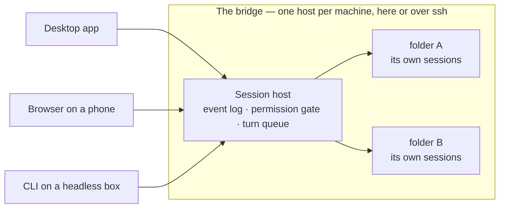
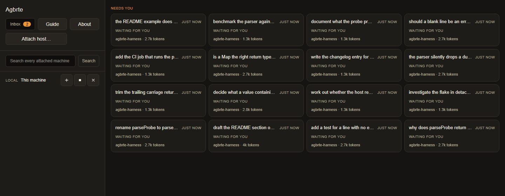
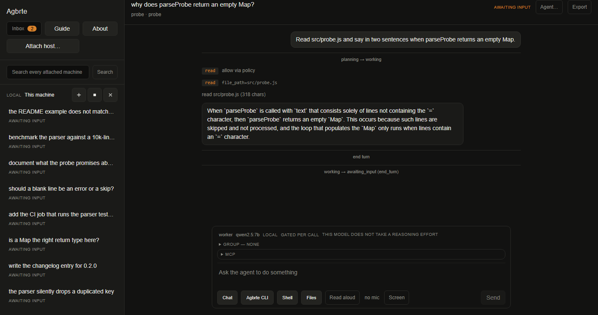
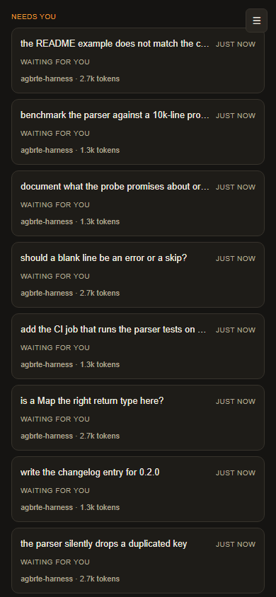
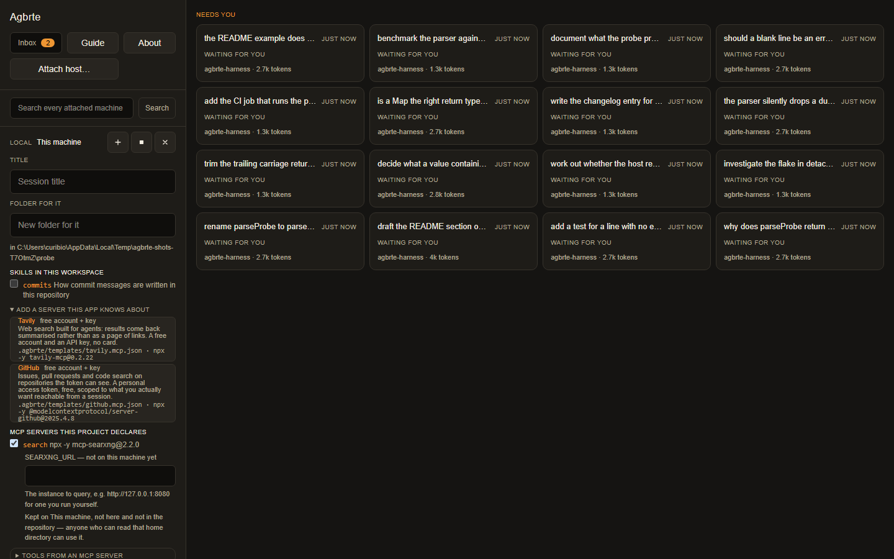
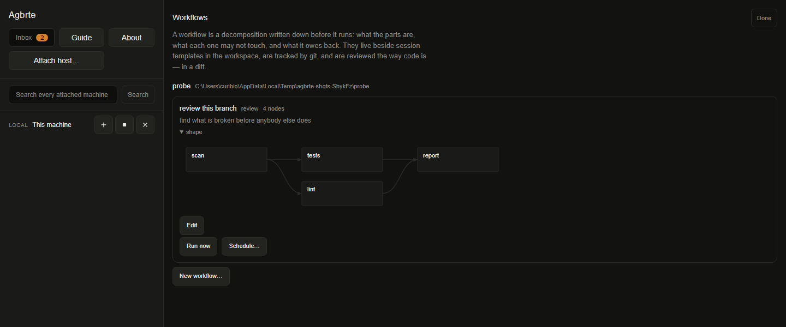

# Agbrte

**Coding agents that keep working after you close the laptop.**

[](https://github.com/YounghyeonPark/agbrte/releases/latest)
[](https://github.com/YounghyeonPark/agbrte/actions/workflows/ci.yml)
[](LICENSE)
[](https://doi.org/10.5281/zenodo.21906998)

An agent-based development workbench. A session runs on a **bridge** — this
machine, or a server over ssh — and never inside the window you happen to be
looking at. Quitting the app does not stop a turn. Your phone and your desktop
show one transcript. A folder that moves takes its sessions with it.



**Ag**ent **Br**idge **Te**rminal, in the order the architecture is built. Said
/ɛɡɯbɯɾɯtʰɯ/ *(AG-buh-ruh-teu)* or /ˈæɡbərt/ *(AG-burt)* — it is a contraction
rather than a word, so there is nothing here to get wrong.

## Get it

```bash
npx agbrte web .
```

Run it **inside a project folder** — one line, Node 22+, nothing installed. It
starts a real host on your machine and prints a link; open that and the browser
client is driving your own folder. It is the same host the desktop app uses, so a
folder open in both shows one session list.

**[Download for macOS, Windows or Linux →](https://github.com/YounghyeonPark/agbrte/releases/latest)**
Unsigned, and says so.

```bash
npm install && npm start        # from a checkout, Node 22+
npm run package                 # → one file to scp to a server, under a megabyte
```

[Installing Agbrte](docs/install.md) has the rest: the server installer, running
two builds on one computer, and what the test commands cover.

## What it looks like

|  |  |  |
| :-- | :-- | :-- |
| Every session on every attached machine, ranked by **who needs a human**. | One session: a tool call, the permission it went through, and the answer. | The same app in a phone browser on your own network, driving a run on a build box. |

|  |  |
| :-- | :-- |
| What this project declares, offered when a session is made: skills and MCP servers that are **files in the repository**, and a key asked for by name — kept on the machine, never in the file. | A workflow is a decomposition written down before it runs. The graph is the document; two parts meeting at one is the shape a session tree cannot express. |

*(Real turns against a local `qwen2.5:7b`, captured by `AGBRTE_WRITE_FIXTURES=1 npx playwright test shots --grep @shots`.)*

## The one idea

**A session runs on the bridge, not inside the terminal.**

The bridge is a machine — this one, or a server over ssh — running one process
that owns the event log, the permission gate, and the turn queue for every folder
open on it. A session picks its folder when it is created, and that folder holds
its own sessions, so moving the folder moves the work.

The terminal is whatever you are sitting at: the desktop app, a browser on your
phone, the CLI on a machine with no display. All of them are clients, and none of
them holds the session.

Closing the app mid-run, driving one session from a second machine, and resuming
after a restart are not three features but three consequences of that.

## What it does that a chat window does not

- **The run outlives the client, and the client is plural.** Two machines on one
  session see one transcript, and a permission prompt raised on either is
  answerable from the other — pending requests live in the log, not in some
  process's memory.
- **Everything resumes from its own log**: which agent ran, under which model and
  adapter version, what it did, who approved each thing it needed permission for.
  A moved folder, a switched provider and a restarted machine are one problem
  rather than three.
- **A model change is recorded rather than swapped.** The seat you had is retired
  and the new one takes over, both written into the transcript, so it says what
  answered and when.
- **Work is decomposed into sessions, not into a roster.** A session too large to
  hold can split into a child with its own log, and a slice of its budget when
  it has one to give — on another machine, if that is where the work is.
  Sessions can also be *grouped* and reach each other one bounded message at a
  time, carrying words and never authority.
- **What a project uses is a file in the project.** A skill — "how we write
  commit messages here" — and an MCP server are both files in a tracked
  directory, so a colleague gets them by cloning rather than by being told, and
  a change to either arrives as a diff. Nothing attaches itself: they are
  offered when a session is made and ticked by the person making it, which is
  the whole distinction from an app-wide registry somebody enabled months ago.
  The app knows a couple of servers and will write the declaration for you,
  saying what each costs to start before you pick one. **The key never goes in
  the file** — the declaration names a variable, the machine holds the value,
  and the form asks for whatever is missing by name.
- **A decomposition can be written down before it runs.** A *workflow* is a file
  in the repository: what the parts are, what each one may not touch, what it
  owes back, and what it waits on. Because it is a file it is reviewed in a diff
  the way code is — which is what makes an authored decomposition safe where an
  autonomous one is not — and the same refusals a split meets at spawn are raised
  while it is being written, in an editor that draws the graph. Running one
  spawns each part as its dependencies finish; a part that fails stops what
  needed it and nothing else — and the same picture carries the run, so which
  part is going is where the shape already was. A workflow can also be left to
  run on a routine, which happens on the host: closing the app does not close
  the schedule.
- **The network is a named door rather than a shell command.** `fetch` reads a
  page as a tool, so which sites a session read is a question the log answers and
  a policy rule can match — and it refuses the addresses that mean *this machine*
  or *this network*, because a control channel and a cloud metadata service both
  answer there. A standing grant does not cover it: "stop asking me" is a person
  taking responsibility for what their own agent does, not for what a web page
  tells it to do.
- **A port on a remote machine comes to a local one**, and it is a plain tunnel,
  so it carries a dev server to your browser or that machine's **desktop** to
  your own remote-desktop client.
- **And you can watch that machine's screen with nothing installed on it.** A
  remote session that opens a window — an installer, a GUI test, the app it just
  built — shows it in a `Screen` pane, a few frames a second, over `xwd` alone.
  Every X display is listed with its size, or with why it cannot be read; the
  frame rate is on screen, because it is a property of `xwd` rather than a target.
  Where a VNC server is actually running, the tunnel above is still the better
  answer, and the app says so.
- **A real terminal that says when it is off the record.** The PTY pane writes no
  events, passes no permission gate and spends your own allowance, and its header
  says so every time it is open.
- **You can point at things, and talk.** A blackout is painted into the pixels
  *before* anything is written, so the original never exists on disk. Dictation
  runs on your machine and lands in the composer for you to edit rather than
  being sent.

> **[The idea, and the shape it forces](https://agbrte.dev/idea/)** —
> the design concept as a page: the process model, how a remote host is
> bootstrapped and what does *not* cross the link, how a session tree reserves
> budget and bubbles blockage, and what is deliberately not built.

## Status

**Phases 1, 2, 4, 6 and 9 are done; 5 and 7 met their criteria with named gaps; 3
is half validated; 8 is started.** The model-provider axis has exactly one
implementation, and "an agent on a GPU box using that box's own model server" has
never run, because that box has no model server.

[The full status](docs/status.md) names the rest rather than glossing it, and
[DESIGN.md §15](DESIGN.md) is the authority.

## Documentation

The load-bearing decision behind all of it is that **the append-only event log is
the source of truth**. `rehydrate()` reconstructs context from that log for a
moved folder, a migrated machine, a switched provider and a resumed quota window,
and doubles as the in-session compactor — so the durable path is exercised
constantly and cannot rot.

| | |
| :-- | :-- |
| [DESIGN.md](DESIGN.md) | The real specification — 17 sections, including what is deliberately unfinished and why. §1–§3 architecture, §5 durability, §6.4 and §8 the host model, §13 permissions, §15 phase status. |
| [Installing](docs/install.md) | Desktop build, checkout, the one-file server installer, `AGBRTE_HOME`, `agbrte update`, testing. |
| [Attaching a machine over ssh](docs/remote.md) | The flow, what it installs on the far side, and why it will not accept a host key for you. |
| [The CLI, with no GUI anywhere](docs/cli.md) | `agbrte run` exit codes, why a permission request is denied rather than queued, and `agbrte web`. |
| [Configuration](docs/configuration.md) | `endpoints.json`, `access.json`, and why a workspace must not live in a sync-managed folder. |
| [Status](docs/status.md) | What is proven, what is not, and what a green suite cannot see. |
| [Citing it, patents, the licence](docs/citation.md) | A citation is appreciated and is **not** a licence term. |

## Licence

Apache License 2.0 — see [LICENSE](LICENSE) and [NOTICE](NOTICE). Chosen over MIT
for an explicit patent grant and a trademark clause, so the code can be forked
freely while the name stays with the project. Every runtime dependency is MIT, and
[a licence gate in `npm run package`](docs/citation.md#the-licence-in-more-detail)
refuses to build the installer if any proprietary SDK reaches the bundles.
